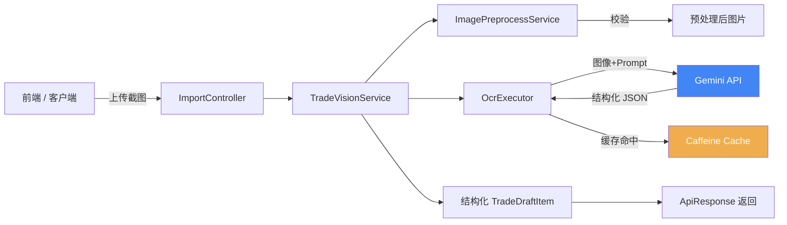
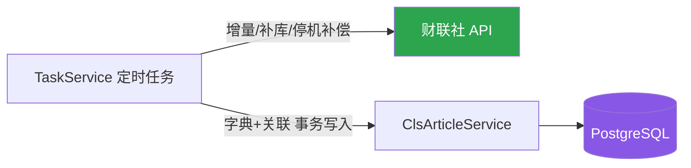
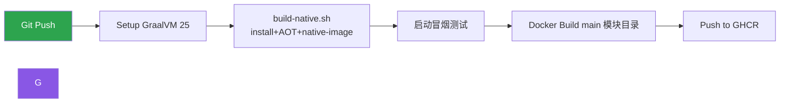

# Stock Calculator Service

基于 **Spring Boot 4.x** 的多模块服务：**股票交易截图智能识别（OCR + LLM）** 与 **财联社快讯数据采集**。用户上传股票交易截图，通过 **Google Gemini 多模态大模型** 自动识别并提取成交流水，生成结构化交易明细数据；内置财联社快讯爬虫，将快讯及其关联股票/题材入库（PostgreSQL）。

| 模块 | 定位 | AI 接入 | JSON 序列化 | 数据库 | 运行形态 |
|------|------|---------|-------------|--------|----------|
| `stock-calculator-main` | OCR 服务 + CLS 爬虫（全功能） | Spring AI（Gemini OpenAI 兼容端点） | Jackson 3（tools.jackson） | PostgreSQL（必需） | JVM Fat JAR 或 GraalVM Native Image（推荐生产） |

两个模块共用 `stock-calculator-common`（统一响应/异常、图片预处理、HTTP 工具、爬虫领域模型）。注意：**JVM 与 Native 两种形态都监听 18080 端口，不能同时运行**。

---

## 目录

- [架构概览](#架构概览)
- [技术栈](#技术栈)
- [核心功能](#核心功能)
- [快速开始](#快速开始)
- [构建与打包](#构建与打包)
- [部署](#部署)
- [配置说明](#配置说明)
- [API 文档](#api-文档)
- [项目结构](#项目结构)

---

## 架构概览



OCR 链路：`OcrExecutor` 由 Spring AI `ChatClient` 实现多模态调用（main 模块唯一实现）：

| | 实现 |
|---|---|
| 模型调用 | Spring AI `ChatClient` 多模态 media API |
| 接入配置 | `spring.ai.openai.*`（Gemini OpenAI 兼容端点） |
| JSON 解析 | Jackson 3（tools.jackson）`ObjectMapper` |

模块额外运行 CLS 爬虫调度（`@EnableScheduling`）：



### 请求调用链路

1. 客户端上传截图至 `POST /api/import/ocr-parse`
2. `ImagePreprocessService` 对图片进行格式/大小/尺寸校验
3. `GeminiTradeVisionServiceImpl` 触发 OCR 识别流程
4. `GeminiOcrExecutorImpl`（Spring AI ChatClient）调用 Gemini 多模态模型（`gemini-3.6-flash`），解析返回的 JSON 二维数组
5. 结果通过 Caffeine 本地缓存缓存 24 小时，相同图片重复请求直接命中缓存
6. 原始 JSON 数组映射为强类型 `TradeDraftItem` 列表返回

爬虫链路：`TaskService` → `CommonHttpService`（`ClsSignUtil` 参数签名）→ 解析快讯（字典/关联分离）→ `saveArticleWithRelations` 单事务入库。

---

## 技术栈

| 类别 | 技术 | 版本 |
|------|------|------|
| 语言 | Java | 21+（Native 编译需 GraalVM 25） |
| 框架 | Spring Boot | 4.1.1 |
| 构建工具 | Maven（mvnw 多模块） | 3.9+ |
| Web 容器 | Tomcat（内嵌） | 由 Spring Boot 管理 |
| ORM | Spring Data JPA（Hibernate） | 7.4.x（爬虫） |
| 数据库 | PostgreSQL（JSONB） | 必需 |
| 序列化 | Jackson 3（tools.jackson） | — |
| 缓存 | Caffeine（300 条 / 24h） | 由 Spring Boot 管理 |
| 虚拟线程 | Project Loom | 已启用 |
| HTTP 客户端 | Spring RestClient | 由 Spring Boot 管理 |
| 多模态 AI | Google Gemini API | gemini-3.6-flash |
| 原生编译 | GraalVM Native Image | 25.0.x |
| 容器化 | Docker 多阶段构建 + GHCR CI | — |

---

## 核心功能

### 1. 智能截图识别（OCR + LLM）

- 支持 **JPEG / PNG / GIF / WebP** 图片格式
- 通过 Gemini 多模态大模型识别截图中的已成交交易记录
- 提取字段：股票代码、股票名称、买卖方向、成交价格、成交数量、成交时间
- 输出严格格式化的 JSON 数据结构

### 2. 图片预处理防御

- 文件大小校验：10KB ~ 20MB
- 图片宽高比校验：竖屏截图（0.45 ~ 5:1）
- 高度上限：5200px（约 10~15 笔交易）
- 纯 Java 二进制读取宽高，零 JNI / 零 AWT 依赖

### 3. 智能缓存

- 基于 Caffeine 本地缓存，最大 300 条记录，有效期 24 小时
- 缓存键：图片预处理后的 MD5 哈希值
- 相同图片重复请求直接返回缓存结果，节省 API 调用成本

### 4. 虚拟线程

- 启用 Spring Boot 4 虚拟线程（Project Loom）

### 5. 延迟初始化

- `spring.main.lazy-initialization: true`，按需加载 Bean，降低启动内存

### 6. 财联社快讯爬虫

- 每 8 分钟增量抓取最新快讯；每 3 分钟滚动历史补库；应用启动时自动补偿停机期间数据
- 快讯主表（cls_article）+ 股票/题材关联表 + 字典表，单事务原子写入
- 请求带 ClsSignUtil 签名，逐条解析异常隔离，不影响整体任务

---

## 快速开始

### 前置条件

- JDK 21+（Native 编译需 GraalVM 25.0.x）
- Maven 3.9+（或直接使用仓库自带 mvnw）
- Google Gemini API Key

### 运行 main 模块（OCR + 爬虫，需 PostgreSQL）

```bash
# 1. 克隆项目
git clone <repo-url>
cd stock-calculator-service

# 2. 启动本地数据库基础设施（postgres，见根目录 docker-compose.yml）
docker compose up -d postgres

# 3. 首次运行需手动建表（sql.init.mode=never，不自动执行 DDL）
psql -h localhost -U root -d scs -f stock-calculator-main/src/main/resources/db/postgres/schema.sql

# 4. 设置 Gemini API Key 并启动
export GEMINI_API_KEY=your-api-key-here
./mvnw -pl stock-calculator-main -am spring-boot:run

# 5. 服务启动后访问
curl http://localhost:18080/
```

> 数据库连接默认 `jdbc:postgresql://localhost/scs`，可用 `POSTGRES_URL` / `POSTGRES_USER` / `POSTGRES_PASS` 环境变量覆盖。

### 测试 API

```bash
curl -X POST http://localhost:18080/api/import/ocr-parse \
  -F "file=@/path/to/screenshot.jpg"
```

---

## 构建与打包

项目提供 **JVM 模式** 和 **Native 原生镜像** 两种运行方式。Native 启动毫秒级、内存占用低，是推荐的生产运行方式。

### 1. JVM 模式构建

```bash
# 编译 main 模块 Fat JAR（-am 会连带构建依赖的 common 模块）
./mvnw clean package -DskipTests -pl stock-calculator-main -am

# 运行
java -jar stock-calculator-main/target/stock-calculator-main-0.0.1-SNAPSHOT.jar
```

### 2. Native 原生镜像构建（推荐生产）

> **要求**：GraalVM 25.0.x（含 native-image）。脚本按 `JAVA_HOME` → `/opt/GraalVM25` → `PATH` 顺序自动探测，**不依赖 sdkman**。二进制含全量功能（Spring AI OCR + 爬虫 + auth），启动仍需连 PostgreSQL。

```bash
# 完整构建：install 父POM/common -> AOT 处理 -> native-image -> 启动冒烟测试（约 10~20 分钟）
./stock-calculator-main/build-native.sh

# 跳过 Maven 编译，复用已有 target/ 产物
./stock-calculator-main/build-native.sh --no-pkg
```

构建脚本会自动完成：
1. 安装父 POM 与 common 模块到本地仓库（多模块单独构建的前提）
2. `mvnw compile` + `spring-boot:process-aot`（AOT 上下文处理）
3. 生成依赖 classpath 并剥离全部 test 相关 jar
4. 直接调用 `native-image` 编译原生二进制
5. 启动冒烟测试：未捕获 `Tomcat started` 则判定失败退出

二进制产物：`stock-calculator-main/target/stock-calculator-service`（实测约 303MB，含 Spring AI 全家桶）

> 反射元数据说明：`stock-calculator-main/agent-config/reachability-metadata.json`（tracing agent 录制）与 `gen-logger-config.py`（生成器补缺）共同提供运行期反射注册；依赖升级后用 `record-agent.sh` 重录。

### 3. Docker 镜像构建

#### JVM 镜像（根目录 Dockerfile 已适配多模块）

```bash
docker build -t stock-calculator:jvm -f Dockerfile .
```

#### Native 镜像（推荐）

```bash
# 方式一：打包脚本（编译 + 校验二进制 + 打镜像）
./stock-calculator-main/package-native.sh stock-calculator:latest

# 方式二：手动两步（注意 build context 是 main 模块目录）
./stock-calculator-main/build-native.sh
docker build -f stock-calculator-main/Dockerfile.native -t stock-calculator:latest ./stock-calculator-main
```

---

## 部署

### Docker 运行

> Native 与 JVM 两种形态都需要 PostgreSQL（内置爬虫），口令经 `POSTGRES_PASS` 注入。

```bash
# Native 模式（推荐，启动快内存低）
docker run -d --name stock-calculator \
  -p 18080:18080 \
  -e GEMINI_API_KEY=your-api-key \
  -e POSTGRES_URL=jdbc:postgresql://host:5432/scs \
  -e POSTGRES_USER=root \
  -e POSTGRES_PASS=your-password \
  stock-calculator:latest

# JVM 模式
docker run -d --name stock-calculator-jvm \
  -p 18080:18080 \
  -e GEMINI_API_KEY=your-api-key \
  -e POSTGRES_URL=jdbc:postgresql://host:5432/scs \
  -e POSTGRES_USER=root \
  -e POSTGRES_PASS=your-password \
  stock-calculator:jvm
```

### 本地基础设施（docker-compose.yml）

根目录的 `docker-compose.yml` 提供 **本地开发基础设施**（非应用本体）：

- `pgvector/pgvector:pg16` — 爬虫入库所需（库名 `scs`，口令从 `.env` 注入）

### CI/CD 自动构建

项目内置 GitHub Actions 工作流（`.github/workflows/docker-image.yml`），在推送至 `main` / `dev` / `native` 分支或打 `v*.*.*` 标签时自动触发：

1. 配置 GraalVM 25 环境
2. 调用 `stock-calculator-main/build-native.sh` 编译 Native 二进制（含启动冒烟测试，失败即中止）
3. 构建并推送 Docker 镜像至 **GitHub Container Registry (GHCR)**

本地与 CI 走**同一条构建脚本路径**，保证「本地验证过的二进制 = 打进镜像的二进制」。



---

## 配置说明

### 环境变量

| 变量名 | 必填 | 默认值 | 说明 |
|--------|------|--------|------|
| `GEMINI_API_KEY` | **是** | `dummy-gemini-key` | Google Gemini API 密钥 |
| `POSTGRES_URL` | 否 | `jdbc:postgresql://localhost/scs` | 数据库连接 |
| `POSTGRES_USER` | 否 | `root` | 数据库用户（建议显式设置） |
| `POSTGRES_PASS` | **是** | 无 | 数据库密码（必须环境变量注入，不再提供默认值） |
| `CRAWLER_ADMIN_TOKEN` | 建议 | 无 | `/api/admin/sync` 管理端点令牌，未配置则端点拒绝请求 |

### 应用配置要点（application.yml）

```yaml
server:
  port: 18080                      # JVM 与 Native 共用端口，不能同时运行
  tomcat:
    threads:
      max: 10                      # 限制工作线程数（个人使用足够）

spring:
  threads:
    virtual:
      enabled: true                # 虚拟线程
  cache:
    caffeine:
      spec: maximumSize=300,expireAfterWrite=24h  # OCR 缓存
  main:
    lazy-initialization: true      # 延迟初始化（降低启动内存）
```

数据源配置在 `application-postgres.yml`（profile postgres，`spring.task.scheduling` 为爬虫调度线程池）。

---

## API 文档

### 识别交易截图

```
POST /api/import/ocr-parse
```

**请求参数：**

| 参数 | 类型 | 必填 | 说明 |
|------|------|------|------|
| `file` | MultipartFile | 是 | 股票交易截图（JPEG/PNG/GIF/WebP） |

**响应示例：**

```json
{
  "code": 200,
  "message": "success",
  "data": [
    {
      "stockCode": "600745",
      "stockName": "闻泰科技",
      "direction": "BUY",
      "price": 16.69,
      "volume": 500,
      "tradeTime": "2025-06-15 09:30:00",
      "status": "FILLED"
    }
  ]
}
```

**错误响应：**

```json
{
  "code": 400,
  "message": "图片文件过小，无法保证清晰度",
  "data": null
}
```

---

## 项目结构

```
stock-calculator-service/
├── pom.xml                            # 父 POM（packaging=pom，聚合 common + main 两模块）
├── mvnw / mvnw.cmd                    # Maven Wrapper
├── stock-calculator-common/           # 公共库
│   └── src/main/java/com/zzh/stock_calculator/
│       ├── common/                    # ApiResponse / BusinessException / GlobalExceptionHandler
│       ├── config/                    # RestClientConfig（通用 + 图像服务 RestClient）
│       ├── dto/                       # TradeDraftItem(OCR) + ClsArticle/Stock 等(爬虫实体)
│       ├── enums/                     # TradeDirection / TradeStatus
│       ├── repository/                # 爬虫 JPA Repository
│       ├── service/                   # ImagePreprocessService + 爬虫 Service + auth 四件套
│       ├── task/                      # TaskService（财联社快讯定时抓取）
│       ├── controller/                # ImportController / SynclsHistorycontroller / AuthController
│       └── util/                      # CommonHttpService / ImageHeaderUtil / ClsSignUtil
├── stock-calculator-main/             # 可运行模块：Spring AI + tools.jackson（OCR + 爬虫 + auth）
│   ├── src/main/java/.../service/impl/  # GeminiOcrExecutorImpl（Spring AI ChatClient）
│   ├── src/main/resources/
│   │   ├── application.yml            # 主配置（默认激活 postgres profile）
│   │   ├── application-postgres.yml   # 数据源配置
│   │   └── db/postgres/schema.sql     # 建表 DDL（需手动执行）
│   ├── build-native.sh                # Native 编译脚本（不依赖 sdkman）
│   ├── gen-logger-config.py           # native 反射元数据生成器
│   ├── record-agent.sh                # tracing agent 录制脚本（依赖升级后重录）
│   ├── agent-config/                  # agent 录制的 reachability metadata（入库）
│   ├── smoke-curl.sh                  # 二进制 HTTP 冒烟（token 门禁验证）
│   ├── package-native.sh              # Native Docker 打包脚本
│   └── Dockerfile.native              # 仅拷贝二进制的最小镜像
├── Dockerfile                         # JVM 镜像（多模块构建 main 模块）
├── docker-compose.yml                 # 本地基础设施：postgres
└── .github/workflows/docker-image.yml # CI：Native 镜像构建并推送 GHCR
```

## 性能对比

同一 main 模块的两种运行形态：

| 指标 | JVM 模式 | Native 模式 |
|------|----------|-------------|
| 启动时间 | ~3-5s | ~0.3s（实测） |
| 基础内存 | ~150MB | 待压测（含 Spring AI 全家桶） |
| 产物体积 | Fat JAR | 二进制 303MB（实测） |
| 部署方式 | 需 JRE 21 | 独立二进制 |
| 数据库依赖 | 需要 PostgreSQL | 需要 PostgreSQL |

> Native 模式推荐用于生产环境：启动快、内存低、独立部署；功能与 JVM 模式完全一致，内置爬虫与 auth，均需连接 PostgreSQL。

---

## 许可证

本项目仅供个人学习与参考，请勿用于商业用途。
