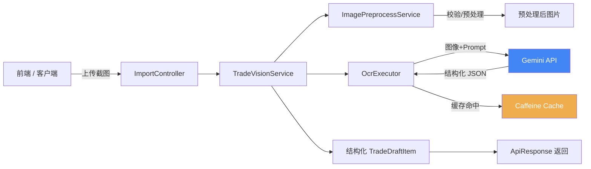

# Stock Calculator Service

基于 **Spring Boot 4.x + GraalVM Native Image** 构建的股票交易截图智能识别服务。用户上传股票交易截图，通过 **Google Gemini 多模态大模型** 自动识别并提取成交流水，生成结构化交易明细数据。

---

## 目录

- [架构概览](#架构概览)
- [技术栈](#技术栈)
- [核心功能](#核心功能)
- [快速开始](#快速开始)
- [构建与打包](#构建与打包)
- [部署](#部署)
- [配置说明](#配置说明)
- [API 文档](#api-文档)
- [项目结构](#项目结构)

---

## 架构概览



### 请求调用链路

1. 客户端上传截图至 `POST /api/import/ocr-parse`
2. `ImagePreprocessService` 对图片进行格式校验、大小校验、尺寸校验
3. `GeminiTradeVisionServiceImpl` 触发 OCR 识别流程
4. `GeminiOcrExecutorImpl` 调用 **Google Gemini** 多模态模型（`gemini-3.6-flash`），将图片 + 定制 Prompt 发送至 Gemini API，解析返回的 JSON 二维数组
5. 结果通过 **Caffeine 本地缓存** 缓存 24 小时，相同图片的重复请求直接命中缓存
6. 原始 JSON 数组映射为强类型 `TradeDraftItem` 列表返回给客户端

---

## 技术栈

| 类别 | 技术 | 版本 |
|------|------|------|
| 语言 | Java | 21+（Native 编译需 25） |
| 框架 | Spring Boot | 4.1.1 |
| 构建工具 | Maven | 3.9+ |
| Web 容器 | Tomcat（内嵌） | 由 Spring Boot 管理 |
| 序列化 | Jackson 3（`tools.jackson`） | 由 Spring Boot 管理 |
| 缓存 | Caffeine | 由 Spring Boot 管理 |
| 虚拟线程 | Project Loom | 已启用 |
| HTTP 客户端 | Spring RestClient | 由 Spring Boot 管理 |
| 多模态 AI | Google Gemini API | gemini-3.6-flash |
| 原生编译 | GraalVM Native Image | 25.0.x |
| 容器化 | Docker | 多阶段构建 |

---

## 核心功能

### 1. 智能截图识别（OCR + LLM）

- 支持 **JPEG / PNG / GIF / WebP** 图片格式
- 通过 **Gemini 多模态大模型** 识别截图中的已成交交易记录
- 提取字段：股票代码、股票名称、买卖方向、成交价格、成交数量、成交时间
- 输出严格格式化的 JSON 数据结构

### 2. 图片预处理防御

- 文件大小校验：10KB ~ 20MB
- 图片宽高比校验：竖屏截图（0.45 ~ 5:1）
- 高度上限：5200px（约 10~15 笔交易）
- 纯 Java 二进制读取宽高，零 JNI / 零 AWT 依赖

### 3. 智能缓存

- 基于 **Caffeine** 本地缓存，最大 300 条记录
- 缓存有效期：24 小时（写入后过期）
- 缓存键：图片预处理后的 MD5 哈希值
- 相同图片重复请求直接返回缓存结果，节省 API 调用成本

### 4. 虚拟线程

- 启用 Spring Boot 4 虚拟线程（Project Loom）
- 轻量级线程模型，降低并发场景下的资源开销

### 5. 延迟初始化

- 启用 Spring Bean 延迟初始化，按需加载，显著降低启动内存

---

## 快速开始

### 前置条件

- JDK 21+（推荐 GraalVM 25.0.x 用于 Native 编译）
- Maven 3.9+
- Google Gemini API Key

### 本地运行

```bash
# 1. 克隆项目
git clone <repo-url>
cd stock-calculator-service

# 2. 设置 Gemini API Key
export GEMINI_API_KEY=your-api-key-here

# 3. 编译并启动
./mvnw spring-boot:run

# 4. 服务启动后访问
curl http://localhost:18080/
```

### 测试 API

```bash
curl -X POST http://localhost:18080/api/import/ocr-parse \
  -F "file=@/path/to/screenshot.jpg"
```

---

## 构建与打包

项目提供 **JVM 模式** 和 **Native 原生镜像** 两种运行方式。Native 镜像启动极快（毫秒级）、内存占用低，是推荐的生产运行方式。

### 1. JVM 模式构建

```bash
# 编译普通 Fat JAR
./mvnw clean package -DskipTests

# 运行
java -jar target/stock-calculator-service-*.jar
```

### 2. Native 原生镜像构建

> **要求**：GraalVM 25.0.x（JDK 25），并安装 `native-image` 组件。

#### 方式一：使用构建脚本（推荐）

```bash
# 完整编译（约 8~15 分钟）
./build-native.sh

# 跳过 Maven 编译，复用已有 target/ 产物
./build-native.sh --no-pkg
```

构建脚本会自动完成：
1. Maven compile + Spring AOT 处理
2. 生成 classpath 并剥离 test 依赖
3. 直接调用 `native-image` 编译原生二进制

#### 方式二：使用 Maven Profile

```bash
./mvnw -Pnative -DskipTests package
```

### 3. Docker 镜像构建

#### JVM 镜像

```bash
# 先编译 Fat JAR
./mvnw clean package -DskipTests

# 构建 JVM 镜像
docker build -t stock-calculator:jvm -f Dockerfile .
```

#### Native 镜像（推荐）

```bash
# 方式一：使用打包脚本（推荐）
./package-native.sh stock-calculator:latest

# 方式二：手动两步操作
./build-native.sh
docker build --no-cache -f Dockerfile.native -t stock-calculator:latest .
```

---

## 部署

### Docker 运行

```bash
# JVM 模式
docker run -d --name stock-calculator \
  -p 18080:18080 \
  -e GEMINI_API_KEY=your-api-key \
  stock-calculator:jvm

# Native 模式（推荐）
docker run -d --name stock-calculator \
  -p 18080:18080 \
  -e GEMINI_API_KEY=your-api-key \
  stock-calculator:latest
```

### Docker Compose 部署

```yaml
# docker-compose.yml
version: "3.8"
services:
  stock-calculator:
    image: stock-calculator:latest
    container_name: stock-calculator
    ports:
      - "18080:18080"
    environment:
      - GEMINI_API_KEY=${GEMINI_API_KEY}
      - GEMINI_MODEL=gemini-3.6-flash
      - TZ=Asia/Shanghai
    healthcheck:
      test: ["CMD", "curl", "-s", "http://localhost:18080/"]
      interval: 30s
      timeout: 5s
      retries: 3
      start_period: 10s
    restart: unless-stopped
```

### CI/CD 自动构建

项目内置 GitHub Actions 工作流（`.github/workflows/docker-image.yml`），在推送至 `main` / `master` / `native` 分支或打 `v*.*.*` 标签时自动触发：

1. 配置 GraalVM 25 环境
2. 编译 Native 二进制
3. 启动冒烟测试验证二进制
4. 构建并推送 Docker 镜像至 **GitHub Container Registry (GHCR)**


---

## 配置说明

### 环境变量

| 变量名 | 必填 | 默认值 | 说明 |
|--------|------|--------|------|
| `GEMINI_API_KEY` | **是** | `dummy-gemini-key` | Google Gemini API 密钥 |
| `GEMINI_BASE_URL` | 否 | `https://generativelanguage.googleapis.com/v1beta` | Gemini API 基础 URL |
| `GEMINI_MODEL` | 否 | `gemini-3.6-flash` | Gemini 模型名称 |
| `IMAGE_SERVICE_URL` | 否 | `http://localhost:8088` | 外部图片处理服务地址（当前未使用） |

### 应用配置（`application.yml`）

```yaml
server:
  port: 18080                      # 服务端口
  tomcat:
    threads:
      max: 10                      # 最大工作线程数（个人使用 10 足够）
      min-spare: 2                 # 最小空闲线程数
    max-connections: 50            # 最大连接数
    accept-count: 20               # 等待队列长度

spring:
  threads:
    virtual:
      enabled: true                # 启用虚拟线程
  main:
    lazy-initialization: true      # 延迟初始化 Bean

gemini:
  cache:
    caffeine:
      spec: maximumSize=300,expireAfterWrite=24h  # 缓存 300 条，24h 过期
```

---

## API 文档

### 识别交易截图

```
POST /api/import/ocr-parse
```

**请求参数：**

| 参数 | 类型 | 必填 | 说明 |
|------|------|------|------|
| `file` | MultipartFile | 是 | 股票交易截图（JPEG/PNG/GIF/WebP） |

**响应示例：**

```json
{
  "code": 200,
  "message": "success",
  "data": [
    {
      "stockCode": "600745",
      "stockName": "闻泰科技",
      "direction": "BUY",
      "price": 16.69,
      "volume": 500,
      "tradeTime": "2025-06-15 09:30:00",
      "status": "FILLED"
    },
    {
      "stockCode": "000001",
      "stockName": "平安银行",
      "direction": "SELL",
      "price": 12.35,
      "volume": 1000,
      "tradeTime": "2025-06-15 10:15:00",
      "status": "FILLED"
    }
  ]
}
```

**错误响应：**

```json
{
  "code": 400,
  "message": "图片文件过小，无法保证清晰度",
  "data": null
}
```

---

## 项目结构

```
stock-calculator-service/
├── .github/workflows/
│   └── docker-image.yml          # GitHub Actions CI/CD 流水线
├── src/
│   ├── main/
│   │   ├── java/com/zzh/stock_calculator/
│   │   │   ├── common/
│   │   │   │   ├── ApiResponse.java              # 统一响应结构
│   │   │   │   ├── BusinessException.java         # 业务异常
│   │   │   │   └── GlobalExceptionHandler.java    # 全局异常处理
│   │   │   ├── config/
│   │   │   │   ├── GeminiRestClientConfig.java    # Gemini API 客户端配置
│   │   │   │   ├── RestClientConfig.java          # RestClient 通用配置
│   │   │   │   └── WebApplicationTypeRuntimeHints.java  # Native 反射注册
│   │   │   ├── controller/
│   │   │   │   └── ImportController.java          # 截图导入接口
│   │   │   ├── dto/
│   │   │   │   ├── ImageProcessOptions.java       # 图片处理参数
│   │   │   │   └── TradeDraftItem.java            # 交易明细 DTO
│   │   │   ├── enums/
│   │   │   │   ├── TradeDirection.java            # 买卖方向枚举
│   │   │   │   └── TradeStatus.java               # 成交状态枚举
│   │   │   ├── service/
│   │   │   │   ├── OcrExecutor.java               # OCR 执行器接口
│   │   │   │   ├── ImagePreprocessService.java    # 图片预处理服务
│   │   │   │   ├── TradeVisionService.java        # 交易视觉服务接口
│   │   │   │   └── impl/
│   │   │   │       ├── GeminiOcrExecutorImpl.java       # Gemini OCR 实现
│   │   │   │       └── GeminiTradeVisionServiceImpl.java # Gemini 交易视觉实现
│   │   │   ├── util/
│   │   │   │   ├── CommonHttpService.java         # 通用 HTTP 工具
│   │   │   │   └── ImageHeaderUtil.java           # 图片头部解析工具
│   │   │   └── StockCalculatorApplication.java    # 应用入口
│   │   └── resources/
│   │       └── application.yml                    # 应用配置
│   └── test/
│       └── java/.../StockCalculatorApplicationTests.java
├── Dockerfile                    # JVM 模式 Dockerfile
├── Dockerfile.native             # Native 模式 Dockerfile
├── build-native.sh               # Native 编译脚本
├── package-native.sh             # Native 镜像打包脚本
├── pom.xml                       # Maven 构建文件
├── mvnw / mvnw.cmd               # Maven Wrapper
└── README.md
```

## 性能对比

| 指标 | JVM 模式 | Native 模式 |
|------|----------|-------------|
| 启动时间 | ~3-5s | ~0.1s |
| 基础内存 | ~150MB | ~30MB |
| 镜像体积 | ~250MB | ~80MB |
| 部署方式 | 需 JDK 21 | 独立二进制 |

> Native 模式推荐用于生产环境，启动快、内存低、镜像小，适合容器化部署。

---

## 许可证

本项目仅供个人学习与参考，请勿用于商业用途。