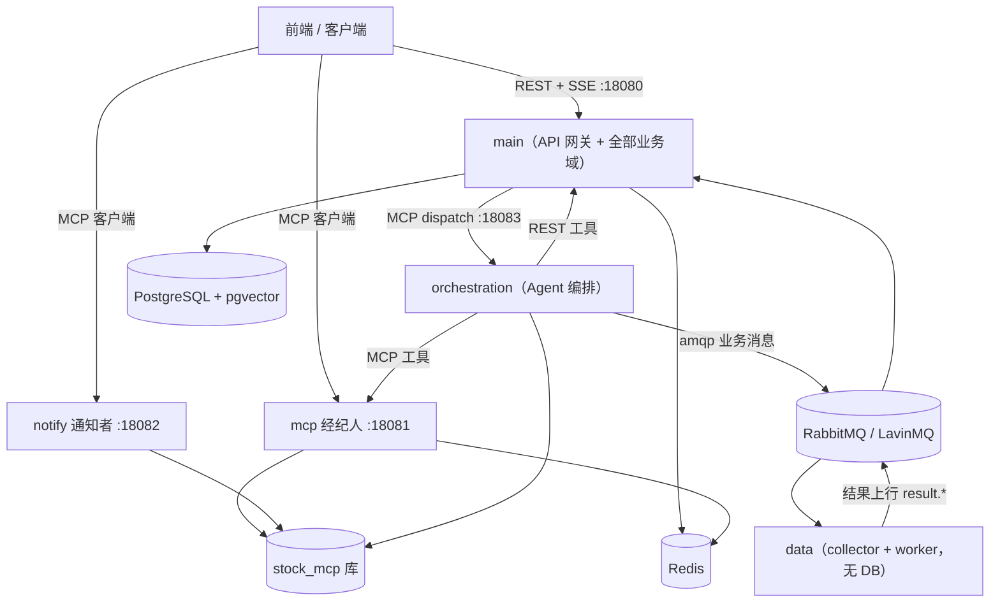

# Stock Calculator Service

基于 **Spring Boot 4.x + Spring AI 2.x** 的股票投研后端 **多模块 Monorepo**。它把「资讯 / 公告 / 行情 / 指标 / 知识 / 提醒 / Agent 编排」整合成一套以 **MQ 解耦、Native 镜像、虚拟线程** 为底座的服务矩阵：用户上传交易截图经 **OCR + LLM** 结构化识别成交流水；财联社快讯与上市公司公告经爬虫 / PDF 抽取 / 蒸馏入库并向量化；叠加 MCP 指标计算、经典书籍知识检索、Web Push 个人提醒，以及把上述能力编排成任务链的 Agent 系统。

> 项目已从单模块（早期 `main` 仅含 OCR+爬虫）演进为 **8 模块 / 5 服务** 的分布式形态；模块边界由 Spring Modulith 边界测试（`ModulithVerifyTest`）强制，跨域仅能引用对方基包公开类型。

---

## 目录

- [核心特性](#核心特性)
- [系统架构](#系统架构)
- [模块划分](#模块划分)
- [技术栈](#技术栈)
- [服务矩阵与端口](#服务矩阵与端口)
- [快速开始](#快速开始)
- [构建与打包](#构建与打包)
- [部署](#部署)
- [配置说明](#配置说明)
- [API 概览](#api-概览)
- [项目结构](#项目结构)
- [性能对比](#性能对比)
- [文档索引](#文档索引)
- [许可证](#许可证)

---

## 核心特性

- **智能截图识别（OCR + LLM）**：JPEG/PNG/GIF/WebP 交易截图 → OCR 文本 → LLM 结构化 → `TradeDraftItem`（代码/名称/方向/价格/数量/时间），支持图片预处理防御（大小 / 宽高比 / 高度校验，纯 Java 二进制读取，零 JNI/AWT）。
- **财联社快讯爬虫**：每 8 分钟增量、每 3 分钟滚动补库、启动补偿停机数据；快讯主表 + 股票/题材关联表 + 字典表单事务原子写入，带 `ClsSignUtil` 签名与异常隔离。
- **公告 RAG 管道**：上市公司公告 PDF 抽取（`PdfTextExtractor` → 结构树 → 切片）→ LLM 蒸馏摘要 → 接地校验 → 向量化入库，状态机（PENDING/DONE/FAILED）与失败计次全部留在主服务。
- **MCP 经纪人服务（:18081）**：`ta4j` 现算 MA/MACD/RSI/BOLL/KDJ、支撑压力位带、条件雷达、K 线读穿代理，以及经典书籍整书 RAG 检索（bge-m3 + pgvector）。
- **个人定制提醒服务（:18082）**：一句话登记「明天 9:30 通知我茅台形态」；触发引擎零 `@Scheduled`（复用 TTL+DLX 自循环钟摆），支持 `at_time` 定时与 `on_event` 事件两类提醒，经 Web Push 触达。
- **Agent 任务编排（:18083）**：LLM 把 MCP 工具与 main 接口动态编排成 **结构化 DAG**——Planner 规划一次、Executor 确定性执行、已验证路径按「规范化意图向量」缓存复用（HITL 人工上架 + 自动冒烟门禁）。
- **自由画布后端代理**：画布 K 线走后端读穿代理（`GET /api/broker/klines`，库即缓存、写穿入库），经纪 MCP 为唯一行情出口与写入者；复杂指标后端算、简单指标前端算。
- **E2EE 用户服务 + 服务端密文同步**：端到端加密的用户体系，登录即备份私有数据（含画布区块）。
- **Copilot AI 聊天 + 资讯/选股引导 + 自定义统计**：上下文感知对话、消息→候选股→个股档案向导、AI 生成代码的自定义指标计算。
- **地基能力**：虚拟线程（Project Loom）、延迟初始化、Redis 分层结果缓存（OCR/视觉/会话/限流）、全链路 `traceId` 贯穿（Copilot→Planner→Executor→REST/MCP→MQ→data worker）。

---

## 系统架构


```mermaid
flowchart TB
    FE["前端 / 客户端"] -->|REST + SSE :18080| MAIN["main（API 网关 + 全部业务域）"]
    FE -->|MCP 客户端| BRK["mcp 经纪人 :18081"]
    FE -->|MCP 客户端| NTF["notify 通知者 :18082"]

    MAIN -->|MCP dispatch :18083| ORCH["orchestration（Agent 编排）"]
    ORCH -->|MCP 工具| BRK
    ORCH -->|REST 工具| MAIN
    ORCH -->|amqp 业务消息| MQ[("RabbitMQ / LavinMQ")]
    MQ --> DATA["data（collector + worker，无 DB）"]
    DATA -->|结果上行 result.*| MQ
    MQ --> MAIN

    MAIN --> PG[("PostgreSQL + pgvector")]
    BRK --> PGM[("stock_mcp 库")]
    NTF --> PGM
    ORCH --> PGM
    MAIN --> REDIS[("Redis")]
    BRK --> REDIS
```

**通信主干**：`main`（业务 + 触达）↔ `orchestration`（编排）↔ `mcp`/`notify`（工具与通知）经 MCP 协议互联；重活（公告识别、向量化、历史补录）由 `main` 下发任务到 `data`，`data` 经 RabbitMQ 回传结果——**所有跨服务数据流走 MQ 或 MCP，单一事实源 = 主服务（状态/配额/查询）与经纪 MCP（行情）**。

---

## 模块划分

| 模块 | 定位 | 运行形态 | Native |
|------|------|----------|--------|
| `stock-calculator-contract` | MQ 队列/交换机常量 + 消息信封与 payload DTO（独立定义，禁引 JPA 实体） | 被依赖库 | — |
| `stock-calculator-jpa` | 抽取出的 Spring Data JPA Native 元数据（`JpaRuntimeHints` + 反射/资源注册），供各模块 native 构建复用 | 被依赖库 | — |
| `stock-calculator-llm` | 跨服务 LLM 装配设施：`ai.tiers.*`（MAX/CHAT/MINI 三档 chat）+ `ai.embeddings.*`（CF / OpenAI 兼容 embedding）唯一事实源，封死 Spring AI 2.0.1 运行时 options 三坑 | 被依赖库 | — |
| `stock-calculator-main` | 主服务（:18080）：OCR+vLLM 识别、CLS 爬虫、E2EE auth、copilot、search、broker 画布代理、sync、customstat、alert | 独立服务 | ✅ |
| `stock-calculator-mcp` | 经纪人 MCP 服务（:18081）：指标计算（ta4j）+ 书籍知识 RAG + K 线读穿 | 独立服务 | ❌（JVM 模式，见 docs/mcp/design.md D6） |
| `stock-calculator-mcp-notify` | 通知者 MCP 服务（:18082）：提醒登记/触发引擎/能力请求/Web Push 触达 | 独立服务 | — |
| `stock-calculator-orchestration` | Agent 编排服务（:18083）：MCP task 工具面 + Planner + Executor（DAG） | 独立服务 | ✅ |
| `stock-calculator-data` | 数据服务（无 DB，native，可水平伸缩）：collector（拉取/webhook 接入/归一化）+ worker（PDF/蒸馏/向量化），经 RabbitMQ 与主服务通信 | 无 Web 门户的后台服务（仅可选 ingest webhook） | ✅ |

> 领域隔离规则：跨域只能引用对方基包下的类型，子包（entity/repository/impl 等）对外不可见，由 `ModulithVerifyTest`（Spring Modulith `verify()`）强制。

---

## 技术栈

| 类别 | 技术 | 版本 |
|------|------|------|
| 语言 | Java | 21+（Native 编译需 GraalVM 25） |
| 框架 | Spring Boot | 4.1.1 |
| AI | Spring AI（OpenAI 兼容端点）、MCP（server/client-webmvc） | 2.0.1 |
| 模块边界 | Spring Modulith | 2.1.1 |
| 构建工具 | Maven（mvnw 多模块） | 3.9+ |
| Web 容器 | Tomcat（内嵌） | 由 Spring Boot 管理 |
| ORM | Spring Data JPA（Hibernate） | 7.4.x |
| 数据库 | PostgreSQL + pgvector（向量检索） | 必需 |
| 序列化 | Jackson 3（tools.jackson） | — |
| 缓存 | Redis 7（OCR/视觉结果、会话热读、限流计数） | docker-compose 提供 |
| 消息队列 | RabbitMQ / LavinMQ（topic + quorum + TTL/DLX 重试环） | 由中间件 compose 提供 |
| HTTP 客户端 | Spring RestClient | 由 Spring Boot 管理 |
| 指标计算 | ta4j | 0.17（钉版：0.18+ 字节码基线升至 Java 25 无法在 21 工具链运行） |
| 虚拟线程 | Project Loom | 已启用 |
| 原生编译 | GraalVM Native Image | 25.0.x（main / data / orchestration） |
| 容器化 | Docker 多阶段构建 + GHCR CI | — |

---

## 服务矩阵与端口

| 服务 | 端口 | 协议 | 职责 | 外部依赖 |
|------|------|------|------|----------|
| `main` | 18080 | REST + SSE | API 网关、全部业务域、SSE 触达 | PostgreSQL + Redis |
| `mcp`（经纪人） | 18081 | MCP Streamable HTTP | 指标计算 + 书籍 RAG + K 线读穿 | stock_mcp 库 + Redis（stock:dict 镜像） |
| `notify`（通知者） | 18082 | MCP Streamable HTTP | 提醒登记/触发/触达 | stock_mcp 库 + RabbitMQ + main SSE |
| `orchestration` | 18083 | MCP Streamable HTTP | Agent 规划 + DAG 执行 | stock_mcp 库 + RabbitMQ |
| `data` | 无（可选 ingest webhook） | HTTP ingest（可选） | collector/worker，无 DB，经 MQ 通信 | RabbitMQ + 外部 LLM/CF |

> 前端只面对 `main`；MCP 端点仅服务端内部消费，一切经 `orchestration` dispatch 单连接（见 docs/architecture/agent-orchestration.md）。`main` / `orchestration` / `data` 均提供 Native 镜像；`mcp` 以 JVM 模式运行。

---

## 快速开始

### 前置条件

- JDK 21+（Native 编译需 GraalVM 25.0.x）
- Maven 3.9+（或仓库自带 `mvnw`）
- LLM 渠道 Key（如硅基流动，对应 `ai.tiers.*`）+ 向量化 Key（如 Cloudflare Workers AI，对应 `ai.embeddings.*`）

### 1. 启动中间件基础设施

```bash
docker compose -f docker-compose.middleware.yml up -d   # postgres(pgvector) / redis / lavinmq
```

> `.env` 中的 `POSTGRES_PASS` / `RABBIT_PASS` 会注入中间件；应用侧经固定名网络 `scs-net` 以服务名 `postgres` / `redis` / `lavinmq` 互访。

### 2. 启动主服务（建表与种子全自动）

```bash
export OPENAI_MINI_API_KEY=your-api-key-here     # 及其他 ai.tiers.* / ai.embeddings.* 凭据
export POSTGRES_PASS=your-password
export RABBIT_PASS=your-rabbit-pass
./mvnw -pl stock-calculator-main spring-boot:run
```

### 3. 测试识别 API

```bash
curl -X POST http://localhost:18080/api/import/ocr-parse \
  -F "file=@/path/to/screenshot.jpg"
```

> 数据库连接默认 `jdbc:postgresql://localhost/scs`，可用 `POSTGRES_URL` / `POSTGRES_USER` / `POSTGRES_PASS` 覆盖。

---

## 构建与打包

核心服务（`main` / `data` / `orchestration`）提供 **JVM** 与 **GraalVM Native Image** 两种形态；Native 启动毫秒级、内存占用低，是生产推荐形态。`mcp` 模块以 JVM 模式运行（设计上明确不引入 native，见 docs/mcp/design.md D6）。

### 1. JVM 模式构建（各模块独立打包）

```bash
./mvnw clean package -DskipTests
# 例：主服务 Fat JAR
java -jar stock-calculator-main/target/stock-calculator-main-0.0.1-SNAPSHOT.jar
```

### 2. Native 原生镜像构建（main / data / orchestration）

> 要求 GraalVM 25.0.x（含 native-image）。脚本按 `JAVA_HOME` → `/opt/GraalVM25` → `PATH` 顺序自动探测，不依赖 sdkman。每个可 native 化的模块自带 `build-native.sh`：

```bash
# main
./stock-calculator-main/build-native.sh
# data（含 §7 实证：PDFBox AOT 冒烟 + 全链 R1 PASS）
./stock-calculator-data/build-native.sh
# orchestration
./stock-calculator-orchestration/build-native.sh
```

构建脚本自动完成：`mvnw compile` → `spring-boot:process-aot`（AOT 上下文处理）→ 生成 classpath（剥离 test jar）→ `native-image` 编译 → 启动冒烟测试（`Tomcat started` 未捕获即失败退出）。

> 反射元数据：`stock-calculator-jpa` 提供 JPA Native 元数据（`JpaRuntimeHints` + `aot.factories` + `resource-config.json`），`stock-calculator-contract` 提供契约 DTO 反射注册（`ContractRuntimeHints`），`stock-calculator-llm` 提供惰性 `LlmRegistry`（纯直调零反射）。依赖升级后用 `record-agent.sh` 重录。

### 3. Docker 镜像构建

```bash
# JVM 镜像（根目录 Dockerfile 适配多模块）
docker build -t stock-calculator:jvm -f Dockerfile .

# Native 镜像（推荐，main 为例）
./stock-calculator-main/package-native.sh stock-calculator:latest
```

---

## 部署

### Docker Compose（中间件与应用分文件管理）

根目录拆为两个 compose 文件，生命周期分开管理（均从项目根目录执行，`.env` 自动加载）：

- `docker-compose.middleware.yml` — 中间件层：`pgvector/pgvector:pg16`（库名 `scs` + 独立 `stock_mcp`）、`redis:7-alpine`（AOF 持久化）、`lavinmq`（含一次性建号容器 `lavinmq-init`）。
- `docker-compose.app.yml` — 应用层：`ghcr.io/loveheng/stock-calculator-service`（main，GraalVM Native）、`ghcr.io/loveheng/stock-calculator-service-data`（data 单镜像任意副本）、`frontend`（注释态）。

两层经固定名网络 `scs-net` 互通；先启动中间件、再启动应用层；应用 `restart: unless-stopped`，中间件晚起可自愈重连。

```bash
docker compose -f docker-compose.middleware.yml up -d
docker compose -f docker-compose.app.yml up -d
```

> **data 服务「恰一个」语义由 MQ 协议仲裁**：单镜像（collector/worker/ingest 全开）× 任意副本——常态拉取靠种子+深度守卫、历史补录靠队列 SAC、worker 竞争消费、控制面每副本匿名队列广播，可跨机任意加副本（见 docs/deploy/data-worker-replica.md）。

### CI/CD 自动构建

内置 GitHub Actions（`.github/workflows/docker-image.yml`）：推送至 `main`/`dev`/`native` 分支或打 `v*.*.*` 标签时，配置 GraalVM 25 → 调各模块 `build-native.sh` 编译（含冒烟测试）→ 构建并推送 Docker 镜像至 **GHCR**。本地与 CI 走同一条构建脚本路径，保证「本地验证过的二进制 = 打进镜像的二进制」。

---

## 配置说明

### 环境变量

| 变量名 | 必填 | 说明 |
|--------|------|------|
| `POSTGRES_PASS` | **是** | PostgreSQL 口令（`.env` 同时注入中间件与应用） |
| `RABBIT_PASS` / `RABBIT_USER` | **是** | RabbitMQ / LavinMQ 账号（建号由 `lavinmq-init` 完成） |
| `OPENAI_MAX_API_KEY` 等 | 建议 | `ai.tiers.openai-max/chat/mini` 三档 chat 密钥（硅基流动等 OpenAI 兼容端点） |
| `CLOUDFLARE_ACCOUNT_ID` / `CLOUDFLARE_API_TOKEN` | 建议 | `ai.embeddings.embed`（provider=cloudflare，bge-m3 向量化） |
| `CRAWLER_ADMIN_TOKEN` | 建议 | `/api/admin/*` 管理端点令牌 |
| `INGEST_SECRET` | 可选 | data 服务 webhook ingest 的 HMAC 鉴权 |
| `APP_PORT` / `DATA_PORT` / `APP_IMAGE_TAG` / `APP_ARGS` | 可选 | compose 部署参数（端口 / 镜像 tag / 附加启动参数） |

> `ai.tiers.*` 三档语义：MAX（规划/复杂问答）、CHAT（常规聊天）、MINI（提取/摘要/批量）；换渠道只改 yml 三键，代码零改动（详见 docs/architecture/llm-module.md）。

### 应用配置要点（application.yml）

```yaml
server:
  port: 18080
spring:
  threads:
    virtual:
      enabled: true                # 虚拟线程
  main:
    lazy-initialization: true      # 延迟初始化（降低启动内存）
```

数据源配置在 `application-postgres.yml`（profile postgres）。

---

## API 概览

| 域 | 端点 | 说明 |
|----|------|------|
| 截图识别 | `POST /api/import/ocr-parse` | 上传交易截图，返回结构化 `TradeDraftItem[]` |
| 资讯 | `GET /api/news/search` | 财联社快讯搜索 |
| Copilot | `POST /api/copilot/ask`（SSE） | 上下文感知 AI 聊天（挂载 dispatch 工具） |
| 自由画布 | `GET /api/broker/klines` | K 线读穿代理（库即缓存 + 写穿入库） |
| 自由画布 | `POST /api/broker/indicators/compute` | 无状态复杂指标计算 |
| 自由画布 | `POST /api/broker/ask`（SSE） | 经纪分析问询 |
| 自由画布 | `POST /api/broker/monitor/{start,stop}` | 个股价格监控（Web Push 提醒） |
| E2EE | `/api/auth/*` | 端到端加密用户体系 |
| 服务端同步 | `/api/sync/*` | 登录即密文备份 |
| 选股引导 | `/api/guide/*` | 消息→候选股→个股档案向导 |
| 自定义统计 | `/api/custom-stats/*` | AI 生成代码的指标计算 |

> 统一响应信封：`{ code, message, data }`；401 → 会话过期；429 → 限流（含 `retryAfterSeconds`）。

**识别响应示例：**

```json
{
  "code": 200,
  "message": "success",
  "data": [
    { "stockCode": "600745", "stockName": "闻泰科技", "direction": "BUY",
      "price": 16.69, "volume": 500, "tradeTime": "2025-06-15 09:30:00", "status": "FILLED" }
  ]
}
```

**MCP 工具（:18081 经纪人）**：`stock_analysis` / `stock_daily` / `fetch_kline` / `fetch_realtime_quote` / `compute_indicators` / `stock_levels` / `stock_radar_check` / `stock_radar_batch` / `time_parse` / `kb_search` / `kb_book_list` / `kb_persona` / `ocr` / `ping`。

**MCP 工具（:18082 通知者）**：`reminder_create` / `reminder_list` / `reminder_update` / `reminder_cancel`。

**MCP 工具（:18083 编排）**：`dispatch`（统一入口，快慢分流）/ `create_task` / `query_task` / `list_capabilities`。

---

## 项目结构

```
stock-calculator-service/
├── pom.xml                              # 父 POM（packaging=pom，BOM 聚合 8 模块）
├── mvnw / mvnw.cmd                      # Maven Wrapper
├── stock-calculator-contract/           # MQ 常量 + 消息信封/DTO（无 JPA 依赖）
├── stock-calculator-jpa/                # 抽取出的 JPA Native 元数据（被依赖库）
├── stock-calculator-llm/                # 跨服务 LLM 装配（ai.tiers.* + ai.embeddings.*）
├── stock-calculator-main/               # 主服务 :18080（含 build-native.sh / package-native.sh / Dockerfile.native）
├── stock-calculator-mcp/                # 经纪人 MCP :18081（JVM 模式）
├── stock-calculator-mcp-notify/         # 通知者 MCP :18082
├── stock-calculator-orchestration/      # Agent 编排 :18083（含 build-native.sh）
├── stock-calculator-data/               # 数据服务（无 DB，含 build-native.sh）
├── postgres/                            # schema.sql 等建表 DDL
├── Dockerfile                           # JVM 镜像（构建 main 模块）
├── docker-compose.middleware.yml        # 中间件层：postgres / redis / lavinmq
├── docker-compose.app.yml               # 应用层：app / data / frontend（Native 镜像）
├── .github/workflows/docker-image.yml   # CI：Native 镜像构建并推送 GHCR
├── context/                             # AI 开发上下文（epics / decisions / todos）
├── docs/                                # 各功能域生命周期文档（design/implementation/api）
└── scripts/                             # agent-tools 工具池（起停/巡检/构建脚本）
```

> 领域隔离：跨域仅引用对方基包公开类型，子包对外不可见，由 `ModulithVerifyTest` 强制（见各模块 `src/test/java/`）。

---

## 性能对比

同一服务的两种运行形态（以 `main` 为例，其余可 native 模块同理）：

| 指标 | JVM 模式 | Native 模式 |
|------|----------|-------------|
| 启动时间 | ~3-5s | ~0.3s（实测） |
| 基础内存 | ~150MB | 显著更低（含 Spring AI 全家桶） |
| 产物体积 | Fat JAR | 二进制约 200-300MB（实测） |
| 部署方式 | 需 JRE 21 | 独立二进制 |
| 数据库依赖 | 需要 PostgreSQL | 需要 PostgreSQL |

> Native 模式推荐用于生产：启动快、内存低、独立部署；功能与 JVM 模式完全一致。`mcp` 模块因个人自用场景以 JVM 模式运行、绕开 AOT 成本。

---

## 文档索引

详细设计见 [`docs/`](docs/README.md)（按功能域组织，每篇含 `status`/`updated` frontmatter 标时效）：

- **copilot/** E2EE 用户服务 / **server-sync/** 密文同步 / **custom-stats/** 自定义统计 / **news-search/** 资讯搜索 / **guide/** 选股引导
- **ai-pipeline/** 四条 AI 管道：公告 RAG、cls_article 向量化、新闻时序知识图谱、OCR+LLM
- **alert/** 价格预告单监控 / **notify/** 个人定制提醒 / **mcp/** 指标+知识 MCP 服务
- **architecture/** 架构与模块拆分：`data-service-split`（MQ 通信）、`agent-orchestration`（Agent 编排）、`free-canvas`（画布后端代理）、`llm-module`（LLM 共享装配）、`pull-loop-unification`（拉取自循环）、`jpa-native-extraction`（JPA Native 抽取）
- **deploy/** 部署运维：`cloud-run-data`、`data-worker-replica`、`vm-migration-2026-09-14`

---

## 许可证

本项目仅供个人学习与参考，请勿用于商业用途。
