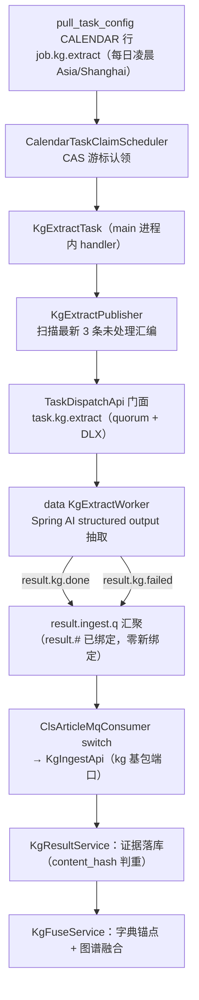
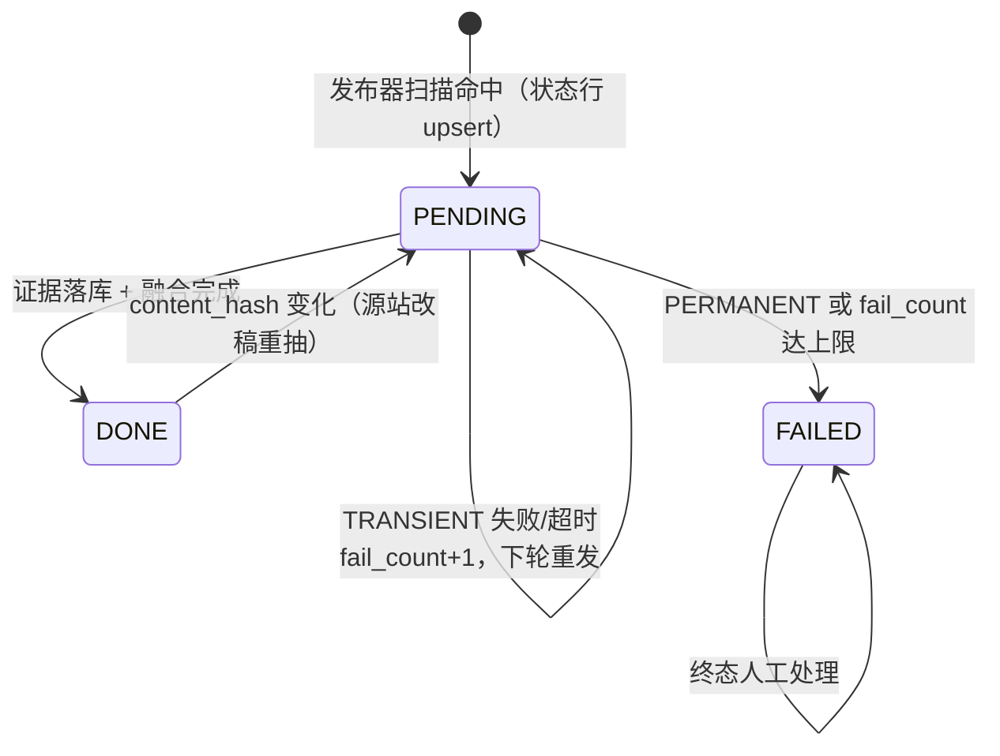

# 财联社《新闻联播》要闻时序知识图谱（kg 域）· 后端设计文档

> 版本：v1.0（2026-09-19，评审定稿）
> 范围：新顶层域 kg——从 cls_article 中《新闻联播》要闻汇编构建 PostgreSQL 时序知识图谱；main 发布任务 → data 无状态 LLM 抽取 → main 证据落库 + 融合
> 关联：docs/ai-pipeline/announcement-rag.md（任务管道先例：PENDING 扫描发布 / 结果上行 / 幂等摄取 / 对账）、docs/ai-pipeline/cls-article-vector.md（embedding 基座）、docs/architecture/pull-loop-unification.md（CALENDAR 认领协议）
> 状态：设计定稿，按断点实施

## 0. 决策记录

| # | 决策点 | 结论 | 关键理由 | 放弃的备选 |
|---|---|---|---|---|
| D1 | 图存储 | PostgreSQL 关系建模（kg_entity / kg_relation / kg_event / kg_event_entity + kg_evidence），时序语义一期以事件时间线（event_time）为主 | 全栈已是 PG + pgvector；Neo4j 同时加重运维与 GraalVM native 构建负担；数据量级（每天 1 篇、~25 条要闻）远够不着图库收益区 | 引入 Neo4j / 专用时序图库 |
| D2 | 领域归属 | 新建顶层域 kg/（main）；data 侧仅 worker；跨域经对方基包 API（ModulithVerifyTest 守护） | 知识图谱是独立衍生智能域，不是抓取（crawler）也不是公告（announcement）；回传端口宿主沿用「消费中枢所在域定义端口」先例 | 并入 crawler（混淆数据源与智能层） |
| D3 | 处理分界 | data 严格无状态单篇抽取（实体/关系/事件/时间归一化）；实体消解与图谱融合全部在 main 落库侧 | data 无 DB（不变量）；融合需要查询已有图谱与字典，放进 worker 会破坏 D2 约束；抽取可重放恰好适配 at-least-once | worker 带图谱上下文做消解 |
| D4 | 数据源口径 | `title LIKE '%《新闻联播》要闻%'`（配置键 kg.digest-title-pattern，可调） | 实测每天恰好 1 条、标题模式稳定；content 匹配引入 24 篇噪音（正文提及联播的普通电报） | content 匹配；独立数据源接入 |
| D5 | 调度模式 | pull_task_config CALENDAR 行（job.kg.extract，每日凌晨 Asia/Shanghai），代码零定时器 | 现有统一认领协议（CalendarTaskClaimScheduler CAS 游标）天然支持多部署；业务 cron 全在 DB 配置 | 代码内 @Scheduled/cron |
| D6 | 任务粒度与对账 | 1 篇文章 = 1 任务；发布器每轮扫「最新 3 条未处理」（LIMIT 可配 kg.dispatch-limit，默认 3）逐条下发；未终态每轮重发（at-least-once + 幂等摄取） | 每天产 1 条，3 条 = 3 天追赶窗口，覆盖断档（实测 2026-09-02~07 六天断档）；「最新 3 条**未处理**」比「当天有数据才下发」在补跑/漏发场景不丢数据 | 整体判断「今天有没有新数据」；独立任务队列表 |
| D7 | 落库两段式 | 先落 kg_evidence 证据行（content_hash 判重，一篇文章一版，改稿覆盖），再融合进图谱；融合失败不回退任务状态 | 证据是可重放的重建源（抽取噪声可自愈）；融合依赖字典查询与多表事务，失败应可单独重放 | 抽取结果直接写图谱 |
| D8 | 实体锚点 | 优先挂现有字典：name/alias 命中 stock → anchor STOCK，命中 cls_subject → anchor SUBJECT；未命中进自由实体（kg_entity status=ACTIVE），MERGED + canonical_id 机制预留（一期不做自动归并） | cls_article_stock / cls_article_subject 已积累现成锚点，实体对齐的大头白拿；开放域别名归并是 KG 传统难点，一期明确不做 | 一期自建别名归并 |
| D9 | 抽取技术 | Spring AI 2.0.1（项目 BOM 锁定版本）ChatClient structured output，复用 data 侧 LlmGatewayProperties 的 OpenAI 兼容网关配置 | 用户拍板直上 Spring AI；structured output 由框架注入 JSON schema 并解析；base-url 兼容 gemini/groq 端点，模型换用不改代码 | 手写 JSON 解析（LlmGateway 老路）；引入新依赖 |
| D10 | 错误分类 | 三分类：解析失败/内容不合法 → PERMANENT；网络/超时 → TRANSIENT（留 PENDING 对账重发）；429 → RATE_LIMITED（发布端熔断窗口） | 坏稿子靠对账无限重发是毒丸；照抄 EmbeddingErrorClassifier 思路 | 不分类一律重试 |
| D11 | 时序建模分期 | 一期只做事件时间线（kg_event.event_time 归一化）；kg_relation.valid_from/valid_to 列预留不启用 | 边有效期抽取难度高、错误率高，先让图谱有价值再演进 | 一期上边有效期 |

## 1. 目标与非目标

目标：

- 每天凌晨自动处理最新《新闻联播》要闻汇编（T+1 语义），抽取实体/关系/事件并归一化时间线，落成可溯源的时序知识图谱
- 每条实体/关系/事件可回溯到证据文章（article_id → cls_article 外链），证据 JSONB 可随时重建图谱
- 实体优先对齐股票/题材字典，未对齐实体进候选池可人工处理

非目标（一期）：

- 开放域别名自动归并（MERGED 机制仅预留字段）
- 关系边有效期抽取与 as-of 查询 API、前端可视化（二期）
- content 匹配与泛「新闻联播」主题抓取（噪音源，明确不做）

## 2. 总体架构



## 3. 数据源（2026-09-19 实测定案）

| 事实 | 实测值 | 对设计的影响 |
|---|---|---|
| 产量 | title 命中「《新闻联播》要闻」共 1114 条（2023-08-30 起），**每天恰好 1 条** | LIMIT 3 = 3 天追赶窗口 |
| 发布时间 | 集中在 12:00–14:00（次日中午汇编稿，标题日期与联播播出日可能差一天） | 凌晨跑 = T+1；时间归一化以正文绝对日期为准，相对表述基于文章 ctime |
| 文体 | level 全 B；正文仅 600–760 字（约 20–30 条要闻，每条一句话） | 单次 LLM 调用，无需切片；限流无压力 |
| 噪音 | content 提及联播但非汇编稿 24 篇 | 匹配只走 title（D4） |
| 断档 | 2026-09-02~07 六天缺失 | 「最新 3 条未处理」扫描式下发可自愈 |

## 4. MQ 契约（contract 模块）

| 项 | 值 | 说明 |
|---|---|---|
| 任务下行 | routing key `task.kg.extract` / queue `task.kg.extract.q` | quorum + DLX，prefetch 2，仿 task.announcement.process.q |
| 结果上行 | `result.kg.done` / `result.kg.failed` | result.ingest.q 已绑定 `result.#`，**零新增绑定** |
| 任务 payload | `KgExtractTaskPayload{articleId, contentHash, title, ctime, content}` | 正文直入 payload（<2KB），data 无需回源 |
| 完成 payload | `KgExtractDonePayload{articleId, contentHash, model, entities[], relations[], events[]}` | 结构见 §8 DTO |
| 失败 payload | `KgExtractFailedPayload{articleId, contentHash, classification, reason}` | classification ∈ TRANSIENT / PERMANENT / RATE_LIMITED |

契约新增注意：message 包每个具体 payload 类必须登记 `ContractRuntimeHints.DTO_TYPES`（data 已有 ContractRuntimeHintsCoverageTest 包扫描守卫，漏登记 native 运行期必崩）。

## 5. 数据模型（postgres/schema.sql，6 张表）

```sql
-- 抽取任务状态表（1 篇 = 1 任务，复刻 cls_article_embedding 范式）
CREATE TABLE IF NOT EXISTS public.cls_article_kg (
    article_id    int8 NOT NULL,
    status        varchar(10) DEFAULT 'PENDING' NOT NULL,   -- PENDING/DONE/FAILED
    status_reason varchar(200) NULL,
    fail_count    int4 DEFAULT 0 NOT NULL,
    content_hash  varchar(64) NOT NULL,
    extracted_at  timestamptz NULL,
    created_at    timestamptz DEFAULT CURRENT_TIMESTAMP NOT NULL,
    updated_at    timestamptz DEFAULT CURRENT_TIMESTAMP NOT NULL,
    CONSTRAINT cls_article_kg_pkey PRIMARY KEY (article_id)
);
CREATE INDEX IF NOT EXISTS idx_cls_article_kg_pending
    ON public.cls_article_kg (article_id) WHERE status = 'PENDING';

-- 抽取证据表（一篇文章一版，改稿重抽覆盖；图谱重建源）
CREATE TABLE IF NOT EXISTS public.kg_evidence (
    id           bigserial NOT NULL,
    article_id   int8 NOT NULL,
    content_hash varchar(64) NOT NULL,
    payload      jsonb NOT NULL,          -- worker 原始抽取 JSON
    model        varchar(100) NULL,
    extracted_at timestamptz DEFAULT CURRENT_TIMESTAMP NOT NULL,
    CONSTRAINT kg_evidence_pkey PRIMARY KEY (id),
    CONSTRAINT uq_kg_evidence_article UNIQUE (article_id)
);

-- 实体表（字典型：字典锚点 + 自由实体）
CREATE TABLE IF NOT EXISTS public.kg_entity (
    id            bigserial NOT NULL,
    name          varchar(200) NOT NULL,   -- 规范名
    entity_type   varchar(30) NOT NULL,    -- STOCK/SUBJECT/ORG/PERSON/PLACE/POLICY/EVENT/OTHER
    anchor_type   varchar(20) NULL,        -- STOCK / CLS_SUBJECT / NULL(自由实体)
    anchor_id     varchar(64) NULL,        -- stock_id / subject_id
    aliases       jsonb NULL,
    first_seen_at timestamptz NULL,
    last_seen_at  timestamptz NULL,
    mention_count int4 DEFAULT 0 NOT NULL,
    status        varchar(10) DEFAULT 'ACTIVE' NOT NULL,  -- ACTIVE/MERGED
    canonical_id  int8 NULL,               -- MERGED 时指向规范实体（二期启用）
    created_at    timestamptz DEFAULT CURRENT_TIMESTAMP NOT NULL,
    updated_at    timestamptz DEFAULT CURRENT_TIMESTAMP NOT NULL,
    CONSTRAINT kg_entity_pkey PRIMARY KEY (id),
    CONSTRAINT uq_kg_entity_type_name UNIQUE (entity_type, name)
);
CREATE UNIQUE INDEX IF NOT EXISTS uq_kg_entity_anchor
    ON public.kg_entity (anchor_type, anchor_id) WHERE anchor_id IS NOT NULL;

-- 关系边表（一期落库但 valid_from/valid_to 不启用，见 D11）
CREATE TABLE IF NOT EXISTS public.kg_relation (
    id                  bigserial NOT NULL,
    subject_entity_id   int8 NOT NULL,
    object_entity_id    int8 NOT NULL,
    predicate           varchar(50) NOT NULL,  -- 受控词表，见 §9
    valid_from          timestamptz NULL,
    valid_to            timestamptz NULL,
    confidence          numeric(4,3) NULL,
    evidence_article_id int8 NOT NULL,
    created_at          timestamptz DEFAULT CURRENT_TIMESTAMP NOT NULL,
    CONSTRAINT kg_relation_pkey PRIMARY KEY (id),
    CONSTRAINT uq_kg_relation
        UNIQUE (subject_entity_id, object_entity_id, predicate, evidence_article_id)
);
CREATE INDEX IF NOT EXISTS idx_kg_relation_subject ON public.kg_relation (subject_entity_id);
CREATE INDEX IF NOT EXISTS idx_kg_relation_object ON public.kg_relation (object_entity_id);

-- 事件表（一期时序主体）
CREATE TABLE IF NOT EXISTS public.kg_event (
    id              bigserial NOT NULL,
    article_id      int8 NOT NULL,        -- 溯源
    event_time      timestamptz NULL,     -- 归一化事件时间
    event_time_text varchar(100) NULL,    -- 原文时间表述
    title           varchar(300) NOT NULL, -- 事件摘要句
    detail          text NULL,
    event_type      varchar(30) NULL,
    content_hash    varchar(64) NOT NULL, -- 事件级判重
    created_at      timestamptz DEFAULT CURRENT_TIMESTAMP NOT NULL,
    CONSTRAINT kg_event_pkey PRIMARY KEY (id),
    CONSTRAINT uq_kg_event_article_hash UNIQUE (article_id, content_hash)
);
CREATE INDEX IF NOT EXISTS idx_kg_event_time ON public.kg_event (event_time);

-- 事件-实体关联
CREATE TABLE IF NOT EXISTS public.kg_event_entity (
    id        bigserial NOT NULL,
    event_id  int8 NOT NULL,
    entity_id int8 NOT NULL,
    role      varchar(30) NULL,
    CONSTRAINT kg_event_entity_pkey PRIMARY KEY (id),
    CONSTRAINT uq_kg_event_entity UNIQUE (event_id, entity_id)
);
CREATE INDEX IF NOT EXISTS idx_kg_event_entity_entity ON public.kg_event_entity (entity_id);
```

## 6. 任务状态机与对账



对账规则（沿用 announcement D6/D7 语义）：

- 发布器每轮对「未终态」（状态行缺失视为 PENDING）重发，at-least-once；摄取侧按 article_id + content_hash 幂等
- ingestDone 仅处理 PENDING 行计次与状态流转，终态不回退、不重复计次
- DONE 行 hash 与源表不符（源站改稿）→ 发布端置回 PENDING 并刷新 hash
- RATE_LIMITED 触发发布端熔断窗口（markRateLimited 先例）

## 7. 调度与发布扫描

pull_task_config 播种（data.sql）：

| 列 | 值 |
|---|---|
| task_code | job.kg.extract |
| schedule_mode | CALENDAR |
| cron_expression | 0 30 2 * * *（每日凌晨 02:30） |
| timezone | Asia/Shanghai |
| ttl_ms | 0 |

发布器扫描 SQL（KgExtractPublisher，语义参照 §0 D6；实际实现分两步查询避免跨域 join）：

```sql
-- crawler 基包 API：按标题模式取最新候选（kg.dispatch-limit 可配，默认 3）
SELECT id, title, content, ctime FROM cls_article
WHERE title LIKE :digestTitlePattern
ORDER BY ctime DESC LIMIT :scanWindow;

-- kg 域自留：过滤未终态（状态行缺失或 PENDING），命中即逐条下发并 upsert 状态行
```

- scanWindow 取 dispatch-limit 的 3 倍，为「最新 3 条未处理」过滤留余量
- **历史回填（二期首项，2026-09-19 落地）**：独立 `job.kg.backfill` CALENDAR 行（每 30 分钟，Asia/Shanghai）+ `KgBackfillTask`，与 daily 共用发布核/任务队列/结果通道/限流熔断，worker 与摄取侧零改动；扫描为最旧优先 ASC（`ClsArticleQueryApi.oldestDigestArticles`），窗口 = `kg.backfill.batch-size`（默认 20）× `scan-multiplier`（默认 3），每轮最多补发 batch-size 条——窗口随终态累积自然前滑、追平后窗口内全 DONE 零下发空转；startup 15s 首轮触发与 DB 调度双路径（单飞守卫防重叠），`kg.backfill.enabled=false` 整体停用（E2E 共享 broker 必关）。回填状态行在下发时才建（PENDING 年龄≈在途时长），不预播种全量，PENDING_AGE 巡检语义不受影响

## 8. 抽取契约与 Prompt 骨架

Spring AI structured output 目标 DTO（contract message 包，main/data 共享）：

```java
KgExtractionDto {
  List<KgEntityDto> entities;     // {name, type, aliases[]}
  List<KgRelationDto> relations;  // {subjectName, objectName, predicate, confidence}
  List<KgEventDto> events;        // {title, detail, time(ISO 可空), timeText, eventType, entityNames[]}
}
```

Prompt 规则（system 骨架，实现随断点迭代）：

1. 只抽正文明确提及的实体，禁止发明；实体类型限 §5 枚举
2. 时间归一化：正文绝对日期优先；相对表述（昨日/上周）以文章发布时间（payload 提供，ISO）为基准换算；无法确定时间留空但必须给 timeText 原文表述
3. 标题日期仅作参考，不直接作为事件日期（汇编稿标题日期与播出日可能差一天）
4. 谓词受控词表：出台/发布/召开/签署/合作/任命/增长/下降/投资/扩大/禁止/推进/其他
5. 别名收集：机构全称/简称/英文缩写/上市主体名，供锚点匹配
6. 输出恒显式 max_tokens（沿用 LlmGatewayProperties），解析失败按 PERMANENT 上报

## 9. 融合规则（KgFuseService，main 侧）

1. **锚点解析**：实体 name + aliases → crawler 基包字典查询 API（stock 精确/别名命中 → anchor STOCK；cls_subject 命中 → anchor CLS_SUBJECT）；未命中 → (entity_type, name) upsert 自由实体
2. **实体幂等**：anchor 命中以 uq_kg_entity_anchor 定位；自由实体以 uq_kg_entity_type_name 定位；命中后更新 last_seen_at / mention_count / aliases 并集
3. **关系幂等**：uq_kg_relation（含 evidence_article_id）冲突跳过——同一文章重复摄取零副作用
4. **事件幂等**：uq_kg_event_article_hash 冲突跳过；事件-实体关联按 name 映射回实体 id 后写 kg_event_entity
5. **事务边界**：证据落库独立事务先行（断点安全序，仿 announcement content 先行）；融合失败仅记状态与告警，任务不回退 FAILED，证据保留待重放

## 10. 监控

- PipelineWatchTask 队列巡检清单增补 task.kg.extract.q（DATA_DOWN：consumer=0 告警）
- 复用既有 DEAD_Q / BACKLOG / BROKER_UNREACHABLE 告警与 pull_heartbeat 心跳面
- cls_article_kg 最老 PENDING 年龄纳入 PENDING_AGE 类指标（随一期巡检顺手加，超龄邮件告警带冷却）

## 11. 分期

| 期 | 范围 |
|---|---|
| 一期（本 epic） | 全链路（调度→发布→抽取→摄取→融合）、字典锚点、事件时间线、证据表、队列巡检接入 |
| 二期 | 历史回填 backfill ✅ 已落地（2026-09-19：job.kg.backfill 每 30 分钟最旧优先分批补发，存量 1105 条 ≈ 1.2 天追平，见 §7）；别名归并（MERGED 流转人工/规则触发）、kg_relation 有效期与 as-of 查询、查询 API 与前端可视化 |

## 12. 改动面清单

| 模块 | 落点 |
|---|---|
| contract | MqKey/MqQueue/MessageType 增 task.kg.extract、result.kg.done/failed 常量；message/ 增 3 个 payload + KgExtractionDto 结构；ContractRuntimeHints 登记（CoverageTest 守卫自动覆盖） |
| main 新域 kg/ | task/KgExtractTask（进程内 handler）、mq/KgExtractPublisher、service/KgResultService（摄取）、service/KgFuseService（融合）、entity×6、repository×6；基包出 KgIngestApi 端口（供 crawler 消费中枢回调） |
| main crawler | 基包增汇编查询 API（按标题模式取最新候选）与字典锚点查询 API；mq/ClsArticleMqConsumer 分发增 kg 分支；data.sql 播种 job.kg.extract 行 |
| data | worker/KgExtractWorker（Spring AI ChatClient structured output）、config/KgWorkerConfig（复用 LlmGatewayProperties 网关配置）、错误三分类上报 |
| schema | postgres/schema.sql 增 6 张表（§5）；postgres/data.sql 增 1 行播种 |
| 配置 | main application.yml：kg.digest.*、kg.process.*、kg.backfill.*（enabled/batch-size/scan-multiplier/startup-delay） |
| 监控 | monitor/PipelineWatchTask 队列清单 + PENDING_AGE 纳入 |
| 文档/索引 | docs/README.md ai-pipeline 域增条目；stock-calculator-service-index 归属表增 kg 行（实施首轮同步） |
