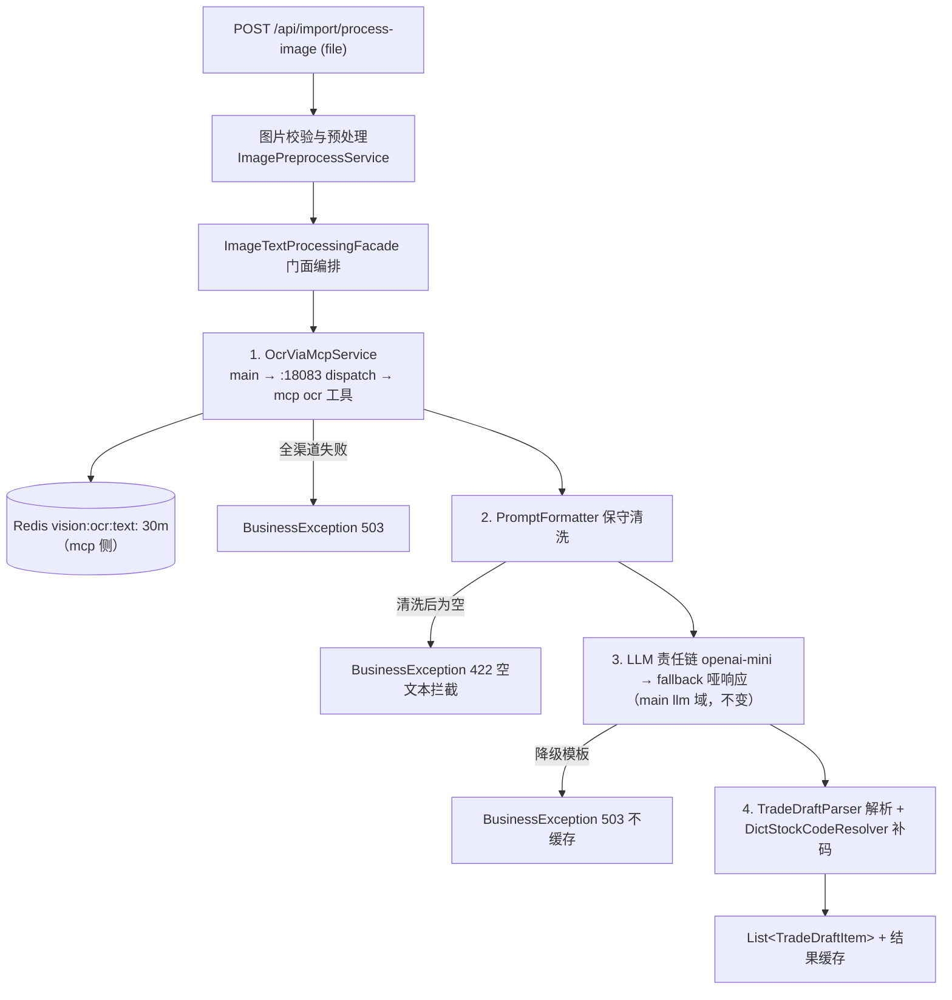

# 智能图片分析：MCP OCR 工具 + main LLM 解析管道

> 版本：v2.0（2026-09-26 vision 精简重构）
> 定位：`/api/import` 下「图片 → OCR 提取文本 → 清洗组装 → LLM 处理 → 业务结果」全链路的实现文档。
> v2.0 起 OCR 层不再是 main 本地责任链，而是经 :18083 dispatch 调 **mcp 经纪人 ocr 工具**（纯 OCR 渠道，无模型）；LLM 文本解析链路仍归 main。
> 配套代码：`stock-calculator-mcp` 模块 `mcp.vision`（OCR 层）+ `stock-calculator-main` 模块 `llm` / `vision`（解析层）
> 前版（v1.2 及以前，main 本地三渠道 OCR 链 + Gemini 多模态直读）历史细节见 git 历史。

---

## 0. v2.0 精简决策记录

| # | 决策 | 结论 |
|---|------|------|
| R1 | OCR 层归属 | OCR 渠道链（azure→ocrspace，**删除 local-gemini 多模态兜底**）整体平移至 mcp 模块 `mcp.vision` 包，以 `ocr` MCP 工具暴露；main 经 dispatch 调用，不直连 :18081（free-canvas 硬约束 #1） |
| R2 | 无模型纯 OCR | ocr 工具只用传统 OCR 渠道，不引入任何多模态模型；原 Gemini 多模态链（`OcrExecutor`/`GeminiOcrExecutorImpl`/`LocalFallbackOcrService`）与 `/ocr-parse` 直读路径一并删除 |
| R3 | 解析归 main | 交易草稿的 LLM 解析（`LlmChainRouter` + copilot prompt 模板热更 + `TradeDraftParser`）保留在 main；`/ocr-parse` 收敛为 `/process-image` 同管道别名（端点保留，前端零改动） |
| R4 | 代码补全换字典 | 缺码补全由腾讯 Smartbox 外呼改为 **main 本地读 `stock:dict` Redis 镜像**（`DictStockCodeResolver`，DB 准源，与 mcp 侧字典同源同 key），零外部依赖；旧名/改名支持反而变好（oldName 在镜像内） |
| R5 | 超时梯队调档 | orchestration MCP client request-timeout 8s→**40s**、main 15s→**45s**（覆盖 ocr 双渠道重试最坏耗时 azure 30s×2+退避）；ToolInvoker REST 分支 8s 与 dispatch 10s 常量不变（仅 kind=rest 走 RestClient） |
| R6 | dispatch 客户端上移 | `BrokerDispatchClient` 上移 common 域为 `McpDispatchClient`（Modulith：跨域只引基包类型；broker 与 vision 共用同一 dispatch 通道） |

v1.x 关键决策（P1–P11）中仍然生效的：LLM 域独立（P1）、LLM 单渠道不重试（P3）、诚实哑响应兜底（P4）、保守清洗（P6）、结果缓存与强制刷新（P9）、Prompt 模板热更（P10）；P8（多模态直读不迁移）与 P11（Smartbox 补全）**已废弃**（R2/R4 取代）。

---

## 1. 总体架构



## 2. 组件落点

### mcp 模块（`stock-calculator-mcp` → `mcp.vision` 包，纯 OCR 无模型）

| 组件 | 职责 |
|---|---|
| `OcrTool` | `@Tool("ocr")`：base64 图（容错剥离 dataURL 前缀）+ language → `{text, length}` / `{error}` |
| `OcrChainManager` | 责任链调度（自 main 平移）：@Order 渠道遍历、MD5 缓存（`vision:ocr:text:<MD5>`，与 v1.x 同 key）、可重试退避、全败聚合 503（`OcrChainException`） |
| `AzureOcrService` / `OcrSpaceService` | 双渠道（@Order 1/2），实现与响应结构兼容逻辑照 v1.x 原样平移；HTTP 辅助内联（不依赖 main util.HttpUtil） |
| `OcrProperties` / `VisionCacheStore` / `RedisVisionCacheStore` | `vision.ocr.*` 配置与 Redis 缓存（fail-open 降级语义不变） |

注册：`McpToolConfig.toolCallbackProvider` 追加 `ocrTool`；orchestration `ToolRegistry.MCP_SEEDS` 增 `ocr` 种子（domain=vision，启动自注册）。

### main 模块（vision 域精简后）

| 组件 | 职责 |
|---|---|
| `OcrViaMcpService` | **新增**：base64 → dispatch 调 `ocr` 工具，error 节点→`BusinessException(503)` |
| `ImageTextProcessingFacade` | 门面编排不变，仅 OCR 阶段注入由本地链换 `OcrViaMcpService`；异常边界：OCR 失败 503 / 空文本 422 / LLM 降级 503 不缓存 |
| `DictStockCodeResolver` | **新增**（替代 SmartBoxStockCodeResolver）：读 `stock:dict` HASH 惰性建名称索引（TTL 5min），名称/曾用名精确→contains 候选；沪深过滤 + fail-open 空列表，唯一候选静默回填、多候选透传语义不变 |
| 保留 | `ImportController`（5 端点全保留）、`ImagePreprocessService`/`ImageHeaderUtil`、`PromptFormatter`、`TradeDraftParser`、`VisionCacheStore`/`RedisVisionCacheStore`（draft 结果缓存仍在 main）、dto/enums、`VisionConfig`（仅注册 VisionAiProperties） |
| 删除 | `OcrExecutor`、`GeminiOcrExecutorImpl`、`OcrService`、`OcrChannelException`、`OcrChainManager`、三渠道实现、`TradeVisionService`/`GeminiTradeVisionServiceImpl`、`SmartBoxStockCodeResolver`、`OcrProperties`、`VisionOcrConfig`、`ImageProcessOptions`（孤儿 DTO） |

### common 域

`McpDispatchClient`（原 broker `BrokerDispatchClient` 上移）：dispatch 确定性调用出口，broker（K 线/指标/监控）与 vision（OCR）共用。

## 3. API 端点（契约不变，前端零改动）

| 端点 | v2.0 行为 |
|---|---|
| `POST /api/import/ocr-parse` | 收敛为 `/process-image` 同管道别名（useCache=true）；原 Gemini 多模态直读废弃（R2） |
| `POST /api/import/ocr-text` | 经 MCP ocr 工具；language 透传，缺省 mcp 侧 `vision.ocr.language`（chs） |
| `POST /api/import/image-ai` | 不变（MCP OCR → 清洗 → main LLM 链） |
| `POST /api/import/process-image` | 不变（+ 结果缓存 `vision:ai:draft:<MD5>` 30m、useCache=false 审查模式强刷）；补码数据源换字典（R4） |
| `GET /api/import/stock-candidates` | 不变；候选范围从 Smartbox 全量收窄为字典镜像（~5000 条，含 ETF/曾用名） |

TradeDraftItem 契约（stockCode/stockName/direction/price/volume/tradeTime/status/candidates）不变。

## 4. 配置参考

```yaml
# ---- mcp 模块（stock-calculator-mcp application.yml）----
vision:
  ocr:
    language: chs
    cache-ttl: 30m
    max-attempts: 2
    retry-backoff: 300ms
    azure:
      enabled: ${AZURE_OCR_ENABLED:true}
      endpoint: ${AZURE_OCR_ENDPOINT:https://zzhscsocr.cognitiveservices.azure.com/}
      api-key: ${AZURE_OCR_API_KEY:}
      api-version: "2024-02-01"
      connect-timeout: 5s
      read-timeout: 30s
      poll-interval: 500ms
      poll-max-times: 20
    ocrspace:
      enabled: true
      api-key: ${OCRSPACE_API_KEY:K82621831488957}
      url: https://api.ocr.space/parse/image
      engine: "2"
      connect-timeout: 5s
      read-timeout: 30s

# ---- main 模块 ----
vision:
  ai:
    result-cache-ttl: 30m   # 交易草稿结果缓存（vision.ocr.* 已随 OCR 层移入 mcp）

# ---- 超时梯队（v2.0 调档，R5）----
# orchestration：spring.ai.mcp.client.common.request-timeout: 40s（原 8s）
# main：spring.ai.mcp.client.common.request-timeout: 45s（原 15s）
# ToolInvoker.INVOKE_TIMEOUT 8s / DispatchTool.DISPATCH_TIMEOUT 10s 常量不变（仅 REST 分支）
```

环境变量变化：`AZURE_OCR_*` / `OCRSPACE_API_KEY` 改为注入 **mcp 容器**（docker-compose.mcp.yml 的 env_file 已覆盖，.env 无需改动）；main 侧对应变量失效可清理。

## 5. 降级行为一览

| 场景 | 结果 |
|---|---|
| mcp/编排通道未起 | 503「OCR 识别失败（MCP ocr 工具）…」/「编排通道未装配」 |
| Azure 429 | mcp 侧 warn → 重试 → 流转 OCR.space |
| OCR 全渠道失败 | 503（mcp `OcrChainException` → 工具 `{error}` → main 503） |
| OCR 成功但图中无文字 | 422 空文本拦截（main 侧，不进 LLM） |
| LLM 全链失败/降级模板 | 503（main 侧，不变） |
| Redis 字典不可用 | 补码 fail-open 零候选，缺码行走前端人工补录 |

## 6. 测试与验证

| 测试类 | 模块 | 覆盖 |
|---|---|---|
| `OcrChainManagerTest` | mcp | 6 用例：缓存命中跳渠道/成功写缓存/可重试流转/健康跳过/全败聚合/空图 400 |
| `AzureOcrServiceExtractContentTest` | mcp | 6 用例：4.x/v3.2 content 路径/readResults 多页/blocks 兜底/空体/error 分类 |
| `ImageTextProcessingFacadeTest` | main | 原 14 用例平移（mock OcrViaMcpService，编排/缓存/补全语义不变） |
| `TradeDraftParserTest` / `PromptFormatterTest` | main | 不变 |

验证命令（2026-09-26 全绿）：

```sh
./mvnw test -pl stock-calculator-mcp                                    # 74 全过
./mvnw test -pl stock-calculator-main -am '-Dtest=!StockCalculatorApplicationTests,!SyncBackupL1IntegrationTest' \
  '-Dsurefire.failIfNoSpecifiedTests=false' '-DfailIfNoTests=false'     # 449 全过
```

## 7. 已知限制与注意事项

1. **候选范围收窄**：补码候选限于 `stock:dict` 镜像（DB 全量股票，含 ETF 与曾用名）；拼音模糊搜索能力随 Smartbox 移除，前端 `StockAutocomplete` 自有代理不受影响；
2. **字典索引新鲜度**：main 侧 `DictStockCodeResolver` 名称索引 TTL 5min，新股上市后最长 5min 延迟（重启全量镜像自愈）；
3. **超时依赖**：dispatch 同步链路最坏耗时 ≈ azure(30s×2)+退避+ocrspace(30s×2) ≈ 2min > orchestration 40s 预算——极端双渠道挂死场景 orchestration 会先超时返回错误（可接受：此时 mcp 侧调用实际仍在跑，缓存可能已写入）；低概率事件，如需根治转 async_long 任务化；
4. **明文 Key**：`OCRSPACE_API_KEY` 默认值仍内置 yml（开箱可用），仓库公开前建议改纯环境变量（v1.x 遗留）；
5. **LLM 无结果缓存**：同图同任务重复请求重复耗额度（P2 预留，不变）。
