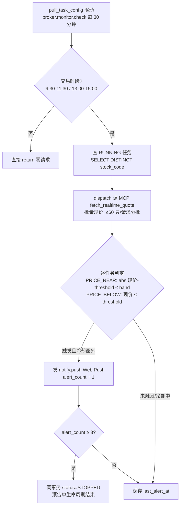

# 价格预告单监控设计（broker_monitor_task 增强）

> 用户在前端填写价格预告单（目标价 + 自定义「附近」容差），后端持续追踪该股票价格，
> 价格进入目标价附近区间时推送通知；最多提醒 3 次后预告单自动结束；
> 用户主动结束则立即停止追踪。多个用户可追踪同一只股票。

## 一、背景与现状基线

本功能是对既有 **broker 画布监控链路**（free-canvas §3.5·B）的增强，不新建体系。
现状基线：

| 环节 | 现状 | 落点 |
|---|---|---|
| 登记/停止 | start/stop API，用户级，状态机 RUNNING/STOPPED，重复 start 幂等 | `broker/service/MonitorService.java` |
| 持续追踪 | 每分钟调度 + 任务级节流，STOPPED 后不再判定 | `broker/task/MonitorCheckTask.java`（`findDueRunning`） |
| 价格比较 | 仅 `PRICE_BELOW`（跌破阈值） | 同上 |
| 取价方式 | 经 dispatch 调 MCP `fetch_kline` 读**最新日收盘价**（T+1 感知） | `MonitorCheckTask.fetchLatestClose` |
| 通知触达 | `notify.push` MQ → main `NotifyPushMqConsumer` → Web Push | `broker/mq/BrokerAlertPublisher` |
| 多用户同股 | 天然支持：任务按 user+stock 建行，逐任务判定 | repository |
| 防轰炸 | 单用户并发上限（默认 5）+ 告警冷却窗（`last_alert_at`） | `MonitorService` + `BrokerProperties` |

相邻体系 **notify 模块（:18082）** 是时间/事件型提醒（at_time/on_event 瞬时点触发），
「持续盯价」的连续条件判定归 main 的 `MonitorCheckTask`，二者边界不变。

## 二、需求定案

| # | 需求 | 定案 |
|---|---|---|
| R1 | 追踪频率不用太高 | **30 分钟一轮** |
| R2 | 价格要实时 | 取价源从日线收盘价换**实时行情**（腾讯 `qt.gtimg.cn`） |
| R3 | 只在交易时段运行 | A股 9:30–11:30 / 13:00–15:00 门控，非时段零请求 |
| R4 | 「在附近」由用户定义 | 新告警类型 `PRICE_NEAR`：`abs(现价 − threshold) ≤ band`，band 用户填 |
| R5 | 批量取价防封 IP | 一轮所有任务合并为**按股票去重后一次（或分批）实时行情请求** |
| R6 | 最多提醒三次 | 任务累计 `alert_count`，**第 3 次提醒后同事务自动转 STOPPED** |
| R7 | 用户结束即停 | 既有 stop API 已覆盖，零改动 |

## 三、总体流程



## 四、改动清单

### 1. MCP 实时批量行情客户端（新增）

- 落点：`stock-calculator-mcp/.../mcp/quote/TencentRealtimeClient.java`，
  与 `TencentDailyClient` 同包同风格（RestClient + UA 惯例）。
- 接口：`https://qt.gtimg.cn/q=sh600519,sz000001,...`，一次约 60 只；
  返回文本 `v_sh600519="1~贵州茅台~600519~现价~昨收~..."`，`~` 分隔，取现价字段。
- 注册为 MCP 工具 `fetch_realtime_quote`（入参股票代码列表，出参 code→price 映射）。
- **边界**：main 不直连行情源，MonitorCheckTask 仍经 `McpDispatchClient` 调用。

### 2. MonitorCheckTask 批量化

- 判定循环改为三段：查 DISTINCT 股票 → 一次批量取价（>60 只分批）→ 逐任务内存判定。
- 单任务失败隔离纪律保留（try-catch 逐条，不中断整轮）。
- 批量请求失败隔离：单只解析失败不影响其他股票。

### 3. PRICE_NEAR 告警类型 + direction 方向（前端反馈定案 2026-09-26）

- `MonitorService.ALERT_TYPES` 白名单：`PRICE_BELOW` / `PRICE_NEAR`；
- `MonitorStartRequest` 加 `direction`（BUY/SELL 必填）；`alertRule` 加 `band` 字段（正数，单位元）；
- **SELL 仅容 PRICE_NEAR**（登记时 400 拒绝 SELL+PRICE_BELOW——BELOW 是低吸语义）；
- **判定改单边**（消盘中触及又回落的漏报，取数见 §四.2）：
  - BUY 低吸：PRICE_BELOW `low ≤ threshold`；PRICE_NEAR `low ≤ threshold + band`（含跌破）；
  - SELL 高抛：PRICE_NEAR `high ≥ threshold − band`（含升破）；
- **取数改 30 分钟 K 线 low/high**：MCP 新工具 `fetch_m30_range`（腾讯 mkline 接口，
  `TencentRealtimeClient.fetchM30Ranges` 逐股取最近一根 m30，盘中为进行中 bar），
  MonitorCheckTask 经 dispatch 调用替代原实时现价；`fetch_realtime_quote` 工具保留他用途；
- `PRICE_BELOW` 的 BUY 语义不变；幂等键扩为 user+code+type+threshold+band+direction；
- list 回显 `direction`。

### 4. 调度节奏与交易时段门控

- 调度频率改 30 分钟（pull_task_config 的 `job.broker.monitor.check` 配置）；
- `MonitorCheckTask.run()` 头部加交易时段门控：A股 9:30–11:30 / 13:00–15:00，周末跳过；
  节假日若 crawler 域有交易日历则用之，否则「周几 + 时段」兜底（// UNCERTAIN: 节假日判断数据源待定）。

### 5. alert_count 三次封顶（唯一 DDL 变更）

```sql
ALTER TABLE public.broker_monitor_task ADD COLUMN alert_count int NOT NULL DEFAULT 0;
```

- 判定触发告警后 `alert_count + 1`；`alert_count >= 3` 时同事务置 `status = STOPPED`；
- start/查询接口回显 `alert_count`，前端可显示「已提醒 2/3 次」；
- 任务 STOPPED 后不再占用户并发额度（既有 `countByUserIdAndStatus` 天然支持）。

## 五、防轰炸与语义说明

- **冷却窗保留**（`alertCooldownSeconds`，建议 ≥ 检查周期同量级如 2h）：
  价格持续在区间内徘徊时，每冷却窗提醒一次、累计 3 次、自动停。
  即 R6 语义为「**按任务累计 3 次**，含冷却窗内的重复提醒」。
- **推送合并窗口（2026-09-26 定案「替代方案」）**：不做按轮聚合，做**同用户 30s 合并窗口**——
  `PushCoalescingService`（main notify 包）缓冲同用户消息，窗口冲刷时批量逐条落库
  （通知中心明细不缩水）但 Web Push 只发一条（标题取首条 +「N 条合并」，正文逐行列出）。
  配置键 `push.coalesce-window-seconds`（默认 30）。JVM 内缓冲：进程重启丢窗口内在途推送，
  拉取兜底通道不受影响；多实例部署各实例独立成窗（// UNCERTAIN: 多实例需改 MQ 延迟队列方案）。
- 触发后价格离开区间再进入，同样受冷却窗约束、计入同一 3 次额度。
- 多用户同股互不影响：告警按任务（user 粒度）各自计数与冷却。

## 六、明确不做（边界）

- 不做盘中秒级/分钟级盯价（30 分钟粒度是定案，实时接口只为取准价格，不提高频率）；
- 不做 notify 模块改造（reminder 触发引擎是瞬时点触发，与持续盯价边界不变）;
- 不做 MA_CROSS 等扩展告警类型（既有注释预留，另行演进）；
- 不做预告单有效期 expire_at（本期不需求，待用户提出）。

## 七、关联

- 上游设计：`docs/architecture/free-canvas.md` §3.5·B（画布监控调度路径）
- 通知触达：`docs/notify/web-push.md`（Web Push 双通道）
- 相邻服务：`docs/notify/design.md`（notify :18082，时间/事件型提醒，边界见 §一）
- 行情数据源：`docs/mcp/design.md`（mcp quote 子包，日线客户端同源惯例）
