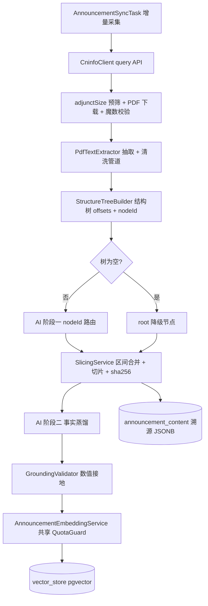

# 公告提取与蒸馏管道（announcement 域）· 后端设计文档

> 版本：v1.7（2026-09-10，S1/S3 实证闭环回写（§8.1），管道未开工；v1.6 长效白名单/首拉护栏/年报回顾性/加载写法/reason 词典；v1.5 历史下界）
> 范围：新顶层域 announcement——CNINFO 公告采集、内存 PDF 纯文本抽取、代码结构树、双阶段 AI（标题路由 + 事实蒸馏）、溯源三件套、pgvector 落库
> 关联：docs/cls-article-vector-backend-design.md（embedding 基座与 CF 额度治理）、docs/announcement-pipeline-todo.md（T1 正文留存暂缓，护栏随 P0 落地）
> 状态：实现前须过 §8 实证清单

## 0. 决策记录

| # | 决策点 | 结论 | 关键理由 | 放弃的备选 |
|---|---|---|---|---|
| D1 | 领域归属 | 新建顶层域 announcement/ | crawler 是财联社专属，公告为独立数据源；跨域仅引对方基包类型（ModulithVerifyTest 守护） | 并入 crawler（混淆数据源） |
| D2 | 处理模式 | 双引擎：纯代码结构裁切 + 单/双次极小 Token AI；不存 PDF、不解析表格结构 | 单篇 token 5~15K，成本 0.01~0.05 元；百页解析 1~3s | 全文送 LLM；表格 OCR（贵两个数量级） |
| D3 | PDF 抽取 | PDFBox 3.x，JVM 内完成；大文件 tmpdir 瞬态文件解析、用后即删 | 单栈零侧车（native 终态）；文件式解析堆占用有界 | Python pdfplumber 侧车；byte[] 全堆解析（OOM） |
| D4 | 切片定位 | 建树期绑定绝对字符偏移；AI 阶段一只回 nodeId 数组，代码按偏移截取 | 同时消除标题回传失配、跨章重名误配、页码边界 bug 三类问题 | 字符串 find()（重名/失配）；页码切片（end_page 语义歧义） |
| D5 | 文本留存 | 不存 cleaned_text（T1 暂缓）；溯源 = 重放重建：重抓 PDF → 重抽 → 重建树 → nodeId 定位；护栏三件套随 P0 落地 | 摘要永久存，换 embedding 模型只需重嵌摘要；重蒸馏低频，重抓兜底可接受（万篇约 1~3h） | 存正文列（3 年约 30~60GB）；本地冷归档（adjunctUrl 即外部归档） |
| D6 | 向量化 | announcement 域内复刻小路径（CF bge-m3 1024 维同空间）；EmbeddingQuotaGuard 提升至 crawler 基包共享计数 | 复刻是 P0 最小改动；CF 免费额度账号级共享，cls 回填已占 75%~84%，双独立计数必超限 | 泛化 crawler/embedding service（跨域引子包类型违反红线）；独立 QuotaGuard（额度超限雷） |
| D7 | 数据模型 | announcement 主表 + 1:1 announcement_content（仅溯源 JSONB，无正文大列）；向量确定性 UUID 幂等 | 三件套几 KB~几十 KB/篇；ON CONFLICT 覆盖式重嵌已实证 | 节点级关系表（无 join 诉求）；正文大列（拖垮列表查询带宽） |
| D8 | 表格数字防护 | 防线1 prompt 数字保真（照抄原文写法，禁换算/舍入）；防线2 数值化接地校验（单位族同族直比/异族归一 + 1 ULP 容差）；失败定向重试 1 次 → FAILED | 前缀匹配覆盖不了四舍五入向上；错误数字比缺失更毒；防线2 只能证伪「凭空捾造」，防线1 是主力 | string.contains()（假阴性高）；表格 OCR |
| D9 | 状态机 | PENDING/DONE/FAILED 三态 + fail_count + status_reason 细分，复刻 cls_article_embedding 范式 | 状态即游标；FAILED 终态防毒丸空耗；grounding 失败等细分走 status_reason，不加第四态 | 引入 NEEDS_REVIEW 第四态（破坏游标查询惯例） |
| D10 | Native 策略 | Bean 一律注册 + 运行期门控（EmbeddingGate 式，R1 对齐）；PDFBox native 冒烟为硬验证项，不通过则 PDF 管道仅 JVM 变体启用 | 构建期条件装配已被 AOT 固化证伪（cls 文档 D9） | 构建期 @ConditionalOnProperty |
| D11 | 索引与生命周期 | 无 TTL（不存正文）；热路径索引 = announcement_id 唯一 + status 部分索引；structure/selection JSONB 不建 GIN | 无节点级查询诉求；PENDING 游标是唯一热路径；TTL 问题随 D5 消失 | JSONB GIN；TTL/分区 |
| D12 | 编码基线 | 清洗期 NFKC 归一化 + 非 BMP（>U+FFFF）与孤立代理对替换为 □（U+25A1） | char 偏移 == code point 偏移恒等式成立，切片/JSONB/SQL/跨语言重放全一致；□ 保留行首缩进判断 | 全链 codePointCount 纪律（每处工具函数 CP 化，漏一处埋雷） |
| D13 | 抓取范围 | 用户订阅驱动（订阅 = 标记 + 范围来源双职，幂等）：announcement_subscription（user_id + stock_id，orgId 懒解析回填）；范围 = 订阅聚合 DISTINCT，sync.stock-list 降级为种子兜底 | 抓取量由用户圈定，轻量约束更强；订阅是产品入口而非运维配置；订阅粒度 = 发行人（受托管理/评级跟踪按发行人锚定） | 全局静态配置抓取（无法响应用户）；订阅级 category 过滤（P1 再议）；独立游标表（可从主表推导） |

## 1. 目标与非目标

目标：

- 圈定范围内的 A 股公告（债券受托管理报告、评级跟踪、重大事项类）建立可溯源语义检索基座
- 单篇成本 0.01~0.05 元、秒级延迟；摘要 200~300 字纯事实
- 每条摘要可追溯：章节标题 + 页码 + 字符偏移 + adjunctUrl 原文外链

非目标：

- 表格结构化解析（表格区域按纯文本保留，靠 D8 防数字污染）
- 扫描件 OCR（无文本层 → FAILED(SKIPPED_NO_TEXT) 终态）
- 全市场全类型公告回填（按需圈定）

## 2. 总体架构



### 2.1 组件清单

| 组件 | 落点 | 职责 |
|---|---|---|
| AnnouncementSyncTask | announcement/task | 定时按订阅聚合范围增量采集（PENDING），水位按 sec_code 从主表推导（§4.1） |
| AnnouncementProcessTask | announcement/task | 拉取 PENDING 批次执行处理管道（与采集解耦），se_date DESC 近端优先消费 |
| CninfoClient | announcement/client | query API + PDF 下载 + 节流 + 错误三分类 |
| PdfTextExtractor | announcement/parser | PDFBox 抽取 + 清洗管道（§4.2） |
| StructureTreeBuilder | announcement/parser | 正则建树 + offsets 绑定 + 去重（§4.3） |
| SlicingService | announcement/parser | nodeId → 区间合并 → 截取 → sha256（§4.5） |
| AnnouncementProcessService | announcement/service | 编排 + 状态机 |
| GroundingValidator | announcement/service | 数值化接地校验（§4.7） |
| AnnouncementEmbeddingService | announcement/service | 摘要向量化（复刻小路径，共享 QuotaGuard） |
| AnnouncementProperties | announcement/config | announcement.* 配置绑定 |
| AnnouncementSubscriptionService | announcement/service | 订阅 CRUD（幂等标记，不触达抓取逻辑）+ orgId 懒解析回填 + 首拉事件发布 |
| AnnouncementSubscriptionController | announcement/controller | 订阅/退订/列表 API |

## 3. 数据模型（入 postgres/schema.sql）

```sql
CREATE TABLE announcement (
    id              BIGSERIAL PRIMARY KEY,
    announcement_id TEXT UNIQUE NOT NULL,          -- CNINFO announcementId，幂等键
    title           TEXT NOT NULL,                 -- 已做 HTML 实体解码
    adjunct_url     TEXT NOT NULL,                 -- static.cninfo.com.cn 外链
    se_date         DATE NOT NULL,
    sec_code        varchar(32),                   -- 发行人证券代码（对齐 stock 字典口径；S3 实证响应字段）
    sec_name        varchar(64),
    status          TEXT NOT NULL DEFAULT 'PENDING',
    status_reason   TEXT,                          -- 终态细分，枚举词典（实现为 Java Enum）：
                                                   --   DOWNLOAD_FAIL=下载/魔数/重试耗尽（含404、非PDF响应）
                                                   --   PARSE_FAIL=PDFBox 解析异常（损坏文件）
                                                   --   PARSE_TIMEOUT=解析超时
                                                   --   SKIPPED_ENCRYPTED=用户密码加密件
                                                   --   SKIPPED_NO_TEXT=扫描件/无文本层
                                                   --   LLM_ROUTE_FAIL=阶段一路由重试后仍失败
                                                   --   GROUNDING_FAIL=接地校验重试后仍失败
    fail_count      INT NOT NULL DEFAULT 0,
    summary         TEXT,                          -- 阶段二产物 200~300 字，即向量 content
    created_at      TIMESTAMPTZ NOT NULL DEFAULT now(),
    updated_at      TIMESTAMPTZ NOT NULL DEFAULT now()
);
CREATE INDEX idx_announcement_pending ON announcement (id) WHERE status = 'PENDING';
CREATE INDEX idx_announcement_sec ON announcement (sec_code, se_date);

-- 1:1 溯源表：无正文大列（T1 暂缓），仅溯源三件套
CREATE TABLE announcement_content (
    announcement_id   BIGINT PRIMARY KEY REFERENCES announcement(id),
    extractor_version TEXT NOT NULL,               -- 抽取/清洗规则版本（T1 护栏3）
    char_count        INT NOT NULL,                -- 清洗后文本长度（char == code point）
    page_count        INT NOT NULL,
    structure_json    JSONB NOT NULL,              -- 树快照：nodeId/level/title/page/startOffset/endOffset
    selection_json    JSONB NOT NULL               -- 选择记录：nodeIds/sliceRanges/sliceSha256[]/hash 算法+编码/joinSeparator/model/promptVersion/route
);

-- 订阅表：抓取范围来源（D13）；user 外键对齐 auth 惯例，stock 字典引用走应用层完整性（cls_article_stock 惯例）
CREATE TABLE IF NOT EXISTS public.announcement_subscription (
    id         BIGSERIAL PRIMARY KEY,
    user_id    UUID NOT NULL REFERENCES public.users(id) ON DELETE CASCADE,
    stock_id   varchar(32) NOT NULL,               -- 对齐 public.stock 字典；无物理外键
    org_id     varchar(64),                        -- CNINFO orgId，订阅后懒解析回填（S3）
    created_at TIMESTAMPTZ NOT NULL DEFAULT now(),
    CONSTRAINT uk_ann_sub_user_stock UNIQUE (user_id, stock_id)
);
CREATE INDEX idx_ann_sub_stock ON announcement_subscription (stock_id);
```

- vector_store 复用 Spring AI PgVectorStore；确定性主键 = UUID.nameUUIDFromBytes（种子 announcement:announcementId），ON CONFLICT 覆盖重嵌（cls 文档 §4.3 已实证）
- metadata 键：announcementId、adjunctUrl、secCode、model（secCode 预留按订阅过滤检索；决策点：订阅当前仅驱动抓取，公告为全局共享内容，一箱嵌一次服务所有订阅者，每用户检索过滤留 P1）
- 溯源链：summary → selection_json（nodeIds）→ structure_json（标题/页码/offsets）→ adjunctUrl 原文 PDF
- 正文未存（D5），offsets 为调试元数据；引用级溯源（标题+页码）永久可用

## 4. 核心设计

### 4.1 CNINFO 采集

- query API：POST www.cninfo.com.cn/new/hisAnnouncement/query（form：pageNum/pageSize/column/tabName/stock/seDate/category；stock 参数 = code,orgId，orgId 缺失的订阅跳过并告警待回填）。S3 实证细节：column=szse&plate=sz（深市）/ sse&plate=sh（沪市）；seDate=YYYY-MM-DD~YYYY-MM-DD，2020 老区间可查；最小请求头即可（无 Cookie/Referer 依赖，仅 UA）；分页以 hasMore + pageNum 迭代为准（totalpages 不可信，43 条曾报 1 页），announcements 可为 null 须判空；orgId 懒解析端点 = POST /new/information/topSearch/query（keyWord=代码/简称、maxNum=10，code 精确匹配取 orgId）
- 抓取范围（D13）：订阅聚合 SELECT DISTINCT stock_id, org_id；范围为空则跳过本轮（seed-stock-list 种子配置仅作引导）。水位按 sec_code 从主表推导：每股查询窗口 = [max(se_date) − 7 天重叠, now]，重叠吸收更正公告、announcement_id 唯一键吸收重复拉取，不新增游标表；缺口自愈是水位推导的自然结果：无人订阅期间水位冻结不前进，重订阅时查询窗口自动覆盖整个缺口，无需独立补全机制。新订阅（主表无该 sec_code 历史）→ 全量首拉：first-pull-mode=FULL 默认，seDate 下界 = sync.history-since（默认 2023-01-01）分页拉取；LOOKBACK 可选（回看 sync.lookback-days）。首拉量级：2023 至今约 3.7 年，每股约百篇级，元数据分页快，重的是逐篇处理——走 PENDING 队列 + 节流排队消化，仅每股发生一次。截止点放宽属运维动作：调早 history-since 后对目标个股做一次带更早下界的定向拉取即可，announcement_id 唯一键幂等，不重不漏，管道零改动
- 订阅与抓取解耦：订阅 = 幂等标记（INSERT ON CONFLICT DO NOTHING，不做同步抓取）；首个订阅者使标的进入范围，后续订阅者仅追加记录；退订删记录，最后一个订阅者退订后范围自然收缩，已抓公告与向量保留（全局共享）；重订阅凭主表水位自愈仅补缺口。订阅与抓取逻辑分离的唯一桥梁 = SubscriptionCreatedEvent（事务 AFTER_COMMIT + @Async，仅提交后触发，回滚无幽灵首拉）：事件只携带 stockId/orgId，监听器复用与 SyncTask 同一条采集代码路径（范围参数为单标的），不另写抓取分支；幂等由 announcement_id 唯一键兑底，节流共享；事件丢失由 cron 周期自愈兑底
- 首拉护栏：首拉批次与增量共用 throttle.batch-interval-ms 严格节流；ProcessTask 消费 PENDING 按 se_date DESC 近端优先——增量实时性天然高于历史首拉，无需独立优先级队列
- 历史长效白名单（long-term-enabled，默认关）：首拉附带的第二遍主动查询——对 sync.long-term-keywords 逐词在 [2000-01-01, history-since) 区间用 query 接口 searchkey 参数做标题检索（S3 实证：2020 老区间可查、标题级命中，命中词带 <em> 标签须剥离），命中且标题复核通过才下载入 PENDING，其余直接丢弃；捕获 IPO 招股书、公司章程、重大资产重组批复等长期生效背景资产，每词每股命中个位数~十位数，成本可忽略；年报是否入词表留 P1（与回顾性提取部分重叠）
- 关键响应字段（S3 实证）：announcementId、announcementTitle（searchkey 命中时带 <em> 高亮须剥离；HTML 实体样本未见，保留防御性解码）、adjunctUrl（完整 URL = static.cninfo.com.cn/ 前缀拼接，直出无防盗链）、adjunctSize（KB 实证：113253 字节文件报 112，下载前预筛 >50MB 拒绝）、announcementTime（epoch ms）；announcementContent 字段存在但恒空，无正文捷径
- 下载防线：魔数 %PDF- + Content-Type 校验；非 PDF 响应（限流页/HTML 错误页）按网络类退避重试——实际命中率最高的毒丸
- 出站节流/熔断：复刻 embedding 三件套模式（批间节流配置化 + 错误三分类 + 熔断）。注意：代码库无通用出站节流组件，RateLimitService/AiChatRateLimiter 均为对内限流，不适用
- 幂等：announcementId 唯一约束，重复直接跳过

### 4.2 PDF 抽取与清洗

- 加载：tmpdir 瞬态文件 → try (PDDocument doc = Loader.loadPDF(file, IOUtils.createTempFileOnlyStreamCache())) { ... } → finally 删除；S1 实证（3.0.8）：loadPDF(File) 默认 createMemoryOnlyStreamCache() 纯内存缓冲，堆随文件体积线性涨（296 页年报 @-Xmx64m A/B：默认 37MB vs 临时文件 22MB），必须显式传临时文件缓冲（ScratchFile，owner-only 权限，close 即清理）；MemoryUsageSetting 类未移除（迁至 pdfbox-io 模块）仅退出 Loader 签名；解析并发限 1~2 + 单篇超时 → FAILED(PARSE_TIMEOUT)；OOM 靠防御不 catch
- 加密：isEncrypted() 探测；InvalidPasswordException → FAILED(SKIPPED_ENCRYPTED)。owner 权限锁通常不影响抽取（空用户密码可解、权限位建议性），真正失败的设用户密码加密件极罕见，不为其做重试风暴
- 抽取：setSortByPosition(true) 保证阅读序；逐页抽取保留页码；加粗软校验在 PDFTextStripper.writeString(String, List of TextPosition) 覆写点取 FontDescriptor（判空 + 名含 Bold/权重 ≥600）
- 清洗管道（顺序固定、全确定性）：
  1. NFKC 归一化（全角括号/数字/标点 → 半角）
  2. 非 BMP 与孤立代理对 → □（D12）
  3. 页眉页脚动态过滤：跨页重复行（≥30% 页面相同行）+ 独立纯数字行（页码，重复行检测抓不到）
  4. 目录页剔除（「目录」页及点划线页码密集页）
  5. 同段拼接（标题行感知）：行尾无标点并入次行；命中标题正则的行作为拼接边界——不并入次行、上一行也不并入它；行内空白压缩
- 空文本检测：中位每页字符数 < 50（或总长 < 100）→ FAILED(SKIPPED_NO_TEXT)；单用总长阈值会漏判「每页页眉残留 30 字 × 200 页」扫描件

### 4.3 结构树（StructureTreeBuilder）

- 产出 nodes：nodeId（"3-2" = 第 3 章第 2 节）、level、title、page、startOffset、endOffset（= 下一节点 startOffset，末节点到文末）；offsets 基于清洗后文本（char == code point）
- 正则（对 NFKC 后文本，全角形态已归一故只需半角）：
  - 一级：^第[一二三四五六七八九十百]+[章节]
  - 二级：^[一二三四五六七八九十]+[、.]
  - 三级：^[(][一二三四五六七八九十]+[)] 或 ^\d+[、.](?!\d)（负向前瞻防 2025.12 误匹配）
- 软校验（不设硬门槛）：行首不缩进；字体加粗（子集字体名常不可靠）
- 防污染：同标题首现去重；页码单调校验（回跳节点丢弃）；目录页已在清洗期剔除
- 跨行标题：匹配在拼接后文本行首进行，标题行已是拼接边界；折行续行不并入 title（可选增强：续行短/无句末标点/无标题命中时仅扩展 title 字符串、不动 offsets，误吸正文短行只影响展示不影响切片）；残余影响 = title 字段截断（展示与阶段一路由信息量），切片内容完整性不受影响——offsets 按下一节点起点截取，续行仍在节点区间内（D4 偏移方案的冗余度）
- 空树降级：合成 root 节点（offset 0..len）直送阶段二，selection_json.route = fallback_no_tree，跳过阶段一；全文 >2000 字时截前 35%（与原提案「前 35%/1500 字」合并为一条规则）
- extractor_version 随树落库（T1 护栏3）

### 4.4 AI 阶段一：标题路由

- 输入：树 JSON（仅 nodeId/level/title/page，不含 offsets，省 token）
- 输出契约：严格 JSON 字符串数组，元素为 nodeId；系统指令沿用原方案（高风险/重大经营变化/核心财务与债务/核心条款变更，含 ST/退市/控制权/违约/实体清单/评级下调/无法表示意见/巨亏/资金缺口/转股价下调等重点识别清单）
- 工程约束：代码侧容错解析（剥 Markdown 包裹）；失败重试 1 次 → 仍失败 FAILED（fail_count+1，防毒丸）；response_format 支持方式进 S5 实证

### 4.5 物理切片（SlicingService）

- AI 返回 nodeIds → 查树取区间 → 父子包含合并（选「第九章」且选其子节时求并集）→ 按偏移截取 → 拼接为待蒸馏文本
- 哈希基线：逐切片计算 SHA-256（StandardCharsets.UTF_8 字节），selection_json 存与 nodeId 对齐的哈希数组——按切片独立哈希，无多节点拼接分隔符歧义；同对象写入 hash_algorithm="SHA-256"、charset="UTF-8"、joinSeparator（阶段二多切片输入的固定分隔符，字面量 \n\n）；D12 的 □ 清洗已保证无孤立代理对，UTF-8 编码确定性成立（T1 护栏2）
- 溯源重放：adjunctUrl 重抓 → 当前版本重抽清洗 → 重建树 → nodeId 定位 → sha256 比对；不一致 = 版本漂移，提示「重蒸馏结果与原始不可比」

### 4.6 AI 阶段二：事实蒸馏

- 系统指令：金融事实提炼专家；200~300 字纯事实；三类覆盖（核心风险与重大变化 / 关键财务与债务数据 / 核心条款与后续动作，无则忽略）；禁 Markdown 表格，统一缩进列表；禁「根据公告显示」类无意义前缀
- D8 防线1 写入指令：数值一律照抄原文写法与单位，禁止单位换算、四舍五入、缩写
- 回顾性提取：announcementTitle 含「年度报告」时条件注入规则——必须提取「近三年/近五年主要会计数据和财务指标对比」与战略演进的回顾性描述；回顾数字同样受 D8 防线2 接地校验约束；缓解 history-since 截止点（2023 前趋势由 2023+ 年报的回顾章节回答）
- 产物即 vector_store.content（200~300 字，量级与 cls 电报相当）

### 4.7 接地校验（GroundingValidator，纯代码）

- 提取：数字+单位联合正则（亿/万/％/%/元/股/手/倍/成/个百分点），保留单位标志不做预除算；千分位逗号剥离（全角形态已由 NFKC 归一）
- 比对规则（单位族：同族直比、异族归一）：
  - %族与倍数族：双方同族直接比数值（ULP 按摘要显示精度定），不做除 100 归一——BigDecimal 除法虽无损，直比消除归一后的 scale/ULP 语义歧义
  - 「个百分点」与「%」分属不同族：5 个百分点 ≠ 5%，不同族即 mismatch
  - 货币/数量族（亿/万 × 元/股/手）：归一到绝对值再比（亿 = 10^8，万 = 10^4）
- 容差：|源值 − 摘要值| ≤ max(摘要小数位 1 ULP, |源值| × 10^-6)，同时覆盖四舍五入与截断
- 失败处置：定向修复重试 1 次（回喂 mismatch 明细）→ 仍失败 → FAILED(GROUNDING_FAIL)，mismatch 明细落 selection_json，不落摘要不落向量
- 已知盲区（明示）：大写金额（壹佰贰拾万元整）第一版不解析 → 直落 GROUNDING_FAIL，人工复核后可重置 PENDING
- 局限（明示）：只能证伪「数字凭空捾造」，不能证真语义对齐——防线1 是主力，本组件是保险丝

### 4.8 向量化与落库

- 输入 = 摘要；EmbeddingModel/PgVectorStore 与 cls 共用 CF bge-m3 1024 维（同语义空间）
- 额度共享（D6 关键）：EmbeddingQuotaGuard 提升至 crawler 基包，announcement 经基包类型注入——严禁复制出第二份独立计数
- 事务：TransactionTemplate 包裹 store.add + 状态 upsert 成对写入（cls 文档 S3 结论沿用）

## 5. 异常与降级（毒丸清单）

| 毒丸 | 判定 | 处置 |
|---|---|---|
| 非 PDF 响应 | 魔数 %PDF- 校验失败 | 网络类退避重试（错误三分类复刻） |
| 加密 PDF | InvalidPasswordException | FAILED(SKIPPED_ENCRYPTED)，不重试 |
| 内存炸弹 | adjunctSize > 50MB 预筛 | 拒绝下载；解析超时 → FAILED(PARSE_TIMEOUT) |
| 扫描件/空文本 | 中位每页字符数 < 50 | FAILED(SKIPPED_NO_TEXT) 终态 |
| 零节点短公告 | 树为空 | root 降级节点直送阶段二 |
| 阶段一输出非法 | JSON 解析失败 | 重试 1 次 → FAILED |
| 接地失败 | §4.7 防线2 | 定向重试 1 次 → FAILED(GROUNDING_FAIL) |
| adjunctUrl 失效 | 下载/重放 404 | 重试后 FAILED；溯源降级为引用级（T1） |

## 6. Modulith 归属与代码落点

新增域 announcement/（相对 stock-calculator-main/src/main/java/com/zzh/stock_calculator/）：

| 动作 | 路径 | 职责 |
|---|---|---|
| 新增 | announcement/client/CninfoClient.java | 采集 + 下载 + 节流熔断 |
| 新增 | announcement/parser/PdfTextExtractor.java | 抽取清洗管道 |
| 新增 | announcement/parser/StructureTreeBuilder.java | 建树 + offsets |
| 新增 | announcement/parser/SlicingService.java | 切片 + sha256 |
| 新增 | announcement/service/AnnouncementProcessService.java | 编排 + 状态机 |
| 新增 | announcement/service/GroundingValidator.java | 接地校验 |
| 新增 | announcement/service/AnnouncementEmbeddingService.java | 摘要向量化 |
| 新增 | announcement/service/AnnouncementSubscriptionService.java | 订阅 CRUD + orgId 懒解析 |
| 新增 | announcement/controller/AnnouncementSubscriptionController.java | 订阅/退订/列表 API |
| 新增 | announcement/task/AnnouncementSyncTask.java | 按订阅聚合范围增量采集（水位按 sec_code 推导） |
| 新增 | announcement/event/SubscriptionCreatedEvent + 首拉监听 | 订阅与抓取解耦的唯一桥梁：AFTER_COMMIT 异步首拉（cron 自愈兜底） |
| 新增 | announcement/task/AnnouncementProcessTask.java | PENDING 批处理 |
| 新增 | announcement/entity、repository、dto、config | 主表/content 表访问 + 配置 |
| 修改 | crawler 基包：EmbeddingQuotaGuard 提升 | 共享额度计数（D6，方式见 S6） |
| 修改 | stock-calculator-main/pom.xml | 新增 pdfbox 3.0.x 显式版本（父 POM 无管理） |
| 修改 | postgres/schema.sql | §3 三表 DDL（含订阅表） |

依赖红线：crawler 域业务代码零改动（QuotaGuard 提升除外）；ModulithVerifyTest 守护。

## 7. 配置设计（announcement.*）

| 键 | 默认 | 说明 |
|---|---|---|
| sync.enabled / sync.cron | false / 每小时 | 采集开关与周期 |
| sync.category | 空 | 公告类型过滤（全局；订阅粒度 = 发行人） |
| sync.seed-stock-list | 空 | 种子标的（订阅表为空时的引导抓取） |
| sync.first-pull-mode | FULL | 新订阅首拉：FULL=自 history-since 全量 / LOOKBACK=回看窗口 |
| sync.history-since | 2023-01-01 | 全量首拉历史下界（更早历史不回补；放宽属运维动作，见 §4.1） |
| sync.lookback-days | 90 | LOOKBACK 模式回看窗口（FULL 时不适用） |
| sync.long-term-enabled | false | 历史长效白名单回补开关（首拉第二遍查询） |
| sync.long-term-keywords | 招股说明书,公司章程,重大资产重组,控制权变更 | 长效词表（title 命中才入库，逐词检索） |
| pdf.max-size-mb | 50 | adjunctSize/Content-Length 预筛 |
| pdf.parse-concurrency / pdf.parse-timeout-seconds | 1 / 120 | 解析并发与单篇超时 |
| clean.header-repeat-ratio | 0.3 | 跨页重复行判定阈值 |
| clean.no-text-min-chars-per-page | 50 | 空文本按页密度阈值 |
| distill.model / distill.prompt-version | — | 阶段二模型与 prompt 版本（入 selection_json） |
| grounding.enabled | true | 接地校验开关 |
| throttle.batch-interval-ms | 300 | 出站节流（对齐 embedding） |

## 8. 实证清单（实现前/中验证）

| # | 待实证 | 风险 |
|---|---|---|
| S1 | ✅ 已实证（2026-09-10，§8.1）：默认纯内存缓冲，须显式 createTempFileOnlyStreamCache；MemoryUsageSetting 未移除仅退出签名；native 资源配置归 S2 | 已闭环（native AOT 余 S2） |
| S2 | PDFBox native-image AOT：CMap/字形资源进 resource config；字体解析路径 | 不通过 → 管道 JVM 变体专用（D10） |
| S3 | ✅ 已实证（2026-09-10，§8.1）：query/topSearch/searchkey 全通；字段、adjunctSize=KB、分页 hasMore、直链下载、category 过滤均确认 | 已闭环 |
| S4 | setSortByPosition(true) 下标题行序与 offsets 确定性（S1 冒烟：同 JVM 双抽逐字节一致；跨进程留实现期验证） | 关闭则乱序，offsets 不可复现 |
| S5 | LlmChainRouter 结构化输出（response_format 或解析容错） | 阶段一契约依赖 |
| S6 | QuotaGuard 共享方式：提升 crawler 基包单例 vs Redis 共享计数 | Modulith 红线内二选一 |
| S7 | 接地容差参数在真实公告集抽检（假阴/假阳率） | D8 调参依据 |

### 8.1 实证记录（2026-09-10，PDFBox 3.0.8 + CNINFO 线上实测）

- 环境：PDFBox 3.0.8（3.x 最新线，Central 元数据 2026-07，实现锁定该版本）；样本：平安银行 2024 年报 296 页/1900KB、1 页公告 110KB；抓包与冒烟产物在 stock-calculator-main/target/empirical/（gitignore，可清理）
- S1 加载缓冲：源码 + 冒烟双闭环。loadPDF(File) 默认 = IOUtils.createMemoryOnlyStreamCache() 纯内存缓冲（javadoc 明示 unrestricted main memory），堆随文件体积线性涨；管道必须显式 Loader.loadPDF(file, IOUtils.createTempFileOnlyStreamCache())——ScratchFile 临时文件 owner-only 权限、close 即清理。A/B 冒烟（-Xmx64m 抽 20 页）：默认 37MB vs 临时文件 22MB。中文 CMap 抽取无乱码。纠错：MemoryUsageSetting 类未移除（迁至 pdfbox-io 模块），仅退出 Loader 签名被 StreamCacheCreateFunction 取代
- S3 CNINFO API：
  - topSearch：POST /new/information/topSearch/query（keyWord、maxNum）→ code/orgId/zwjc/category/delisted，orgId 懒解析用
  - query：column=szse&plate=sz（深）/ sse&plate=sh（沪）；seDate=YYYY-MM-DD~YYYY-MM-DD；2020 老区间可查；无 Cookie/Referer 依赖（仅 UA）；分页 hasMore+pageNum（totalpages 不可信：43 条报 1 页）；announcements 可为 null
  - searchkey：标题级检索（非全文），命中词带 <em> 高亮须剥离；实测「公司章程」@[2020,2023) 精准命中 1 条——长效白名单机制可行
  - 字段：adjunctSize 单位 KB（113253B 报 112）；announcementTime=epoch ms；secCode/secName 正确回填；category_ndbg_szsh 过滤生效（000001 全 2025 仅年报+摘要 2 条）；announcementContent 恒空无正文捷径
  - 下载：static.cninfo.com.cn/<adjunctUrl> 直出无防盗链；短时 ~10 请求无拦截，300ms 节流维持
  - 边界：整月无公告返回空 JSON 属正常（例：000001 的 2025-01），水位幂等吸收
- S4 辅证：同 JVM 双抽 deterministic=true 逐字节一致；跨进程/重启留实现期
- S5 LLM 双阶段（groq/gpt-oss-120b，经代理 192.168.1.40:2080；直连 403 被中间设备拦截，代理后 curl 200）：600745 共 5 篇全链路实证 **5/5 DONE**，零 GROUNDING_FAIL/零 FAILED
  - 阶段一：nodeId 契约回传正常（selected 2~9 节点）；两次异常实测——空数组 `[]` 与幻觉树外 nodeId `"1"`（树上为 `0-x` 形态）均致 joined 空串，已加降级守卫（空 selection → level≤2 全树重切片），守卫两路径均实测生效
  - 阶段二：摘要 257~349 字，数值全部照抄原文（1,394,505,000.00 元/16.22%、2,139,057,955 元、279.04 万股、0.22%），接地校验零失配；缩进列表无 Markdown 表格
  - 瞬时语义闭环：groq 429 → fallback 降级响应 → LlmRouteException → fail_count=1 保 PENDING（不烧终态），下轮自动恢复 DONE
  - 向量化：确定性 UUID（announcement:{id}）落 vector_store，bge-m3 1024 维与 cls 同空间；429 期间 PENDING 保持、额度护栏语义未触发
  - 单测：TextCleaner 6 + GroundingValidator 8（单位族/容差/大写金额盲区/裸数通配）+ DistillService 8（围栏容错/重试/降级/年报注入）全绿；过程中修复 validate() 全通过误返回 fail 的逻辑 Bug
- 文档同步：§4.1/§4.2/§8 状态行已按实证结论更新

## 9. 风险表

| 风险 | 等级 | 缓解 |
|---|---|---|
| 表格错列 → 摘要数字污染 | 高 | D8 双防线 |
| PDFBox native AOT 阻塞 | 中 | D10 门控 + S2 前置冒烟 |
| 扫描件混入 | 中 | 按页密度检测 → 终态 |
| 阶段一漏选/误选章节 | 中低 | prompt 迭代 + selection_json 全量审计可回放 |
| CNINFO 反爬/接口变更 | 中低 | 节流退避 + S3 抓包基线 |
| adjunctUrl 失效 | 低 | 引用级溯源降级；重启条件见 T1 |

## 10. T1 待办合入说明

docs/announcement-pipeline-todo.md 三条护栏已落位：护栏1（nodeId 重放）→ §4.3/§4.5；护栏2（slice sha256）→ §4.5；护栏3（extractor_version）→ §3/§4.3。正文留存重启条件维持 T1 原文，本设计不预埋正文列；T1 重启时正文列加在 announcement_content（独立 1:1 表已就位，列表查询排除大列，可选 COMPRESSION lz4）。
