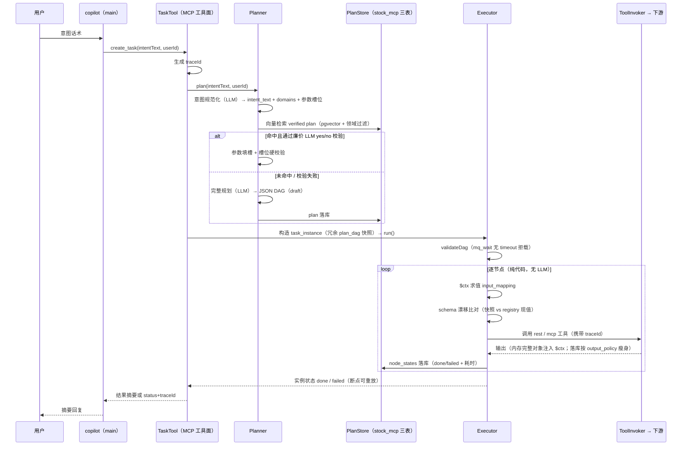

# Agent 编排系统实现技术文档（orchestration）

> 设计决策与领域模型见 [agent-orchestration](agent-orchestration.md)（评审稿）；本文档面向实现：
> 代码落点、模块结构、核心流程的逐步描述，以及**链路与边界口径**（前端不直连 MCP、通行证鉴权、
> 用户信息不外溢）。实现进度：步 0-4 已落地（骨架 / 三表 / 统一工具面 / Planner / Executor 同步部分），
> 步 5-7 未开始（dispatch 网关 / HITL / mq 工具面）。

## 一、模块结构与代码落点

独立 Maven 模块 `stock-calculator-orchestration`（:18083，库连 stock_mcp）：

| 包 | 类 | 职责 |
|---|---|---|
| `tool` | ToolDescriptor / ToolRegistry / ToolInvoker | 统一工具面：registry 加载与检索、下游调用封装（REST/MCP） |
| `tool` | TaskTool | MCP 工具入口（`create_task` / `query_task`），copilot 消费 |
| `planner` | Planner / PlannerLlmClient / IntentEmbeddingClient | 意图规范化 → 向量匹配 → 规划/复用决策；LLM 与 embedding 客户端独立配置（D6） |
| `executor` | Executor / CtxEvaluator | 确定性 DAG 执行；$ctx 求值器（`$.params` / `$.nodes` / `$.env` 三命名空间） |
| `entity` + `repository` | Plan / TaskInstance / ToolRegistry | 三表落 stock_mcp 库（tool_registry / plan / task_instance） |
| `config` | OrchestrationToolConfig | MCP server 工具装配 |

## 二、链路与边界口径（本轮已定）

三条铁律，所有新功能不得违背：

1. **前端不直连 MCP**：数字人前端永远只面对 main 后端；MCP `/sse` 端点仅服务端内部消费。
   所有非前端消费方（含未来的其他后端服务）也统一走后端转发，不在编排器处做前端化接口。
2. **通行证鉴权**：编排器不对用户做复杂鉴权，只验服务级通行证（后端持证转发即放行）；
   用户级鉴权、会话、权限全部收敛在 main 后端。通行证形态待定（v1 建议：配置发放的静态
   Bearer token），后端与 copilot（编排器内部调用方）各自持证。
3. **用户信息不外溢**：编排器与 MCP 全链路不接触用户信息本体——后端把用户需求转成
   **自包含任务描述**（自然语言意图）或**参数化请求**（结构化参数）下发，MCP 只按描述满足
   请求。废弃身份透传字段方案；MQ 回传通道的 `userId` 一律改用后端下发的匿名
   correlation id（仅路由关联，不含身份语义）。

## 三、任务执行流程（当前实现态）

### 3.1 同步主链路（已实现）

当前为同步阻塞执行（TaskTool 内联 `executor.run`），长时任务异步化与完成事件见 §四 待办。

### 3.2 节点类型支持矩阵

| 节点类型 | 状态 | 说明 |
|---|---|---|
| rest | ✅ 已实现 | HTTP 调 main 业务接口 |
| mcp | ✅ 已实现 | 调 :18081/:18082 工具 |
| switch | ✅ 已实现 | JSONPath 取值枚举路由，不表达式求值 |
| foreach | ✅ 已实现 | 数组展开串行子任务（`$.item` 替换，子项 key=`<node_id>:<index>`），空数组/未注册工具拒绝 |
| mq_send | ✅ 已实现（步 6-2） | 按 contract routing_key 下发 `task.*` 消息，messageId=traceId 重放幂等，payload 仅 correlationId（脱敏） |
| mq_wait | ✅ 已实现（步 6-2） | waiting + wait_deadline 挂起，MqResultEventListener 终态事件唤醒断点续跑；`timeout_seconds` 必填（拒载防御）+ MqWaitTimeoutScanner 超时收口（Zombie 防御） |
| hitl_wait | ✅ 已实现（步 7-1） | 复用 mq_wait 挂起机制，唤醒入口为人工决策 REST 回调（approve 续跑 / reject 置 failed），不走 MQ |
| sleep | ✅ 已实现（冒烟专用） | Dummy 耗时工具（≤120s），仅供 E2E/冒烟 DAG 显式声明，Planner 真实 DAG 不会产出 |

### 3.3 失败与重放

- 任一节点失败 → 实例置 `failed`，node_states 保留各节点断点；
- 重放 = 注入落库的上游节点输出，从失败节点起跑（失败节点的直接上游自动升级 `keep_ref` 保完整输出）；
- MQ 下发节点重放以 traceId 幂等键防重复触发。

## 四、实现进度与剩余工作

| 步骤 | 内容 | 状态 |
|---|---|---|
| 0-1 | 模块骨架 + 三表 DDL（pgvector，stock_mcp 库） | ✅ |
| 2 | ToolDescriptor/ToolRegistry/ToolInvoker + traceId 打点 | ✅ |
| 3 | Planner（规范化 → 领域过滤向量匹配 → 完整规划） | ✅ |
| 4 | Executor（rest/mcp/switch/foreach + $ctx） | ✅ |
| 5 | dispatch 网关 + copilot 单工具接入 + 通行证鉴权 | ✅（2026-09-22） |
| 6 | TraceId 透传 / 通道映射 / mq_send/mq_wait / 真异步+SSE / 限流+GC / 冒烟 Gate 五场景 E2E 全绿 | ✅（2026-09-22） |
| 7 | HITL 审核 API（hitl_wait + verify/deprecate/approve/reject）+ mq 可观测工具面（queue_stats/message_peek/message_trace） | ✅（2026-09-22） |
| 收口 | 单测补齐（$ctx 求值器 / Executor 分支 / Planner 填槽，22 用例） | ✅（2026-09-22） |

步 6/7 落地实况（2026-09-22，§五 五项全兑现）：

1. **6-0 TraceId**：main 生成 W3C traceparent 经 MCP 请求头下传（McpTraceHeaderConfig），
   PassportFilter 捕获 + TraceIdHolder 透传优先链（外部参数 > header > 本地生成）；
2. **6-1 通道映射块**：`user_async_task_log` 审计表（main 侧），correlationId 兼作
   orchestration traceId（task_instance.trace_id == correlation_id，MQ payload 天生脱敏）；
   `pg_advisory_xact_lock(hashtext(plan_id))` 同 plan 串行（多实例并发定案）；
3. **6-2 MQ 节点**：TaskMessageSender（TASKS 交换机，messageId=traceId 幂等，信封 JSON 字符串
   统一序列化形态）+ mq_wait 挂起/唤醒/超时扫描三件套，contract 增
   `task.completed.*`/`task.failed.*`/`task.orchestration.run` key；
4. **6-3 真异步 + SSE**：dispatch/create_task 即刻返回 RUNNING（TaskRunnerListener 消费侧
   执行，幂等拒重放）；main AsyncTaskResultConsumer 还原 user → CAS 终态回写 → SSE 推流
   （`GET /api/copilot/async-tasks/{correlationId}/events`）；
5. **6-4 限流 + GC**：AsyncTaskRateLimiter 双闸门卡 createAsyncTask 入口（并发 2/频控
   60 次每分，配置化 `copilot.async-task.rate-limit`）+ AsyncTaskLogGcScanner 超期 RUNNING
   置 TIMEOUT（x-expires 24h 三队列核对落盘）；
6. **冒烟 Gate**：OrchestrationSmokeGateE2ETest 五场景全绿（SMOKE_E2E 门控，真实
   PG/LavinMQ）——挂起/唤醒/SSE 路由/超时/失败；拦下两处真 bug：实体 JsonNode 字段缺
   `@JdbcTypeCode(SqlTypes.JSON)`（上下文起不来）、MQ POJO 直发 JDK 序列化不一致；
7. **7-1 HITL**：HitlReviewService/Controller（plan 详情 + verify/deprecate +
   approve/reject 挂起回调）+ `hitl_wait` 节点（mq_wait 机制复用，人工决策 REST 回调）；
8. **7-2 可观测**：MqObservabilityTool 三工具注册进 MCP 工具面经 dispatch sync 直达。

步 5 落地实况（2026-09-22，三定案见 §四点一）：

1. **tool_registry.execution_mode** 已加列（sync 默认 / async_long），DDL（orchestration-schema.sql）、
   ToolRegistryEntity、ToolDescriptor、ToolRegistry upsert/reload 全链路透传；
2. **通行证**：PassportFilter 校验 `Authorization: Bearer <orchestration.security.passport-token>`，
   验不过 401；token 空值（本地未配置）放行；
3. **dispatch 网关**：DispatchTool（MCP 工具 `dispatch`，caller=copilot/service 调用方适配——
   clarify 对程序化调用方降级为确定性错误）+ DispatchRouter 确定性打分分流（工具名 > 领域名，
   同分并列即低置信澄清，勿硬路由；误判样本回流规则库 + DispatchRouterTest 单测）；
   sync 直接代调 ToolInvoker 秒回，async_long 转 create_task 返回 `{taskId, status:"RUNNING"}`
   占位契约（内联跑完，步 6 升级真异步）；
4. **超时梯队**：ToolInvoker 8s（RestClient connect/read + MCP client request-timeout）<
   dispatch 10s（预算内由 8s 上游兜底）< copilot HTTP 15s（main `spring.ai.mcp.client.common.request-timeout`）；
5. **copilot 收尾**：main application.yml MCP client 只挂 `orchestration-dispatch`（:18083），
   :18081/:18082 直连池移除；StockAnalysisCapabilityHandler 按名找不到 stock_analysis 回调走
   既有「能力未注册」降级（去留随步 7 评估）。

步 5 是链路枢纽，落地顺序（依赖驱动）：

1. **tool_registry 补 `execution_mode` 能力标签**（sync / async_long）——分流地基；
2. **dispatch 网关工具**：统一入口，sync 直接代调 ToolInvoker 秒回，async_long 转
   create_task；低置信返回候选清单澄清，不硬路由；分流规则单测。同时落**通行证校验**
   （服务级 Bearer token，验不过 401）与**调用方适配**：copilot 内部调用与后端服务调用
   共用 dispatch，但后端直调时「低置信澄清」语义降级为确定性错误返回（程序化调用方无法
   反问用户）；
3. **copilot 收尾**：main application.yml 移除 :18081/:18082 直连池，copilot 只挂
   :18083 dispatch 一个连接，端到端跑通「公告订阅+形态」首条链路。

## 四点一、步 5 开工预置定案（2026-09-22）

1. **通行证形态（已拍板）**：静态配置 `orchestration.security.passport-token`；Filter 拦截
   `Authorization: Bearer <token>`，非法直接 401。
2. **async_long 准异步占位（已明确）**：步 5 的 dispatch 针对 `async_long` 即刻返回
   `{ taskId, status: "RUNNING" }` 占位契约，任务仍内联跑完；Copilot 按异步契约对接，
   步 6 引入 MQ 时无缝升级为真异步。
3. **超时梯队防护（已对齐）**：ToolInvoker 超时 (8s) < dispatch 超时 (10s) < Copilot HTTP
   超时 (15s)。

## 五、异步通道可靠性五项（已评审定案）

针对「脱敏 + 匿名通道」架构的五个可靠性缺口，评审结论如下（随步 6 mq 通道动工落地）：

### 5.1 通道映射持久化与断点恢复

- main 侧新建极简映射/审计表 `user_async_task_log`：`id, channel_id, task_id, user_id, task_type, status(RUNNING/COMPLETED/FAILED), created_at, updated_at`——**恢复依据 + 异步任务调用审计日志，一举两得**；
- SSE/WebSocket 断开重连时前端携带 channelId 向 main 重新注册 emitter；长任务（如 2 小时 mq_wait）期间 main 重启/发布，映射从 DB 恢复，orchestration 推 MQ 终态事件时 main 能查到 userId 并送达；
- 断连期间丢失的中间态事件不做事件回放，由前端重连后经 copilot `query_task`（持 traceId）主动拉取补偿——推送管实时、拉取管完整。

### 5.2 匿名通道生命周期与 GC

- MQ 队列（`channel.{channelId}.{taskType}`）设 **`x-expires`**（如 24h 无人消费自动删除）防死锁；**不用 auto-delete**——auto-delete 绑定消费连接，orchestration 重启断连会误删在跑任务的队列；
- 终态事件 `task.completed` / `task.failed` 由 orchestration 下发，main 收到后清理映射行（status 置终态）并解绑队列；
- main 或 orchestration 侧一个轻量 `@Scheduled` 定时任务扫描 DB 超期 RUNNING 记录做兜底清理（双重保险：队列 TTL + 显式扫描）。

### 5.3 限流与配额（main 侧拦截）

- 用户维度 Rate Limiting / 并发上限（如「同时 2 个长任务、60 次/分钟」）**严格卡在 main**，orchestration 不感知任何用户频次逻辑；
- 通行证不携带租户/配额等级（v2 再评估）；orchestration 的系统级自保护仅做简单全局并发上限（如最大在跑实例数），不做用户级识别。

### 5.4 私有资源 Scoped Token（暂不做）

- 当前 MCP 工具数据全公共/本地，工具参数保持纯参数化，main 解析需求为自包含请求下发即可；
- **不做** scope_token / data_bucket_id 数据作用域凭证——待出现用户私有资源（个人笔记/持仓）场景再立项，避免过度设计。出现时口径：私有工具只收 main 签发的临时、只读、单次有效的 Scoped Token，永收 userId。

### 5.5 全链路 TraceId（OpenTelemetry 口径）

- main 收请求生成标准 trace_id（W3C TraceContext），HTTP Header + MQ Message Properties 向下透传 orchestration 与 MCP；
- **orchestration 入口适配（现有代码需改）**：TaskTool 当前自生成 UUID traceId，改为优先接受外部透传的 traceId（traceparent header / create_task 参数），无透传时才本地生成——否则链路在 main→orchestration 处断裂；
- 排查口径：先在 main 用 userId 查出 trace_id/channelId，再拿 trace_id 去 orchestration/MCP 日志库检索——脱敏架构下的跨服务排查路径。

## 六、风险与守护（实现视角）

- **多实例并发**：Executor 同步执行无分布式锁，同 plan 并发实例可能重复调外部接口——
  异步化改造时一并引入实例级锁/幂等；
- **双状态源**：mcp mq/ 子包只做可观测（message_trace/queue_stats/message_peek），
  不设 task 状态类工具，权威状态唯一在 task_instance；
- **Modulith 边界**：跨域只引对方基包公开类型（ModulithVerifyTest 守护）；
- **token 成本**：完整规划单次大 prompt，复用路径近乎零 LLM 开销；复用池只进
  verified（人工上架）plan。

## 七、关联文档

- [agent-orchestration](agent-orchestration.md) · 设计评审稿（决策 D1-D12、数据模型、Planner/Executor 设计要点）
- [agent-orchestration-possibilities](agent-orchestration-possibilities.md) · 功能展望
- [data-service-split](data-service-split.md) · MQ 通信与契约基础
