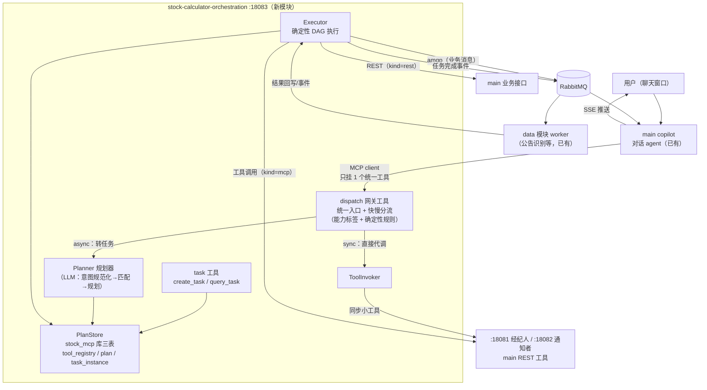
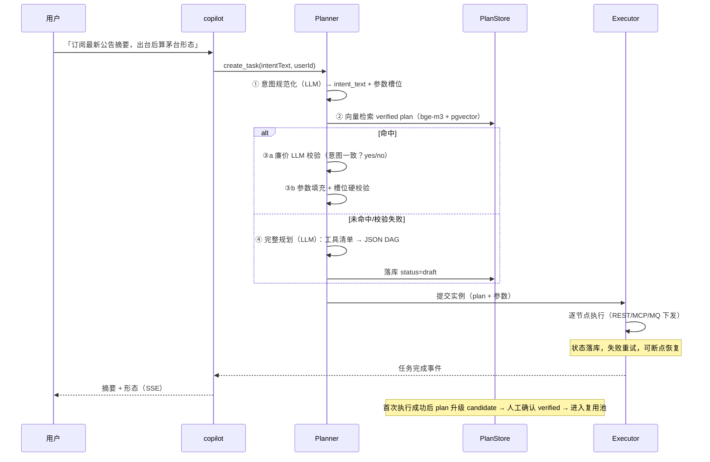

# Agent 任务编排系统设计（orchestration）

> 让 LLM 把 mcp 工具与 main 接口**动态编排成任务链**：规划一次、执行多次。
> 对话入口（copilot）理解意图 → 规划 agent 生成结构化 DAG → 确定性 executor 执行 →
> 已验证路径按「规范化最终意图」缓存复用。本篇为框架设计（评审稿），
> 功能展望见 [agent-orchestration-possibilities](agent-orchestration-possibilities.md)。

## 一、背景与动机

现有体系三类能力的消费方式各不相同：

| 能力 | 现状 | 痛点 |
|---|---|---|
| mcp 工具（:18081，指标/知识检索） | 人通过 ZCode/Claude Desktop 调用 | main 的 copilot 用不上 |
| main 业务接口（公告/自选/搜索等） | 前端/前端 SDK 调用 | LLM 无法组合成多步任务 |
| MQ 管道（公告识别等） | 固定代码编排 | 新类型任务要改代码 |

目标：**不用代码写死任务链**，用户在聊天窗口说意图（如「订阅最新公告摘要并算出台后茅台的形态」），
LLM 规划出任务路径并执行；规划过的路径持久化，后续同/近意图直接复用。

## 二、核心决策

| # | 决策 | 理由 |
|---|---|---|
| D1 | 规划与执行分离：LLM 只做规划，执行是确定性代码 | 长时任务（小时/天级）agent 循环存活不了；确定性执行可复现、可断点恢复、便宜 |
| D2 | 规划产物为**结构化 JSON DAG**，非自然语言计划 | executor 才能确定性执行；缓存才有意义 |
| D3 | 复用锚定「规范化最终意图」向量，非原始话术 | 措辞千变万化，规范化意图才可匹配；差异走参数槽位 |
| D4 | 复用命中后必须过两道校验：参数槽位硬校验 + 廉价 LLM yes/no 语义校验；**plan 升级 verified 一律人工确认** | 防「语义近但 DAG 不同」错配与参数注入；人工上架同时是 pgvector 阈值的校准手段 |
| D5 | 统一工具面：mcp 工具与 main REST 接口经同一 registry 描述，executor 一个入口调用 | 规划 agent 不感知工具背后是 MCP 还是 REST |
| D6 | 域落点：**独立 Maven 模块 stock-calculator-orchestration**（:18083），MCP 工具面（create_task/query_task）+ 规划/执行引擎；三表落 **stock_mcp 库** | 与 notify 同构：plan/registry/instance 与 mcp 工具面数据同属 agent 基础设施，聚合在 mcp 专用库（notify N3 同款惯例）；代价（诚实记账）：Planner 的 LLM 调用不再复用 main llm 域 fallback 链（自带 provider 配置一份），amqp/contract 自引 |
| D7 | 高危工具（写操作）默认排除出规划集 | agent 规划的路径会真实调用接口，白名单是安全边界 |
| D8 | mcp 模块新增 mq/ 子包（MQ 可观测工具），不独立进程 | 工具粒度与注册丰富度决定 agent 能力，进程拓扑无关；省一份运维 |
| D9 | 全链路 traceId 贯穿（Copilot→Planner→Executor→REST/MCP→MQ→data worker），MQ 消息头携带 | 跨 3 进程 + MQ 的排查刚需；初期日志打点即可，Jaeger/OTel 后台可选 |
| D10 | plan 发布流水线：draft → 自动冒烟执行 → candidate → HITL 人工上架 → verified | 已有人工上架缺自动化验证步；收敛为单环境冒烟，不做多环境 promote |
| D11 | HITL 审核走 **API/CLI 而非管理前端**：plan 详情接口返回 DAG + 冒烟真实输入输出/耗时，POST 确认上架 | 自用系统先建 DAG 可视化前端成本失衡；DAG 可视化预览为后续可选 |
| D12 | **职责 ≠ 粒度**：各 MCP 服务按职责定义（经纪人=指标/知识、通知=触达），同一服务既可被简单意图单独调用、也可作为大流程的一个节点组装——服务不关心被怎么用；不因「场景简单」另拆轻量系统 | 简单/复杂是使用方式的连续谱，同一执行引擎覆盖两端；按粒度拆服务才是职责冲突 |

## 三、范围与非目标

**范围内**：见 D1-D10。

**非目标（明确不做）**：

- Jaeger/Zipkin 全套 OTel 后台（初期日志 + traceId 打点即可，量起再评估）；
- 「时间旅行」全仿真调试框架（保留失败节点重放这一最常用形态）；
- 多环境 plan promote（dev/staging/prod 导出导入与灰度）——单环境自用，真有多环境再立项；
- plan 主动回归测试套件（以惰性回归替代，见 §八）；
- HITL 管理前端 / DAG 可视化预览（以 API/CLI 替代，D11；可视化量起再评估）；
- DAG 内嵌脚本引擎（见 §十一 表达力上限）。

## 四、总体架构

要点：

- **统一入口（方案 3，快慢车分流）**：copilot 只挂 `dispatch` 一个 MCP 工具，所有自然语言触发都递进 :18083。网关按 tool_registry 的能力标签（`execution_mode: sync / async_long`）+ 确定性规则分流——同步小请求网关内直接代调下游工具秒回；长任务/多步/条件等待转 create_task 走 Planner/Executor。路由复杂度下沉到编排器，copilot 不做架构通道决策；
- **main 不直连 MCP 工具服务**：copilot 不再挂 :18081/:18082 的工具池，避免两套调用逻辑双源维护（单一事实源 = tool_registry）；
- **独立进程（D6）**：与 mcp/notify 三服务并列，共用 stock_mcp 库——agent 基础设施（工具面+规划+执行+提醒）数据聚合一处；
- **Planner 自带 LLM 客户端**：不复用 main llm 域（D6 代价），provider 配置独立维护；
- **Executor 是纯代码**：按 DAG 逐节点调 ToolInvoker，结果注入下游节点参数，状态落库，可恢复。

## 五、任务执行流（一次完整请求）

## 六、数据模型（草案，三表落 stock_mcp 库，D6）

### 6.1 tool_registry（工具注册表）

| 列 | 类型 | 说明 |
|---|---|---|
| tool_name | text PK | 全局唯一（`stock_analysis` / `main.announcement.latest`） |
| kind | text | `mcp` / `rest` |
| endpoint | text | mcp：:18081 调用端点；rest：URL + method |
| param_schema | jsonb | 参数 schema（名称/类型/必填/枚举） |
| description | text | 一句话语义（「什么时候该用我」，规划 prompt 的直接输入） |
| domain | text | 领域标签（quote / kb / mq / announcement…），工具超 40 个后按域分组注入 |
| risk | text | `read` / `low` / `high`；规划 prompt 硬约束只准编排 read/low |
| output_policy | text | 输出落库策略：`keep_summary` / `keep_head(N)`（默认 2KB）/ `keep_ref`；防 node_states 膨胀 |
| execution_mode | text | 能力标签（方案 3 分流依据）：`sync`（秒级单跳，网关直接代调）/ `async_long`（长任务/条件等待，转 Planner+Executor）；分流器按此 + 确定性规则路由 |
| enabled | bool | 下线开关 |

登记方式：mcp 工具启动自注册（或维护 SQL）；main 接口白名单手工登记。

### 6.2 plan（规划路径）

| 列 | 类型 | 说明 |
|---|---|---|
| id | bigserial PK | |
| intent_text | text | 规范化意图（LLM 提炼，非用户原话） |
| intent_domains | text[] | 规范化时 LLM 抽取的领域标签（可多值），向量检索的前置标量过滤器（§七） |
| intent_embedding | vector(1024) | HNSW cosine 索引（沿用 bge-m3 惯例） |
| param_schema | jsonb | 参数槽位定义（`stockId` / `keywords` …） |
| plan_dag | jsonb | DAG：节点（tool、input_mapping、depends_on、retry、timeout、成功判据），取值一律 **$ctx 寻址**（见 §八）：`$.params.*` / `$.nodes.<id>.output.*` / `$.env.*` |
| status | text | `draft` → `candidate`（**自动冒烟执行通过**，D10）→ **`verified`（HITL 人工确认上架）** / `deprecated`。verified 一律人工确认，无自动通道——同时作为 pgvector 匹配阈值的校准样本池 |
| use_count / last_used_at | | 复用统计（淘汰参考） |
| created_at / updated_at | | |

> **阈值陷阱（pgvector）**：cosine 阈值过高→复用率归零，过低→异意图错配。缓解：① verified 人工上架保证复用池纯净；② 匹配日志落表（query 向量 → top-k → 是否被采纳/回退）供回溯调参；③ 前 N 条 plan 集中人工研判，反向校准阈值后再评估放宽。

### 6.3 task_instance（执行实例）

| 列 | 类型 | 说明 |
|---|---|---|
| id | bigserial PK | |
| plan_id | FK | 用的哪条路径 |
| plan_dag_snapshot | jsonb | **创建时冗余快照**——plan 后续变更不影响在跑实例；节点执行前与 registry 现值比对防版本漂移 |
| trace_id | text | 全链路追踪键（D9），随 MQ 消息头下发 |
| user_id | | 归属用户 |
| params | jsonb | 本次填充的具体参数 |
| node_states | jsonb | 各节点状态（pending/running/done/failed + 按 output_policy 瘦身的输出摘要） |
| status | text | running / done / failed / cancelled |
| created_at / updated_at | | |

### 6.4 用户通道（MQ 侧，随任务创建）

- 队列命名：`user.{userId}.{taskType}`，任务完成且闲置后回收（TTL + 定时清理）；
- 编排器为唯一管理者；通道只是资源，**不是状态源**（权威状态在 task_instance）。

## 七、Planner 设计要点

1. **意图规范化**：LLM 把用户话术提炼成 `intent_text`（做什么+触发条件+交付物）+ **领域标签（可多值，入 intent_domains）** + 参数槽位——复用键在这里生成；
2. **匹配**：意图向量化 → **Filtered Vector Search**（`WHERE status='verified' AND intent_domains && 查询domain数组`——先收窄到同领域，防跨域向量噪声「指标计算 ≈ 订阅通知」）→ pgvector top-k（阈值）→ 命中后廉价 LLM yes/no 校验（几十 token，防止语义近但 DAG 不同）；plan 带「待复核」标记时跳过复用直接重规划（惰性回归，见 §八）；
3. **完整规划 prompt**：注入 registry 的工具描述（含 risk/paramSchema）+ 2-3 条 verified plan 作 few-shot；输出 JSON 严格按固定 schema，解析失败重试一次后明确返回「无法编排」，**宁可说不会，不可编错**；
4. **参数填充**：命中复用路径时由 LLM 填槽，executor 前置硬校验（类型/必填/白名单），不通过即回退重新规划；
5. **简单意图快路径**：高频简单意图（如定时提醒类「明天 9:30 通知茅台形态」）规划产物天然是微小 DAG（触发 → 调用 → 触达，1-3 节点）；Planner 对此类意图走快路径——识别后直接套微小 DAG 模板、免向量匹配，规划成本趋近于零。快路径是规划器的**优化项**，不另立轻量系统（D12）。

## 八、Executor 设计要点

- 节点类型：`rest`（HTTP 调 main）、`mcp`（调 :18081 工具）、`mq_wait`（等某队列/表出现结果）、`mq_send`（下发任务消息，按 contract 契约构造 payload），以及两类**控制节点**：
  - `switch`：基于 JSONPath 取值做**枚举路由**（取值 → 枚举匹配 → 固定分支），不支持表达式求值——守住「不引入脚本引擎」底线；
  - `foreach`：输入为数组（如自选股列表），对每个元素展开子任务并行执行；分支收束依赖下游 LLM 汇总节点，不引入 reduce 语义。**部分失败隔离**：`on_item_failure`（continue=忽略单项失败继续收束 / abort=任一失败即中断）+ `min_success_ratio`（成功率门槛，如 0.8）决定节点成败；每个子项有隐式 key `<node_id>:<item_key>` 落入 node_states，**重放只重跑 failed 子项、跳过已成功项**（避免重复冲击外部接口）。
- `input_mapping`：**统一执行上下文 $ctx**——所有取值表达式强制基于 $ctx 根节点，三个命名空间杜绝二义与越界：
  - `$.params.*`：task_instance.params（用户输入/填槽参数）；
  - `$.nodes.<node_id>.output.*`：指定上游节点的执行输出（内存中完整对象）；
  - `$.env.*`：系统变量（user_id / trace_id / now / timestamp）；
  - 落库快照里的表达式在重放时按同一 $ctx 语义求值；
  - **大输出传递与落库分离**：节点间 `input_mapping` 在 Executor 内存中传递完整对象（不经 Redis）；落库到 node_states 时按 registry 的 `output_policy` 瘦身——`keep_summary` / `keep_head(N)`（默认 2KB）/ `keep_ref`（完整体落临时存储 + TTL 引用），防止巨量 JSON（财报全文等）拖垮 task_instance 行；
- **节点流转白盒化**：节点状态变更（进入 mq_wait、每节点 done/failed）即发流转事件，copilot 订阅并转发 SSE 给前端——长时任务的「已查资料，正在订阅队列」中间态让过程可感知，避免前端只有 Loading 被当成卡死；节点级耗时数据随之沉淀，供性能排查；
- **版本漂移防护（工具接口变更 × 在跑实例）**：task_instance 创建时**冗余快照 plan_dag**（后续 plan 变更不影响在跑实例）；tool 的 paramSchema 变更时，Executor 在每个节点执行前比对快照与当前 registry 的 schema 摘要，不匹配则实例置 failed 并通知用户，不静默崩溃；
- **工具 Schema 变更的惰性回归**：registry 变更时除标记存量 plan deprecated 外，对引用该工具的 verified plan 打「待复核」标记——此类 plan 下次被匹配命中时**强制完整重规划**而非直接复用（零测试基建，覆盖面等效主动回归套件）；
- **失败节点重放**：`plan_dag_snapshot` + node_states 天然构成重放素材。失败任务可从失败节点起跑重放（注入落库的上游节点输出，不重调上游、不重新规划）。注意：失败节点的**直接上游**输出落库策略自动升级 `keep_ref`（keep_head 截断可能不够重放入参）；MQ 下发节点重放需防重复触发（幂等键随 traceId）；
- **全链路 traceId（D9）**：任务创建时生成 traceId，贯穿 Copilot 日志 → Planner → Executor → REST/MCP 调用头 → MQ 消息头 → data worker 回写。初期日志打点 + traceId 检索即可定位卡点（与 mq/ 子包 task_trace 工具互补），Jaeger/OTel 后台为可选项；
- 可靠性：节点级重试 + 超时；实例状态落库，进程重启后可恢复未完成实例；
- 长时等待（如等公告出台）：`mq_wait` 节点挂起实例，由 MQ 事件/回调唤醒，不轮询占线程；
- **mq_wait 死锁防御**：`timeout_seconds` + `on_timeout`（超时后跳转的降级节点，如发 SSE 提醒「等待超 2 小时，已转入后台监控」）为**必填**——Executor 加载 DAG 时校验，无 timeout 的 mq_wait 直接拒载（硬约束，不靠 prompt 约束 LLM），杜绝悬挂实例（Zombie Task）；
- 产出：最终交付物（摘要+形态）写回 task_instance，并发任务完成事件给 copilot 推送。

## 九、与现有域的边界

| 域 | 关系 |
|---|---|
| copilot | 入口与出口：只挂 dispatch 一个工具递意图、订阅节点流转事件转发 SSE 中间态、收结果推送；不碰规划/执行内部，不做通道路由决策 |
| llm（main 域） | **不再复用**（D6 代价）：orchestration 独立进程自带 LLM provider 配置；将来如需统一路由再评估抽公共客户端 |
| mcp / notify / main | 同为服务拓扑节点：mcp+notify 是工具提供方（:18081 经纪人 / :18082 通知者），main 是 REST 工具提供方与 SSE 触达出口；三者的工具**只经 tool_registry 与 dispatch 网关暴露**，main copilot 不直连工具池 |
| announcement | 公告识别的权威结果仍在 announcement 域表里；DAG 节点读它，不复制数据 |
| monitor | task_instance 心跳可接入 pull_heartbeat 体系（待定，评审后定） |

> 服务拓扑总览：**main :18080（能力+触达）/ mcp :18081（经纪人）/ notify :18082（通知者）/ orchestration :18083（编排）**，后三者独立进程、共用 PG 实例（mcp/notify/orchestration 落 stock_mcp 库，main 落 scs 库）。

## 十、落地顺序（每步独立可验）

0. 模块骨架：stock-calculator-orchestration 新 Maven 模块（:18083，父 POM 挂载；引入 spring-ai mcp server + amqp + contract + pgvector，库连 stock_mcp）；
1. tool_registry + plan + task_instance DDL（含 pgvector 索引，进 mcp-schema.sql 同款幂等初始化惯例）；
2. ToolDescriptor / ToolRegistry / ToolInvoker（统一工具面）+ traceId 贯穿打点；
3. Planner（意图规范化 → 带领域过滤的向量匹配 → 完整规划，先接 mcp 既有 6 工具）；
4. Executor（REST/MCP 节点先行，含 switch/foreach 控制节点与 $ctx 求值；mq_wait/mq_send 随公告场景接）；
5. dispatch 网关工具 + copilot 接入：tool_registry 补 execution_mode 能力标签，dispatch 按 sync 直接代调 / async_long 转 create_task，低置信意图返回候选清单澄清（不硬路由）；copilot 只挂 :18083 一个连接（移除 :18081/:18082 直连池），端到端跑通首条链路（公告订阅+形态）；
6. HITL 审核 API/CLI（D11：plan 详情 + 冒烟回放 + 确认上架）；
7. mcp 模块 mq/ 子包工具面（message_trace / queue_stats / message_peek…——**不设 task 状态类工具**，防与 task_instance 双状态源冲突；两个视角由 LLM 持 traceId 交叉拼合）。

## 十一、风险与未决项

| 项 | 说明 |
|---|---|
| 错配爆炸半径 | 复用 DAG 真实调接口；防线 = D4 双校验 + risk 白名单 + **verified 全量人工上架**（无自动通道），复用池只进经过人确认的路径 |
| 意图漂移 | 工具/接口变更后存量 plan 失效：registry 变更时扫 plan_dag 依赖的 tool，标记 deprecated + 「待复核」；**在跑实例**由 plan_dag_snapshot + 节点执行前 schema 比对兜底（failed + 通知，不静默崩溃） |
| State 膨胀 | node_states 按 registry 的 output_policy 落库瘦身；节点间大输出仅内存流转，不落库 |
| 体验（长时任务黑盒） | 节点流转事件 → copilot → SSE 中间态推送，执行过程白盒化 |
| token 成本 | 完整规划单次成本可控（一次大 prompt）；复用路径几乎零 LLM 开销 |
| DAG 表达力上限 | 不引入脚本引擎；条件与批量由控制节点兜住（`switch` 枚举路由 / `foreach` 展开 + LLM 汇总收束），超出此粒度的复杂转换回归「写一个新工具」而不是扩展 DAG 语法 |
| dispatch 分流误判 | 方案 3 的路由判断在网关分流器：确定性规则（execution_mode 标签 + 关键词）优先；低置信不硬路由，返回候选清单由 LLM 向用户澄清；分流器带单测，误判样本回流规则库；延迟优化（缓存/本地代调）后置 |
| Modulith 边界 | orchestration 跨域只引用对方基包公开类型（ModulithVerifyTest 守护） |

## 十二、关联文档

- [功能展望](agent-orchestration-possibilities.md) · 可能性功能清单与演进路线
- [mcp/design](../mcp/design.md) · mcp 模块现有设计（mq/ 子包将并入其 §四模块结构，修订「不引入 contract」决策）
- [data-service-split](data-service-split.md) · MQ 通信与契约基础
