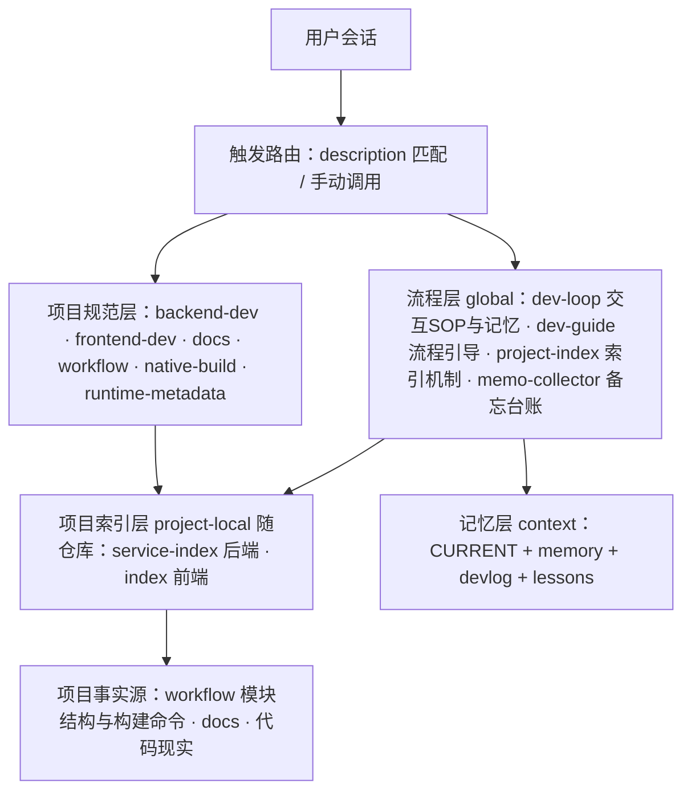
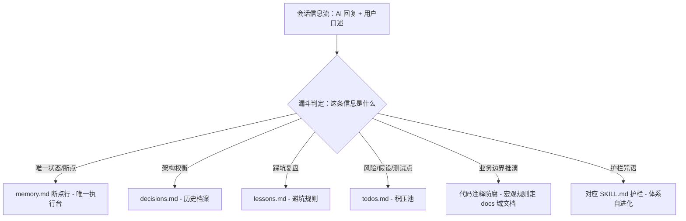
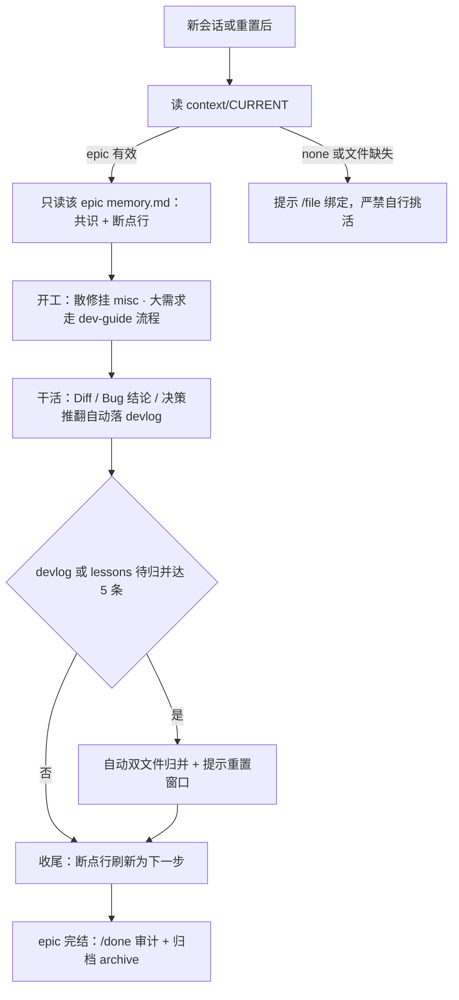
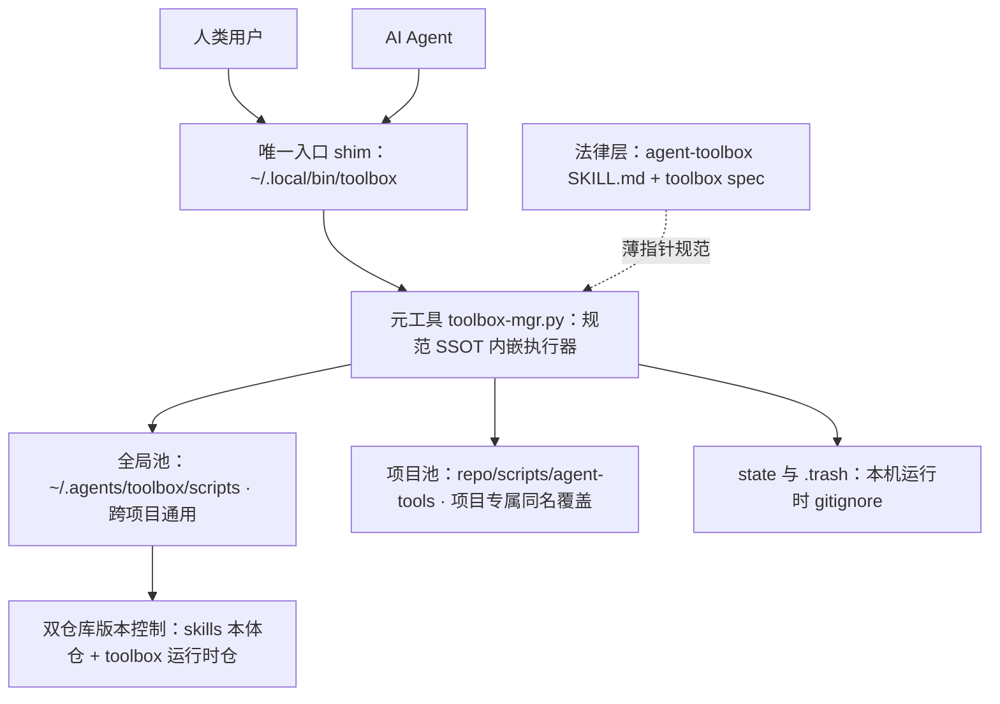

# AI 辅助开发 Skill 体系（设计意图与使用手册）

> 定位：解释本仓库与前端姊妹仓库 AI 辅助开发 skill 体系的**设计意图**、各 skill **功能边界**与**使用方式**。各 skill 正文是唯一规范事实源——本文只做意图解释与导航，不复制规范正文，冲突时以 skill 正文为准。过程记忆（memory/devlog/lessons）不入本文，归 `context/`。

## 一、设计意图

### 1.1 约束与对策

| 现实约束 | 后果 | 体系对策 |
|---|---|---|
| Agent 会话无状态（重置即失忆） | 每个新会话都要重新对齐上下文，共识易丢 | 状态外置：`context/CURRENT` 槽位 + `memory.md` 蒸馏记忆 + 断点行，一句「继续」即可恢复 |
| Token 昂贵 | 全仓扫描、整读大文件不可持续 | 分层检索：description 触发 → skill 正文 → 索引 L1 锚点 → L2 展开命令，逐层按需付费 |
| 事实易漂移 | 结构清单/命令/版本号散落多处，与代码现实脱节 | 事实指针化：skill 正文只放规则，事实路由到唯一事实源（workflow/索引/docs），审计抽查守护 |
| 经验只在对话历史里 | 同类坑反复踩 | 三级沉淀：skill（规范）/ lessons（避坑规则）/ memory（项目决策），日志驱动自动生长 |
| 多项目并存 | 换项目就要改一遍 skill 正文 | 机制与数据分离：机制全局化（dev-loop/project-index），项目数据 project-local 随仓库版本化，「换项目零编辑」 |

### 1.2 六条设计原则

1. **状态外置，会话可弃**：`context/CURRENT` 只存一行 `epic: <名>`；`memory.md` 是长期记忆 SSOT（决策/踩坑/验收 + 断点行）；devlog 是追加式过程日志，≥5 条自动归并进 memory。窗口重置零损失。
2. **机制与数据分离**：project-index 只定义「索引长什么样、怎么查、怎么维护」，零项目数据；数据在各仓库 `.agents/skills/<repo-name>-index/SKILL.md`，随仓库一起 commit、一起演进。
3. **事实指针化，单一事实源**：每类事实只有一个出处（模块结构/构建命令 → workflow；功能归属 → 项目索引；文档规范 → docs skill）；其他位置一律薄指针（§节号可 grep），防双源漂移。
4. **分层检索，按需展开**：索引只存低频变化锚点（领域包/固定单文件），类清单靠展开命令现场 derive；展开结果只用于当前任务，禁止写回索引（防索引腐化）。
5. **记忆自生长，日志归并**：产生 Diff / 通用 Bug 结论 / 决策推翻的轮次必须用 tool 落盘 devlog（非聊天框）；lessons 记具备通用价值的 Bug（现象 → 根因 → 避坑规则）；归并时 `[SSOT 修正]` 条目最高优先级。
6. **护栏内建，风险分级**：资源缺位必须索取（禁虚构）；同一卡点 2 次熔断；破坏性操作二次确认；生成代码必须过本地工具链校验；公共接口与数据模型契约受保护（大面积改动先列影响清单）；无法安全推进时，打断求助（Human-in-the-loop）优先于硬试。

### 1.3 分层架构

### 1.4 裁决链、挂载点与加载方式

- **冲突裁决链**：绑定 epic 的 memory 显式最新决策 ＞ 项目级 skill / AGENTS.md ＞ dev-loop 通用规约。memory 决策属有意覆盖；推翻项目规范时以 `[SSOT 修正]` 审计行留痕。
- **挂载点两级**：
  - global：`~/.agents/skills/<name>/SKILL.md`——跨项目通用机制 + stock-calculator 全家桶专属规范；
  - project-local：`<repo>/.agents/skills/<repo-name>-index/SKILL.md`——功能归属数据，随仓库版本化，Zed 自动发现。
- **加载方式**：description 与请求匹配时自动路由；`skill` 工具显式调用；project-local 未被自动发现时直接读 SKILL.md 路径。

### 1.5 冷启动（新机器 / 新成员）

- **项目数据零操作**：project-local 索引、`context/` 记忆、docs/ 随仓库 clone 即得；`CURRENT` 为个人指针被 gitignore——新 clone 视同无活跃 epic，首件事 `/file <名>` 绑定（dev-loop §3 视为常态，不报错）。
- **global 技能包（`~/.agents/skills/`）**：本身是独立 git 仓库（单机自管理），但**现状无远端**——
  - 今日可用兑底：整目录拷贝迁移（纯 Markdown + 普通脚本自包含，rsync/scp 均可）；
  - 推荐演进：配置私有远端后，新机器 `git clone <url> ~/.agents/skills` 一键拉取，技能包升级退化为 `git pull`。
- **自检**：新环境开场让 Agent 读任一 SKILL.md 确认可达即可开工。

### 1.6 IDE 兼容性

- **Zed（基准环境）**：description 命中自动加载 global skill；project-local skill 自动发现（新会话生效）。
- **其他 IDE / Agent（Cursor、Windsurf、VS Code + Cline/Roo 等）**：skill 是纯 Markdown + 普通脚本，无 Zed 专有依赖——自动路由失效时**功能不降级，只退化为手动加载**：
  1. prompt 中 @文件 或直接给路径，让 Agent 先读对应 `SKILL.md` 再开工（global：`~/.agents/skills/<name>/SKILL.md`；项目内：`<repo>/.agents/skills/<name>/SKILL.md`）；
  2. project-index 已把「未自动加载时直接读路径」定义为规范兑底，非临时变通；
  3. 可选增强（当前未实施）：仓库根提供 `AGENTS.md` 统一工作区规范，声明「按需读取 `.agents/skills/` 下对应 SKILL.md」，让不识别 skill 机制的 Agent 也能完成路由。
- **不依赖 skill 挂载的机制照常工作**：context/ 记忆读写、docs/、索引文件、feature-map 等脚本、git 纪律——换 IDE 只有「加载方式」一个变量。

### 1.7 信息漏斗（隐性资产分流模型）

既有容器（memory/todos/lessons/decisions）承接的是**显式信息流**——断点、权衡、踩坑都有明确触发条件。漏斗模型补**隐性资产**维度：AI 在干活时顺带产出、极易随窗口重置蒸发的四类高价值信息。原则（防维护地狱）：**只复用既有容器，不为收集新增任何文件**。

**六条漏斗（信息分流判定表）**：

| 会话信息 | 判定问题 | 去向（容器） | 承接机制 |
|---|---|---|---|
| 唯一状态/断点 | 是当前的唯一下一步吗？ | memory.md 断点行（唯一执行台） | dev-loop §3 |
| 架构权衡 | 选型与优缺点对比吗？ | decisions.md（历史档案，AI 只写不读） | `/adr`（dev-loop §6） |
| 踩坑复盘 | 有通用价值的排错结论吗？ | lessons.md | dev-loop §2 |
| 风险/假设/测试点 | 潜在雷、未验证前提、被否决的候选路径吗？ | todos.md（积压池） | memo-collector §1（未验证假设点名信号 + `(测试)` 类型） |
| 业务逻辑细节 | 边界推演、领域规则吗？ | 代码注释（随代码生存）；宏观规则 → docs/ | backend-dev §2.6 / frontend-dev §4 防腐注释；宏观联动见 stock-calculator-docs §二 |
| 护栏咒语 | 用户重复纠正的项目级约束吗？ | 对应 SKILL.md（体系自进化） | memo-collector §1 咒语行（当轮附注建议，经确认写入） |

**四类隐性资产：典型信号与收集口诀**：

| 隐性资产 | 典型信号 | 收集口诀 |
|---|---|---|
| 边界推演（领域知识） | 「除权日开盘价不仅要减红利，还要考虑拆股比例，所以加了复合计算……」 | 「把这段推演写进该方法注释里，防腐化」；宏观规则走 docs/ 联动 |
| 未验证假设 | 「假设前端传来的时间戳已统一转成 UTC……」 | Agent 收尾自查自动收；含核对动作的按可执行 `(风险)` 落 todos |
| 测试场景启发 | 排错时被否决的候选根因路径（4 选 1 中的另外 3 条） | 「把另外 3 条异常路径 `/todo` 落盘为 `(测试)` 待办，后续补单测」 |
| 咒语（元认知护栏） | 「必须用 Jakarta，不能用旧版 javax」「useEffect 必须加清理函数」 | 当轮一行附注建议写入对应 SKILL.md，经确认执行——体系自进化 |

规范事实源分布：假设/测试/咒语信号 → memo-collector §1；注释防腐 → backend-dev §2.6、frontend-dev §4；断点/权衡/踩坑 → dev-loop §2/§3/§6。本文只做导航。

## 二、Skill 清单（功能与触发时机）

共 13 个：global 11 + project-local 2。

### 2.1 流程层（global，跨项目通用）

| skill | 一句话职责 | 何时加载 |
|---|---|---|
| **dev-loop** | 无状态极简交互 SOP：Token 管控、tool 优先落盘、CURRENT/memory 绑定自恢复、长期记忆按大功能组织、增量日志协议与 ≥5 自动归并，配套管理指令（含 /help 求助入口）与全局护栏（静默容错/资源拦截/2 次熔断/高危确认/静态强约束/契约保护/求助人类优先） | 所有编码会话（回复格式与日志规约的底座） |
| **dev-guide** | 大需求开发、结构性重构、复杂 Bug 的流程引导 Check List：入口判定 → 需求流七步 / Bug 修复流六步，硬卡点检查 + 跨 skill 指针速查；零裁决权（薄路由） | 大需求 / 结构性重构 / 复杂 Bug；单文件微调、散修、纯咨询勿加载 |
| **project-index** | 通用「功能 → 代码落点 + 文档落点」索引机制：表格式规范、L1/L2 两级调阅、防膨胀预算、维护协议、与 README/规范 skill 的边界 | 定位功能归属、建/维护项目索引、判断改动影响面 |
| **memo-collector** | 备忘收集台账：AI 回复与用户口述中的待办/风险/未验证假设/测试启发自动收集去重落盘——todos.md 按域分节（活跃 epic + misc 兑底，与 devlog 挂靠同规则），七类内联标签（功能/修复/优化/文档/环境/测试/风险），咒语类信号不落台账、当轮附注建议写入对应 SKILL.md 护栏（经确认，体系自进化）；完成后流转 done.md；人工打勾自动回收（脏读校验）、(block) 阻塞绝对优先、/todo-groom 语义洗盘；与 dev-loop 互补（断点=唯一下一步，本表=全部积压） | 回复将产生「待办/注意/风险/未验证假设/咒语」类信号、用户说「记个待办/收集备忘」、发送 /todo /todos /tdone /todo-clean /todo-groom |
| **agent-toolbox** | 全局脚本工具箱机制：脚本池（全局 `~/.agents/toolbox/scripts/` + 项目 `<repo>/scripts/agent-tools/`，同名项目覆盖全局）、元工具 `toolbox`（规范 SSOT + 执行器：init/new/check/list/run-hooks/install-hooks/spec/remove）、脚本自描述头部规范 v1、退出码契约（0 过/1 未过/2 自身故障）、金丝雀自测、脚本登记制（持久脚本入池、禁止系统内散放）、fail-open 钩子巡检（bootstrap/audit/cron/pre-commit）；人与 AI 共用同一 CLI，无 AI 可完全人工操作 | 需要复杂校验/巡检/环境体检，新增/修改/退役定制脚本工具，或收编登记散落各处的持久脚本时；写脚本前先 `toolbox spec`，登记用 `toolbox check` |

> **脚本登记制（agent-toolbox）**：AI 产出的持久脚本一律经 `toolbox check` 登记入池——跨项目入全局池，项目专属入 `<repo>/scripts/agent-tools/`；禁止散放于家目录/项目根等处（/tmp 一次性分析脚本豁免，用完即弃）。历史散放脚本按「评估 → 合规化 → 入池 → 原址清理」收编，迁移走同一 check 门禁不豁免。流程细节见 agent-toolbox SKILL.md「散乱脚本治理」节。

### 2.2 项目规范层（stock-calculator 专属，global 挂载）

| skill | 一句话职责 | 何时加载 |
|---|---|---|
| **stock-calculator-backend-dev** | 后端代码模式规范（Spring Boot 4 / Java 21 / Jakarta JPA / PostgreSQL）：统一风格、Entity 三型 + JSONB/时间戳/生成列、Repository、Service 判重写入/字典 upsert/事务组合、TaskService、Util/Config、HTTP 抓取、标准实现优先、边界推演防腐注释（§2.6：非显然逻辑同轮写 JavaDoc，写 why 不写 what） | 写后端任意模块、建表/接口/定时任务、发现非标准实现 |
| **stock-calculator-frontend-dev** | 前端规范（React+TS+Vite+Dexie+zustand）：分层架构与依赖方向 R1/R2/R3 硬护栏、store 切片模式、services 惰性封装、新增功能落点速查、验证命令、边界推演防腐注释（非显然逻辑同轮写 JSDoc） | 前端新增功能、改 store/db/views/services/utils、分层或循环依赖问题 |
| **stock-calculator-docs** | docs/ 工程文档规范：功能域落点与生命周期切片命名、Frontmatter 时效标注、Mermaid 唯一图表标准、废弃 Tombstone、§八写后自检 lint | 新增/修改/移动/废弃 docs 文档；代码触达对外契约后的联动提示 |
| **stock-calculator-workflow** | 环境限制与项目事实源：终端禁 $ 形式字符串、单次写入截断、可靠工作模式（分段写入）、模块结构、包名、GraalVM 工具链、compose 本地依赖、构建命令 | 本项目所有终端命令与文件写入操作（强制性） |
| **stock-calculator-native-build** | Native 构建与多模块故障排查：环境探测 → contextLoads 复现 → 构建脚本审查 → AOT 产物验证 → 二进制冒烟的排查套路 + 已验证修复结论 | native 编译、GraalVM、AOT、CI 构建、多模块启动失败 |
| **stock-calculator-native-runtime-metadata** | native 二进制「编译成功但运行期崩溃/静默失效」的 reachability metadata 迭代修复：javap 先行、一轮一变量、agent 录制、十八轮修复目录 | ELF 已产出但冒烟/真实业务失败、反射/类/资源缺口、零报错静默失效 |

### 2.3 项目索引层（project-local，随仓库版本化）

| skill | 所在仓库 | 职责 |
|---|---|---|
| **stock-calculator-service-index** | 本仓库 `.agents/skills/` | 后端「功能 → 代码落点 + 文档落点」领域归属表 + 业务别名映射 + 变更落点顺序 + 验证 + 命令速查（跨 skill 指针） |
| **stock-calculator-index** | 前端仓库 `.agents/skills/` | 前端功能归属表 + 实时触点脚本 `npm run map:features` + 业务别名映射 + 命令速查 |

## 三、使用手册

### 3.1 会话生命周期（恢复 → 干活 → 收尾）

- 恢复口令：发送「继续」或「读 context/CURRENT，开始下一个子任务：<xxx>」，Agent 直接按 memory 开工，不反问。
- `context/` 随仓库提交 git（CURRENT 为个人指针，已 gitignore）；多机协作需「切换机器前 commit」纪律。
- misc 是常驻杂项挂靠点：散修日志直接落 `misc/devlog.md`，不切换 CURRENT；misc 内任务连续多轮长成大功能时 `/bind` 转正。

### 3.2 指令速查（用户手动操作面）

**dev-loop 指令**：

| 指令 | 职责 | 详见 |
|---|---|---|
| `/file <名>` / `/bind <名>` | 绑定/切换 epic；切换且旧 epic 有积压时先归并 | dev-loop §3 |
| `/next [方向]` | 断点规划：报断点或给 ≤3 候选，选定后落盘为断点 | dev-loop §6 |
| `/remember <事实>` | 决策直写 memory 正文（用户发起即视为确认） | dev-loop §6 |
| `/status` | 运行态快照：CURRENT/断点/积压计数/memory 行数，≤5 行 | dev-loop §6 |
| `/merge` | 手动归并：devlog→memory、lessons 追加区→正文 | dev-loop §4 |
| `/audit` | 十一项质检（账账相符：断点新鲜度/新旧并存/指针抽查/skill 卫生/toolbox 巡检等） | dev-loop §7 |
| `/verify <epic\|lessons\|all>` | 账实对账：memory 断言逐条对代码现实，三态输出 | dev-loop §7 |
| `/done` | epic 收尾：强制审计 → memory 提炼 ≤10 行 → 归档 archive | dev-loop §8 |
| `/help` | 输出指令总表与当前绑定状态（新会话 / 跨 IDE 求助入口） | dev-loop §9 |

> `/done` 对常驻 misc 不适用（misc 永不收尾）；全部指令仅用户显式触发。

**memo-collector 指令**（备忘收集，独立于 dev-loop，仅用户显式触发）：

| 指令 | 职责 | 详见 |
|---|---|---|
| `/todo <事项>` | 追加待办（按域归属落节：域内挂 epic 节，散修/跨域挂 misc） | memo-collector §1 |
| `/todos [域]` | 只读展示待办（带临时编号，可按域过滤） | memo-collector §3 |
| `/tdone <编号\|关键词>` | 待办完成 → 移入 done.md（记来源域） | memo-collector §2 |
| `/todo-clean` | 清理待办（列出全量 → 用户勾选 → 批量删除需确认） | memo-collector §3 |
| `/todo-groom` | 语义洗盘：合并同类项（直接执行）+ 剔除过期项（经确认）；任一节 >10 条时触发点附注建议 | memo-collector §3 |

> 除上表指令外，待办/风险/未验证假设/测试启发的常规收集由 Agent 在**触发点批量落盘**（子任务收尾 / 显式搁置「以后再修」/ 用户指令），完成流转自动执行，严禁逐轮碎写；咒语类信号不落台账，当轮附注建议写入对应 SKILL.md（经确认）。

### 3.3 场景 → 入口速查

| 场景 | 入口 | 要点 |
|---|---|---|
| 大需求 / 结构性重构 | dev-guide §1 | 七步流 + 三个硬卡点（落点/验证/收尾），缺卡即未完成 |
| Bug / 复杂排错 | dev-guide §2 | 先读 lessons 正文对照历史规则；同卡点 2 次熔断；收尾做 lesson 判定 |
| 散修 / 小改动 | dev-loop §3 misc | 不切 CURRENT，日志落 misc/devlog |
| 记待办 / 收集备忘 / 查积压 | memo-collector | 回复含「待办/注意/风险/未验证假设/咒语」自动收集（咒语→当轮建议写 SKILL.md）；/todos 全量一览；完成自动流转 done.md |
| 查后端功能归属 | service-index | 归属表/别名映射 → 行内展开命令 L2；结果禁写回索引 |
| 查前端功能归属 | index（前端仓库） | 归属表 → `npm run map:features -- <域>` 实时触点 |
| 写后端代码 | backend-dev | 模板复用 + 标准实现优先；结构与命令查 workflow |
| 写前端代码 | frontend-dev | R1/R2/R3 依赖方向硬护栏 + §3 落点速查 |
| 写 / 改 docs | stock-calculator-docs | frontmatter + 域落点 + Mermaid；写完跑 §八 lint |
| 终端命令被截断/取消 | workflow | 禁 $ 形式字符串；长内容 write_file 首写 + edit_file 段尾标记续写 |
| native 构建失败 | native-build §二 | 排查套路按序执行不跳步 |
| native 运行期崩溃 / 静默失效 | runtime-metadata | javap 验证根因再动手；一轮只改一类变量 |
| 新项目接入 | project-index | 按 template 建 project-local 索引，只登记域级锚点，禁止一次性铺满 |
| 需要脚本工具 / 环境体检 / 巡检 / 收编散放脚本 | agent-toolbox | 先 `toolbox list` 查现有，无则 `new` → 实现 → `check` 登记；持久脚本禁散放（详见 §3.4） |

### 3.4 agent-toolbox：全局脚本工具箱（设计原则与使用说明）

agent-toolbox 是**跨项目**的脚本管理机制（与具体项目无关，换项目零编辑）：skill 只承载法律，元工具 `toolbox` 既是规范 SSOT 又是唯一执行器，工具脚本自描述。功能面已在 §2.1 登记，本节补设计原则与操作面——规范正文以 agent-toolbox SKILL.md 与 `toolbox spec` 为唯一事实源，本文只做意图解释。

**七条设计原则**：

1. **三层解耦**：法律（SKILL.md + `toolbox spec`）→ 元工具（规范内嵌执行器，只搬运不重生）→ 自描述工具脚本（头部块 v1：name/summary/trigger/platform/self-test；参数/帮助/检测项内聚脚本内）。
2. **零注册表**：没有需要维护的清单文件，`toolbox list` 从脚本头部现场派生——对齐 project-index「可推导的不维护」。
3. **登记制禁散放**：持久脚本必须经 `toolbox check` 入池（门禁：文件名/头部块/--help/--json/--self-test/纯 stdlib）；散放脚本走收编流程（SKILL.md「散乱脚本治理」节），迁移门禁不豁免。
4. **人机同权**：唯一入口是 shim `~/.local/bin/toolbox`，AI 无专属通道；无 AI 时 `toolbox --help` 即说明书，巡检/增删全可人工操作。
5. **退出码契约 + fail-open**：0 过 / 1 未过 / 2 自身故障，元工具与所有工具脚本一致；`run-hooks` 任一 FAIL → exit 1（供 pre-commit 门禁拦截），工具自身故障仅报 ERROR 不阻塞（防巡检自身瘫痪主流程）。
6. **金丝雀自证**：guard 类工具（trigger≠manual）必带 `--self-test`，内嵌已知坏样本证明「能抓到坏」，防监控工具静默失效。
7. **平台不 fork + 双仓库版本控制**：平台差异一律运行时探测，严禁 fork 平台副本文件；`~/.agents/skills`（skill 本体 + 元工具）与 `~/.agents/toolbox`（脚本池运行时）各自纳 git——新机器 clone 两仓库后 `toolbox init` 即完成适配。

**命令面**（`toolbox help` 汇总；`toolbox <cmd> --help` 即该命令手册）：

| 命令 | 职责 | 详见 |
|---|---|---|
| `toolbox init` | 初始化运行时（目录/shim/README），新机器适配入口 | `toolbox init --help` |
| `toolbox new <名>` | 生成合规脚手架（头部块 + help/json/self-test 骨架） | `toolbox new --help` |
| `toolbox check <路径>` | 门禁校验并登记入池；引入新能力需用户确认 | `toolbox check --help` |
| `toolbox list` | 现场派生工具清单（名称/摘要/trigger/平台） | `toolbox list --help` |
| `toolbox run-hooks <钩>` | 按 trigger 批量执行；FAIL→exit 1，故障 fail-open | `toolbox run-hooks --help` |
| `toolbox install-hooks` | 向 Git pre-commit 安装 FAIL 门禁（侵入操作，需确认） | `toolbox install-hooks --help` |
| `toolbox spec` | 输出脚本编写规范 SSOT 正文 | `toolbox spec` |
| `toolbox remove <名>` | 退役工具移入 .trash（破坏性，需确认） | `toolbox remove --help` |
| `toolbox self-test` | 元工具自过自检 | `toolbox self-test` |

**典型流程**：

- **新增工具**：`toolbox spec` 看规范 → `toolbox new <名>` 出脚手架 → 实现逻辑 → `toolbox check`（经确认入池）→ 使用；
- **巡检提醒**：会话开场 dev-loop §3 自动跑 `toolbox run-hooks bootstrap --quiet`（exit 0 静默）；`/audit` 第 11 项跑 `audit` 钩——FAIL 按 memo-collector 口径转 `风险` 待办；
- **收编散放脚本**：评估复用价值 → 合规化补头部/help/json/自测 → `toolbox check` 入池 → 原址删除或改一行薄指针。

**现状**（2026-09-16）：试点工具 `env-doctor`（本地运行时环境体检，trigger: manual）；钩子池为空 → `run-hooks` 静默通过；`install-hooks` 未安装（决策：不接 pre-commit/profile，按需人工触发）；脚本池与快速上手见 `~/.agents/toolbox/README.md`。

### 3.5 环境硬约束（workflow 摘要）

- 终端命令（含 heredoc）禁含 `${...}`、`$VAR`、`$(...)` 形式字符串——静态扫描直接截断/取消；用字面量代替。
- `write_file` / `terminal` 单次内容过长会被截断：大文件分段写入；命令保持短、分步执行。
- native 工具链一律 `/opt/GraalVM25/bin/`（系统 java 无 native-image/agent）；构建一律仓库根 `./mvnw`。
- 本地依赖 compose 三件套（postgres/redis/lavinmq）+ 项目根 `.env` 口令；口令严禁写进仓库或 skill。

## 四、推荐使用方式

### 4.1 触发纪律：谁在什么时候做什么

| 类别 | 内容 |
|---|---|
| Agent 自动执行 | 日志追加落盘、≥5 条自动归并、断点刷新、备忘自动收集（含未验证假设/测试启发）、打勾回收与完成流转（memo-collector）、文档联动**提示**（仅提示不擅改）、咒语→skill 进化**建议**（仅建议，经确认写入）、熔断停止、恢复时读 CURRENT/memory |
| 仅用户显式触发，Agent 严禁自主执行 | `/audit`、`/verify`、`/done`；一切修复经用户确认后落盘 |
| 用户高频指令 | `/bind` 开工、`/next` 规划下一步、`/remember` 固化聊定的决策、`/status` 快照 |

### 4.2 日常节奏建议

- **小改直接说**：散修由 misc 自动兜住，无需任何指令；不要为小改动建 epic。
- **备忘零抄写**：回复中的建议/待办由 memo-collector 自动落 `context/todos.md`（`/todos` 一览、`/todo` 补录、`/tdone` 手动结转），无需手动抄写。
- **大需求开工即 `/bind`**：拆解交给 `/next`（≤3 候选选定）；全程硬卡点自检；收尾 `/done`（内含强制审计，有 ⚠ 先修复再收尾）。
- **窗口管理**：看到自动归并附注（⚙️）后，方便时重置会话；恢复成本 = 一句「继续」。
- **健康节奏**：多机同步 / 分支切换 / 久别重开后跑 `/audit`；里程碑收尾、lessons 归并出新规则后跑 `/verify`（趁热验真）。
- **改 docs 后**：跑 §八两条 lint + `sh docs-index-lint.sh`；**前端改码后**：`npx tsc --noEmit` + `npm test`（pretest 自动跑架构护栏）。
- **git 纪律**：Agent 不擅自 commit / 建分支；`context/` 随功能 PR 一起提交。

### 4.3 灾难恢复与记忆防腐

- **版本控制是前提**：`context/` 整目录（除 `CURRENT` 个人指针）必须纳入 git——每次归并与修正都可回溯，这也是多机纪律的基础。
- **归并事故回滚**：AI 归并（或任何记忆写入）导致 memory.md 质量断崖式下跌（关键决策被总结错、断点丢失、正文失真）时，**严禁让 Agent「尝试自己重写修复」**——直接 `git checkout -- context/<epic>/memory.md` 恢复最近提交版本（lessons.md 同理），再由人工微调补记；存疑时先 `git --no-pager log -p -- context/` 对照历史。
- **防腐日常**：`/audit` 十一项中的断点新鲜度 / 新旧并存 / 记忆补记审查即防腐检查——多机同步、久别重开、里程碑后跑一轮；怀疑账实不符用 `/verify`，不凭印象改。

### 4.4 skill 治理（新增/修改 skill 时的硬规则）

1. **description 是路由信号非正文**：新建目标 ≤~250 字符、硬顶 550；完备症状清单沉正文 §一，description 只留项目锚点 + 技术栈 + 高频症状关键词。
2. **事实指针化**：规范类 skill 正文严禁自带易漂移事实（模块结构/领域清单/编译命令/依赖版本/环境限制），一律指针到项目事实源（workflow、项目索引）。
3. **指针必须可 grep**：有节号用 §，纯命名节用「节名」；写入前核对锚点真实存在；被引用 skill 改节号/节名的当轮，同步所有引用方。
4. **检测网**：/audit 第 9 项（指针抽查）+ 第 10 项（skill 卫生：事实指针化 + description 预算）+ 第 11 项（toolbox 巡检）兔底。

### 4.5 反模式速查

- ❌ 资源缺位凭空假设（假日志/假配置/假接口）→ 必须打断向用户索取
- ❌ 同一报错连续修 3 轮 → 第 3 轮必须熔断，输出已尝试方案/核心卡点/建议方向
- ❌ 隐式破坏公共接口 / 数据模型契约 → 大面积跨文件改动先列影响清单经确认
- ❌ 上来就全仓 grep → 先查项目索引 L1，再 L2 展开，兑底才全量
- ❌ 把 L2 展开结果 / 类名清单写回索引表 → 索引只存低频锚点
- ❌ 过程记忆写进 docs/；docs 根目录平铺新文档；改正文不刷 updated
- ❌ ASCII 画图 → 流程/状态/架构一律 Mermaid
- ❌ 记忆归并坏了让 AI 自己重写修复 → `git checkout -- context/<epic>/memory.md` 回滚 + 人工微调（见 §4.3）
- ❌ 把 `context/` 移出版本控制 → 记忆不可回溯，灾难恢复失效
- ❌ 隐性资产随窗口蒸发：边界推演不留注释、假设/测试启发不落 todos、咒语只记脑子里 → 按 §1.7 信息漏斗各归其位

## 五、权威出处索引（防双源，遇冲突以出处为准）

| 主题 | 唯一事实源 |
|---|---|
| 交互协议 / 日志 / 指令 / 护栏 | dev-loop `SKILL.md` |
| 需求与 Bug 流程卡点 | dev-guide `SKILL.md` |
| 索引机制与维护协议 | project-index `SKILL.md` |
| 备忘收集协议（待办/完成台账） | memo-collector `SKILL.md` |
| 模块结构 / 构建命令 / 环境限制（后端） | stock-calculator-workflow |
| 后端功能归属 | 本仓库 `.agents/skills/stock-calculator-service-index/SKILL.md` |
| 前端功能归属 | 前端仓库 `.agents/skills/stock-calculator-index/SKILL.md` |
| docs/ 文档规范 | stock-calculator-docs |
| 代码写法模式 | stock-calculator-backend-dev / stock-calculator-frontend-dev |
| Native 构建期 / 运行期 | stock-calculator-native-build / stock-calculator-native-runtime-metadata |
