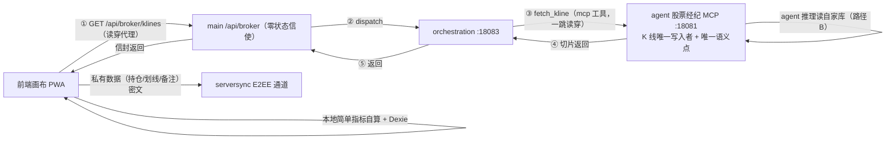
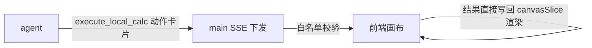
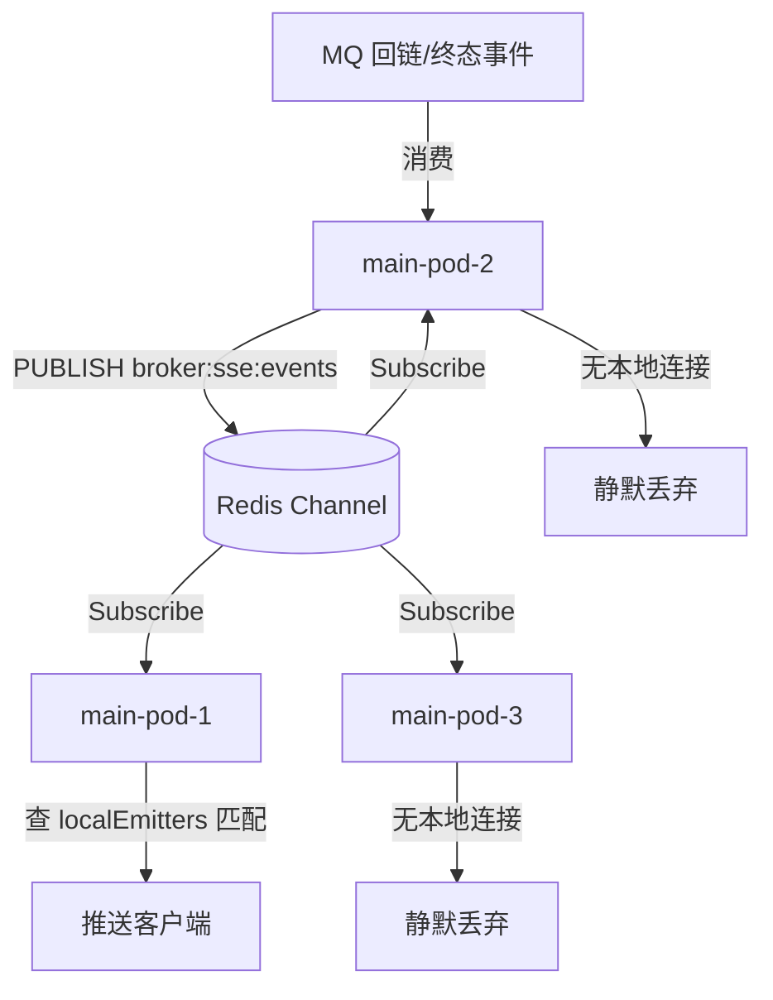

# 自由画布 · 后端对接方案 v3 Master（Agent × Main × 前端）

> 本文为自由画布前后端对接的**唯一权威契约**（v2 众包架构反转为**后端代理模式**，2026-09-24 定稿）：
> 画布 K 线获取走后端读穿代理（库即缓存，写穿入库），前端彻底纯消费；数据单源可信，
> v2 众包特有机制（upload/metadata/防投毒/缺口两腿/USER_RELAY）整体废除。
> 配套设计规格见前端仓库 `docs/free-canvas-spec.md`（spec §N 引用均指该文档）。

## 一、角色与职责划分（6 角色）



| 角色 | 职责 | 明确不做 |
|---|---|---|
| 前端画布（PWA） | **纯消费**：经代理端点获取 K 线；Dexie 本地缓存；简单指标即时计算（MA/因子/涨跌幅）；区块数据本地持久化 | **不爬行情商、不上传数据、不做任何数据管理**；不做全量历史存储；不做毫秒时间戳转换 |
| main :18080（多实例） | 唯一 API 出口：信封包装、用户鉴权、双层限流收口、SSE 推送、新闻聚合 | **K 线域零状态**：无 K 线表、无内容级校验、无本地缓冲；不做行情拉取 |
| orchestration :18083 | dispatch 唯一工具入口：sync 短链直代调 / async_long 转任务；traceId 透传；全局限流 | 不碰数据本体；不做用户级鉴权（只验服务通行证） |
| agent 股票经纪 MCP :18081 | **K 线唯一写入者 + 唯一语义点 + 唯一行情出口**：读穿代理（`QuoteSyncService.ensureBars`：查库→不足自动全量/增量拉腾讯→ON CONFLICT 幂等入库→返回）、复杂指标计算（纯计算+本域只读）、监控 DAG 数据操作。计算面无状态多实例，数据落共享 stock_mcp 库（`quote_daily` 表） | 不直连前端；不持久化用户私有数据 |
| data 模块 | 既有职责不变（公告识别/向量化等 Worker） | **退出画布 K 线域**（拉取与存储均由经纪原生承担，无需 data 参与） |
| serversync（现状） | 用户私有数据密文备份（含画布区块数据） | 行情原始数据/明文快照不入此通道 |

**核心决策记录**（v3 收敛结论）：

1. **简单指标前端算、复杂指标后端算**——端上有全量输入且无状态的留前端（extractFactors/metricsEngine 现成）；需全量历史或研报级推理的上收经纪 MCP。
2. **计算双路径**——路径 A（无状态）：前端喂切片算完即弃，适合实时拖拽；路径 B（沉淀）：经纪 MCP 读自家库，适合长上下文推理/监控，agent 推理路径上零数据采集。
3. **K 线数据家在经纪 MCP**——权威存储在 stock_mcp 库；main 不存、data 只拉取不写库，写入权唯一。
4. **后端代理拉取（v3 反转，废除众包；经纪原生读穿）**——画布 K 线经后端读穿代理获取，**拉取与入库由经纪 MCP 一跳完成**（复用既有 `QuoteSyncService`：库为事实源、数据源只补差，2026-09-24 起数据源为**腾讯**，与前端图表同源、口径天然一致，ON CONFLICT 幂等）：**库即缓存**（历史数据拉一次永久复用；最新数据增量拉取+请求合并），数据**单源可信**（无投毒/无交叉验证/无版本混拼隐患）。行情商出口封禁风险由三件套管控：库缓存去重 + 出口频控削峰 + 商业数据源 fallback。
5. **多用户平台 + main 多部署**——限流双层桶、SSE 多实例路由、监控任务单实例执行均为必答题（§八）。
6. **转换成本留后端（契约裁决）**——fullCode 腾讯形态 / date 日期字符串 / adjustFactors 因子比对（Epsilon 口径）/ version 数字自增，详见 §3.8。
7. **存量域零回归**——沙盘/风控/做T 等**存量域**的 klineService 直连通道不动；本方案代理通道仅服务**画布新域**。

## 二、服务连接拓扑与硬约束

沿用 agent-orchestration 定案：**前端只面对 main，MCP `/sse` 端点仅服务端内部消费，一切经编排器 dispatch**。

### 2.1 连接明细

| # | 调用方 → 被调方 | 协议/端口 | 鉴权 | 用途 |
|---|---|---|---|---|
| 1 | 前端 → main | REST + SSE，:18080 `/api/broker/*` | 用户 Bearer token（现有 auth 体系） | 唯一 API 出口；信封 `{code,message,data}` |
| 2 | 前端 → 行情商 | **仅存量域**（沙盘/风控/做T klineService 直连不动）；画布域不走直连 | 无 | 存量展示（零回归） |
| 3 | main → orchestration | MCP 连接（:18083，dispatch；拆分裁决见 §8.2） | 服务级通行证（`orchestration.security.passport-token`） | copilot/broker 统一入口；超时梯队 main 15s > dispatch 10s > ToolInvoker 8s |
| 4 | orchestration → 经纪 MCP :18081 | MCP 工具调用（ToolInvoker 8s） | 服务间内部消费 | **fetch_kline 读穿**（查库→缺则拉腾讯→入库→返回）/ sync_kline / 指标计算 |
| 5 | 经纪 → 腾讯行情 | HTTP（web.ifzq.gtimg.cn fqkline 公开接口，qfq 前复权；2026-09-24 起与前端同源） | 无（公开接口） | **全系统唯一行情出口**；受出口频控约束（§8.3） |
| 6 | orchestration → main | rest 节点（$ctx 求值） | 服务间 | DAG 中回调 main 业务接口 |
| 7 | orchestration → LavinMQ | mq_send，TASKS 交换机，messageId=traceId 幂等 | — | 监控任务（async_long） |
| 8 | 经纪 → notify :18082 | mcp 节点 | 服务间 | 监控告警推送（DAG 内） |

### 2.2 连接硬约束（v3 共 9 条）

1. **main 不直连 :18081/:18082**——所有工具面调用收敛到 :18083 dispatch 单连接。
2. **全链路不接触用户信息本体**——下发自包含任务描述/参数化请求；MQ 回传只用匿名 correlationId；**明文快照（§3.7）与 serversync E2EE 通道物理隔离**。
3. **TraceId 透传**——main 生成 W3C traceparent，经请求头下传 orchestration → data/MCP → MQ。
4. **MQ 队列禁 auto-delete**，x-expires + 终态事件 + GC；K 线事件 key（`kline.fetched` 等）定义于 stock-calculator-contract 模块。
5. **双层限流**——用户级桶卡 main（Redis，复用 `AiChatRateLimiter` 模式，按端点拆桶）；orchestration 只做全局并发上限；**data 侧对行情商出口设全局频控+队列削峰**（防封核心闸门，见 §4.2）；矩阵见 §4.2。
6. **经纪工具分级纪律**——**指标计算类工具**：纯计算 + 本域只读（读自家 stock_mcp 库），禁外部 IO（8s ToolInvoker 兜底前提）；**读穿拉取类工具（fetch_kline）**：允许外部 IO（腾讯出口，现状 `TencentDailyClient`/`QuoteSyncService`），单次拉取受独立超时与出口频控约束，且**拉取与计算不得混在同一工具内**（防慢 IO 拖垮计算工具）。
7. **main → :18083 连接池隔离**——静态拆 dispatch-compute/dispatch-chat 两条 MCP 连接 + W1 压测验证，裁决见 §8.2。
8. **main 在 K 线域零状态**——消费回链消息只做转发：不解析、不校验、不暂存、不落任何表；失败 nack 回队列由 MQ 重试/DLX 接管。
9. **K 线写入权唯一**——全系统只有经纪 MCP 写 stock_mcp 库；data 拉取后经回链入库；CAS/因子比对/入库全部单点收敛在经纪。

## 三、接口契约（main → 前端）

统一约定：HTTP 200 + `{ code, message, data }` 信封（与 searchService/announcementService 同构）；401 → SessionExpiredError；流式走 SSE（复用 copilot 的 `streamQuestion`/`parseSseBlock` 管道）；token 一律 Authorization Bearer 注入。

- **fullCode 规范形态：腾讯形态**（如 `sh601318`）——前端全仓主键即此形态，前端零转换。main 收到后正则归一化出 6 位裸码（如 `sh601318 → 601318`）过 crawler 股票字典校验，非法或不存在的代码响应 400——防 Agent 基于脏代码推理。前端各调用点禁出现第二套键形态。
  - 校验口径（2026-09-25 E2E 定稿）：字典键形态混杂（沪深 `sh600745` 前缀 / 北交所 `920000.BJ` 后缀），故**一律用 `existsBySixDigit` 尾匹配**，裸 6 位码 `existsById`（`existsByCode`）永远落空——klines/compute/ask/monitor 四个端点必须同一口径（曾因 compute/ask/monitor 沿用 `existsByCode` 导致对合法代码全量误 400）。
- **时间口径：交易日日期字符串** `date: "YYYY-MM-DD"`（非 Unix 毫秒）——klineService 的 `KlineItem.date` 即此形态，直接做缓存键/复权因子索引；形状校验按字符串单调性判断。禁止要求前端做毫秒转换。
- **Payload 硬上限**：`compute`/`ask` 等带体端点请求体 ≤256KB，超出拦截返回 413（防画布大图把 canvasContext/klines 叠加塞爆）；`GET /klines` 为查询端点无请求体。

### 3.1 POST /api/broker/indicators/compute —— 无状态复杂指标计算

- **前端功能**：metric/chart 区块选「agent 指标」数据源时调用；前端把 K 线切片（含复权因子表）交给后端算复杂指标，结果写回区块 data 渲染。
- **请求体**：

```json
{
  "fullCode": "sh601318",
  "adjustType": "qfq",
  "klines": [{ "date": "2026-01-05", "open": 10.2, "close": 10.5, "high": 10.6, "low": 10.1, "volume": 12345600 }],
  "adjustFactors": { "2026-01-05": 1.0, "2026-03-10": 0.87 },
  "indicators": ["macd", "kdj", "boll"]
}
```

  - `fullCode`：腾讯形态；`adjustType`：`'qfq' | 'raw'`（透传）；`klines` 升序 ≤120 根；`adjustFactors` 逐日因子表；`indicators` 指标名白名单，白名单外 → code 400。
- **返回值**：

```json
{ "code": 200, "message": "ok", "data": { "version": 3, "indicators": { "macd": { "macd": [null, null, 0.12], "signal": [null, null, 0.08], "hist": [null, null, 0.04] } } } }
```

  - `version`：**数字自增**（与 GET /api/broker/indicators 统一，前端只比对相等）。
  - **数组对齐口径**：各指标数组长度/顺序与请求 klines 一一对齐；暖机期槽位用 **null 占位**（不截短），前端按 null 跳过渲染；次新股根数不足 `minBars` 时对应指标整体返回 null。
- **错误分支**：code 400 形状/白名单不合法｜401 SessionExpiredError｜429 限流（读 `data.retryAfterSeconds` 倒计时，计算桶独立提示）｜5xx 计算失败（metric 区块降级占位）｜网络失败 15s 超时（对齐 REQUEST_TIMEOUT_MS）。
- **幂等/频率**：无状态可重复调用；设置变更时触发，不做轮询。走 dispatch-compute 通道。

### 3.2 POST /api/broker/ask —— 经纪分析问询（SSE）

- **前端功能**：画布 AI 聊天窗问询（scopeId=`canvas` 线程）；带画布标号上下文；agent 回复可携带动作卡片（`annotate_block`/`execute_local_calc`）。
- **请求体**：

```json
{
  "cid": "c-20260924-a1b2c3",
  "question": "结合 A1 的 K 线分析当前支撑位",
  "fullCode": "sh601318",
  "klines": [ "…同 3.1 切片结构…" ],
  "canvasContext": "画布区块：\nA1[kline] 贵州茅台 sh600519，日K 120根，水平线2条\nB2[text] 「关注放量突破」"
}
```

  - `cid`：幂等键，复用 `newClientMessageId()`（§3.8-6）；`canvasContext`：spec §6.2 摘要协议（每区块 ≤2 行、总 ≤30 行）。
- **返回值**：SSE 流（复用 copilot 事件协议）：`message` 增量文本；`done` 权威响应体（`actions` 随 done 返回，**不设独立 actions 事件**，前端事件分发零改动）。白名单守卫后 confirm 执行。done 后流即结束（单向发布，**前端不回传执行结果**）。agent 需历史数据时读自家库（路径 B），不要求前端喂全量。
- **错误分支**：SSE `error` 事件｜401 → SessionExpiredError｜断线复用 copilot 重连｜canvasContext 超限由前端截断。走 dispatch-chat 通道。**断连补偿契约**：`done` 前断线，重连后 `query_task` 补偿**必须连同 `actions` 一并返回**，前端按 `cid + actionId` 去重执行。

### 3.3 GET /api/broker/news/{fullCode} —— 个股新闻聚合（预留）

- **前端功能**：画布新闻类区块（二期）拉取个股新闻；main 聚合新闻源管道 + agent 产出。
- **参数**：path `fullCode`；query `page`（默认 1）、`pageSize`（默认 20，上限 50）。
- **返回值**：`data: { items: [{ id, title, summary, source, publishedAt, url }], page, pageSize, total }`——`url` 原文外链，画布内不渲染正文。
- **错误分支**：同信封标准；空结果 `items: []`（非错误）。**状态**：一期仅登记契约。

### 3.4 GET /api/broker/klines —— K 线读穿代理（画布数据主通道）

- **前端功能**：画布 kline/chart 区块获取 K 线数据的**唯一通道**（替代客户端直连行情商）：后端查库覆盖，未命中/过期部分由 data 代理拉取，拼接返回并写穿入库——前端零数据获取逻辑。
- **参数**：query `fullCode`（腾讯形态）、`adjustType`（`'qfq'|'raw'`）、`interval`（`'1d'`）、`from`/`to`（`YYYY-MM-DD`，可省略 to=最新）。
- **处理链（一跳读穿，复用经纪既有 QuoteSyncService）**：main 鉴权 + klines 桶限流 → orchestration dispatch → **经纪 `fetch_kline` 工具**：查库覆盖（`quote_daily`）→ 不足/过期则按 ensureBars 策略拉腾讯（全量 days×2+30 冗余 / 增量 last_date-10 天重叠兜近期 qfq 微调）→ ON CONFLICT 幂等 upsert → 读库返回升序切片 → 原路返回前端。**拉取与入库同体同事务边界，零 MQ、零回链、零 data 参与**。
- **返回值**：`data: { klines: [KlineItem], coverage: { from, to }, snapshotId }`——`klines` 升序 date 字符串结构；`coverage` 为实际覆盖区间（不足请求区间时如实标注）；`snapshotId` 供日志追踪。
- **错误分支**：400 形状/字典校验不过｜401｜429 限流｜5xx data 拉取失败（前端区块降级占位「行情服务暂不可用」）｜15s 超时。**单段拉取失败不阻断其余区间**（coverage 如实标注空洞）。
- **缓存语义**：历史段（已收盘）库内永久复用；最新段增量拉取 + main 层短 TTL（5s）请求合并（盘中多用户刷新合并为单次行情商请求）。

### 3.5 POST /api/broker/monitor/{start,stop} —— 监控任务（B·调度路径，2026-09-24 SSOT 修订）

> **架构修订**：原案「orchestration async_long → Executor DAG 循环（mq_wait tick）」经实现期实证废止——Executor 为线性单次执行、无循环/无确定性建任务入口/无 stop 机制，改造代价过高。定案为 **B·调度路径**：监控任务状态落 main broker 域 `broker_monitor_task` 表（用户业务数据，非行情数据，硬约束 #8 不破），main 定时调度判定循环，行情获取仍走 §3.4 读穿代理，告警经 notify.push 直投复用 Web Push 全链。

- **前端功能**：用户开启个股监控（如"跌破 1500 提醒"），后端周期判定并 Web Push 提醒。
- **start 请求体**：`{ fullCode, interval: "1d", alertRule: { type: "PRICE_BELOW", threshold: 1500 } }`
- **start 返回值**：`data: { taskId, status: "RUNNING" }`——taskId 即 `broker_monitor_task.id`；重复 start（同 user+code+type+threshold 已 RUNNING）幂等返回既有任务。执行主体：main 调度行 `job.broker.monitor.check`（每分钟）→ 经 dispatch 调经纪 `fetch_kline` 读穿（近 7 日历日）→ 最新收盘价阈值判定（任务级节流 60s + 告警冷却 30min）→ notify.push 直投（`NotifyPushMqConsumer` → Web Push 落库+推送全链）。
- **stop 请求体**：`{ taskId }`；返回 `{ status: "STOPPED" }`——服务端校验归属（userId 隔离），非本人任务 400；STOPPED 幂等。
- **限流**：单用户并发监控 ≤5（DB 在途计数为准，429 含并发上限提示）。
- **错误分支**：同信封标准；413 带体上限；429 含并发上限提示；判定轮内单任务失败隔离（日志级，下轮自然重试）。

### 3.6 GET /api/broker/indicators —— 能力端点

- **前端功能**：brokerService 初始化时拉取，缓存 `version` 与指标名清单；本地计算函数表与渲染以它为准。
- **参数**：无。
- **返回值**：`data: { version: 3, indicators: [{ name: "macd", label: "MACD", minBars: 33, applicableBlocks: ["metric","chart","kline"] }] }`——`version` 数字自增；`minBars` 最少暖机根数；`applicableBlocks` 限定可挂区块类型。
- **错误分支**：拉取失败用上次缓存（首次失败隐藏 agent 指标选项，不阻断画布）。

### 3.7 POST /api/broker/annotations —— 画布快照沉淀（预留，画布二期）

- **前端功能**：用户把「分析结论快照」（区块数据 + AI 结论摘要 + 日K形态）存后端跨设备恢复；本地 Dexie 仍是主存储，此为可选云端副本。
- **请求体**：`{ canvasId, snapshot: { blocks: [区块摘要], aiNotes: [AI备注] } }`——**不含行情原始数据**（行情由 §3.4 代理通道负责）。
- **返回值**：`data: { snapshotId, savedAt }`。
- **错误分支**：失败静默（本地已有，不阻断）。
- **鉴权与隐私声明（硬门槛）**：此通道为**明文业务数据**进 main 库，非 serversync E2EE 密文通道——显式声明「画布快照非密文备份，敏感内容用户自理」；与 serversync 物理隔离（硬约束 #2）。`canvasId` 必须服务端校验归属（按 userId 隔离）。
- **状态**：预留契约，与画布二期一起评审。

### 3.8 契约对账定案（前后端核对 2026-09-24，8 项）

原则：**转换成本留在后端，前端零改动**。

1. **fullCode 采用腾讯形态**为规范输入（§三统一约定），main 归一化 + 字典校验。
2. **K 线时间口径为日期字符串** `YYYY-MM-DD`（§三统一约定），禁止要求前端做毫秒转换。
3. **复权一致性采用因子 Epsilon 比对**——前端 `buildAdjustFactors` 产出逐日因子表随切片/请求携带；经纪入库拼接按因子值比对，口径为**相对 Epsilon 容差（1e-6）或定点归一化（round 8 位小数）**，禁止跨语言浮点字面相等（JS IEEE 754 序列化漂移）；与 v1 ±0.01 价格绝对容差是不同语义不同量级，非回退。
4. `execute_local_calc` 与 sandboxEngine（customStats QuickJS VM）边界：一期声明式计算名**不走** VM 沙箱；sandboxEngine 仅归 customStats 域。
5. 动作消费队列化：画布消费侧须在 canvasSlice 加同 blockId 串行队列（多 SSE 流并发防线）。
6. `/api/broker/ask` 幂等键复用 copilot 的 `newClientMessageId()`（copilotService.ts:168）。
7. KlineBundle 透传 `adjustType`（parse 已有 `'qfq'|'raw'` mode 参数）。
8. brokerService 初始化拉 `GET /api/broker/indicators` 缓存 version。

## 四、数据架构（v3 代理模式 · 经纪原生读穿）

### 4.1 数据所有权与单一来源

- **权威存储**：经纪 MCP 的 stock_mcp 库 `quote_daily` 表（**现状已建**，adjust='qfq'）；main/orchestration/data 均无 K 线表。
- **写入权唯一 + 拉取内聚**：只有经纪 MCP 写库；拉取（`TencentDailyClient`，fqkline 公开接口 qfq/raw 双口径，单请求上限约 800 根按 640/页分页回溯）、同步编排（`QuoteSyncService`）与入库同在经纪一跳完成——**无 MQ 回链、无 data 参与、无跨服务数据搬运**。
- **数据单源可信**：全库数据唯一来源 = 经纪腾讯出口（D9 定案"库为事实源，数据源只补差"；2026-09-24 数据源由东财切腾讯，与前端图表同源），**无投毒面**。口径注意：腾讯行仅 [日期,开,收,高,低,量]，额/换手不提供（amount/turnover 恒 0），chg/pctChg/amplitude 由前一根收盘派生。
- **读穿机制（现状已有，画布直接复用）**：`ensureBars(stockId, days)`——库不足 → 全量窗口（days×2+30 日历日冗余覆盖停牌）；存量足够 → 增量窗口（last_date-10 天重叠兜近期 qfq 微调）；upsert ON CONFLICT 幂等，部分失败下次同步自愈。除权后 qfq 远端漂移走 `/admin/quote/resync` 手动重灌（现状取舍，画布场景增强见生死线 #1）。

### 4.2 双层限流 + 出口频控矩阵

| 层 | 对象 | key/位置 | 算法 | 阈值建议 |
|---|---|---|---|---|
| 用户桶 | klines 代理 | `rl:broker:klines:{uid}` | 固定窗口 | 30/min |
| 用户桶 | compute | `rl:broker:compute:{uid}` | 漏桶 | 20/s，burst 30 |
| 用户桶 | ask | `rl:broker:chat:{uid}` | 令牌桶 | 1/5s，burst 2 |
| 用户桶 | monitor | `rl:broker:monitor:{uid}` | 并发计数 | 5 个在途 |
| 全局 | orchestration 并发 | 侧内 | 并发上限 | compute 100 / chat 20 |
| **出口频控** | **经纪 → 腾讯行情** | 经纪侧队列 + 令牌桶 | 全局 QPS 上限 | ≤5 QPS + 突发 burst 20（防封核心闸门；参数随压测调） |
| **请求合并** | main 层 | 短 TTL 缓存 | 同 (code,adjust,区间) 5s 合并 | 盘中多用户刷新归一 |

### 4.3 三条工程生死线（经纪读穿入库必须死守）

1. **复权基准统一（Epsilon 比对增强项）**：现状基线 = 增量重叠窗口（10 天）兜近期 qfq 微调 + `/admin/quote/resync` 手动重灌修远端漂移；画布**共享库**场景增强为：入库重叠段与库内逐日 **Epsilon 比对**（口径见 §3.8-3，`|a-b|/max < 1e-6` 或 round 8 位），漂移超阈值 → 触发该股自动 resync（替代人工），坚决不把不同复权基准的 K 线硬拼（防均线跳空断层）。
2. **连续性记录**：拼接时按时间轴检测缺口并**记录（日志级）**，不得静默跳过（防「瑞士奶酪」脏库）；代理模式下缺口由后续按需请求自然补齐，无主动补爬机制。
3. **入库幂等**：ON CONFLICT (stock_id, trade_date) 幂等 upsert（现状已有）；重复请求/并发同步幂等吸收，多实例经纪并发写同股由行级 upsert 原子性保证。

**演进节奏**：代理端点（§3.4）一期即启用——画布数据获取主通道，底层完全复用既有 QuoteSyncService，新增面仅 `fetch_kline` MCP 工具注册 + 出口频控 + Epsilon 增强比对；无二期数据架构切换。

## 五、本地计算代理（前端 MCP 形态 · 单向发布模式）

### 5.1 定位与可行性结论

结论：**浏览器无法承载标准 MCP server**（无法监听 socket），「前端 MCP 服务」以标准协议形态不成立；落地形态为**单向发布的本地计算代理（Fire and Forget）**：



**单向 vs 双向（决策记录）**：不做「任务下发 → 结果上报」的双向 RPC——单向模式下 agent 把前端当成**带计算能力的富客户端执行引擎**：下发指令后 SSE 流直接结束，agent 不等待、不知晓结果。

**多用户边界（硬条款）**：**凡在画布上渲染数值的指标，唯一计算来源 = §3.1 compute 端点**（agent 回答文本与画布展示同源同值，杜绝双轨计算"文本说的数"与"图上画的数"打架）；`execute_local_calc` **禁用于画布数值指标**，仅用于不落画布数值的 agent 独占辅助计算。

核心收益：零后端挂起、计算结果不回传大模型（省 token）、复用 copilotActions 现有动作机制。

### 5.2 执行通道（复用现有机制，零新协议）

1. **任务下发**：agent 在 SSE 流输出动作卡片 `{ type: 'execute_local_calc', payload: { blockId, calc: 'MA20' 等白名单计算名, params? } }`；前端 `utils/copilotActions.ts` 白名单登记，分级 `confirm`。**Agent 提示词约束（后端配合项）**：系统提示词明确「你不需要自己计算实时指标，只需输出 execute_local_calc 动作，前端会自动计算并展示，你无需等待结果」
2. **本地执行**：前端按 calc 白名单名分发到本地计算函数（复用 extractFactors/metricsEngine/canvasExpr 纯函数）——**不执行 agent 下发的任意代码**（一期只做声明式指令；与 sandboxEngine 边界见 §3.8-4）
3. **结果写回**：经 canvasSlice action 写入目标区块 data——**结果只进本地 store/Dexie，不上报后端**
4. **blockId 存活校验**：动作执行最后一刻（reducer 内）二次校验区块存活，不存在则静默丢弃
5. **同 blockId 串行队列**：canvasSlice 消费侧同 blockId 串行队列（多 SSE 流竞态防御，§3.8-5）

### 5.3 安全护栏（强制）

- 未登记白名单 / calc 名不在函数表 / payload 形状不符 → 静默丢弃
- **禁止传输与执行任意代码**：一期只允许声明式计算名；未来脚本级任务再评估 VM 沙箱（customStats 模式），必须 confirm + 隔离执行
- 严禁 eval / new Function / Function 构造器（对齐 spec §4.7）
- 本地计算输入只读（klineService 缓存与区块 data），不写行情源数据

## 六、降级链路与故障边界

| 故障 | 行为 |
|---|---|
| 腾讯拉取失败/行情商不可达 | `GET /klines` 对应区间 coverage 空洞如实标注；区块降级占位「行情服务暂不可用」；持续失败触发商业数据源 fallback（`DailyQuoteClient` 第二实现，QuoteSyncService 无感切换，§8.3） |
| 后端出口 IP 被行情商限流 | data 出口频控自动削峰退避；持续封禁切换商业数据源（单点风险由三件套管控，见 §一 决策 4） |
| agent 超时/异常 | main 信封 5xx + message 用户可读；前端 15s 超时 |
| CAS 拒绝 / 因子比对不一致 | 该段不入库并记日志；下次请求自然重拉；前端无感知（数据以本次返回为准） |
| 监控任务实例崩溃 | Executor 断点续跑（任务状态在 stock_mcp 库） |
| 多实例 SSE 推送丢失 | Redis Pub/Sub fire-and-forget 窗口丢消息 → 前端重连后 `query_task` 主动拉取补偿 |
| execute_local_calc 本地执行失败 | 结果不上报；本地 toast 提示，不阻断画布；agent 不感知 |
| SSE 断连 | 复用 copilot 重连；`done` 前断线由 query_task 补偿（含 actions，cid+actionId 去重，§3.2） |
| 能力端点拉取失败 | 用上次缓存；首次失败隐藏 agent 指标选项，不阻断画布 |

## 七、前端消费封装（一期落点）

| 层 | 文件 | 职责 |
|---|---|---|
| services/brokerService.ts（新建） | 惰性动态 import；`getKlines(...)` / `computeIndicators(...)` / `askBroker(...)` / `startMonitor(...)` / `stopMonitor(...)` | 路由前缀切换点收敛于此；token 传参注入，禁 import store；初始化拉能力端点缓存 version |
| utils/copilotActions.ts | 登记 `execute_local_calc`（及 annotate_block）白名单 + 载荷守卫 | 动作下发通道 |
| utils/canvasExpr.ts（新建） | 递归下降四则运算解析器（spec §4.7）+ 本地计算函数表 | 本地简单指标 |
| store/slices/canvasSlice.ts | K 线结果/复杂指标结果与本地计算结果写入区块 data 的 action（含 blockId 存活二次校验 + **同 blockId 串行队列**） | 状态唯一写路径 |

实施排期建议：后端 §三 契约先行评审 → brokerService + 画布数据接入（走 §3.4 代理）；本地计算代理（§五）独立小迭代，不阻塞画布一期。

## 八、遗留问题与终局裁决

### 8.1 多实例 SSE 路由（P0）——Redis Pub/Sub 事件广播

main 扩展为多实例后，SSE 长连接仅挂载于单台 pod 内存，而消费 MQ 事件的可能是任意一台 pod。



**实现规范**：
1. **连接登记**：main 收到 SSE 请求时在本地 `SseEmitterRepository` 注册 `(channelId, SseEmitter)`——key 与 `user_async_task_log.channel_id` 同源；
2. **事件广播**：任意 pod 消费到 MQ 事件后**严禁直推 SSE**，包装为 `SseBroadcastMessage(channelId, payload)` 发布至 Redis channel `broker:sse:events`；
3. **本地匹配**：持有 emitter 则 `emitter.send()`，否则静默丢弃；
4. **异常清理**：`onCompletion/onTimeout/onError` 回调移除映射；
5. **丢消息兜底**：Pub/Sub fire-and-forget——前端重连后经 `query_task` 主动拉取补偿（推送管实时、拉取管完整）；
6. **单实例统一**：单 pod 也走同一通道，避免双路径分支。

### 8.2 dispatch 连接池拆分（P0）——静态拆分 + W1 压测验证

杜绝 ask 长推理占满连接池导致 compute 队头阻塞：配置层拆 `orchestration-dispatch-compute` / `orchestration-dispatch-chat` 两条 MCP 连接（同指 :18083）。

**W1 验证项**：Spring AI MCP client 对 per-connection `request-timeout` / 池容量的支持度——不支持时降级路径：连接池拆分照做，超时差异收敛在 main service 层调用侧控制。

**压测 SOP**：15 并发 ask（模拟 LLM 15s）期间 50 并发 `/indicators/compute`。**判定**：compute P99 < 100ms 且无连接池耗尽；若 HTTP 多路复用生效，compute 池容量可下调。

### 8.3 行情商出口防护（P1）——v3 代理模式的封禁防线

后端代理承担全部画布行情流量，封禁防线三件套（决策 4）：

1. **库即缓存**：历史段零重复拉取（§4.1 ensureBars 增量机制），最新段增量 + main 层 5s 请求合并（§4.2）——出口请求量 ≈ 独立数据单元数 × 刷新率，与用户数解耦；
2. **出口频控**：**经纪侧**（腾讯出口，全系统唯一行情出口）全局令牌桶 ≤5 QPS + 队列削峰，超限排队而非穿透；参数随压测与行情商反馈调整；
3. **商业数据源 fallback**：持续限流/封禁时切换配置好的商业源（如 TuShare Pro，实现为 `DailyQuoteClient` 的第二实现，`QuoteSyncService` 无感切换），`GET /klines` 响应不区分来源（对前端透明）。

**W1 验证项**：以真实 UA/Referer 特征做小压测，校准出口频控阈值基线（现状 UA=Mozilla/5.0 已自带）。

### 8.4 已废止裁决存档（v2→v3 反转后失效）

以下定案随架构反转**整体废止**，留档防回潮：客户端上传端点与 metadata 协议、USER_RELAY 合规标记、防投毒交叉验证（生死线 #4）、缺口目录与两腿优先级（Client-First + 10s 延迟检查）、`fetch_gap_request` 动作及其下发通道（经纪→orchestration→main 内部回调）、腿 B 延迟检查（TTL+DLX 专用队列）、`check_and_dispatch_gap` 工具、**data 承担 K 线拉取与 MQ 回链入库**（经纪 `QuoteSyncService` 原生读穿覆盖，拉取与入库同体，MQ 回链属重复建设）。废止原因：数据获取收归后端单源（且经纪已有原生读穿实现）后，上述机制针对的"多源可信/客户端参与补全/跨服务拉取回传"问题不再存在。

## 附录 A · 前端需提供的数据/参数清单（对账表）

| 场景 | 前端提供参数 | 契约/防线要求 |
|---|---|---|
| 全部 `/api/broker/*` | `Authorization: Bearer <userToken>` | 复用现有 Auth 体系 |
| §3.4 klines 代理 | query：`fullCode`；`adjustType`；`interval`；`from`/`to` | 画布 K 线唯一通道；coverage 空洞如实标注；无上传、无数据管理 |
| §3.1 compute | `fullCode`；`klines[]`（≤120 根升序）；`adjustFactors`；`adjustType`；`indicators[]`（能力端点）；429 读 `retryAfterSeconds` | 计算桶独立提示；413/400 分支见统一约定 |
| §3.2 ask | 上述 + `question`；`canvasContext`；`cid`（newClientMessageId 幂等）；scopeId（`canvas`） | done 带 actions；断连补偿含 actions 去重执行 |
| §3.5 monitor | `start: {fullCode, interval, alertRule}` / `stop: {taskId}` | 单用户并发 ≤5 |
| 动作执行 | ① 白名单函数表（能力端点下发）；② blockId reducer 内二次存活校验；③ **同 blockId 串行队列**；④ 结果只写 store/Dexie 不回传 | 单向发布模式（§五）；画布数值指标唯一来源=compute（§5.1 硬条款） |
| 能力发现 | 无参 GET，失败用上次缓存/首次隐藏选项 | version 数字自增只比对相等 |

## 修订记录

- 2026-09-25（**E2E 实测·字典校验口径收口**）：本地容器全链 E2E（klines / indicators / compute / ask JSON+SSE / monitor start-stop+告警直投 / 401 / 429）通过；实测暴露 compute/ask/monitor 沿用 `existsByCode`（裸 6 位码 `existsById` 永远落空）导致对合法 fullCode 全量误 400，三端点统一改为 klines 已有的 `existsBySixDigit` 尾匹配并补回归单测。§三 fullCode 条目补记校验口径与成因。

- 2026-09-24（**数据源切腾讯·与前端同源**）：经纪行情出口由东方财富 push2his 切换为腾讯 fqkline（`web.ifzq.gtimg.cn`，`EastmoneyDailyClient` → `TencentDailyClient`，东财实现退役为备用实现位）——动机：前端图表取腾讯数据，后端同源消除口径差；腾讯行仅 [日期,开,收,高,低,量(手)]，额/换手不提供（amount/turnover 恒 0，存量东财数据经增量 upsert 逐步收敛）、chg/pctChg/amplitude 由前收盘派生（窗口前冗余 15 日历日）；单请求上限约 800 根，按 640/页分页回溯覆盖全量/重灌窗；频控配置键 `quote.eastmoney.*` → `quote.tencent.*`。§一/§2.1/§3.4/§4.1/§4.2/§六/§8.3 已同步。

- 2026-09-24（**§3.5 SSOT 修订·监控走 B 调度路径**）：监控任务执行主体由「orchestration async_long → Executor DAG 循环」改为「main broker 域定时调度判定循环」——实现期实证 Executor 无循环语义/无确定性建任务入口/无 stop 机制，改造代价高；任务状态落 `broker_monitor_task` 表（用户业务数据，硬约束 #8 不破），行情仍走 §3.4 读穿代理，告警经 notify.push 直投复用 Web Push 全链；端点占位契约 `{taskId, status}` 不变，taskId 语义改为 broker_monitor_task.id。

- 2026-09-24（**v3 修订·经纪原生读穿收口**）：确认经纪 MCP 已有完整东财日 K 链路（`EastmoneyDailyClient` push2his fqt=1 前复权 / `QuoteSyncService` ensureBars 读穿+全量增量自动判定+ON CONFLICT 幂等 / `quote_daily` 表 / secid 兼容腾讯形态）——v3 代理模式的拉取与入库由经纪一跳原生完成，**data 模块退出画布 K 线域、MQ 回链整体废除**（§8.4 存档追加），同步链缩为 main → orchestration → 经纪 `fetch_kline` 三跳；硬约束 #6 改为工具分级纪律（计算类纯计算 / 读穿拉取类允许东财 IO 且不得与计算混工具）；出口频控移至经纪东财出口；商业源 fallback 定为 `DailyQuoteClient` 第二实现（QuoteSyncService 无感切换）；生死线 #1 现状基线（重叠窗口+手动 resync）与画布增强（重叠段 Epsilon 比对超阈值自动 resync）分层明确。
- 2026-09-24（**v3 架构反转：代理模式定稿**）：废除 v2 众包数据架构——画布 K 线获取改为后端读穿代理 `GET /api/broker/klines`（主通道，库即缓存+写穿入库），前端彻底纯消费（不爬/不上传/零数据管理）；data 转型为全系统唯一行情拉取执行者（同步 fetch_kline rest 工具 + MQ 回链），经纪保持纯计算+本域只读、唯一写入者不变；整体废止 upload/metadata/USER_RELAY/防投毒/缺口两腿/fetch_gap_request/延迟检查/动作下发通道（§8.4 存档）；新增 §8.3 行情商出口防护三件套（库缓存/出口频控 ≤5QPS/商业源 fallback）；生死线收敛为三条（因子 Epsilon 比对/连续性记录/入库幂等）；存量域（沙盘/风控/做T）直连通道零回归。
- 2026-09-24（v2 修订·外部评审收口八项）：防投毒生死线、因子 Epsilon 口径、payload 分层、状态机抢占锁、actions 断连补偿、延迟队列防队头阻塞、双轨计算硬条款、直连失败代理兜底（后五项在 v3 中继续有效）。
- 2026-09-24（v2 修订·接缝通道定案）：§8.4 三接缝收口（其中动作下发通道与延迟检查随众包废止，监控增量归属 data 保留）。
- 2026-09-24（v2 修订·前端零管理裁决）：前端不做数据比对/覆盖判断/目录管理（v3 中进一步收敛为不参与数据获取）。
- 2026-09-24（v2 Master 定稿）：v1 与前端对接稿融合；4 项契约裁决（腾讯形态/日期字符串/因子比对/version 数字）。
- 2026-09-24：v1 评审修订（能力端点/限流拆桶/连接池隔离等）。
