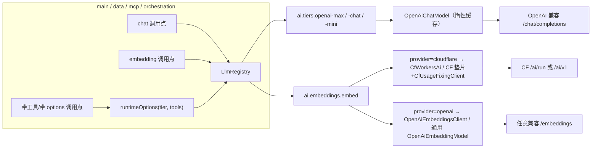

# stock-calculator-llm · LLM 共享装配模块

跨服务 LLM 客户端装配设施（Maven 模块 `stock-calculator-llm`，包 `com.zzh.llm`）：
chat 三档 tier + embedding tier 的**唯一配置事实源**，并封死 Spring AI 2.0.1
运行时 options 的三个坑。只做「装配设施」，不含任何业务 fallback 链逻辑
（orchestration D6 决策：Planner 不复用 main llm 域 fallback 链——该决策不受本模块影响）。

## 一、依赖红线

pom 仅允许：`spring-ai-openai` / `spring-boot-autoconfigure` / `spring-web`（RestClient）/
lombok / configuration-processor / starter-test(test)。

**严禁引入 web starter、JPA、JDBC、PG 驱动等重依赖**——main/data/mcp/orchestration
的 native 变体均依赖本模块，任何依赖污染会传染全仓 native 构建
（历史教训：JPA 泄漏 native 变体）。

## 二、chat tier（ai.tiers.*）

三档语义（决策依据：调用「出错代价 × 调用量」的乘积，三挡为最小完备分法）：

| tier 常量（LlmTiers） | yml 键 | 语义 | 现用服务 |
|---|---|---|---|
| `LlmTiers.MAX` | `ai.tiers.openai-max` | 规划/复杂问答（强推理、贵、可慢） | main copilot、orchestration Planner |
| `LlmTiers.CHAT` | `ai.tiers.openai-chat` | 常规聊天（实时等待、质量可感知） | main（就绪待接入） |
| `LlmTiers.MINI` | `ai.tiers.openai-mini` | 提取/摘要/提炼（廉价批量、单次可错） | data KG+蒸馏、mcp persona |

规则：

- tier 名常量唯一来源是 `LlmTiers`，**调用侧禁止自起别名**（防 reason/kg/chat 时代
  一服务一名的漂移复发）；
- tier 名跨服务同名不同义是合法形态——`ai.tiers` 按服务各自解析，换渠道互不影响；
- `openai-` 前缀标记「OpenAI 兼容协议 chat 端点」，与 embedding（见 §三）/vision
  （gemini 原生）划界；渠道在 SiliconFlow/stepfun/deepseek 间切换名字不变。

### Spring AI 2.0.1 三坑（本模块存在的核心理由）

凡 Prompt 携带运行时 ChatOptions 且目标是 OpenAI 兼容模型：

1. options 必须是 `OpenAiChatOptions` 类型——`createRequest` 硬 cast，
   通用 `DefaultToolCallingChatOptions` 直接 ClassCastException；
2. model 必须显式携带——`createRequest` 只读运行时 options，缺省时
   openai-java 以 SDK 内置默认 `gpt-5-mini` 发出 → 渠道 404；
3. 采样参数（temperature 等）只读运行时 options——不带则模型级 defaultOptions
   被静默丢弃。

**对策**：带工具/带 options 的调用一律走 `llmRegistry.runtimeOptions(tier, tools)`，
禁止手写 `OpenAiChatOptions.builder()`。不带 options 的纯聊天不受影响
（`buildRequestPrompt` 自动回填模型级默认）。

## 三、embedding tier（ai.embeddings.*）

供应商可切换（**不绑 CF 一家，也不强制 OpenAI 协议**），由 `EmbedSpec.provider` 分派：

| provider | 协议 | 必填键 | 实现 |
|---|---|---|---|
| `cloudflare`（现状默认） | Workers AI 原生 `/ai/run` 直调 + Spring AI 路径走 CF OpenAI 垫片（`/ai/v1` + `CfUsageFixingClient` 修 usage 缺失） | account-id / api-token / model | `CfWorkersAiEmbeddingClient` |
| `openai` | 任意 OpenAI 兼容 `POST /embeddings`（SiliconFlow `BAAI/bge-m3` 等） | base-url / api-key / model | `OpenAiEmbeddingsClient` |

公共键：`model` / `dimensions`（默认 1024）/ `timeout` / `maxRetries`。
维度换型须全量重嵌并同步 `vector_store` / `kb_chunk` / `plan.intent_embedding` 列宽。

registry 两种产物形态：

- `embeddingModel(tier)` → Spring AI `OpenAiEmbeddingModel`（main/data 的
  PgVectorStore 依赖）；CF 路径自动包 `CfUsageFixingClient`；maxRetries 缺省 0
  （429 原样抛出交上层熔断分类）；
- `embedClient(tier)` → `EmbeddingClient` 接口（`embed(List<String>)` /
  `embedOne(String)` / float[] 形态，批量 16/批 + 重试 3 次退避 2s），
  mcp/orchestration 等轻量调用点使用。

pgvector 字面量统一用 `EmbeddingVectorLiteral.of(float[])`。

## 四、Registry API 速查

```java
// chat
OpenAiChatModel chatModel(String tier)                       // 惰性构造 + 缓存，三键 fail-fast
OpenAiChatOptions runtimeOptions(String tier, ToolCallback... tools)  // 三坑封死的运行时 options
boolean isReady(String tier)                                 // 三键齐备判定（503 门控用）
String model(String tier)                                    // 模型名（落库留档用）

// embedding
OpenAiEmbeddingModel embeddingModel(String tier)             // Spring AI 形态（PgVectorStore）
EmbeddingClient embedClient(String tier)                     // float[] 形态（轻量调用点）
EmbedSpec embedSpec(String tier) / boolean isEmbedReady(String tier)
```

配套约定：构造器注入 `LlmRegistry` 后即可用；tier 未配置/缺键时 fail-fast 抛
`IllegalStateException`（附已注册 tier 清单）。

## 五、各服务接入现状

| 服务 | tier | 环境变量 | 接入点 |
|---|---|---|---|
| main | openai-max | `OPENAI_MAX_*` | copilot `AiChatOrchestrationService`（聊天+MCP 工具） |
| main | openai-chat / openai-mini | `OPENAI_CHAT_*` / `OPENAI_MINI_*` | 已配置就绪，待调用点接入 |
| data | openai-mini | `OPENAI_MINI_*` | `kgChatModel` + 公告蒸馏 `LlmGateway` |
| data | embed | `CLOUDFLARE_*` | `workerEmbeddingModel`（embedding worker） |
| mcp | openai-mini | `OPENAI_MINI_*` | `KbLlmClient`（persona 提炼） |
| mcp | embed | `CLOUDFLARE_*` | `KbEmbeddingClient` 门面（kb 灌书/检索） |
| orchestration | openai-max | `OPENAI_MAX_*` | `PlannerLlmClient` |
| orchestration | embed | `CLOUDFLARE_*` | `IntentEmbeddingClient`（意图向量） |



## 六、AOT / native 设计取舍

- **不做动态 Bean 注册**：tier 集合来自运行时配置，动态 BeanDefinition 在 Spring AOT
  下需构建期可见，会炸 native 构建；registry 惰性 Java 单例对 AOT 完全透明
  （纯直调代码，零反射）。
- **auto-configuration**：`META-INF/spring/...AutoConfiguration.imports` 注册
  `LlmRegistry` 单例；未配置 `ai.*` 的服务引入依赖零副作用。
- **native 构建桩**：各服务 `build-native.sh` 的 SPRING_APPLICATION_JSON dummy
  必须覆盖本服务用到的 tier 键（AOT 实例化单例会触发 fail-fast）；install 清单
  需含 `stock-calculator-llm`。

## 七、换供应商操作手册

chat 档换渠道（例：mini 档换 Groq）——只改 yml 三键，代码零改动：

```yaml
ai:
  tiers:
    openai-mini:
      base-url: https://api.groq.com/openai/v1
      api-key: ${GROQ_API_KEY:}
      model: llama-3.3-70b-versatile
```

embedding 换出 CF（例：SiliconFlow bge-m3，1024 维同规格免重嵌）：

```yaml
ai:
  embeddings:
    embed:
      provider: openai
      base-url: https://api.siliconflow.cn/v1
      api-key: ${OPENAI_EMBED_API_KEY:}
      model: BAAI/bge-m3
      dimensions: 1024
```

换不同维度的模型才需要全量重嵌 + 调 vector 列宽。主服务 `EmbeddingGate` /
worker fail-fast / mcp-orchestration 宽松告警三种门控语义见各服务接入点注释。

## 八、演进边界（刻意不做）

- **embedding/vision 不进 chat tier**：协议不同（CF 原生 / gemini 原生），
  vision 仍走 main 独立装配；
- **main `llm.*` 引流链未收编**：多渠道 fallback 语义（gemini 兜底链）与单 tier
  形态不同，收编需先把「渠道列表」作为 tier 扩展能力设计；
- **不加挡的纪律**：新增档位前先回答「出错代价 × 调用量」是否真的与现有三挡
  都不同——通常该换渠道/模型而不是加结构。
