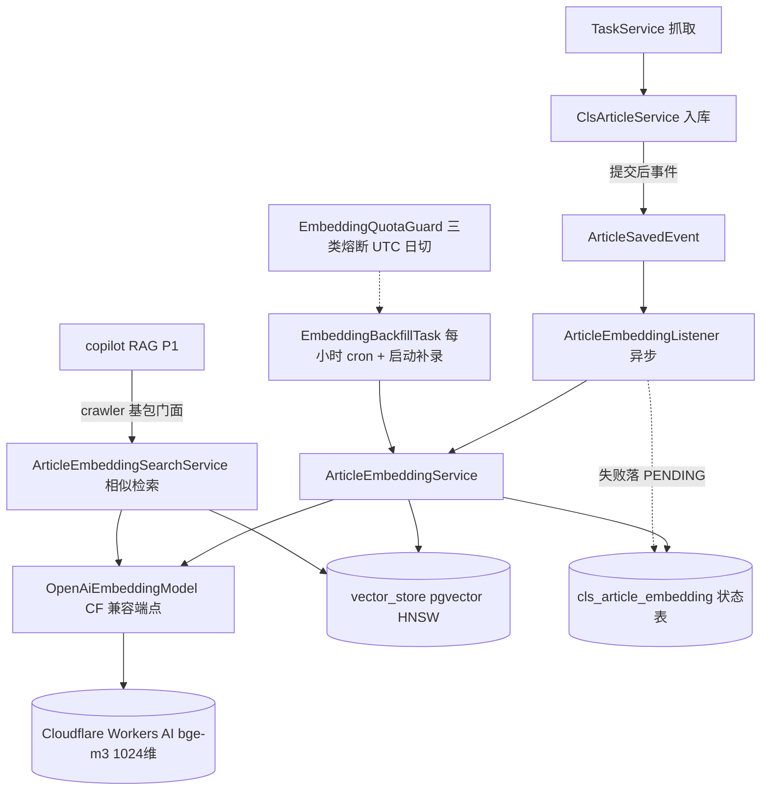

# cls_article 向量化（语义检索基座）· 后端设计文档

> 版本：v1.4（2026-09-09，远程库 DDL 部署 + 小批量试点实证见附录 A.3）
> 范围：crawler 域 embedding 子包——cls_article 全量向量化管道（存量回填 + 增量）、pgvector 存储、Cloudflare Workers AI 配额治理与熔断；相似检索 service 能力随 P0 就绪，消费场景（copilot RAG）为 P1 待定。
> 关联：`docs/copilot-design.md`（P1 消费方先例）、`postgres/schema.sql`（表结构落点）
> 状态：P0 已实现（2026-09-09 编码完成，全量回归 297 测试 0 失败；存量回填待生产库开闸）

---

## 0. 决策记录

| # | 决策点 | 结论 | 关键理由 | 放弃的备选 |
|---|---|---|---|---|
| D1 | 向量存储 | PostgreSQL + pgvector 0.8.6 | 容器镜像 `pgvector/pgvector:pg16` 已内置（仅差 `CREATE EXTENSION`）；单栈零新增运维；50 万×1024 维 HNSW 单查 <10ms 量级 | 独立向量库（Qdrant/Milvus，该规模属过度设计） |
| D2 | 向量接入框架 | Spring AI 2.0.1 `PgVectorStore`（父 POM BOM 已锁 2.0.1） | 标准实现优先（硬性约定 §十三）；schema/索引/相似度检索由框架托管 | 自建 embedding 列 + native SQL（可控但非标准，吃不到官方修复） |
| D3 | Embedding 模型 | BAAI **bge-m3**（dense **1024** 维） | 多语 + 中文检索强；8192 token 上下文完整覆盖最长电报（1100 字）零截断；CF 同价最廉档（$0.012/M input tokens） | bge-large-zh-v1.5（512 token 上限，长文截断）；gemini-embedding-001（另一语义空间，与 bge 混库不可比） |
| D4 | 推理运行时 | **全量 Cloudflare Workers AI**（存量与增量同渠道） | 单模型 + 单运行时 → 语义空间唯一，无跨运行时一致性门禁；免本地 GPU（1050 Ti 不参与）；免费额度内完成全量回填 | 本地 Ollama 回填 + CF 增量（需跨运行时一致性校验门禁 + 本地环境依赖）；Gemini（不同模型空间，混库硬伤） |
| D5 | 接入端点 | CF **OpenAI 兼容端点** `/ai/v1/embeddings` | 已实测通过（附录 A.1）：1024 维、L2 已归一化；直接复用 classpath 现有 `OpenAiEmbeddingModel`，**零自定义适配器** | 原生 `/ai/run/@cf/baai/bge-m3`（需手写 EmbeddingModel 实现） |
| D6 | 状态管理 | 独立状态表 `cls_article_embedding`，**三态**（PENDING/DONE/FAILED，P1 追加 FAILED 终态见 §9.3）+ content_hash + fail_count | 状态即游标（断点续传零额外状态文件）；model 列为换模型留记录；hash 支撑内容变更重嵌；主表零污染；FAILED 终态防毒丸文章反复空耗 | cls_article 加 embedding_status 列（域污染）；三态含「处理中」（崩溃卡死态需重置逻辑，单线程 + 幂等下无收益） |
| D7 | 额度策略 | 免费档 10,000 Neurons/天 + 三类熔断 + 每小时对账 + **日上限不跑满**（预留余量） | 回填日上限 6 万条 ≈ 日额度 75%~84%（计价校准后修订，§9.3 C2），全量回填约 8.5 天零成本；余量保增量、查询向量化与估算偏差；付费兜底仅 ~$1.5（附录 B.1） | 本地回填（无可用 GPU）；直接付费一次刷完（保留为应急选项） |
| D8 | 领域归属 | crawler 域 `embedding` 子包；检索门面 P1 时提升至 crawler 基包 | 数据主权在 crawler；跨域仅暴露基包类型（Modulith 红线，ModulithVerifyTest 守护） | 独立顶层 embedding 域（当前无第二数据源诉求） |
| D9 | native 隔离 | `embedding.enabled` 总开关，不配置即整体不装配 | native 变体无需向量能力；AOT 风险面不扩大 | — |

**历史决策脉络**（评审过程存档）：最初评估「存量 Ollama bge-large-zh-v1.5 + 增量 Gemini」→ 发现**不同模型向量空间不可混库**（同维度 ≠ 同坐标系）→ 改为「本地 Ollama bge-m3 + CF bge-m3」同模型双运行时 → 最终收敛为**全量 CF**（消除跨运行时一致性门禁，架构最简）。

---

## 1. 背景与目标

### 1.1 数据画像（2026-09-08 实测）

| 指标 | 值 | 设计含义 |
|---|---|---|
| 存量 | **50 万条**（真实生产库；本地开发库为 1099 条 / 6 天样本） | 回填是长周期任务 → 断点续传与额度治理为一级设计目标 |
| 日增 | 200~300 条 | 增量实时嵌入，消耗 <1% 免费额度（§5） |
| content 长度 | 均值 157 字 / 中位 125 / p90 319 / max 1100 | 单条成向量**无分块**；bge-m3 8192 上下文零截断 |
| title / brief 覆盖 | 100% | 空内容降级输入始终可用 |
| 空 content | 样本 24/1099（≈2%） | 输入降级规则：content 缺失 → title + brief（§4.3） |
| level 分布 | C≈91%、B≈9%（样本） | metadata 随向量落库，P1 可做重要级过滤 |

### 1.2 目标

- **P0（本文档范围）**：向量化基础设施——存量 50 万回填（免费额度内自动推进）、增量事件驱动嵌入、相似检索 service 能力、状态可观测与自愈
- **P1**：消费场景接入（copilot RAG 为默认候选，场景细化后另立文档）

### 1.3 非目标

- 分块（chunking）：电报为短讯形态，单条成向量（这是本方案复杂度骤降的关键前提）
- 图片 / 音频向量化（`images` / `audio_url` 仅存链接，不入向量）
- 多模型向量空间并存（D3/D4 锁定单一空间，换模型 = 全量重嵌，见 R9）
- 检索 API 的 Controller 暴露（场景未定，P0 只交付 service 层能力）

---

## 2. 总体架构



### 2.1 组件清单

| 组件 | 落点 | 职责 |
|---|---|---|
| `EmbeddingProperties` | embedding/config | `embedding.*` 配置绑定 |
| `EmbeddingConfig` | embedding/config | `OpenAiEmbeddingModel` + `PgVectorStore` Bean 装配；`@EnableAsync`；`@ConditionalOnProperty` 总开关 |
| `ArticleEmbeddingService` | embedding/service | 输入规整、sha256 指纹、嵌入调用、向量落库、状态 upsert（事务内成对写入） |
| `EmbeddingQuotaGuard` | embedding/service | 每日额度熔断（内存态）、UTC 日切、致命错误标志 |
| `EmbeddingBackfillTask` | task | 每小时 cron + 启动补录触发；游标推进；批间节流 |
| `ArticleEmbeddingListener` | embedding | `@TransactionalEventListener(AFTER_COMMIT)` + `@Async` |
| `ArticleSavedEvent` | event | 事件载体（articleId, ctime） |
| `ClsArticleEmbedding` + Repository | embedding/entity · repository | 状态表访问（含游标查询） |
| `ArticleEmbeddingSearchService` | embedding/service | `similaritySearch` 封装（P0 能力层） |
| `ArticleSearchFacade` | crawler 基包（**P1**） | 跨域检索门面，copilot 唯一入口 |

---

## 3. 数据模型

### 3.1 vector_store（Spring AI 托管）

- 由 `PgVectorStore` 的 initialize-schema 自动建表 + 建 HNSW(cosine) 索引，**不手写 DDL**
- 参考结构：`uuid uuid PK default gen_random_uuid()`、`content text`、`metadata json`、`embedding vector(1024)`（字段类型/索引参数以 Spring AI 2.0.1 实际 schema 为准，见 §7.3 实证清单）
- `content` 列复制文章正文（50 万 × ~160 字 ≈ 80MB，可接受）；业务键入 metadata：`articleId`、`ctime`、`level`、`model`
- 可选优化：50 万灌完后 DROP 并重建 HNSW 索引一次，优化图质量（pgvector 官方建议 bulk load 后建索引）

### 3.2 cls_article_embedding 状态表（入 postgres/schema.sql）

```sql
CREATE TABLE if not exists public.cls_article_embedding (
	article_id int8 NOT NULL,
	status varchar(10) DEFAULT 'PENDING' NOT NULL,
	fail_count int4 DEFAULT 0 NOT NULL,
	model varchar(64) DEFAULT '@cf/baai/bge-m3' NOT NULL,
	content_hash varchar(64) NULL,
	error varchar(500) NULL,
	embedded_at timestamptz NULL,
	created_at timestamp DEFAULT CURRENT_TIMESTAMP NULL,
	updated_at timestamp DEFAULT CURRENT_TIMESTAMP NULL,
	CONSTRAINT cls_article_embedding_pkey PRIMARY KEY (article_id)
);

CREATE INDEX if not exists idx_cae_status ON public.cls_article_embedding USING btree (status);
```

- 与现库惯例一致：不建物理外键（引用完整性由应用层保证，同 `cls_article_stock`）
- 三态语义（P1 修订）：**不存在行 或 PENDING = 未处理**；**DONE = 已生成**；**FAILED = 永久失败终态**（fail_count 达上限后游标不再捞起，需人工介入）；「处理中」仅为内存游标，不落库
- `model`：留档当前向量由哪个模型生成，支撑将来换模型时的全量重嵌账务（R9）
- `content_hash`：输入文本 sha256 hex，防御性支撑正文变更重嵌

### 3.3 Entity 映射要点（遵循 cls-article-patterns）

- `ClsArticleEmbedding`：Lombok 三件套；`@Id` **无** `@GeneratedValue`（外部 ID = article_id 手动写入）；无 `@ManyToOne`（`Long articleId` 平铺）
- `model` / `status` 用 `@Builder.Default` 给默认值；`createdAt` `@CreationTimestamp`、`updatedAt` `@UpdateTimestamp`
- 状态枚举 `EmbeddingStatus { PENDING, DONE, FAILED }`，持久化为 varchar(10)；`failCount` `@Builder.Default Integer 0`，仅永久类失败计次，DONE 成功时清零

---

## 4. 核心设计

### 4.1 EmbeddingModel 装配（D5）

```java
// 设计意图示意；builder 签名以 2.0.1 sources 实证为准（§7.3 S1）
@Bean
@ConditionalOnProperty(prefix = "embedding", name = "enabled", havingValue = "true")
public OpenAiEmbeddingModel embeddingModel(EmbeddingProperties props) {
    var api = OpenAiApi.builder()
            .baseUrl(props.baseUrl())          // https://api.cloudflare.com/client/v4/accounts/<accountId>/ai/v1
            .apiKey(props.apiToken())          // Bearer，环境变量注入
            .build();
    return OpenAiEmbeddingModel.builder()
            .openAiApi(api)
            .defaultOptions(OpenAiEmbeddingOptions.builder()
                    .model("@cf/baai/bge-m3")
                    .build())
            .build();
}
```

- 与 `DeepSeekConfig` 手动装配同法；`spring.ai.openai.*` 自动装配因无 api-key 配置而退避，互不干扰
- CF OpenAI 兼容端点已实测可用（附录 A.1）；`usage` 字段缺省（None）对 Spring AI 解析的兼容性列入实证清单 S5

### 4.2 PgVectorStore 装配（D2）

- 新依赖：`spring-ai-starter-vector-store-pgvector`（BOM 2.0.1 管理，本地 m2 未缓存需拉取；Ollama starter **不再需要**）
- 关键参数：dimensions=1024、distance=COSINE、index 类型=HNSW、initialize-schema=true、schema=public
- 装配方式二选一，实现时以 2.0.1 自动装配行为定（倾向属性化）：
  a) starter 自动装配 + `spring.ai.vectorstore.pgvector.*` 属性；
  b) 手动 `PgVectorStore.builder(jdbcTemplate, embeddingModel, ...)`（与 §4.1 同 Bean 集）

### 4.3 输入规整与指纹（实现后修订：确定性 UUID 替代删除重加）

- 输入文本 = content 非空 ? content :（title + '\n' + brief）；title 已内嵌于 content 的【标题】前缀，不重复拼接
- bge-m3 检索无指令前缀要求，查询与文档同空间，无需 prompt 前缀
- `content_hash` = sha256 hex(输入文本)；DONE 且 hash 未变 → 跳过；hash 变化 → 置 PENDING 重嵌（当前爬虫只插不改，此为防御性设计）
- **重嵌幂等（实现修订，S4 后）**：不采用「按 filter 删除旧行再 add」，改为向量主键 = 确定性 UUID（`UUID.nameUUIDFromBytes("cls-article:" + articleId)`），PgVectorStore 落库为 `ON CONFLICT (id) DO UPDATE`（insertOrUpdateBatch 实证）→ 重嵌覆盖旧向量，不产生重复行；冒烟测试已验证

### 4.4 存量回填管道（实现时经 S3/S5 实证后修订，已按修订版落地）

- **游标即状态（P1 修订：ctime 降序 + boundary 快照）**：取批查询 = `cls_article a LEFT JOIN 状态表 WHERE (无行 OR PENDING) AND a.ctime <= boundary ORDER BY a.ctime DESC LIMIT batch`——**最新数据优先**（最新电报可先被检索到，历史重要性低）；boundary 取本轮启动时刻快照（秒级），运行中新落库的增量不混入本轮，本轮范围确定、跑完自动退出；FAILED 终态不进游标（反连接 native `@Query`，skill「不写 @Query 除非必要」的例外点）
- **单批流程（修订版，S3 实证后）**：原设计「一次请求 64 条输入、事务外嵌入」不可行 —— `PgVectorStore.add()` 内部即调 embeddingModel（S3）。**实现改为逐篇嵌入**：每篇一个 TransactionTemplate 事务包裹 `store.add(1 doc)` + 状态 upsert DONE，同批原子；逐篇而非攒批的理由：① 毒丸文章不阻塞游标（单条 400 只自损不改批，留 PENDING 继续）② 与增量监听共用同一 Service 路径 ③ 实测逐篇延迟 ~400ms，日上限 3 万条仅需 ~2.5h/日，吞吐非瓶颈
- **节流**：批间 sleep 300ms（batch-interval-ms 可配）
- **触发源**：① `ApplicationReadyEvent` 延迟 15s（虚拟线程 sleep，异常不外溢）② cron 每小时（`@Scheduled(zone = "UTC")`）；单飞守卫 AtomicBoolean 防重叠
- **单次运行上限**：`daily-max-articles`（默认 60000，计价校准后修订，§9.3 C2）保险丝——**日消耗不跑满额度（约 75%~84%）**：到达即退出，下小时续。该上限仅约束回填 Task，增量监听不占此计数器
- **Day-1 校准**：日志输出当日实际处理条数与退出原因（CAUGHT_UP/MAX_REACHED/QUOTA_EXHAUSTED/TRANSIENT_FAIL/FATAL）
- **完成通知（P1 新增，§9.3 C5）**：本轮启动时存量尚未全量完成、结束后达到全量完成（DONE + FAILED ≥ 总数）→ 发布 `EmbeddingBackfillCompletedEvent`，auth 域邮件监听器发一封完成通知；`EMBEDDING_NOTIFY_EMAIL` 未配置静默跳过；进程生命周期内最多一次

### 4.5 增量管道

- **发布点**：`ClsArticleService.saveArticleWithRelations` 仅在 `saveIfNotExists` 返回 true 后发布事件（**唯一侵入点，一行**）
- **监听**：`@TransactionalEventListener(phase = AFTER_COMMIT)` 保证仅在事务提交后触发（不会嵌入未提交数据，不占 DB 事务时长）；`@Async` 异步执行
- **失败**：catch-all → upsert PENDING + error 摘要 + `log.warn`；绝不向主链路传播（爬虫入库不受任何影响）
- **吞吐**：日增 250 条 → 逐篇嵌入约 250 次调用/天，实时性高、实现简单；P0 取逐篇，不攒批

### 4.6 对账与自愈（与 §4.4 同一 Task）

- 每小时任务统一扫 PENDING（含增量失败件 + 上小时熔断余量），`QuotaGuard` 放行才执行
- 自愈时效：增量失败件 ≤ 1h 修复（额度充足时）；存量停机期间数据与存量回填共享同管道

### 4.7 检索能力（P0 service 层）

```java
// ArticleEmbeddingSearchService
public List<ArticleSearchResult> similaritySearch(String query, int topK, double threshold) {
    // 1. query 经同一 EmbeddingModel 嵌入（向量空间唯一，D4）
    // 2. vectorStore.similaritySearch(SearchRequest.query(query)
    //        .topK(topK).similarityThreshold(threshold))
    // 3. metadata.articleId 批量回查 ClsArticle 组装 DTO
}
```

- 返回 DTO：`articleId, score, title, brief, level, ctime`（`@Data @Builder` 三件套）
- P1 场景接入时提升 `ArticleSearchFacade` 至 crawler 基包（Modulith 红线），copilot 仅依赖基包类型

---

## 5. 配额与成本模型

### 5.1 官方参数（附录 B.1）

| 参数 | 值 |
|---|---|
| bge-m3 单价 | **1075 Neurons / M input tokens**（$0.012/M） |
| 免费额度 | **10,000 Neurons / 天**，00:00 UTC 重置，超额报错 |
| 每日免费 token 预算 | ≈ 9.3M tokens |

### 5.2 推算与工期

| 场景 | 估算 | 说明 |
|---|---|---|
| 单条 token | ~115（0.727 token/字 Ollama tokenizer 实测 × 157 字均长，Day-1 再校准） | CF XLM-R 与本地 tokenizer 有口径差，以 CF Dashboard 实际 Neurons 为准 |
| 存量日容量 | **约 7.4万~8.4万 条/天**（60000 条 ≈ 7,400~8,400 Neurons） | 计价校准（B.1 = 1075 Neurons/M）后上修；最初 3.0~4.6 万按 1.2~2 token/字 高估 |
| 回填日上限 | **60,000 条/天**（`daily-max-articles`） | **不跑满**：占日额度 75%~84%，余量留给增量 / 查询向量化 / 估算偏差 |
| 50 万全量工期 | **约 8 天**（试点实测库 48.3 万条 ÷ 60,000/天；A.3） | 按日上限封顶推进；每小时任务 + 熔断自停，全自动 |
| 增量消耗 | ~70 Neurons/天（<1% 额度） | 零成本结论不受影响 |
| 付费兜底 | 全量 ≈ 125M tokens ≈ **$1.5** | 应急压缩到 1~2 天的保险丝，非必选 |

### 5.3 治理机制

- **预留余量原则（D7）**：回填日消耗封顶于 `daily-max-articles`（默认 60000 ≈ 日额度 75%~84%），**不跑满免费额度**。余量用途：① 增量嵌入永享额度（~70 Neurons/天）；② 聊天查询向量化不被回填连坐 429；③ Day-1 估算偏差缓冲；④ 人工检索 / 冒烟测试试探调用
- 计数器边界：daily-max 仅约束回填 Task；增量监听不占该计数器（真实 429 熔断对两者同样生效）
- Day-1 校准后修正：以 CF Dashboard 实际 Neurons/条 反推日容量 → 修正 daily-max（建议保持 ≥15% 余量）→ 同步修正工期
- 用量观测：CF Dashboard Neuron 台账（人工周检即可，不建监控）

---

## 6. 错误处理与可靠性

### 6.1 三类熔断（EmbeddingQuotaGuard）

| 类别 | 识别 | 动作 | 恢复 |
|---|---|---|---|
| 配额类 | HTTP 429 / 官方「usage limit exceeded」响应体 | 置位 exhaustedUntil = 次日 00:00 UTC（内存态）；当次任务立即退出 | guard 放行自动续跑 |
| 瞬时类 | 超时 / 5xx / 连接拒绝 | 批级退避重试 ×3（300ms → 1s → 3s）；仍败 → 当次退出 | 下小时任务续跑 |
| 致命类 | 401/403（token 失效）、400（参数错误） | `log.error` + 置 fatal 标志，停止所有任务；401/403 单篇按永久类失败处理（P1 接线，见下） | 人工修复配置后重启 |

- 注：429 的实际响应形态未实测（附录 A.2 开放项），上线首日按真实响应固化识别规则
- 配额类是共享池：预留余量原则（§5.3）下稳态增量不应触达 429；万一触达（估算偏差 / 异常消耗），失败件自然落入 PENDING 由对账自愈，**不做重试风暴**
- guard 为内存态：进程重启丢失无妨（重启后首个 429 重新置位，最多浪费一次试探调用）
- **FAILED 终态（P1 新增，§9.3 C3/C4）**：永久类失败（含 401/403）单篇计 `fail_count`，达 `max-fail-attempts`（默认 5）落 FAILED 不再进游标——防毒丸文章反复空耗额度；DONE 成功时 fail_count 清零

### 6.2 幂等与一致性矩阵

| 故障点 | 后果 | 保证 |
|---|---|---|
| CF 调用成功、事务前崩溃 | 无落库 | 下轮整批重嵌（重复消耗 ≤ 1 批额度，可忽略） |
| 事务内（add 成功、状态未落） | 无（同事务回滚） | 批次原子性（JdbcTemplate 参与外部事务，实证 S3） |
| 历史遗留重复向量行 | 检索重复命中 | 上线一次性 dedupe 巡检 SQL（metadata 按 articleId 分组 count>1）；事务设计杜绝新增 |
| DONE 但 content_hash 变化 | 旧向量残留 | 确定性 UUID upsert 覆盖（§4.3 实现修订），无重复行 |
| CF 429 / 停机 | 当次退出 | 状态即游标，下小时/次日续 |
| 增量监听异常 | 无向量 | PENDING + 对账自愈；主链路零影响 |

### 6.3 可观测性

- 关键日志：批号/条数/耗时、当日累计、退出原因（QUOTA_EXHAUSTED / MAX_REACHED / TRANSIENT_FAIL / FATAL）、回填进度（DONE 计数 / 总数）
- 日志红线：只记 articleId/批次/条数/错误摘要；禁打向量值与正文（§8.4）

---

## 7. 配置设计

### 7.1 配置键（application.yml）

```yaml
embedding:
  enabled: true                        # native 变体不配置 → 整体关闭（D9）
  cloudflare:
    account-id: ${CLOUDFLARE_ACCOUNT_ID:}
    api-token: ${CLOUDFLARE_API_TOKEN:}   # 口令不落库，同 POSTGRES_PASS 模式
    model: '@cf/baai/bge-m3'
    dimensions: 1024
  batch-size: 64
  batch-interval-ms: 300
  daily-max-articles: 60000            # 不跑满：≈日额度 75%~84%，余量留增量/查询向量化/偏差（§5.3）
  max-fail-attempts: 5                 # 永久类失败计次上限，达上限落 FAILED 终态（§6.1）
  backfill:
    startup-delay: 15s
    cron: '0 5 * * * *'                # 每小时；@Scheduled zone 显式 UTC
  report:
    enabled: true                      # 统计报告邮件（收件人复用 EMBEDDING_NOTIFY_EMAIL，未配置静默）
    interval-days: 3                   # 发送间隔：每日 cron 检查点比对上次发送，满间隔才发（§9.3 C7）
    cron: '0 0 1 * * *'                # 每日检查点（UTC 01:00 = 北京 09:00）
  search:
    default-top-k: 10
    default-threshold: 0.5             # cosine 阈值，P1 场景联调时校准
```

- `enabled=true` 但 account-id/api-token 缺失时：不装配 Bean + 启动 WARN 日志（避免半配置状态抖动）

### 7.2 环境变量

| 变量 | 用途 | 要求 |
|---|---|---|
| `CLOUDFLARE_ACCOUNT_ID` | 拼接 base-url | CF Dashboard 获取 |
| `CLOUDFLARE_API_TOKEN` | Bearer 认证 | **须为轮换后的新 token**（§8.1）；最小权限：仅 Workers AI Edit |
| `EMBEDDING_NOTIFY_EMAIL` | 完成通知 + 统计报告共用收件邮箱 | 可选；未配置时两类邮件均静默跳过（不影响任务）；SMTP 发件复用 auth 域 MailService 既有配置 |
| `SMTP_SSL` | JavaMail `mail.smtp.ssl.enable`（465 隐式 SSL 直连） | 可选，默认 false（现行为零变化）；用 465 发件时置 true 且 `SMTP_STARTTLS=false`，与 starttls 互斥使用 |
| `SMTP_STARTTLS` | JavaMail `mail.smtp.starttls.enable`（587 STARTTLS 模式） | 可选，默认 true（原硬编码值参数化）；仅 465 SSL 模式下才需置 false |

**发件通道选型实测（2026-09-09，curl 直连验证）**：

- Outlook 个人邮箱 `smtp-mail.outlook.com:587`：连接/TLS 正常，但 LOGIN 认证被 **`535 5.7.139 basic authentication is disabled`** 策略级拒绝（应用密码路径同样被堵）——`JavaMailSender` 标准能力仅基础认证，无解，弃用
- 新浪邮箱 `smtp.sina.com:465`（隐式 SSL）：`AUTH LOGIN` + 授权密码实测通过（`235 OK Authenticated` → `250 ok queue id ...`）；**587 为明文端口且无 STARTTLS，禁止使用**。发件用新浪（授权密码），收件不受影响可继续 Outlook
- 配置组合：`SMTP_HOST=smtp.sina.com` + `SMTP_PORT=465` + `SMTP_SSL=true` + `SMTP_STARTTLS=false`；`MAIL_FROM` 必须等于 `SMTP_USERNAME`（新浪校验 From=认证账号）

### 7.3 实证清单结论（2026-09-09 完成回填）

| # | 待实证 | 结论 |
|---|---|---|
| S1 | `OpenAiApi` / `OpenAiEmbeddingModel` builder 签名（2.0.1） | 2.0.1 已删 `OpenAiApi`；`OpenAiEmbeddingModel.builder().openAiClient(client).options(...)`；`OpenAiEmbeddingOptions` 支持 model/dimensions/timeout/maxRetries；**`DEFAULT_MAX_RETRIES=3` 必须显式 `maxRetries(0)`** |
| S2 | pgvector starter 属性与装配 | 支持自动装配或手动 builder 二选一；实现取手动 `PgVectorStore.builder(jdbcTemplate, embeddingModel)`（方法名：`vectorTableName`/`dimensions`/`distanceType`/`indexType`/`initializeSchema`） |
| S3 | `PgVectorStore` 的 JdbcTemplate 是否参与外层事务 | **参与**（JdbcTemplate batchUpdate 同 DataSource 同事务）；**但 `store.add()` 内部即调 embeddingModel（网络 IO 在事务内），设计 §4.4「事务外嵌入」不可行 → 改为 TransactionTemplate 包裹 add+状态 upsert 的同批原子语义** |
| S4 | `delete(Filter)` 语义 | 存在（`doDelete(Filter.Expression)` → SQL WHERE 删除）；**本实现未用**：确定性 UUID + `ON CONFLICT (id) DO UPDATE`（insertOrUpdateBatch 实证）使重嵌幂等覆盖，无需删除重加 |
| S5 | `/ai/v1/embeddings` 无 usage 字段时 Spring AI 解析兼容性 | **不兼容（阻断）**：openai-java 4.49.0 `CreateEmbeddingResponse.usage()` 为 `getRequired("usage")`，字段缺失必抛 `OpenAIInvalidDataException`；已实调确认 CF 响应仅 `object/data/model` 三键 → 采用 **Option A 垫片**（`CfUsageFixingClient` 装饰 OpenAIClient，拦截 embeddings() 对缺失 usage 回填合成 Usage(0,0)），实调 5 条冒烟通过 |

补充实证（Option A 配套）：

- `OpenAiSetup.setupSyncClient(...)` 为 spring-ai-openai 2.0.1 **public static**（与框架内部同路径构建 client），`detectModelProvider` 对自定义 baseUrl 回退 `OPEN_AI` 并原样使用
- 429 映射：openai-java 直接抛 `com.openai.errors.RateLimitException`（statusCode()=429，经 OpenAiEmbeddingModel 原样透传，无包装）→ 熊断分类按 com.openai.errors.* 类型判定
- `initializeSchema(true)` 自动执行 `CREATE EXTENSION IF NOT EXISTS vector/hstore/uuid-ossp` + 建表 `embedding vector(1024)` + HNSW(cosine) 索引
- CF 兼容端点接受 `dimensions: 1024` 参数（实测正常返回）
- 本地库冒烟：5 条实调全通过（DONE + sha256 + vector_store 单行），同文重嵌幂等；冒烟数据已清理

---

## 8. 安全与隐私

### 8.1 Token 事件与轮换（已发生，最高优先级）

- 2026-09-08 评估期间，CF API Token 与 Account ID 以明文出现在会话与 shell 历史中 → **须立即在 CF Dashboard 撤销并重建**，新 token 仅经 `CLOUDFLARE_API_TOKEN` 环境变量注入；git / 文档 / 日志不得出现字面量

### 8.2 最小权限

- 专用 token：仅 Workers AI Edit 权限，不与其它产品/页面权限复用

### 8.3 数据出域声明

- 全量 50 万条电报正文将发送至 Cloudflare 推理节点——已确认接受；电报为公开资讯，无个人敏感数据
- 如后续引入用户私有内容（如聊天记录、密文同步内容）向量化，须重审本节

### 8.4 日志红线

- 日志只记 articleId / 批次 / 条数 / 错误摘要；禁打向量值与正文

---

## 9. Modulith 归属与代码落点

### 9.1 文件清单（相对 `stock-calculator-main/src/main/java/com/zzh/stock_calculator/crawler/`）

| 动作 | 路径 | 职责 |
|---|---|---|
| 新增 | embedding/config/EmbeddingProperties.java | 配置绑定 |
| 新增 | embedding/config/EmbeddingEnabledCondition.java | enabled + 凭据三重条件装配 |
| 新增 | embedding/config/CfUsageFixingClient.java | Option A 垫片：装饰 OpenAIClient 修 CF 响应缺 usage（S5 实证结论，用户拍板 2026-09-08） |
| 新增 | embedding/config/EmbeddingConfig.java | Bean 装配（OpenAiSetup+垫片→OpenAiEmbeddingModel；PgVectorStore；QuotaGuard） |
| 新增 | embedding/entity/ClsArticleEmbedding.java | 状态表实体 |
| 新增 | embedding/entity/EmbeddingStatus.java | 三态枚举（PENDING/DONE/FAILED） |
| 新增 | embedding/repository/ClsArticleEmbeddingRepository.java | 状态访问 + 游标查询 |
| 新增 | embedding/service/ArticleEmbeddingService.java | 规整/嵌入/落库/状态成对写入（TransactionTemplate）+ 失败计次/终态（P1） |
| 新增 | embedding/service/EmbeddingQuotaGuard.java | 三类熊断 + UTC 日切 |
| 新增 | embedding/service/EmbeddingErrorClassifier.java | openai-java 异常三分类 |
| 新增 | embedding/service/ArticleEmbeddingSearchService.java | 相似检索（P0） |
| 新增 | embedding/dto/ArticleEmbeddingHit.java | 检索命中 DTO |
| 新增 | embedding/ArticleEmbeddingListener.java | AFTER_COMMIT + Async 监听 |
| 新增 | event/ArticleSavedEvent.java | 事件载体 |
| 新增 | task/EmbeddingBackfillTask.java | 定时 + 启动触发批处理；boundary 快照 + DESC 游标 + 完成事件发布（P1） |
| 新增 | EmbeddingBackfillCompletedEvent.java（crawler **基包**） | 回填完成事件（Modulith 严格规则：跨模块事件必须落基包，§9.3 C6） |
| 新增 | EmbeddingStatsReportEvent.java（crawler **基包**） | 统计报告事件：窗口/新增/处理量/完成标志（§9.3 C7） |
| 新增 | task/EmbeddingStatsReportTask.java | 周期统计报告 Task：每日检查点 + 满间隔发送，存量完成后仅报增量 |
| 修改 | service/ClsArticleService.java | 保存成功后发布事件（唯一侵入点，一行） |
| 修改 | postgres/schema.sql（仓库根） | cls_article_embedding DDL（含 fail_count + 幂等 ALTER）+ CREATE EXTENSION vector |
| 新增 | auth/service/EmbeddingBackfillMailListener.java（auth 域） | 回填完成事件 → 邮件通知（ObjectProvider 兕底条件 Bean；EMBEDDING_NOTIFY_EMAIL 门控） |
| 新增 | auth/service/EmbeddingStatsMailListener.java（auth 域） | 统计报告事件 → 邮件渲染发送（进行中完整模板 / 完成后仅增量模板） |
| 修改 | auth/service/MailService.java | 抽 requireSender/buildMessage + 新增 sendText(to, subject, text) |
| 修改 | application.yml | embedding.* 配置 |
| 新增 | test/…/crawler/embedding/… | 单测（QuotaGuard/异常分类/失败终态/回填 Task）+ CfEmbeddingSmokeLiveTest（实调冒烟，凭据缺失自动跳过） |
| 新增 | test/…/auth/service/EmbeddingBackfillMailListenerTest.java | 完成邮件监听器单测（事件门控/邮箱门控/发送失败吞掉） |
| 新增 | test/…/crawler/task/EmbeddingStatsReportTaskTest.java | 统计 Task 单测（间隔判定/开关/窗口对齐/完成标志） |
| 新增 | test/…/auth/service/EmbeddingStatsMailListenerTest.java | 统计邮件单测（邮箱门控/两套模板/发送失败吞掉） |

### 9.2 边界守护

- 新增代码全部位于 crawler 域内，无跨域引用 → `ModulithVerifyTest` 零新增风险
- P1 门面上基包（`ArticleSearchFacade`）时单独评审：copilot 仅可依赖 crawler 基包类型
- 登记：`stock-calculator-feature-index` 的 crawler 行子包列表需补 `embedding`

### 9.3 P1 变更记录（2026-09-09，用户拍板后落地）

| # | 变更 | 动机 |
|---|---|---|
| C1 | 游标改 **ctime 降序 + boundary 快照**（本轮启动时刻，秒级） | 最新电报优先可查（历史重要性低）；快照防运行中新数据混入本轮，范围确定、跑完自动退出 |
| C2 | `daily-max-articles` 30000 → **60000** | 计价校准：bge-m3 = 1075 Neurons/M，Ollama tokenizer 实测 ~0.727 token/字 → 60000 条 ≈ 75%~84% 日额度；50 万工期 17 天 → ~8.5 天 |
| C3 | 状态表新增 **FAILED 终态 + fail_count**（schema.sql 已含幂等 ALTER） | 永久类失败计次达 `max-fail-attempts`（默认 5）落终态，防毒丸文章反复空耗额度；DONE 时清零 |
| C4 | 401/403 **fatal 接线**：单篇按永久类失败处理 + 当轮 FATAL 退出 | token 失效时停止无意义重试 |
| C5 | **完成邮件通知**：`EmbeddingBackfillCompletedEvent`（crawler 基包）→ auth 域 `EmbeddingBackfillMailListener` | 存量跑完（DONE+FAILED ≥ 总数）邮件提示；`EMBEDDING_NOTIFY_EMAIL` 未配置静默跳过；进程生命周期一次 |
| C6 | Modulith 事件落 **crawler 基包**（非 event 子包） | ModulithVerifyTest 严格 verify() 只放行基包类型跨模块引用 |
| C7 | **周期统计报告**（用户需求）：每 interval-days（默认 3 天）一份邮件，统计新增数据量（按 ctime）+ 存量处理量（按 embedded_at）；存量全量完成后自动切「仅增量」模板 | 每日 UTC 01:00 检查点比对上次发送 epoch day，满间隔才发（间隔严格、不受月份长度影响；内存态重启顺延不轰炸）；统计在 crawler 域完成后发布基包事件，auth 侧渲染发送；收件人复用 EMBEDDING_NOTIFY_EMAIL。口径说明：cls_article 无独立入库时间戳（created_at 为 to_timestamp(ctime) 生成列），新增按 ctime（爬虫近实时入库 ctime ≈ 入库时间） |

---

## 10. 分期计划

| 阶段 | 内容 | 预估 |
|---|---|---|
| P0-1 | 实证清单 S1~S5 + 依赖引入 + Bean 装配 + DDL | 0.5 天 |
| P0-2 | 状态表 + 回填 Task（三类熔断 / 断点续传 / UTC 日切） | 0.5 天 |
| P0-3 | 增量事件 + 监听 + 检索 service + 单测 | 0.5 天 |
| P0-4 | 5 条实调冒烟 → 开闸回填 → Day-1 校准 | 试点已完成（2026-09-09，32 条全链路验证，附录 A.3）；剩正式开闸 + Day-1 校准，观察期约 8 天 |
| P1 | copilot RAG 接入（场景细化后另立文档） | 0.5~1 天 |

---

## 11. 验证清单

| # | 验证项 | 命令 / 步骤 |
|---|---|---|
| V1 | 编译 | `./mvnw compile` |
| V2 | 全量测试（含 ModulithVerifyTest） | `./mvnw test '-Dtest=!TaskServiceTest' '-DfailIfNoTests=false'`（需 POSTGRES_PASS） |
| V3 | CF 连通冒烟 | ✅ 2026-09-09 远程库试点覆盖：实调 32 篇均 dim=1024（附录 A.3）；语义检索 sanity（如「固态电池」命中相关电报）留 P1 场景联调一并验证 |
| V4 | 幂等验证 | 同批重跑两次 → vector_store 行数不增（S3 原子性 + 确定性 UUID upsert 生效） |
| V5 | 熔断验证 | mock 429 / 500 / 401 三分支单测 |
| V6 | native 隔离 | `embedding.enabled` 缺省 → Bean 不装配 → contextLoads 通过；native 构建不受影响 |
| V7 | Day-1 校准 | 记录当日实际处理条数与退出原因，回填 §5.2 工期预估 |
| V8 | 完成邮件 | 配置 `EMBEDDING_NOTIFY_EMAIL` 后，存量回填全量完成时收到一封通知（§4.4 / §9.3 C5） |
| V9 | 统计报告 | 配置 `EMBEDDING_NOTIFY_EMAIL` 后，每 3 天收到一份统计邮件；存量完成后模板自动切「仅增量」（§9.3 C7） |

---

## 12. 风险与开放问题

| # | 风险 / 问题 | 影响 | 缓解 |
|---|---|---|---|
| R1 | CF 免费额度政策调整 | 回填中断 | ~$1.5 付费兑底；D5 端点抽象可换 provider |
| R2 | XLM-R token 效率偏差 | 工期偏差 | Day-1 校准 + daily-max 保险丝 |
| R3 | 429 响应形态未实测 | 熔断误判 | 上线首日固化识别规则；三类熔断互不遮蔽 |
| R4 | Spring AI 2.0.1 装配细节与记忆不符 | 编码返工 | §7.3 实证清单前置为阻塞项 |
| R5 | api.cloudflare.com 可达性波动 | 增量延迟 | 已实测可达；瞬时类熔断 + 对账自愈（≤1h） |
| R6 | CF 推理为 fp16 量化 | 相似度微小偏差 | 已实测归一化正常（l2_norm 0.999961）；cosine 影响 ~1e-3 可忽略 |
| R7 | 检索场景未定 | P0 接口形态可能返工 | P0 仅交付 service 层最小面；DTO 直取文章基础字段 |
| R8（开放） | metadata JSONB 过滤在 50 万行的性能 | P1 检索延迟 | 必要时表达式索引或冗余标量列（P1 评审） |
| R9（开放） | 换模型 = 全量重嵌（50 万条） | 模型升级成本 | model 列已预留账务；qwen3-embedding-0.6b 同价可 A/B 对比（§B.2） |

---

## 13. 附录

### A.1 CF 端点实测记录（2026-09-08）

- 原生端点 `/ai/run/@cf/baai/bge-m3`（2 条批量）：`success=true`，`shape=[2,1024]`，维度均 1024；向量分量呈 fp16 台阶（如 0.01239013671875）
- OpenAI 兼容端点 `/ai/v1/embeddings`（1 条）：`model=@cf/baai/bge-m3`，维度 1024，`usage=None`；**l2_norm = 0.999961**（已归一化），max_abs ≈ 0.2098
- 网络：本机直连 api.cloudflare.com 可达

### A.2 开放实测项

- 429 / 超额的真实响应体形态（触发后固化 §6.1 识别规则）
- XLM-R 对本语料的真实 token/字比（Day-1 校准）
- CF 单请求文本数上限（当前保守取 batch=64）

### A.3 远程库部署与小批量试点（2026-09-09，全链路实证）

**环境基线**（JDBC 探测，凭据经 .env 注入不落日志）：

- 远程库：PostgreSQL 16.15；`cls_article` 实际 **482,736 条**（max_ctime 1788920878）
- 本地开发库（localhost/scs）与远程生产库并存，`.env` 的 `POSTGRES_URL` 切换指向；本地跑测试套件时必须确认 URL 指向（误指远程会触发真实爬虫/回填）

**DDL 部署**（幂等语句对远程执行成功）：

- `CREATE EXTENSION IF NOT EXISTS vector`（远程原缺失）
- `CREATE TABLE IF NOT EXISTS public.cls_article_embedding`（含 fail_count）+ `idx_cae_status` 索引 + 幂等补列 ALTER
- `vector_store` 未手动建：由 PgVectorStore `initializeSchema` 首启自动建（试点已验证）

**小批量试点**（真实 jar + `EMBEDDING_DAILY_MAX_ARTICLES=30` 压上限，SIGINT 保底终止）：

- 回填 Task 正常触发（trigger=startup，boundary 快照 1788921478），ctime 降序处理最新 30 条后 MAX_REACHED 优雅停；上限熔断有效
- 期间增量监听实时嵌入爬虫新入库 2 条 → 状态表 **DONE=32**、vector_store 32 行、articleId 无重复（确定性 UUID 幂等）
- CF 实调每篇 dim=1024；本地 jar → 远程库 → CF 全链路打通

**开闸指引**：

- 推荐生产服务器部署（库在就近网络；本地跑需机器不休眠且与生产实例并存时爬虫幂等双跑无害）
- 启动即自动开跑：48.3 万 ÷ 6 万/天 ≈ **8 天**；每小时续跑、429 熔断、UTC 日切自愈
- 运维观察：`cls_article_embedding` 状态分布 SQL（§6.3）+ CF Dashboard Neurons 台账（Day-1 校准 `daily-max-articles`，保持 ≥15% 余量）

### B. 参考

- B.1 CF Workers AI 定价（developers.cloudflare.com/workers-ai/platform/pricing，2026-08-28 版）：bge-m3 = 1075 Neurons/M input tokens（$0.012/M）；免费 10,000 Neurons/天；所有限额 00:00 UTC 重置；超额报错；付费 $0.011 / 1,000 Neurons
- B.2 同价替代：`@cf/qwen/qwen3-embedding-0.6b`（1075 Neurons/M，可零成本 A/B）；reranker 备选：`@cf/baai/bge-reranker-base`（$0.003/M，P1 RAG 精排）
- B.3 bge-m3 模型卡（BAAI）：dense 1024 维，8192 token 上下文，检索无指令前缀要求
- B.4 本地样本画像（scs 库 1099 条 / 09-02~09-08）：content 均值 157 / 中位 125 / p90 319 / max 1100 字，全量 169,259 字；title/brief 100%；空 content 24 条；level C=1000 / B=99

> 维护约定：本文档为设计基线；实现阶段产生的偏差（S1~S5 实证结果、Day-1 校准数据、429 形态）应回填至对应章节并升版本号。
