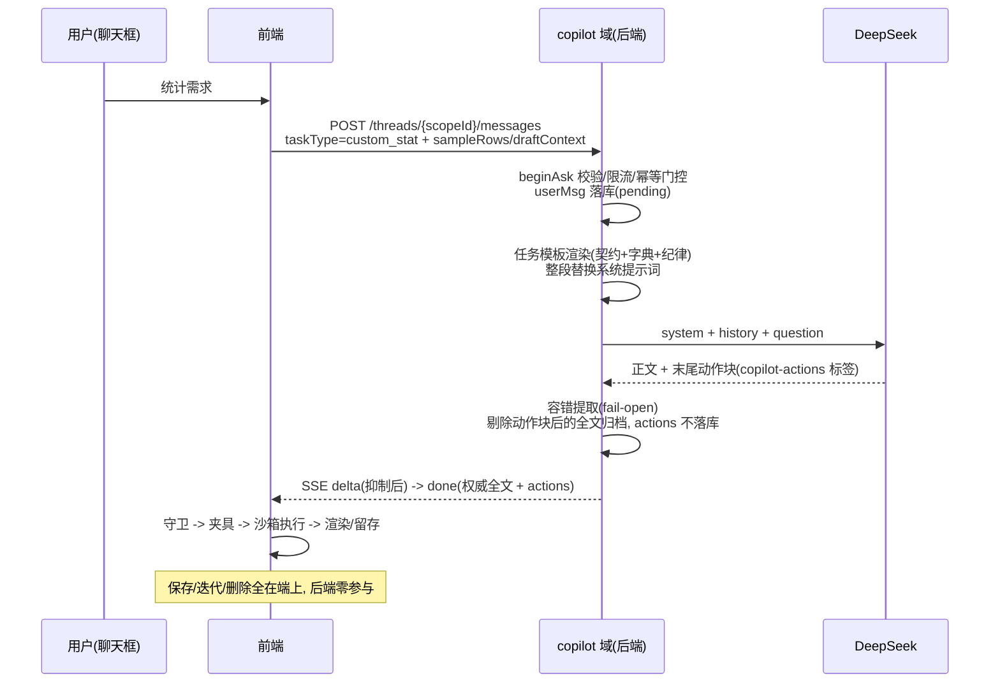

# 自定义统计（AI 生成代码）· 后端实现文档

> 版本：v1.0（2026-09-07）
> 范围：custom_stat 后端 P0 的落地记录——文件清单、模块契约、模板登记、测试映射与验证结果。「为什么这样设计」见两份设计文档，本文只写「实现成了什么、怎么验证、前端怎么接」
> 关联：`docs/custom-stats-api.md`（接口变更清单 v1.0）、`docs/custom-stats-backend-support.md`（契约详解与字段字典）、`docs/copilot-design.md`（Copilot 架构）；前端仓 `docs/custom-stats-spec.md`、`docs/copilot-implementation.md`
> 验证基线：`./mvnw compile -q`；单测命令见 §5.2
> 状态：后端已实现（P0）· 单测全绿 · 待前端联调

---

## 1. 实现总览

### 1.1 改动面（全部收敛在 copilot 域，ModulithVerifyTest 守护）

| 文件（`copilot/` 下） | 变更 | 内容 |
|---|---|---|
| `dto/CopilotDtos.java` | 修改 | `AskRequest` 增 `taskType`；新增 `CopilotActionItem {type, payload}`；`AskResponse` 增 `actions` |
| `CopilotPromptResolver.java` | 修改 | 新增 `resolveTaskTemplate(tag)`：任务型模板直读，长度上限单独放宽至 16384 |
| `util/CopilotTaskPromptRenderer.java` | 新增 | 任务型系统提示词构建与占位符渲染（纯函数无状态） |
| `util/CopilotStatActionExtractor.java` | 新增 | LLM 输出动作块容错提取器（纯函数无状态） |
| `service/AiChatOrchestrationService.java` | 修改 | taskType 路由分支、动作提取接线、SSE 抑制位、`persistAssistant`/`buildAskResponse` 扩参 |
| `postgres/data.sql` | 修改 | 播种模板行 `copilot_custom_stat_gen`（文件尾部，`ON CONFLICT (tag) DO NOTHING`） |
| 测试 ×3 | 新增/追加 | Renderer 17 / Extractor 15 / Resolver 25 用例（§5） |

无新端点、无新表、无新依赖（JSON 解析复用既有 `tools.jackson.databind.ObjectMapper`，Jackson 3）。

### 1.2 与接口文档的两处偏差（实现时修正，前端对接须以此为准）

| # | 文档假设 | 实际实现 | 影响 |
|---|---|---|---|
| D1 | api 文档 §2.2「后端无需处理其语义，透传即可」、§3.2「actions 现状即不落库」——隐含 actions 传输通道已存在 | 后端此前**完全没有** actions 提取与传输（前端 `resp.actions` 一直只有 mock 值） | 本次新增 `copilot-actions` 动作块容错提取 → `AskResponse.actions` 下发，属最小闭环补齐。fail-open：无块/解析失败时聊天文本原样归档、`actions=null`；actions 不落库不打日志的语义不变 |
| D2 | api 文档 §2.1 请求示例字段写 `content` | 现有端点实际字段为 `question`（`AskRequest.question`） | 文档示例笔误，请求体以 DTO 实际字段为准；本功能仅新增 `taskType` 一个字段 |

### 1.3 数据流（实现后真实时序）



## 2. 接口契约（实现后）

### 2.1 请求扩展（POST /api/copilot/threads/{scopeId}/messages，既有端点）

`AskRequest` 新增可选字段 `taskType`：

| 项 | 约定 |
|---|---|
| 取值 | `custom_stat` = 自定义统计代码生成；缺省/未知值 = 现有聊天模板，行为零变化 |
| 校验 | 仅限长：trim 后 >64 字符 → 400「taskType 过长」（不拼 Redis key，仅防滥用）；未知值不报错，宽松回落 |
| 语义边界 | 仅参与系统提示词模板路由，不改变存储、限流、SSE 事件、容灾逻辑；不落库、不打日志 |

> 其余请求字段（`question` / `clientMessageId` / `contextSummary` / `contextOverview` / `timeAnchor` / `focusBlockId`）不变，见 D2。

### 2.2 响应扩展

`AskResponse` 新增 `actions: List<CopilotActionItem>`，`CopilotActionItem = {type: String, payload: Object}`：

```jsonc
{
  "userMessageId": 101, "assistantMessageId": 102,
  "content": "已为你生成各股做T收益排行。",   // 剔除动作块后的权威全文
  "promptTokens": 1834, "completionTokens": 962, "channel": "deepseek",
  "actions": [                               // 无块/解析失败 = null
    { "type": "run_custom_stat",
      "payload": { "name": "...", "description": "...", "prompt": "...", "code": "(ctx) => { ... }" } }
  ]
}
```

| 项 | 约定 |
|---|---|
| 透传形状 | payload 保持 LLM 原始 JSON 结构（Map/List），仅非 Map/List 时兜底为空对象；type 为 trim 后字符串 |
| 校验责任 | 后端不校验 payload 内容（形状守卫 + 沙箱执行 + 夹具预跑全在前端，support 文档 §6） |
| 存储语义 | actions 仅随响应下发（JSON 信封 / SSE done 事件），**不落库、不打日志**；归档 content 为剔除动作块后的全文 |

### 2.3 SSE 事件流变化（事件名与结构不变）

| 事件 | 行为 |
|---|---|
| `delta` | 不变；唯一新增：全文累计中出现动作块开标签即置抑制位，此后 delta 不再下发（防聊天气泡闪烁机器 JSON；模板约定动作块恒在回复末尾） |
| `done` | 载荷即 `AskResponse` JSON（含 `actions`）；`content` = 剔除动作块后的权威全文，流式尾部被抑制的少量正文由 done 整体替换自愈 |
| `error` | 不变（归档失败 / LLM 异常 / 断开超时 → userMsg 标 failed，前端同 cid 可重发续跑） |

JSON 阻塞路径（非流式）：聚合响应过同一提取器 → `persistAssistant(content=cleanedText, actions)` → 200 信封，与 SSE 路径语义一致。

## 3. 模块明细

### 3.1 CopilotTaskPromptRenderer（任务型提示词构建，纯函数）

入口 `buildCustomStatSystemPrompt(taskType, contextSummary, question, templateReader)`，返回 `null` 表示不走任务模板（编排层回落既有聊天链路）：

| 输入形态 | 返回 |
|---|---|
| `taskType`（trim 后）≠ `custom_stat`、reader 为 null | null（宽松降级，不报错） |
| 模板读取异常 / 未命中 / 空白 | null（与未配置同等对待） |
| 命中 | 渲染后的完整系统提示词 |

占位符（精确字面量 `replace`，无正则；替换顺序 SAMPLE_ROWS → DRAFT_CONTEXT → USER_CONTENT **最后**，用户文本中占位符样式内容保持字面量，有单测锚定）：

| 占位符 | 取值 | 缺失语义 |
|---|---|---|
| `{SAMPLE_ROWS}` | `contextSummary.sampleRows`（根级优先 → `data` 子对象；对齐快照信封形态）；均无且原文非空 → **整段原文回退**（契约兜底：该场景 contextSummary 内容即样例行） | `（未提供样例行）` |
| `{DRAFT_CONTEXT}` | `contextSummary.draftContext`（根级 → `data` 子对象；**不回退原文**，防把样例误当草稿） | 首轮生成指令；有值 → 迭代轮指令（基于当前 code 改、返回完整替换代码，禁 diff/patch）+ 草稿 JSON |
| `{USER_CONTENT}` | 本次提问原文（null → 空串） | — |

容错：contextSummary 非法 JSON / 非对象 → 视为无该键，绝不抛错；全链路不落库不打日志（样例行含用户真实数据）。

### 3.2 CopilotStatActionExtractor（动作块容错提取，纯函数）

常量：开/闭标签（`copilot-actions`，与 data.sql 模板同步维护）、`MAX_ACTIONS=10`（前端白名单上限 5，此处放宽做防御）。

| 输入形态 | cleanedText（归档权威全文） | actions |
|---|---|---|
| 无任何块 | 原文（parse 整体返回 null，原文即权威） | null |
| 完整块 ×N | 剔除全部块后 trim | **最后一个**完整块的解析结果 |
| 完整块 + 未闭合尾部残块 | 块与残块一并剔除（残块自开标签起恒为机器文本） | 最后完整块结果 |
| 仅未闭合残块（LLM 截断） | 自开标签剔除到文末 | null |
| 块内 JSON 非法 / 结构不符 | 块照剔（机器 JSON 不进气泡） | null（fail-open） |

条目级守卫：信封 `{"actions":[...]}` 或裸 `[...]` 均接受；条目缺 `type` / 空白 `type` 跳过；`type` trim；`payload` 非 Map/List → 空对象兜底；超 10 条截断；全部条目无效 → actions=null。

红线：**绝不抛错**；actions 仅随响应下发，不落库、不打日志。

### 3.3 CopilotPromptResolver.resolveTaskTemplate（任务型模板直读）

- 与 `resolveByTag` 同源同容错：未命中 / 空白 / 超长 / Redis 异常一律返回 null（fail-open），兜底责任在调用方（renderer 回落聊天链路）
- 长度上限单独放宽：`MAX_TASK_TEMPLATE_LENGTH = 16384`（聊天人设仍 4096）——生成器模板含执行契约 + 字段字典，体量远超聊天人设，沿用 4096 会静默拒载
- key：`copilot:prompt:{tag}`；生产入口走 `StringRedisTemplate`，纯函数核心供单测（Mockito reader 桩）

### 3.4 AiChatOrchestrationService 接线点

| 位置 | 改动 |
|---|---|
| `beginAsk` | `taskType` trim 后 >64 → 400；位置在限流/门控之前（快速失败） |
| `buildPrompt` | 先试任务模板：命中 → 系统提示词**整段替换**（人设/页面快照/数据新鲜度段不叠加；contextSummary 经占位符消费，不再拼进系统段），对话历史与提问照常拼装（两分支一致）；未命中 → 原聊天链路逐字节不变 |
| `ask`（JSON 路径） | LLM 响应过提取器：cleanedText 归档 + actions 入响应 |
| `askStream`（SSE 路径） | 抑制位逻辑（§2.3）；complete 回调中同一提取器解析后归档，done 下发 |
| `persistAssistant` / `buildAskResponse` | 扩参 actions；assistant 落库行不含 actions（ephemeral） |

## 4. 模板登记（postgres/data.sql 播种）

```sql
INSERT INTO copilot_prompt_template (tag, content, ctime, mtime) VALUES
    ('copilot_custom_stat_gen', '你是 A 股做T交易记账应用的统计代码生成器。…（多行字面量）…',
    (EXTRACT(EPOCH FROM now()) * 1000)::BIGINT, (EXTRACT(EPOCH FROM now()) * 1000)::BIGINT)
ON CONFLICT (tag) DO NOTHING;
```

| 项 | 说明 |
|---|---|
| 内容三段式 | 执行契约 + 字段字典（静态内容件，已内联定稿）+ 输出格式/输出纪律；运行时占位符仅 `{SAMPLE_ROWS}` / `{DRAFT_CONTEXT}` / `{USER_CONTENT}` 三个（support 文档 §4 草稿中的 `{CONTRACT_BLOCK}` / `{FIELD_DICTIONARY}` 已内联，不再动态渲染） |
| 动作块格式段 | 模板内规定输出 `copilot-actions` 标签块，标签与 `CopilotStatActionExtractor.OPEN_TAG/CLOSE_TAG` **同步维护**（两处文件头注释已双向标注，改一处必须改另一处） |
| 字面量约束 | content 内零单引号（SQL 单引号字面量）；全文约 4.9KB，低于 16384 上限 |
| 热更路径 | DB 唯一来源 → 启动 `CopilotPromptSync` 全量镜像 Redis → 运行时只读 Redis；admin 接口在线改即热生效。data.sql 仅首装播种，`ON CONFLICT DO NOTHING` 不覆盖线上已改行（漂移以 Redis 为准，见 §7） |
| native | 模板为 DB 数据非代码，无 AOT 反射登记需求；`taskType` 为普通字符串字段，无反射风险 |

## 5. 测试与验收

### 5.1 support 文档 §7.3 测试要点 → 用例映射

| 要点（support §7.3） | 覆盖 |
|---|---|
| 1. taskType 缺省回归零变化 | RendererTest `blankOrNullTaskType` / `unknownTaskType` / `templateMiss` / `templateReaderThrows` / `nullReader` → 全部回落 null；`buildPrompt` else 分支零改动（代码 review 锚定） |
| 2. custom_stat 路由新模板；未知值回落 | RendererTest `customStat_routesToTaskTemplate` / `taskTypeTrimmed` |
| 3. SSE 事件结构不变 | done 载荷即 AskResponse（仅多 `actions` 字段）；delta 抑制位与 done 自愈为代码路径行为，无专项单测（见 §7 遗留） |
| 4. 模板渲染 | RendererTest 占位符填充 / sampleRows 根级与 data 子对象提取 / 原文回退 / 迭代指令 / 非法 JSON / 占位符样式字面量安全 |
| 5. 限流回归 | `rateLimiter.check(userId)` 在 beginAsk 中先于门控，未改动；`AiChatRateLimiterTest` 既有用例全绿 |

新增/追加测试类（纯 JUnit 5 + Mockito，无 Spring 上下文，对齐项目模式）：

| 测试类 | 用例数 | 覆盖 |
|---|---|---|
| `copilot/util/CopilotTaskPromptRendererTest` | 17 | 路由回落矩阵、占位符渲染、样例/草稿提取（根级→data→回退）、渲染健壮性 |
| `copilot/util/CopilotStatActionExtractorTest` | 15 | 信封两形态、块剔除（完整/残块/多块）、fail-open 矩阵、条目守卫、上限截断 |
| `copilot/CopilotPromptResolverTest`（追加 7） | 25 | resolveTaskTemplate：超聊天上限命中 / 边界 16384 / 超限拒载 / 未命中与空白标签 / Redis 异常 / tag trim / 生产接线 |

### 5.2 验证记录（2026-09-07）

```
./mvnw test '-Dtest=CopilotTaskPromptRendererTest,CopilotStatActionExtractorTest,CopilotPromptResolverTest' '-DfailIfNoTests=false'
  → Tests run: 57, Failures: 0, Errors: 0

./mvnw test '-Dtest=!TaskServiceTest,!StockCalculatorApplicationTests,!SyncBackupL1IntegrationTest' '-DfailIfNoTests=false'
  → Tests run: 212, Failures: 0, Errors: 0   （含 ModulithVerifyTest 域边界守护）
```

> 三个排除项均为 @SpringBootTest（需本地 PG + POSTGRES_PASS），本机无 DB 环境未跑，属环境限制非回归。部署前建议补全量：`POSTGRES_PASS=… ./mvnw install '-Dtest=!TaskServiceTest' '-DfailIfNoTests=false'`（同时验证 data.sql 播种被启动执行 + Redis 镜像同步）。

### 5.3 DoD 对照（api/support 文档 §9）

- [x] taskType 缺省回归零变化（Renderer 回落矩阵 + buildPrompt else 分支未动；端到端 diff 待联调确认）
- [x] taskType=custom_stat 路由新模板；未知值回落默认
- [x] 新模板登记：data.sql 播种（admin 接口 + history 体系为既有能力，本功能零代码改动）
- [x] 单测全绿（DB 用例除外，环境无 PG，见 §5.2）
- [ ] 与前端联调：一轮真实生成的 action JSON 通过前端守卫 + 夹具 + Guard 三道关

## 6. 前端对接清单（后端已就绪）

1. **发起**：`AskRequest` 增 `taskType: 'custom_stat'`；请求字段以现有 DTO 为准（`question` / `clientMessageId` / `contextSummary`…，见 §1.2 D2）
2. **上下文构造**：`contextSummary.sampleRows`（各集合 2~3 行真实形状样例，buildFullContext 顺带产出）+ 迭代轮 `draftContext { prompt, code, feedback }`；走既有白名单与 `applySizeGuard` ≤12KB 护栏
3. **动作登记**：`utils/copilotActions` 的 `ACTION_TIERS` 登记 `run_custom_stat`（auto 级）+ `asRunStatPayload` 形状守卫（name≤40 / description≤200 / prompt≤2KB / code≤16KB 且形如 `(ctx) => { ... }`，与模板 payload 约束一致）
4. **消费位置**：JSON 路径 `resp.actions`；SSE 路径 `done` 事件载荷的 `actions` 字段。delta 中不会出现动作块内容（后端已抑制），前端无需处理残块
5. **兜底语义**：`actions = null`（无块/解析失败）时按纯聊天文本展示——守卫静默丢弃语义与 support §6 一致

## 7. 遗留与风险

| 项 | 说明 | 处置 |
|---|---|---|
| SSE 抑制位无专项单测 | `suppressRef` 逻辑在 `askStream` chunk 回调内，纯 Mockito 单测不覆盖（需 SSE 测试设施） | 联调阶段冒烟覆盖；块剔除/残块语义已被 Extractor 15 用例锚定，风险面窄 |
| DB 级验证未跑 | contextLoads（含 data.sql 播种执行）/ TaskServiceTest / SyncBackupL1 需本地 PG | 见 §5.2 建议命令，部署前补跑 |
| token 用量观察 | 生成代码输出 token 显著高于普通聊天，限流沿用同阈值 | P0 按现状跑；预留为 taskType=custom_stat 设独立阈值（api 文档 §4，暂不做） |
| 模板漂移 | 线上经 admin 改行后，再次部署 data.sql 因 `ON CONFLICT DO NOTHING` 不覆盖 | 有意为之：Redis 为运行时权威，data.sql 仅首装播种；模板大改时走 admin 接口或手工 UPDATE 并留 history |
| 字段字典防腐 | 字段字典是模板内静态内容件，domain 字段变更时模板会静默腐化 | 按 support §7.2：前端 `types/domain.ts` 字典一致性测试报警；后端无自动化手段 |
| actions 语义边界 | 后端只保证「块剔除 + 结构最简守卫」，不理解 payload | 维持现状（E2EE + local-first 架构决定）；若未来需要服务端审计/风控再评估 |
