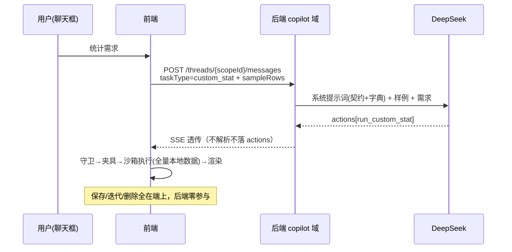

# 自定义统计 · 后端开发信息支持文档 v1.0

> 版本：v1.0（2026-09-07）
> 读者：stock-calculator-service 后端开发（本功能后端侧改动极小，本文档补齐「为什么」与「内容件」）
> 前置阅读：`docs/copilot-design.md`（架构）、`docs/copilot-api.md`（现有接口）、本文档姊妹篇 `docs/custom-stats-api.md`（接口变更清单）
> 状态：设计定稿，待 P0 开发启动

---

## 1. 功能全景（后端视角）

用户在 AI 聊天框描述统计需求 → LLM（本文档范围内 = 你们 familiar 的 copilot ask 链路）按新提示词模板返回一个 `run_custom_stat` 动作（含可执行 JS 代码）→ **前端在本地沙箱对全量用户数据执行并渲染图表** → 用户满意后存入本地库。



**后端职责一句话：稳定地把「契约 + 用户需求」喂给 LLM，产出结构合法的 action JSON。** 代码对错、安全、执行、存储全部在前端闭环——这是架构决定的（E2EE + local-first，服务端无明文数据，见前端需求文档 D1/D3）。

## 2. 为什么这样设计（前端约束的由来）

| 前端决策 | 对后端的含义 |
|---|---|
| 沙箱 = QuickJS WASM in Worker，真隔离 | LLM 代码可以放心透传给前端执行，后端无需安全审查——但**必须**用模板约束输出为纯 JSON action，杜绝裸文本代码块（前端守卫对裸文本静默丢弃） |
| LLM 只见契约+字典+样例，不见全量（隐私红线） | 请求里 contextSummary 的 sampleRows 就是为 prompt 准备的「教材」；不要在模板里鼓励 LLM「索要更多数据」 |
| 前端按 JSON action 白名单消费 | 模板必须规定「actions 之外不输出任何可执行内容」；输出纪律见 §4.2 |
| 生成结果用户不读代码、看效果拍板 | description（口径说明）是用户唯一依据，模板必须强制 LLM 产出人话口径 |

## 3. 动作契约详解（run_custom_stat）

### 3.1 payload 字段表

| 字段 | 类型 | 约束 | 内容要求 |
|---|---|---|---|
| name | string | ≤40 字符 | 统计名（用户保存时的默认名），如「各股做T收益排行」 |
| description | string | ≤200 字符 | **口径说明**：算了什么、什么范围、含不含费用——用户据此判断是不是想要的 |
| prompt | string | ≤2KB | 规范化需求种子：自包含、不依赖对话上下文即可复现本统计的需求描述（用户迭代/重建时直接复用） |
| code | string | ≤16KB | `(ctx) => CustomStatsResult` 完整箭头函数表达式（不是函数体片段、不是 IIFE、不是代码块围栏） |

### 3.2 输出纪律（模板必须约束 LLM 的）

1. **二选一（XOR）**：一次只返回一个 result 形态——标题卡（`kind:'card'`，kpis≤3）或单图表（`kind:'chart'`，bar/line/pie 三选一），**不返回表格**；
2. 复合需求可在一轮回多个 action（≤5 个，沿用 COPILOT_ACTION_LIMIT）；
3. 图表数据规则：bar 降序、line 时间升序、pie ≤8 片；bar/line ≤50 点；
4. 金额一律走 `ctx.helpers.fmtMoney` / `round2`，不做裸浮点拼接；
5. 空数据防御：全空集合返回空 data 数组（不抛错），禁 `rounds[0].x` 无保护索引；
6. 代码内禁用 `Date.now/Math.random`（时间用 `ctx.now`），禁访问 ctx 之外的任何全局；
7. 输出必须为合法 JSON action，code 字段内换行转义合法（JSON string）。

## 4. 系统提示词模板草稿（copilot_custom_stat_gen）

> 用途：直接登记进 CopilotPromptTemplate；`{...}` 为占位符，由后端渲染时填充。

```
你是 A 股做T交易记账应用的统计代码生成器。根据用户需求，生成一段在受限
沙箱中执行的 JavaScript 统计函数，并以 JSON action 返回。

【执行契约】用户数据已由宿主组装为唯一入参 ctx，结构如下（字段一字不差）：
{CONTRACT_BLOCK}

【字段字典】（语义口径，写代码前先读）
{FIELD_DICTIONARY}

【样例行】（ctx 各集合的真实形状示例，仅形状参考，忽略具体数值）
{SAMPLE_ROWS}

【输出纪律】
1. 只输出一个 action，type 固定为 "run_custom_stat"，payload 含
   name(≤40字)、description(≤200字口径说明)、prompt(≤2KB规范化需求种子)、
   code(≤16KB，形如 (ctx) => { ... return result; } 的完整箭头函数)。
2. result 二选一：
   标题卡 { kind:'card', title, caption?, kpis:[{label,value,tone?}] ≤3 }
   单图表 { kind:'chart', title, caption?, chart:{ type:'bar'|'line'|'pie', data:[...] } }
   禁止返回表格。复合需求拆成多个 action（本轮最多 5 个）。
3. 图表：bar 降序、line 时间升序、pie ≤8 片；bar/line ≤50 点。
4. 金额用 ctx.helpers.fmtMoney/round2；百分比用 ctx.helpers.pct（0-1 小数）。
5. 空集合返回空 data 数组，禁止无保护索引与除零。
6. 禁用 Date.now/Math.random（时间用 ctx.now）与 ctx 之外的全局对象。
7. 先判断需求形态：问「多少/总额/胜率」→ 标题卡；问「排行/趋势/占比」→ 图表。

用户需求：{USER_CONTENT}
```

> 维护约定：`{CONTRACT_BLOCK}` 与 `{FIELD_DICTIONARY}` 为人工维护内容件——**字段字典是口径语义的权威载体，TS 类型推不出语义**（如 netProfit=绝对现金流法净收益）。防腐加固见 §7.2。

## 5. 迭代协议（草稿多轮修改）

前端草稿态迭代时，请求构成（contextSummary.draftContext）：

```jsonc
{
  "prompt": "规范化需求种子（不变的需求锚点，防多轮漂移）",
  "code": "当前版本完整代码",
  "feedback": "用户本轮自然语言反馈，如「按月分组」「去掉手续费」"
}
```

模板对迭代轮的指令增量：**基于当前 code 修改，返回完整替换代码（禁止 diff/patch/省略号）**；prompt 种子始终随行——单码覆盖 + 需求锚点是防多轮「改着改着忘了本来要干嘛」的双保险。重新生成场景（从定义卡发起）无 code，只有 prompt 种子 + 用户追加要求（走 content）。

## 6. 失败模式与前端兜底（后端须知，无需处理）

| LLM 输出问题 | 前端行为 |
|---|---|
| action JSON 非法/字段缺失/超长 | asRunStatPayload 守卫静默丢弃（聊天文本照常展示） |
| 代码语法错误 / 签名错误 | 沙箱 eval 报错行号 → 夹具预跑拦截 → 「一键 AI 修复」自动回喂错误栈+code |
| 空数据崩溃（rounds[0].x） | 空数组夹具预跑拦截，同上回喂修复 |
| 结果形状非法（缺 title、超点数） | Result Guard 拒绝/截断归一 |
| 死循环 | 沙箱 interrupt 500ms + terminate 重建 |
| 用户报「数字不对」 | 口径问题，沙箱管不了——靠 description 口径说明 + 用户迭代反馈收敛 |

设计含义：**后端不需要为输出质量做代码级兜底**，但模板质量直接决定一轮生成成功率（夹具+守卫拦截会转化为用户可见的重试成本）。

## 7. 实施边界与工程约束

### 7.1 代码边界（Modulith）

- 全部改动收敛在 `copilot` 域内：`CopilotDtos`（请求体加 taskType）、模板选择路由（AiChatOrchestrationService 按 taskType 取模板）、`CopilotPromptTemplate` 数据行登记；
- **不新增**：端点、表、entity、repository、跨域引用；crawler/vision/llm/sync 域零改动（ModulithVerifyTest 守护）；
- native-image：模板为 DB 数据非代码，无 AOT 反射登记需求；taskType 为普通字符串字段，无反射风险。

### 7.2 字段字典防腐（建议的轻量加固）

字段字典（§4 的 FIELD_DICTIONARY）是人工维护的「内容件」，domain 字段将来变更时模板会静默腐化。建议：前端仓 `types/domain.ts` 为权威源，前端实现时在 `__tests__` 加一条**字典一致性测试**——断言字典中出现的字段名都能在 TS 类型上找到，两端文档同源引用同一段字段清单（本文档 §8 即该清单的当前快照）。后端侧无自动化手段，依赖前端仓的这条测试报警。

### 7.3 测试要点（后端侧）

1. `taskType` 缺省行为回归：现有聊天模板路由零变化（回归保护是本变更最大的风险面）；
2. `taskType=custom_stat` 路由到新模板；未知 taskType 值 → 回落默认聊天模板（宽松处理，不报错）；
3. SSE 透传：actions 数组含 run_custom_stat 时事件结构不变；
4. 模板渲染：占位符填充 / 超长 sampleRows 的护栏不破坏 prompt 组装；
5. 限流回归：custom_stat 走同阈值不绕过。

## 8. 字段字典 v1 快照（模板 FIELD_DICTIONARY 的内容底稿）

> 口径语义权威表。前端契约 `CustomStatsContext` 各集合的字段与含义；单位与既有 Copilot 词典一致（元/CNY、rate 为 0-1 小数、手=100 股）。

### rounds / openRounds（TRoundArchive，做T轮次）

| 字段 | 类型 | 语义 |
|---|---|---|
| fullCode / stockName | string | 证券代码（含市场前缀）/ 名称 |
| mode | 'long'\|'short' | 先买后卖（正T）/ 先卖后买（反T） |
| status | 'OPENED'\|'COMPLETED' | 进行中 / 已了结 |
| netProfit | number | **绝对现金流法净收益（已扣规费），元**——收益统计的主口径 |
| totalFees / fees | number | 规费合计（优先 totalFees），元 |
| buyAmount / sellAmount | number | 买入/卖出成交额，元 |
| avgPrice | number | 均价，元/股 |
| tradeCount | number | 笔数 |
| holdingDays | number | 持有天数 |
| win | boolean | 是否盈利轮 |
| openedAt / closedAt | string | 开仓/平仓时间（ISO；closedAt 仅 COMPLETED 有） |
| settleType | 'clear'\|'partial'\|'transfer' | 清仓/部分了结/划转底仓 |

### txns（RoundTxn，逐笔流水，timestamp 升序）

| 字段 | 类型 | 语义 |
|---|---|---|
| roundId | string | 所属轮次（关联 rounds[].id） |
| timestamp | string | 成交时间（ISO，升序） |
| direction | 'buy'\|'sell'\|'merge' | 买/卖/合并 |
| price / amount | number | 价格（元/股）/ 成交额（元） |
| fee | number | 该笔规费，元 |
| realizedProfit | number | 撮合实现收益（可能有，元） |
| fullCode | string | 证券代码 |

### positions（Position，持仓全量含已平仓）

| 字段 | 类型 | 语义 |
|---|---|---|
| fullCode / stockName | string | 证券代码/名称 |
| isClosed | boolean | 是否已平仓 |
| totalQty / totalCost | number | 当前股数 / 累计投入成本（元）——以 domain 实际字段名为准 |
| marketValue / floatProfit | number | 市值/浮动盈亏（未平仓行，若快照含）——以 domain 实际字段名为准 |

### activeStreams（进行中轮撮合结果，序列化安全子集）

| 字段 | 语义 |
|---|---|
| stockName / status | 标的 / 撮合状态（未了结集合） |
| netPendingAmount | 净持仓敞口（元） |
| weightedBuyCost | 加权买入成本（元/股） |
| realizedPnL | 已实现盈亏（元） |

### 其他

| 字段 | 语义 |
|---|---|
| ctx.now | 宿主时间锚点（ISO），一切「今天/本月」以此为基准 |
| ctx.feeConfig | 费率配置对象（净额复算用） |
| ctx.helpers | round2/pct(除零安全,0-1)/groupBy/sumBy/fmtMoney(千分位+2位) |

> 标注「以 domain 实际字段名为准」的字段：实现阶段以前端 `types/domain.ts` 最终核对为准（本文档成稿于实现前）。

## 9. 验收（后端侧 DoD）

- [ ] taskType 缺省回归零变化（现有模板路由/SSE/落库 diff 为空）
- [ ] taskType=custom_stat 路由新模板；未知值回落默认
- [ ] CopilotPromptTemplate 新模板 admin 登记 + history 可追溯
- [ ] `./mvnw test '-Dtest=!TaskServiceTest' '-DfailIfNoTests=false'` 全绿
- [ ] 与前端联调：一轮真实生成的 action JSON 通过前端守卫 + 夹具 + Guard 三道关
