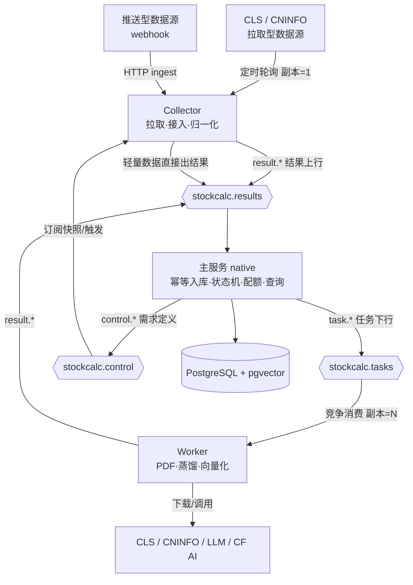
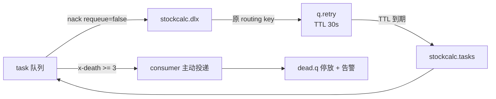

# 数据服务拆分与 MQ 通信 · 后端设计文档

> 版本：v2.4（2026-09-12，终态清理完成：main 侧回退路径删除，MQ 单路径）：
> §8 回退策略存续期间的双路径门控（datasvc.mq.enabled / crawler.enabled）按终态规划退役——
> main 删除 announcement 进程内管道（parser 5 件套/CninfoClient+DTO/ExtractedDocument/
> DistillService/GroundingValidator/ProcessService/CollectService/SyncTask/订阅首拉监听）、
> CLS 进程内拉取（TaskService/ClsDayTask/HistoryClsDayTask/CommonHttpService/ClsSignUtil/
> ClsDayTaskHelp/ParseDataUtil/ApplicationEvent 启动补录/ClsSearchTask 空壳）、
> embedding 进程内计算半边（ArticleEmbeddingService 裁为纯函数工具/EmbeddingErrorClassifier/
> EmbeddingBackfillTask 进程内分支及完成邮件事件），全文 14 处副本归零；
> 7 个 MQ Bean（TaskPublisher/ClsArticleMqConsumer/两 Publisher/EmbeddingTaskDispatcher/
> RabbitTopologyConfig/RabbitPublishConfig）摘除 @ConditionalOnProperty 常驻装配；
> 历史补录按 §3.2 落地：main 控制器改发 task.history.sync（MQ 化闭环，死拓扑消除），
> data/cls/HistorySyncWorker 执行区间拉取（频控策略平移）+ result.cls.history.report 回执；
> 可靠性姿态：无回退开关，broker/worker 停摆靠 数据源窗口自愈（D3）+ 对账器（D6）
> + PipelineWatchTask 堆积/停机告警（R4 落地）；
> 验收：main 369 用例 0 失败 9 skip、data 68 用例 0 失败 3 skip；
> 遗留：main native 二进制重建（ContractHintsConfig 已在位）
> 历版本：v2.3（2026-09-11，阶段 2 native 补课完成，R1 硬门槛全绿）：
> ① native 构建：build-native.sh 参照 main 脚本适配（-J-Xmx12g + 构建期
> SPRING_APPLICATION_JSON 钉死三角色全开 all-in-one 变体 + dummy 凭据，AOT 固化
> 条件装配），产物 201MB ELF，启动 0.3s，smoke-native.sh（启动+ingest 端点 503）双绿；
> ② R1 冒烟暴露三缺口并修复：(a) data 模块 web 缺口——pom 缺 spring-boot-starter-web
> + yml web-application-type=none 致 ingest 控制器从未监听，补 starter 删配置；
> (b) 契约 DTO 反射缺失——手工 readValue/convertValue 不被 AOT 推断，native 消费信封
> 报 InvalidDefinitionException，新增 contract 模块 ContractRuntimeHints（信封+19 DTO
> 全量 MemberCategory + getNestMembers 递归兜底内部类，DTO→hints 契约模块单点，
> 新增 DTO 必须登记），data 挂 MqTopologyConfig/@ImportRuntimeHints（无条件），
> main 新增无条件 ContractHintsConfig（未来 main native 重建的前置）；
> (c) PDFBox AOT 三重缺口——PDDocument.<clinit> 拉 Raster/ColorModel → libawt
> JNI FindClass(java/awt/GraphicsEnvironment) 不可静态分析、Helvetica.afm 等字体
> 资源未入镜像、pdfbox 反射缺失，经 native-image-agent 统一格式 reachability-metadata.json
> （R1_JVM_AGENT=1 模式 JVM 跑全链采集）落 src/main/resources/META-INF/native-image/
> 修复；③ R1 硬门槛 PASS：native 二进制全链（PDF 下载→PDFBox 解析→建树→LLM 路由/蒸馏
> →接地→result 上行）绿，队列清零无死信；④ 教训：LavinMQ 管理 API 无 /purge（用 DELETE
> /contents），Java RestClient 走 chunked 无 Content-Length（桩须按块读），
> agent 插桩使 JVM 启动 0.2s→60s+；验收：data 68 用例 0 失败、main 编译过、
> R1 native PASS；遗留：worker-only/collector-only 变体拆分（当前仅 all-in-one）、
> main native 二进制待用 ContractHintsConfig 重建）
> 历版本：v2.2（2026-09-11，阶段 5 完成：通用 webhook 摄取管道 + 扩展规范，详见接入
> 文档 docs/data-source-onboarding.md；开放问题 1 定案 HMAC-SHA256；遗留：native data 构建
> （本版补课）、CLS 表多源复用泛化、sourceUrl/tags 落库）
> 历版本：v2.1（2026-09-11，阶段 4 任务 5：公告 worker 闭环 E2E（AnnouncementWorkerE2ETest，
> RABBIT_E2E=true 门控）——task 下发 → 真实监听器（手动 ack + prefetch=2）→ 解析/建树/
> 切片/接地全真实现 → LLM 经本地 JDK HttpServer 桩（OpenAI 兼容 /chat/completions，
> 按提示词“路由引擎”标记分流路由["root"]/蒸馏两段响应，端口随机经 @DynamicPropertySource
> 惰性回填）；CninfoClient 用 @MockitoBean 桩（不真实打 CNINFO），collector.enabled=false
> 防真实打 CLS（CollectorGateTest 教训）——worker 依赖的 CninfoClient 由 mock 补位；
> worker.enabled=true 会连带激活 WorkerEmbeddingConfig 的 CF 凭据 fail-fast，须同配 dummy
> embedding 凭据（EmbeddingWorkerE2ETest 同款教训）；正文字典定 ASCII 且不命中标题模式 →
> 建树空 → root 兑底覆盖全文的降级路径也获 E2E 覆盖；两用例：done 全链（
> extractorVersion/charCount/pageCount/summary/structure=root/selection 断言 + 队列清零
> 无死信）与 failed 支路（mock 下载异常 → DOWNLOAD_FAIL/TRANSIENT）；验收：E2E 2/2 绿，
> 管理台核队列终态全 0；阶段 4 全部 5 任务完成）
> 历版本：v2.0（2026-09-11，阶段 4 任务 4：data worker 公告处理链（无 DB）——parser 全套
> （PdfTextExtractor/StructureTreeBuilder/SlicingService/TextCleaner/TitlePatterns）+
> AnnouncementDistillService/GroundingValidator 平移至 data/announcement，
> AnnouncementParseProperties（announcement.parse.*，默认与主服务同口径）随迁；
> LLM 精简为单渠道 LlmGateway（AnnouncementWorkerConfig 内部类，OpenAI 兼容
> /chat/completions，datasvc.llm.* 配置，baseUrl/apiKey/model 非空 fail-fast，
> maxAttempts=1；不做 main 侧多渠道路由——数据侧只需蒸馏单能力）；
> AnnouncementProcessWorker @RabbitListener(task.announcement.process.q，prefetch=2
> 独立 factory 手动 ack)：pdfCache 断点续传（同 URL 重发免重复下载，进程生命周期内）→
> extract → <100 码点抛 SkipTerminal(SKIPPED_NO_TEXT) → 建树 → route（空/LLM 幻觉树外
> nodeId 致切片空 → fallbackNodeIds(level<=2 含 root) 降级）→ distill → grounding
> 终败 SkipTerminal(GROUNDING_FAIL)；失败上报语义：worker 无本地重试环，分类
> reasonOf（SKIPPED_ENCRYPTED/GROUNDING_FAIL/LLM_ROUTE_FAIL/DOWNLOAD_FAIL/PARSE_FAIL）
> + errorKind（SKIPPED_NO_TEXT/GROUNDING_FAIL=PERMANENT，余 TRANSIENT）经
> result.announcement.done/failed 上报后 ack，重试计次归主服务 fail_count；
> 条件装配：7 个 worker 侧组件（worker/parser/service）统一挂
> @ConditionalOnProperty(datasvc.worker.enabled=true)——修复 ResultPublisherTopologyTest
> （collector.enabled=false 上下文）因 worker 链注入 CninfoClient 失败的装配污染；
> ackQuietly 全路径收口（catch 块 ack 失败不再触发容器重投，杜绝 done/failed 重复上报）；
> 测试：TextCleaner/GroundingValidator/DistillService 三测平移 + 新增
> AnnouncementProcessWorkerTest（done 载荷/SKIPPED_NO_TEXT 终态/LLM_ROUTE_FAIL TRANSIENT/
> 毒消息 ack 丢弃 4 用例）；验收：data 60 用例 0 失败 1 skipped（E2E 门控），main 未动；
> E2E（真实 broker + worker 闭环）留任务 5）
> 历版本：v1.9（2026-09-11，阶段 4 任务 3：主服务公告任务发布端 + done/failed 消费端 +
> 公告嵌入二段下发——AnnouncementProcessPublisher（datasvc.mq.enabled 门控）两级分发：
> 待蒸馏 PENDING（摘要空，top50 近端优先）发 task.announcement.process，已蒸馏未向量化
> （摘要非空断点续传态）经新端口 AnnouncementEmbeddingApi 直接补发二段任务；发布端熔断
> rate-limit-cooldown-minutes=30（worker 回报 RATE_LIMITED → markRateLimited 暂停发布窗口）；
> AnnouncementResultService 扩展 ingestDone/ingestFailed（载荷非法/未知/终态行拒绝、
> failCount 恒加、PERMANENT 或达 maxFailAttempts 落 FAILED、RATE_LIMITED 触发熔断）；
> EmbeddingResultService kind=announcement 分支维度校验前置后委托端口；
> AnnouncementProcessTask/AnnouncementEmbeddingBackfillTask 双路径改造（MQ=发布端/对账器
> force=true，进程内原样）；EmbeddingTaskDispatcher 保持 cls-only 零改动——Modulith 端口
> 倒置：公告嵌入派发/落账归 announcement 域（AnnouncementEmbeddingMqService 实现端口，
> 向量写入含三处同步 UPSERT 本地副本）；测试修复：4 处 Mockito UnnecessaryStubbing
> （stub 与生产调用顺序不对齐）；E2E 污染防护：EmbeddingBackfillTask 新增
> embedding.backfill.enabled 总开关（默认 true 行为不变），AnnouncementProcessMqE2ETest
> 关回填 + announcement.process.cron=- 禁调度器（缓存上下文在类结束后仍存活，定时器
> 扫真实库发布任务会污染共享 broker 队列），EmbeddingWorkerE2ETest awaitResult 按
> traceId 过滤 + retry 队列纳入清理；验收：main 58 类/421 用例 0 失败 1 skipped，
> data 9 类/34 用例全绿，双 E2E 全过，队列终态全 0）
> 历版本：v1.8（2026-09-11，阶段 4 任务 2：data collector 公告采集 + 主服务 collected 消费端——
> CninfoClient/DTO 自主服务 announcement 平移进 data/announcement（properties 换 CollectorProperties，
> downloadPdf 供任务 4 随迁；@Component 残留已除，仅经 CollectorConfig 门控装配，worker 部署
> collector.enabled=false 不需 RestClient bean）；SubscriptionSnapshotConsumer 消费 collector.control.q
> （手动 ack prefetch=1，catch-all ack 无重试环）+ SubscriptionSnapshotCache version 单调拒绝 <=；
> AnnouncementCollectorService orgId 存量→topSearch、首拉 FULL/LOOKBACK 双模式、长效白名单回填、
> 标题清洗剥 em，不去重不拦超体积（主服务状态机 D7/D3）；AnnouncementCollectTask cron 双重
> @ConditionalOnProperty 门控；主服务侧新增 AnnouncementIngestApi 端口接口（crawler→announcement
> 防 Modulith 成环）+ AnnouncementResultService 幂等摄取（重复投递无副作用、超体积终态
> FAILED(DOWNLOAD_FAIL)、orgId 回填仅补空白行）；ClsArticleMqConsumer 新增
> RESULT_ANNOUNCEMENT_COLLECTED 分支 + safeType headers→getType() 双通道兜底；
> 双路径门控：AnnouncementSyncTask/SubscriptionCreatedListener datasvc.mq.enabled=true 时空转；
> 验收 E2E：collected 落库 PENDING + orgId 回填 + 重复投递幂等 + 超体积终态，队列终态全 0）
> 历版本：v1.7（2026-09-11，阶段 4 任务 1：契约扩展 + 主服务快照下发——contract 新增
> SubscriptionSnapshotPayload（含 SnapshotStock{stockId,orgId,since}）/ AnnouncementCollectedPayload /
> AnnouncementProcessTask / AnnouncementDonePayload / AnnouncementFailedPayload 五 DTO，
> StructureNode/SliceSelection 自主服务 announcement/dto 下沉 contract 单源（R2）；
> 新增 SubscriptionChangedEvent（subscribe/unsubscribe 事务内发布）+ TaskDispatchApi
> 基包门面（EmbeddingSearchApi 同款 ObjectProvider 惰性解析，公告域跨域复用
> TaskPublisher 的 Modulith 合规通道）+ SubscriptionSnapshotPublisher
> （datasvc.mq.enabled 门控；订阅变更 AFTER_COMMIT/启动首推/30min 定时重推三触发点；
> 覆盖式全量语义，空订阅照发空快照；since=最新公告日-7d ISO 文本，无存量 null）；
> 验收 E2E：快照落 collector.control.q 契约还原 + 退订后重推不含已退订标的）
> 历版本：v1.6（2026-09-11，阶段 3 任务 5（收尾）：data 侧 worker 角色落地——EmbeddingComputeWorker
> 竞争消费 task.embedding.compute.q（手动 ack + prefetch=8 + 每实例 EmbeddingRateLimiter 节流），
> CF 计算经 WorkerEmbeddingConfig 装配（同款 usage 垫片 + maxRetries=0 + 凭据缺失 fail-fast，
> datasvc.worker.enabled 门控与 collector 同款约定）；失败分流 §6.1 三分类：429/PERMANENT
> ack 丢弃不回报（PENDING 留给对账器次日续发）、TRANSIENT nack 进 TTL 重试环、401/403
> 直投 dead.q 停放可重放；ResultPublisher 新增 4 参 publish（PRODUCER_WORKER 角色标识 +
> 任务信封 traceId 透传，跨服务排障串联）；KEDA 伸缩属部署项（§6），阶段 3 代码面全部完成）
> 历版本：v1.5（2026-09-11，阶段 3 任务 4：主服务 result.embedding.done 消费端落地——
> ClsArticleMqConsumer 新增 type 分发分支，新增 EmbeddingResultService：确定性 UUID
> 向量 upsert（直接以 PgVectorStore.insertOrUpdateBatch 同源 SQL 写 vector_store，绕开
> VectorStore.add 的重新嵌入）+ 状态行 DONE 落账（TransactionTemplate 同批原子）；
> 指纹未变跳过防晚到旧结果覆盖新向量；验收 E2E：重复投递无副作用、无死信）
> 历版本：v1.4（2026-09-11，阶段 3 任务 2：EmbeddingBackfillTask MQ 模式改造为发布端对账器
> （启动快照全量 pending ids 内存迭代扫缺补发，规避 dispatch 不改行状态的重查死循环；
> 循环仅读额度状态中断，记账唯一入口仍在 dispatcher）；门控细化：EmbeddingGate 新增
> isFeatureEnabled()，MQ 发布路径仅查功能开关、凭据齐备性属计算端 worker，进程内路径
> 仍查 isAvailable()）
> 历版本：v1.3（2026-09-11，阶段 3 任务 2 落地：ArticleSavedEvent 双路径监听（MQ 开→EmbeddingTaskDispatcher 下发
> task.embedding.compute + 额度上移发布端；MQ 关→原进程内路径不变）+ EmbeddingBackfillTask MQ 模式暂停；
> 历版本：v1.2（2026-09-11，阶段 3 任务 1：任务下行契约 DTO + 主服务 TaskPublisher + data 测试门控补齐）
> 历版本：v1.1（2026-09-11，阶段 1 已实现并验收：contract 契约模块 + 全量 MQ 拓扑声明 + CLS 滚动窗口链路迁移；
> 验收 E2E：数据服务发布 → result.ingest.q → 主服务消费幂等入库，重复投递无副作用；见 §8）
> 范围：把「拉取 + 处理数据」能力从 stock-calculator-main 拆出为独立数据服务（无 DB、native、可水平伸缩），与主服务经 RabbitMQ 通信；含队列拓扑、消息协议、可靠性语义、扩缩容与分阶段路线
> 关联：docs/announcement-rag-pipeline-design.md（公告管道，状态机语义沿用）、docs/cls-article-vector-backend-design.md（embedding 基座与 CF 额度治理）、docs/news-search-backend-implementation.md（search 域留守主服务）
> 状态：实现前须过 §7 实证清单

## 0. 决策记录

| # | 决策点 | 结论 | 关键理由 | 放弃的备选 |
|---|---|---|---|---|
| D1 | 拆分边界 | crawler 拉取/解析、announcement 采集、PDF 抽取/蒸馏、向量化**计算** → 数据服务；入库、状态机、配额记账、search/查询、订阅 CRUD → 主服务 | 「无状态计算」与「有状态存储」分离是扩缩容的必要条件 | 按模块对半拆（查询侧贴 DB 必须留守） |
| D2 | 数据服务零 DB | 数据服务不连 PostgreSQL，不持有任何表的所有权 | 副本可随时增减/重建；数据单一写入方（主服务） | 数据服务连库的传统拆法（schema 双方耦合） |
| D3 | 采集去游标化 | 拉取不查「上次拉到哪」：CLS 用滚动窗口全量推、公告用 seDate-7 天重叠窗口，去重全部由主服务幂等入库承担 | 消除对 DB 游标的反向依赖；量级（≤50 条/8min、30 条/h）完全可承受 | MQ 请求-回复查游标（同步耦合，MQ 优势归零） |
| D4 | 角色划分 | 数据服务同一 artifact 双 profile：`collector`（副本恒=1，定时拉取 + webhook 接入 + 归一化入队）与 `worker`（副本=N，竞争消费处理任务） | 拉取瓶颈在源站限流，多副本拉取只会重复+封禁；处理（PDF/LLM/向量）才是可伸缩项 | 单角色多副本（重复拉取）；两个独立应用（维护面翻倍） |
| D5 | MQ 选型 | RabbitMQ：topic 交换机 + 竞争消费 + TTL/DLX 重试环 + quorum 队列 | Spring AMQP 全套现成（@RabbitListener/确认/死信）；推送型数据源天然走队列；KEDA 官方 scaler | Redis Streams（被否，要 MQ 现成方案）；HTTP 回调（故障隔离差） |
| D6 | 可靠性语义 | at-least-once + 消费幂等 + 对账补偿；**不引入** outbox/事务消息 | 三条链路各有天然对账器：CLS 滚动窗口重拉、公告 PENDING 扫描重发、embedding 回填任务扫缺重发 | outbox（个人规模过度设计） |
| D7 | 状态机归属 | announcement 的 PENDING/DONE/FAILED、failCount、终态判定全部留在主服务；worker 只回报错误分类（TRANSIENT/PERMANENT/RATE_LIMITED） | 状态即游标，DB 在主服务；worker 保持无状态可缩容 | 状态机下放 worker（副本间计数漂移） |
| D8 | 配额中心化 | CF 日额度（60000 条/天）记账留主服务（EmbeddingQuotaGuard 职责上移到发布端），发布前扣减放行 | 额度账号级共享，伸缩副本数不得影响记账；worker 多少副本都打不爆额度 | worker 各自记账（超限连坐 429） |
| D9 | 契约共享 | 新增 `stock-calculator-contract` Maven 模块：队列常量 + 消息 DTO（独立定义，不引 JPA 实体） | 两个 native 构建共用协议单点；schemaVersion 管演进；防实体类型泄漏进消息 | 复制 DTO（腐化）；主服务实体直接序列化（JPA 类型泄漏） |
| D10 | Native 策略 | 数据服务也走 native 构建；PDFBox AOT 冒烟为阶段一硬验证项，不过则 PDF 管道仅 JVM worker 变体启用 | 冷启动快/单副本内存小，正配频繁伸缩；对齐 announcement 设计 D10 | worker 用 JVM（与用户部署要求冲突） |
| D11 | 伸缩机制 | KEDA RabbitMQ scaler 按任务队列积压伸缩 worker（value≈5 条/副本）；collector `replicas: 1` + Recreate 策略防双跑 | 积压是唯一真实的负载信号 | CPU 指标伸缩（空闲 worker 占多数，信号失真） |
| D12 | 顺序性 | 全链路不保序，接受 | ctime/seDate 是数据字段，查询侧排序；公告处理优先级≈发布顺序但仅尽力而为 | 队列分优先级/单活消费者（复杂度不值） |

## 1. 目标与非目标

目标：

- 接入**推送型**数据源（webhook ingest），并让「更多数据解析」的扩展收敛为「新 parser 插件 + 新 routing key」
- 数据服务无状态化（零 DB），worker 副本按队列积压动态伸缩
- 主服务与数据服务故障隔离：爬虫重试风暴/限流/大 PDF 内存峰值不影响前端 API
- 双侧均 native 构建，主服务 native 变体经既有开关（crawler.enabled 等）卸掉数据职责

非目标：

- 不做多租户/多主服务（单主服务消费全部结果）
- 不做跨服务分布式事务（用幂等 + 对账替代，D6）
- 不追求消息吞吐优化（个人规模日均万级消息，远低于瓶颈）
- 不迁移 search/auth/vision/copilot/sync/customstat（查询与用户域留守）

## 2. 总体架构



### 2.1 角色与职责

| 角色 | 部署 | 职责 | 明确不做 |
|---|---|---|---|
| 主服务（现有 main） | native，单副本 | 结果消费 + 幂等入库；任务发布（PENDING 扫描、embedding 回填、历史触发）；状态机/失败计次/终态；CF 额度记账；订阅 CRUD + 快照下发；search 与全部前端 REST API | 拉取、PDF、LLM 蒸馏、向量计算 |
| collector | 数据服务镜像，replicas=1 | 定时拉取（CLS 8min/公告小时级）；webhook ingest 接入推送源；归一化 → 发 `result.*`；执行 history.sync 触发 | 任何 DB 访问；重处理（交 worker） |
| worker | 数据服务镜像，replicas=N（KEDA） | 竞争消费 `task.*`：公告处理（下载→抽取→建树→路由→切片→蒸馏→接地）、向量计算；回报 `result.*.done/failed` | 状态机判定；本地持久化；记账 |

### 2.2 交互模式与判断边界

| 交互 | 谁主动 | 载体 | 例子 |
|---|---|---|---|
| 结果上行 | 数据服务 → 主服务 | `stockcalc.results` | 解析好的电报、公告蒸馏结果、1024 维向量、失败报告 |
| 任务下行 | 主服务 → 数据服务 | `stockcalc.tasks` | 向量化任务、公告处理任务、历史补录触发 |
| 需求定义 | 主服务 → 数据服务 | `stockcalc.control` | 订阅快照（决定采哪些标的） |
| 采集自驱 | 数据服务内部 | 本地 @Scheduled / ingest | CLS 轮询、公告小时采集、webhook 接收 |

> 边界规则：凡需要 DB 状态、配额、优先级决策的 → **主服务发起任务**；凡纯「按源、按节奏拉取」的 → **collector 自驱**，主服务只定义需求。collector 与 worker 之间不直接通信，链式处理一律经主服务编排。

## 3. 领域迁移映射（代码落点）

### 3.1 迁出 → 数据服务（stock-calculator-data，新模块）

| 来源域 | 迁移内容 | 说明 |
|---|---|---|
| crawler | ClsDayTask（拉取调度）、TaskService 的拉取/解析、CommonHttpService、ClsSignUtil、ClsDayTaskHelp、ParseDataUtil | 归一化后发 `result.cls.article`；去重逻辑删除（移交主服务） |
| crawler | HistoryClsDayTask 执行体 | 主服务 SynclsHistorycontroller 改发 `task.history.sync`，collector 执行 |
| announcement | CninfoClient + client/dto、AnnouncementCollectService（采集编排） | 水位改重叠窗口（D3）；orgId 解析结果回推主服务记账 |
| announcement | parser 全套：PdfTextExtractor、TextCleaner、SlicingService、StructureTreeBuilder、TitlePatterns | worker 内执行；PdfTextExtractor.EXTRACTOR_VERSION 随迁 |
| announcement | AnnouncementProcessService 的处理段（下载→抽取→建树→路由→切片→蒸馏→接地）、AnnouncementDistillService、GroundingValidator | failOne/reasonOf/终态判定留守主服务（D7）；LLM 经精简版 LlmChainRouter（仅保留 distill 用渠道）随迁 |
| embedding | CF bge-m3 调用端（cls/announcement 两处计算段） | 计算无状态；回填游标与额度留守 |
| 新增 | webhook ingest endpoint + parser 插件骨架 | 新数据源接入点（§8 阶段 5） |

### 3.2 留守 → 主服务

| 内容 | 改造 |
|---|---|
| 全部 entity/repository/schema 所有权 | 不动；新增各 result 消费的幂等 upsert |
| ArticleSavedEvent 监听链 | 改造：入库成功 → 发 `task.embedding.compute`（原进程内事件跨服务化） |
| AnnouncementProcessService 状态机段（failOne/reasonOf/PENDING 扫描） | 改造：扫描发布任务 + 消费结果落状态；RATE_LIMITED → 暂停发布窗口 |
| EmbeddingBackfillTask / AnnouncementEmbeddingBackfillTask | 改造为对账任务：扫缺向量记录 → 补发任务（D6 的补偿器） |
| EmbeddingQuotaGuard | 上移到发布端：发布前扣减，429 冷却暂停 |
| 订阅 CRUD + SubscriptionCreatedListener | 新增：变更后发 `control.subscription.snapshot`（全量快照 + version） |
| SynclsHistorycontroller | 改发触发消息，HTTP 响应变「已受理」 |
| EmbeddingStatsReportTask、search 域、auth/vision/copilot/sync/customstat | 不动 |

### 3.3 新增契约模块（stock-calculator-contract）

- 队列/交换机常量（名称、routing key、参数）
- 消息信封 + 各 payload DTO（独立定义，禁引 JPA 实体，D9）
- 父 POM 聚合：`main` + `data` + `contract` 三模块；两个 native 构建共同依赖 contract

## 4. MQ 设计（RabbitMQ）

### 4.1 交换机与队列拓扑

三个 topic 交换机按「方向」划分，命名空间 `stockcalc.*`：

| 交换机 | 方向 | 生产方 | 消费方 |
|---|---|---|---|
| `stockcalc.tasks` | 任务下行 | 主服务 | worker（竞争消费）、collector（单发单收） |
| `stockcalc.results` | 结果上行 | collector、worker | 主服务 |
| `stockcalc.control` | 需求定义 | 主服务 | collector |
| `stockcalc.dlx` | 死信/重试 | 队列 DLX 自动 | 重试环 / 停放队列 |

队列与绑定：

| 队列 | 绑定 key | 消费者 | 关键参数 |
|---|---|---|---|
| `task.announcement.process.q` | `task.announcement.process` | worker | quorum；prefetch=2（CNINFO 限流友好） |
| `task.embedding.compute.q` | `task.embedding.compute` | worker | quorum；prefetch=8 |
| `task.history.sync.q` | `task.history.sync` | collector | classic 持久化；单发单收 |
| `result.ingest.q` | `result.#` | 主服务 | quorum；prefetch=16 |
| `collector.control.q` | `control.#` | collector | classic；快照类消息覆盖式处理 |
| `<q>.retry`（每个工作队列伴生一个） | 见重试环 | — | x-message-ttl=30s，DLX 指回原交换机原 key |
| `dead.q` | `dead.#` | 无人消费，管理台/告警 | 停放三次重试后仍失败的消息 |

- 所有声明集中在数据服务侧 `MqTopologyConfig`（RabbitAdmin + Declarables Bean）；主服务侧仅声明自己消费的队列，避免双方声明漂移
- 消息一律持久化（deliveryMode=2）+ quorum 队列（任务/结果两类）

### 4.2 重试环与死信流



- 消费者检查 `x-death` 计数：`< 3` → nack 进重试环；`>= 3` → 投 `dead.q` 后 ack（不再重试）
- **业务失败不进重试环**：worker 处理完成但结果为失败（如接地终败、扫描件）→ 正常发 `result.*.failed` → ack；只有**基础设施失败**（主服务 DB down、发布确认超时）才走重试环，不计业务 failCount（D7）

### 4.3 消息信封与协议（contract 模块）

统一信封：

```json
{
  "messageId": "uuid",
  "type": "result.cls.article",
  "schemaVersion": 1,
  "occurredAt": 1757480000000,
  "traceId": "uuid",
  "producer": "datasvc-collector",
  "payload": { }
}
```

| type | 方向 | payload 要点 | 幂等锚点 |
|---|---|---|---|
| `result.cls.article` | collector → 主 | article(id/type/title/brief/content/ctime/author/level/images/audioUrl) + subjectDicts + stockDicts + subjectLinks + stockLinks | 主表 `INSERT ... ON CONFLICT DO NOTHING`（平移现 saveIfNotExists 语义） |
| `result.cls.history.report` | collector → 主 | requestId + range + inserted 计数 | 日志级，无需幂等 |
| `result.announcement.collected` | collector → 主 | announcementId/title/adjunctUrl/seDate/secCode/secName/adjunctSize + orgId 解析结果 | 主服务 existsByAnnouncementId 去重 → PENDING |
| `task.announcement.process` | 主 → worker | announcementId/title/adjunctUrl/secCode（**不含 PDF**，worker 自下载） | 计算型任务，重跑无害 |
| `result.announcement.done` | worker → 主 | announcementId + extractorVersion/charCount/pageCount + content + summary + structure[] + selection（D7 两段式：**不含向量**，向量经 task.embedding.compute 二段） | content 1:1 upsert + 向量见 result.embedding.done |
| `result.announcement.failed` | worker → 主 | announcementId + failReason + errorKind(TRANSIENT/PERMANENT/RATE_LIMITED) + message | 主服务 failCount 计次/终态判定 |
| `task.embedding.compute` | 主 → worker | kind(cls_article/announcement) + refId + text（announcement 仅摘要） | 计算型任务，重跑无害 |
| `result.embedding.done` | worker → 主 | kind + refId + model/dims/vector/tokensUsed | 确定性 UUID upsert |
| `control.subscription.snapshot` | 主 → collector | version(epoch millis) + stocks[{stockId, orgId, since}]（since=最新公告日-7d ISO 文本，null=首拉由 collector 配置推导；v1.7 增补） | collector 全量替换本地缓存，version 单调拒旧 |
| `task.history.sync` | 主 → collector | requestId + source + from/to | collector 执行后回 report |

> 消息体积评估：电报单条几 KB~几十 KB；向量 1024 维 JSON ≈ 8KB；任务消息只传元数据（PDF 自下载）。全部远低于 MQ 舒适区。

### 4.4 可靠性语义

| 环节 | 机制 |
|---|---|
| 发布端 | publisher confirms（correlated）+ mandatory；确认超时/退回 → 记日志**不阻塞主流程**，靠对账重发兑底（D6） |
| 消费端 | MANUAL ack；业务成功（或失败报告已发出）后 ack；基础设施失败 → nack 进重试环 |
| 主服务消费幂等 | 每类 result 以自然键幂等（§4.3 表），重复消费无副作用 |
| worker 消费幂等 | 计算型任务天然幂等，重跑无害；429 依赖 prefetch + 每实例 RateLimiter 兑底 |
| 对账补偿 | ① CLS：滚动窗口重拉 + 主服务幂等；② 公告任务：PENDING 扫描每轮重发未终态的（现 processNextBatch 改造为「扫描 → 发布」）；③ 向量：回填任务每小时扫缺补发 |
| 顺序性 | 不保序（D12）：文章按 ctime 落字段，查询侧排序；公告处理优先级≈发布顺序但仅尽力而为 |

### 4.5 配额与限流

| 资源 | 控制方 | 机制 |
|---|---|---|
| CF Workers AI 日额度（60000 条/天） | 主服务 | EmbeddingQuotaGuard 上移到发布端：发布前扣减放行；余额不足 → 停发；429 → 冷却窗暂停发布 |
| CNINFO 限流 | worker | prefetch=2 + 每实例 RateLimiter；429 → errorKind=RATE_LIMITED 上报 → 主服务暂停发布窗口（原批级熔断改为发布端熔断） |
| CLS 接口 | collector | 维持原 8min fixedDelay 节奏与 sign 逻辑，不变 |
| LLM 渠道 | worker | 精简版 LlmChainRouter fallback 链随迁；max-attempts=1 快速流转 |

> worker 副本数不影响任何记账正确性：额度在发布端扣，限流在每实例局部生效。这是 D7/D8 的直接收益。

## 5. 配置设计（v2.4 按实现现状修订）

```yaml
spring:
  rabbitmq:
    host: ${RABBIT_HOST:localhost}
    port: ${RABBIT_PORT:5672}
    username: ${RABBIT_USER:guest}
    password: ${RABBIT_PASS:guest}
    publisher-confirm-type: correlated
    publisher-returns: true
    listener:
      simple:
        acknowledge-mode: manual

datasvc:   # 数据服务侧（stock-calculator-data）
  collector:
    enabled: true                # collector 角色总开关（D4 部署形态，非回退开关）
    ingest:
      enabled: true
      secret: ${INGEST_SECRET:}  # webhook HMAC 鉴权（阶段 5 定案，见 onboarding 文档）
  worker:
    enabled: true                # worker 角色总开关
    prefetch:
      announcement: 2
      embedding: 8
```

- 主服务 MQ 面**常驻装配（v2.4 终态）**：result 消费者（幂等入库 + 状态机落账）、任务发布器（PENDING 扫描、回填对账、快照下发）、历史补录触发；原 `datasvc.mq.enabled` / `crawler.enabled` 双路径门控已删除，MQ 为唯一路径
- 拓扑声明：数据服务侧 Declarables 集中声明（§4.1），主服务只声明自己消费的 `result.ingest.q`
- 角色切换用 @ConditionalOnProperty 绑定 `datasvc.collector.enabled` / `datasvc.worker.enabled`（设计原稿的 `datasvc.role` 未实现，实际为独立布尔开关）
- 管线巡检告警（R4 落地）：主服务 `pipeline.watch.*`（见 application.yml）+ monitor 域 PipelineWatchTask，邮件收件人 `PIPELINE_ALERT_EMAIL`

## 6. 扩缩容与部署

| 项 | 决策 |
|---|---|
| worker 伸缩 | KEDA RabbitMQ scaler：queue=task.announcement.process.q + task.embedding.compute.q（QueueLength 合计），triggerAuthRef 用 RabbitMQ 连接串；value=5 条/副本，min=1，max=按机器上限 |
| collector 副本 | 恒为 1；deployment strategy=Recreate（滚动更新会出现短暂双跑，Recreate 用停机换安全） |
| 优雅停机 | listener shutdown-timeout 30s 排空在途消息；terminationGracePeriodSeconds=60；未 ack 消息回归队列由其他副本接管 |
| 缩容安全 | 消息持久化 + 快速 native 冷启动 → 缩容丢弃的是「空闲」，不是「在途」 |
| RabbitMQ 本身 | 单机部署，quorum 队列持久化；消息均可对账重发（D6），MQ 单点可接受 |
| 部署形态 | 两镜像：all-in-one（`-data`，collector+worker+ingest 全开，副本恒=1 的主机形态）+ worker 变体（`-data-worker`，collector/ingest AOT 裁剪 + 无 web，2026-09-13 多副本改造新增）；角色隔离在构建期完成（原设计「role 环境变量运行期区分」因 AOT 条件固化不可行而调整为双变体，运行期 env 强开被裁角色无效），主服务不变；部署手册见 docs/data-worker-replica-deploy.md |
| 常态拉取统一化（已实施） | collector 两个 cron 已改为 TTL+DLX 自循环延迟任务（LavinMQ per-message TTL 已实证），main 升级为控制面（配置/心跳两表 + 看门狗补种 + control 快照下发）；完整推演（含被否方案与约束修正）与实施记录见 docs/pull-loop-unification-design.md |

## 7. 实证清单（实现前/中验证）

- [ ] PDFBox native 冒烟（**硬门槛**）：native 数据服务对一篇真实公告完成 下载→抽取→建树，产出与 JVM 一致；不过则 PDF 管道仅 JVM worker 变体启用（D10，对齐 announcement D10）
- [ ] spring-amqp listener + publisher confirms 在 native 下行为一致（AOT 无额外反射配置则记录结论）
- [ ] quorum 队列 + TTL 重试环：kill worker 于处理中途，消息回归并由其他副本完成
- [ ] 幂等回放：同一 `result.cls.article` 重复投递三次，库中仅一行
- [ ] 对账兑现：停 worker 10 分钟 → 积压消化后，PENDING 扫描与向量回填无重复任务副作用
- [ ] KEDA 伸缩：灌 100 条任务消息，观察副本扩容与缩容回落
- [ ] 额度记账：发布端扣减后 worker 多副本并发，当日总量不超 60000

## 8. 分阶段实施路线（每阶段独立可交付/可回退）

| 阶段 | 内容 | 验收 |
|---|---|---|
| 1 骨架 | contract 模块 + RabbitMQ 部署 + 拓扑声明 + CLS 电报迁 collector（JVM 先跑通）+ 主服务 result 幂等消费 | 电报数据经 MQ 落库；重复投递无副作用 |
| 2 native ✅ | 数据服务 native 构建（build-native.sh 扩展）+ §7 前三项实证 | native 二进制跑通电报链路 + PDF 冒烟（v2.3 完成：R1 native PASS，见版本行；main 侧消费入库待 main native 重建后联调） |
| 3 向量化任务化 | task/result 队列全开 + 回填任务改造为对账器 + KEDA 伸缩 | 向量化全链 MQ 化；伸缩生效 |
| 4 公告迁移 | 采集拆出（订阅快照下发）+ 处理任务化（状态机留主服务）+ 发布端熔断 | 公告全链经 MQ；failCount/终态语义与现在一致 |
| 5 扩展规范 | ingest endpoint + parser 插件约定 + 新源接入文档 | 新数据源接入只改数据服务 + contract |

回退策略（v2.4 已退役）：迁移期每阶段主服务保留原路径开关（crawler.enabled 等既有门控），任一阶段可切回进程内执行；**终态（2026-09-12）双路径与开关已删除，MQ 为唯一路径**——停摆发现与提醒由 PipelineWatchTask 告警承担（§5/monitor 域），恢复靠数据源窗口自愈（D3）+ 对账器（D6）+ 人工重启 data 服务。

## 9. 风险表

| # | 风险 | 缓解 |
|---|---|---|
| R1 | PDFBox AOT 不过 | 硬门槛前置于阶段 2；降级为 JVM worker 变体（native collector 不受影响） |
| R2 | 消息协议腐化 | contract 单点 + schemaVersion；禁止两侧各自定义 DTO |
| R3 | 订阅快照过期（collector 缓存漂移） | 快照 version 单调 + collector 定期请求重推 + 公告采集结果里 orgId 回推对账 |
| R4 | 队列积压无感知 | dead.q 告警 + KEDA 指标 + 管理台；PENDING/缺向量两个对账器保底 |
| R5 | 双跑（collector 滚动更新窗口） | Recreate 策略；幂等入库兑底即使短暂双跑也无副作用 |
| R6 | RabbitMQ 单点故障 | 持久化 + 对账重发；故障期间数据源窗口天然补投（CLS 滚动窗口/公告 7 天重叠） |

## 10. 开放问题

1. webhook 推送源的认证强度：静态 token 还是 HMAC 签名（~~阶段 5 定~~ 已定案 HMAC-SHA256 + 时间戳防重放，v2.2，见 docs/data-source-onboarding.md）
2. CLS/CNINFO 的配置（category、longTermKeywords 等）归属哪侧：跟随部署在数据服务 yml，还是经 control 消息由主服务下发
3. contract 模块版本策略：随 monorepo 同版本发布即可，还是独立版本号（当前建议同版本）
4. dead.q 的处置方式：仅告警人工处理，还是加管理端点重放
