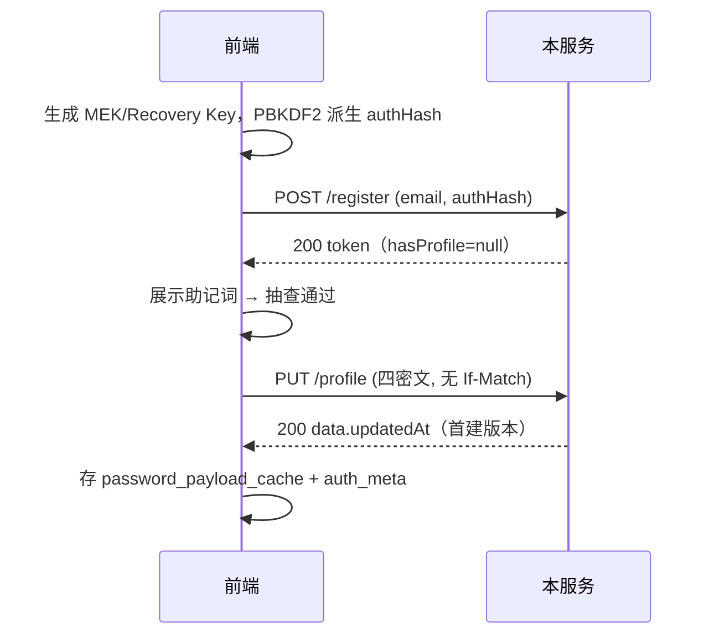
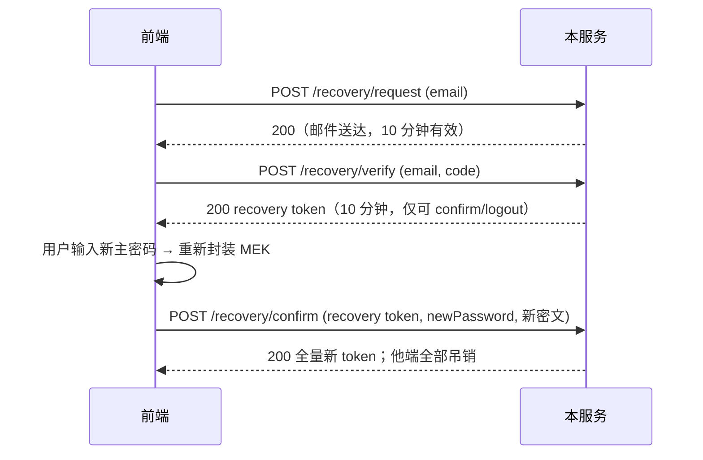

# E2EE 用户服务 · 接口文档 v1.0

> 后端：stock-calculator-service（Spring Boot 4.1.1，端口 18080）
> 对应设计：docs/e2ee-auth-backend-design.md（决策 B1-B10）
> 前端规范：前端《E2EE 鉴权与密钥管理系统 · 功能实现文档 v1.0》
> 本文所有示例均为 2026-08-31 真实环境冒烟实测记录。

---

## 1. 概述与通用约定

本服务为前端 E2EE 鉴权系统提供三组能力：**账号会话**（注册/登录/登出）、**密文档案**（读写 KEK/Recovery 封装的 MEK 密文）、**找回**（邮箱验证码三步改密）。

**零知识红线**：服务端永远只接触两种东西——
- `password` 字段：前端 PBKDF2-SHA256 派生的 **64 位小写 hex authHash**（主密码明文不出浏览器）；
- 密文四元组（Base64）：服务端只存储不解其语义。

| 约定 | 说明 |
|---|---|
| Base URL | `http://<host>:18080/api/auth` |
| 请求体 | `Content-Type: application/json` |
| HTTP 状态 | **恒 200**（唯一例外：未认证请求由拦截器直接写 HTTP 401） |
| 响应信封 | `{"code": 200, "message": "success", "data": ...}`，前端按 `code` 分支、不解析 message |
| 鉴权头 | `Authorization: Bearer <token>`（仅端点 3/4/5/8 需要） |
| CORS | `*` 全放行（Bearer 令牌无 cookie，无 CSRF 面） |
| 幂等性 | 登出幂等；profile 缺行 404 是合法中间态，不是错误 |

### 错误码语义（信封 code）

| code | 含义 | 前端建议处理 |
|---|---|---|
| 200 | 成功 | 正常分支 |
| 400 | 参数非法 / 邮箱或密码错误 / 验证码错误（统一文案，不区分细分原因） | 展示 message |
| 401 | 会话无效/过期/被吊销/recovery scope 越权 | 转 SIGNED_OUT 本地清理（HTTP 与信封 code 同为 401） |
| 404 | 密文档案缺行（**合法中间态**） | 进入孤儿引导 / 补传分支 |
| 409 | 注册邮箱已注册 / If-Match 版本冲突 | 按 message 语义区分；409 profile 必带 `data.updatedAt` |
| 429 | 限流 | 提示稍后重试，倒计时可用 60s |
| 500 | 邮件发送失败等系统级 | 提示稍后重试 |

---

## 2. 会话模型

- **令牌形态**：43 字符 base64url（256-bit 熵），落库为 SHA-256，泄露库也不泄露令牌；
- **TTL**：注册固定 7 天；登录可传 `ttlDays`（记住登录 7/30，服务端夹取 [1,30]）；
- **滑动续期**：服务端自动完成——距上次使用超过 TTL/2 的请求会顺延至满 TTL，**前端无需刷新调用**（等价 Supabase autoRefreshToken 的服务端侧）；
- **多端并存**：每个登录产生独立会话；登出只吊销当前；**改密吊销他端全部会话**；
- **重启不失效**：会话落库（实测：应用重启后旧 token 依然有效）；
- **recovery 受限会话**：找回验证通过后签发，**10 分钟硬过期**，且仅允许调用 `/recovery/confirm` 与 `/logout`，访问其他端点一律 HTTP 401。

---

## 3. 限流（429）

双维度计数（IP = `X-Forwarded-For` 首跳，无代理头时取直连地址；email 为请求体邮箱），超限即 429，**计数在业务逻辑之前**（非法请求也计入）：

| 端点 | IP 维度 | 邮箱维度 |
|---|---|---|
| `POST /register` | 5 次/小时 | — |
| `POST /login` | 30 次/15 分钟 | 10 次/15 分钟 |
| `POST /recovery/request` | 10 次/小时 | 3 次/小时 |
| `POST /recovery/verify` | 20 次/小时 | 10 次/小时 |

注意：限流为内存计数（Caffeine），**应用重启清零**；认证端点（3/4/5/8）无限流（由会话本身保护）。

---

## 4. 端点详情

### 4.1 注册（注册即登录）

`POST /register` · 无需鉴权

请求体：

| 字段 | 类型 | 说明 |
|---|---|---|
| email | string | 常规邮箱，服务端 trim+小写归一化 |
| password | string | **authHash**，64 位小写 hex（不合规直接 400） |

成功 `data`（AuthSessionResponse）：

| 字段 | 类型 | 说明 |
|---|---|---|
| userId | uuid | 用户 id，即后续档案归属 id |
| token | string | 会话令牌（TTL 7 天，注册固定不可调） |
| expiresAt | string | ISO-8601 带时区过期时间 |
| hasProfile | null | 注册流恒为 null |

| 错误 | 条件 |
|---|---|
| 400 邮箱格式不正确 | email 空白/过长/非邮箱形 |
| 400 主密码格式不正确 | password 非 64 位小写 hex |
| 409 该邮箱已注册 | 邮箱已存在（归一化后判定） |

```bash
curl -X POST http://localhost:18080/api/auth/register \
  -H 'Content-Type: application/json' \
  -d '{"email":"user@test.com","password":"<64位hex authHash>"}'
# -> {"code":200,"data":{"userId":"3a3b37e3-...","token":"ZFZmAmla...","expiresAt":"2026-09-07T13:15:21+08:00","hasProfile":null}}
```

### 4.2 登录

`POST /login` · 无需鉴权

请求体：`email`、`password`（同注册）、`ttlDays`（可选 int，记住登录 7/30，缺省 7）。

成功 `data`：同 4.1，`expiresAt` 按 ttlDays；**`hasProfile` 为三态**：

| hasProfile | 前端分支 |
|---|---|
| `false` | 账号存在但档案缺行 → 孤儿引导（重新封装上传）或补传 |
| `true` | 正常拉取密文档案解锁 |
| `null` | 仅注册流出现 |

| 错误 | 条件 |
|---|---|
| 400 邮箱格式不正确 / 主密码格式不正确 | 格式问题 |
| 400 邮箱或主密码错误 | 邮箱不存在与密码错误**统一文案**（防枚举），且服务端跑 dummy bcrypt 抹平时序 |

### 4.3 登出

`POST /logout` · 需鉴权（Bearer）· 无请求体

吊销当前会话（幂等）。成功 `data: null`。之后原 token 一切请求 → HTTP 401。

### 4.4 读密文档案

`GET /profile` · 需鉴权（Bearer）· 无请求体

成功 `data`（ProfileResponse）：

| 字段 | 类型 | 说明 |
|---|---|---|
| passwordPayload | string(Base64) | KEK 封装 MEK 的密文 |
| passwordIv | string(Base64) | 12 字节 IV |
| recoveryPayload | string(Base64) | Recovery Key 封装 MEK 的密文 |
| recoveryIv | string(Base64) | 12 字节 IV |
| updatedAt | string\|null | 服务端版本号，规范 UTC 文本（见 §5） |

| 错误 | 条件 |
|---|---|
| HTTP 401 | 无/坏/过期/已吊销 token，或 recovery scope 越权 |
| 404 用户档案尚未创建 | **合法中间态**：驱动孤儿引导 / 补传 |

锁屏解锁推荐链路：本地 `password_payload_cache` → 失败静默调本端点重拉 → 仍失败（404 或解密失败）再抛密码错误。

### 4.5 写密文档案（upsert + If-Match 乐观锁）

`PUT /profile` · 需鉴权（Bearer）

请求体（四密文均为客户端封装产物，服务端只验 Base64 合法性不解语义）：

| 字段 | 必填 | 说明 |
|---|---|---|
| passwordPayload | ✓ | KEK 封装 MEK 密文 |
| passwordIv | ✓ | IV |
| recoveryPayload | ✓ | Recovery 封装 MEK 密文 |
| recoveryIv | ✓ | IV |

请求头 `If-Match`（可选）：上次响应拿到的 `updatedAt`。

- **无行** → 无条件首建（不校验 If-Match），返回新版本；
- **有行** → If-Match 必须与服务端当前版本指向**同一时刻**（等价时区表示可接受），否则 409。

成功 `data`：同 4.4（**updatedAt 一定是本次写入后的新版本**）。

| 错误 | 条件 |
|---|---|
| 400 | 任一密文空白 / 非法 Base64 |
| 409 | 有行且 If-Match 缺失或不匹配；`data.updatedAt` 携带服务端最新版本 |

```bash
curl -X PUT http://localhost:18080/api/auth/profile \
  -H 'Authorization: Bearer <token>' \
  -H 'If-Match: 2026-08-31T05:25:17.230304Z' \
  -H 'Content-Type: application/json' \
  -d '{"passwordPayload":"cGF5bG9hZC12Ng==","passwordIv":"MTIzNDU2Nzg5MDEy","recoveryPayload":"cmVjb3ZlcnktcGF5bG9hZA==","recoveryIv":"MTIzNDU2Nzg5MDEy"}'
# 409 -> {"code":409,"message":"档案版本冲突，请以助记词恢复","data":{"updatedAt":"..."}}
```

### 4.6 请求找回验证码

`POST /recovery/request` · 无需鉴权

请求体：`{ "email": "..." }`

- 未知邮箱也返回 200（恒不泄露邮箱存在性，静默跳过）；
- 已知邮箱 → 发送 6 位验证码邮件（10 分钟有效、60s 同邮箱冷却、单次消费、5 次尝试锁死）。

| 错误 | 条件 |
|---|---|
| 429 | 冷却/限流（同邮箱 3 次/小时） |
| 500 验证码邮件发送失败 | SMTP 未配置或发送异常；**验证码不落库**（事务回滚，无死码） |

### 4.7 校验验证码（签发 recovery 会话）

`POST /recovery/verify` · 无需鉴权

请求体：`{ "email": "...", "code": "123456" }`（code 含空白时自动剔除，防误粘贴）

成功 `data`：AuthSessionResponse，**scope=recovery**（10 分钟硬过期，仅可调 4.8 与 4.3）。

| 错误 | 条件 |
|---|---|
| 400 验证码错误或已过期 | 格式错/无待验证码/过期/错误码/已被消费/用户缺失 —— 统一文案；错误码累计 5 次后当前码作废 |

### 4.8 确认改密（原子操作）

`POST /recovery/confirm` · 需鉴权（**Bearer recovery 会话**）

请求体：

| 字段 | 必填 | 说明 |
|---|---|---|
| newPassword | ✓ | 新 authHash（64 位小写 hex） |
| passwordPayload | ✓ | 新 KEK 封装 MEK 密文 |
| passwordIv | ✓ | 新 IV |

单事务内原子完成：bcrypt 新 authHash → 更新 password 密文（**recovery_payload 不变**，助记词未更换）→ 吊销他端全部会话 → 签发全量新会话。

成功 `data`：AuthSessionResponse（全量会话，TTL 7 天）。

| 错误 | 条件 |
|---|---|
| HTTP 401 | 无/坏 recovery 会话（含过期）或用了全量会话调用（scope 越权） |
| 400 主密码格式不正确 | newPassword 非 64 hex |

注意：**改密成功后，其他所有已登录设备（含原全量 token）全部失效**（HTTP 401）→ 前端转 SIGNED_OUT 本地清理。

---

## 5. If-Match 版本约定（重要）

`updatedAt` 兼作档案版本号，由服务端生成，**统一规范为 UTC 文本**（形如 `2026-08-31T05:25:17.230304Z`）。

- 前端规则：**每次写请求回传上一次响应（PUT/GET/409）中的 `updatedAt` 原文即可**；
- 服务端按时刻比较而非文本比较：等价时区表示（如 `+08:00`）同样匹配（实测验证）；
- 收到 409 时：拿 `data.updatedAt` 刷新本地版本，**不得盲目重试覆盖**——先决策哪份密文为准（冲突语义：另一设备可能刚改过密码封装；无法决策时提示以助记词恢复）。

---

## 6. 典型时序

### 注册 → 备份 → 首传



### 找回三步



---

## 7. 前端对接注意

1. **hasProfile 三态**见 §4.2：`false` 是孤儿引导信号，不是错误；
2. **404 合法中间态**：登录后首次 GET /profile 404 属正常，进入补传分支；
3. **改密/改密后旧 token 401**：拦截器 401（HTTP 与信封同码）→ 转 SIGNED_OUT 清理本地会话态；
4. **邮件 500**：部署后若 SMTP 未配置，/recovery/request 对已知邮箱稳定 500；配好 SMTP 后自然恢复，前端只需统一提示；
5. **Supabase 兼容映射**：signUp→4.1、signInWithPassword→4.2、signOut→4.3、from(user_profiles).select→4.4、upsert→4.5、resetPasswordForEmail→4.6、verifyOtp→4.7、再无 updateUser 需求（由 4.8 承担）；
6. **本地 auth_meta 待传队列**：PUT /profile 失败（网络类）时入队，重连后带 If-Match 重放；收到 409 先拉服务端版本决策。

---

## 8. 部署前提

| 项 | 说明 |
|---|---|
| DDL | 4 表已建（users / user_profiles / auth_sessions / otp_codes），与业务表共存无冲突 |
| `app.auth.enabled` | main 变体 application.yml 已开；native 变体不配置即整体关闭 |
| `SMTP_HOST` / `SMTP_PORT` / `SMTP_USERNAME` / `SMTP_PASSWORD` | 必须注入，否则找回链路 500 |
| `MAIL_FROM` | 可选发件人，空则用 SMTP 默认值 |
| DB | `POSTGRES_URL` / `POSTGRES_USER` / `POSTGRES_PASS`（默认 localhost/scs） |

---

## 9. 冒烟实测记录（2026-08-31，真实 DB + 真实 HTTP）

| # | 用例 | 结果 |
|---|---|---|
| 1 | 注册成功（TTL 7 天） | ✅ 200 |
| 2 | 重复注册 / 非法 authHash | ✅ 409 / 400 |
| 3 | 登录成功（混合大小写邮箱归一化，hasProfile=false） | ✅ 200 |
| 4 | 密码错 / 邮箱不存在（统一文案） | ✅ 400 |
| 5 | 无 token → HTTP 401 信封体 | ✅ |
| 6 | GET profile 缺行 404 | ✅ |
| 7 | 首建 / 更新 / 过期 If-Match 409 | ✅（修复后） |
| 8 | 登出后原 token 401，其他会话不受影响 | ✅ |
| 9 | 未知邮箱静默 200；已知邮箱 500 + 事务回滚无死码 | ✅ |
| 10 | 错误验证码 attempts+1 持久化 / 正确码签发 recovery 会话（10 分钟） | ✅（修复后） |
| 11 | recovery scope 访问 /profile → HTTP 401 | ✅ |
| 12 | confirm 原子改密：新会话签发 + 他端全部吊销 + recovery_payload 不变 | ✅ |
| 13 | 旧密码 400 / 新密码 200（hasProfile=true） | ✅ |
| 14 | 限流：同邮箱第 4 次 /recovery/request → 429 | ✅ |
| 15 | 应用重启后会话仍有效（落库验证） | ✅ |

实测中发现并修复的三个缺陷（均已回归验证）：

1. **P0** `save()` 不即时 flush → 首建/更新响应携带 null/旧版本号 → 改 `saveAndFlush()`；
2. **P0** 版本号时区表示不稳定（Hibernate 生成 `+08:00` vs JDBC 读回 `Z`）→ If-Match 字符串比较误判 409 → 输出规范 UTC + 按时刻比较；
3. **P0** OTP 失败计数随事务回滚，「5 次锁死」永不生效 → verify 链路去除外层事务，计数独立提交。
