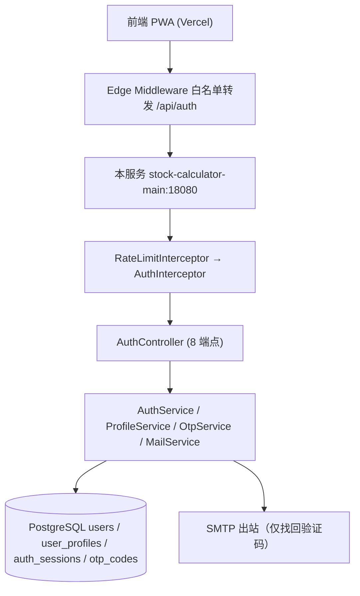
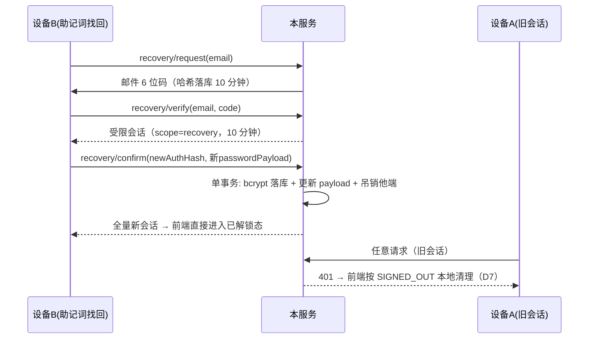

# E2EE 用户服务后端 · 设计方案

> 版本：v1.0（2026-08-31）
> 定位：为前端《E2EE 鉴权与密钥管理系统 v1.0》（下称《前端 spec》，位于前端仓库 docs/e2ee-auth-spec.md，章节号 §x 均指该文档）提供**用户相关服务**，与现有 /api/import（OCR 识别）并列的后端服务模块。
> 配套文档：实行方案 docs/e2ee-auth-backend-implementation.md（文件级任务拆解与验收标准）。
> 状态：待评审冻结（对应实行方案 B0 阶段）。

---

## 0. 已确认决策记录

| # | 决策点 | 结论 |
|---|--------|------|
| B1 | 服务定位 | 按前端实际调用需求提供用户服务（会话 / 密文档案 / 找回），缺什么补什么，不多做；与前端配套使用，不托管业务数据 |
| B2 | 零知识红线 | 服务端只见 authHash（64 位小写 hex）与四段密文；authHash 落库前必须 bcrypt(10)；任何日志 / 异常 / toString 不得输出密码相关值 |
| B3 | 会话令牌 | 不用 JWT：不透明随机令牌（256-bit SecureRandom → base64url），SHA-256 哈希落库 auth_sessions；牺牲无状态性换取可吊销性 |
| B4 | 改密吊销 | 改密成功 → 吊销除当前会话外全部会话（对齐《前端 spec》§6.5 注 9） |
| B5 | 覆盖竞态 | PUT profile 携带 If-Match（客户端已知的 updated_at），不匹配返回 409（防御跨设备孤儿竞态，见 §6.4） |
| B6 | 找回原子性 | recovery/confirm 单事务完成：bcrypt 新密码 + 写新 password_payload + 吊销他端（消除《前端 spec》§6.5 步骤 5/6 的失配窗口） |
| B7 | 邮箱枚举 | 注册端点保留"该邮箱已注册"文案（《前端 spec》§8 明确要求）；找回 request 恒返回 200 静默处理不存在邮箱；取舍已记录 |
| B8 | 响应契约 | 沿用项目惯例：ApiResponse 信封 + 业务码，HTTP 200 承载业务错误；唯一例外：拦截器对未认证请求写 HTTP 401 + 信封体 |
| B9 | 限流实现 | Caffeine（main 模块已有依赖）；限流拦截器放 main 模块，common 不新增依赖 |
| B10 | native 隔离 | 鉴权相关 Bean 标注 @ConditionalOnProperty("app.auth.enabled")，仅 main 变体开启；防止 common 层鉴权组件污染 native 变体（历史已有 JPA 泄漏教训） |
| B11 | 存储分层 | PostgreSQL 唯一事实源 + Redis 热读缓存（cache-aside：resolve 缓存优先→回源回填，TTL=min(300s, 剩余有效期)，吊销/续期写库后立即驱逐）；限流计数同步迁 Redis（INCR 固定窗口，重启不清零，消除 B9 的 P2 取舍）；Redis 故障降级：会话回源 DB、限流 fail-open 放行，不阻塞认证主链路；spring-boot-starter-data-redis 仅引入 main 模块 |
| B12 | 内存缓存退场 | 全应用内存缓存代码移除（Caffeine 依赖、spring-boot-starter-cache、@EnableCaching、spring.cache 配置全部删除），视觉识别结果同步迁 Redis（决策 B11 的延伸）：OCR 文本 `vision:ocr:text:<MD5>` / 交易草稿 `vision:ai:draft:<MD5>`（JSON）/ 多模态执行器 `vision:executor:<cacheKey>`（TTL 24h 沿用原 genericVisionCache 语义），统一经 `VisionCacheStore` 接口（Redis 实现，故障降级同 B11），详见 docs/ocr-llm-pipeline.md |

---

## 1. 服务定位与边界

### 1.1 定位

后端不"接管"前端账号体系，而是按《前端 spec》的实际交互面提供四组用户服务；前端除替换数据源适配器（原 §5.1 supabaseClient → 薄 API 适配器）外，密码学核心、AuthDB_v1、状态机、4 个 Modal 零改动。验证标准：前端除换数据源外感知不到后端的存在。

### 1.2 范围边界

| 范围内 | 范围外（明确不做） |
|--------|-------------------|
| 会话：register / login / logout / 校验与节流续期 | 业务账本存储（前端本地 Dexie 自治，《前端 spec》D5/D6） |
| 密文档案：profile GET / PUT（仅属主，仅密文四元组） | 密钥托管（零知识红线，决策 B2） |
| 找回：邮箱 OTP + verify + 原子 confirm | 邮箱确认流（《前端 spec》D8）、OAuth / Magic Link |
| 改密吊销他端 + 登出 | 云端密文同步（二期，《前端 spec》§13）、多标签页锁定同步（前端 backlog） |

---

## 2. 总体架构

### 2.1 模块归属

| 模块 | 归属内容 | 依据 |
|------|----------|------|
| stock-calculator-common | entity / repository / dto / service（AuthService、ProfileService、OtpService、MailService、SessionService） | 项目分层惯例（实体与业务在 common） |
| stock-calculator-main | AuthController、AuthInterceptor、RateLimitInterceptor、AuthProperties、application.yml 变更 | Controller 惯例（参照 ImportController）；生产镜像仅构建 main 变体（Dockerfile 现状） |
| stock-calculator-native | 不改动；靠 @ConditionalOnProperty("app.auth.enabled") 隔离 | 决策 B10 |

### 2.2 复用清单（不重复造轮子）

| 现有设施 | 复用方式 |
|----------|----------|
| ApiResponse{code,message,data} | 统一响应信封（决策 B8） |
| BusinessException(code,message) + GlobalExceptionHandler | 业务错误抛出与兜底；新增 auth 业务码常量类 |
| Caffeine（main 已有） | 限流桶与会话续期节流缓存 |
| 虚拟线程（已开启） | SMTP 阻塞发送无需异步改造 |
| PhysicalNamingStrategyStandardImpl | 列名手工标注（snake_case），与现有实体一致 |

---

## 3. 数据模型（4 张表）

> 完整 DDL 见实行方案 §2.2；本节定义字段语义。主键风格对齐《前端 spec》§11：users.id 用 uuid，user_profiles.id 同型引用，前端 UserProfile 类型零改动。

### 3.1 users
| 列 | 类型 | 约束 | 说明 |
|----|------|------|------|
| id | uuid | PK | 对齐《前端 spec》user_profiles.id 引用型 |
| email | varchar(255) | UNIQUE NOT NULL | 归一化（小写 + trim）后落库；服务端收到后再归一化兜底 |
| password_hash | varchar(60) | NOT NULL | bcrypt(10) over authHash；authHash 原文不落任何存储 |
| created_at / updated_at | timestamptz | 自动 | |

### 3.2 user_profiles（列名与《前端 spec》§4.1 / §11 完全一致）
| 列 | 类型 | 说明 |
|----|------|------|
| id | uuid PK/FK → users | on delete cascade |
| password_payload / password_iv | text / varchar(32) | KEK 封装 MEK 密文（客户端产物，服务端只存不解） |
| recovery_payload / recovery_iv | text / varchar(32) | Recovery Key 封装 MEK 密文 |
| updated_at | timestamptz NOT NULL | 服务端维护；**同时作为 If-Match 版本号** |

### 3.3 auth_sessions
| 列 | 类型 | 说明 |
|----|------|------|
| id | uuid PK | |
| user_id | uuid NOT NULL | 索引 |
| token_hash | varchar(64) UNIQUE NOT NULL | SHA-256(token) hex；token 原文不落库 |
| scope | varchar(16) DEFAULT 'full' | full / recovery（受限会话见 §4.3） |
| expires_at | timestamptz NOT NULL | 滑动续期目标列 |
| last_seen_at | timestamptz | 节流续期依据 |
| revoked_at | timestamptz NULL | 吊销标记（logout / 改密） |
| created_at | timestamptz | |

### 3.4 otp_codes
| 列 | 类型 | 说明 |
|----|------|------|
| id | bigserial PK | |
| email | varchar(255) NOT NULL | 索引；归一化后 |
| code_hash | varchar(64) NOT NULL | SHA-256(6 位码)；不存原文 |
| purpose | varchar(16) DEFAULT 'recovery' | 预留多用途 |
| attempts | int DEFAULT 0 | ≥5 拒绝校验 |
| expires_at / consumed_at / created_at | timestamptz | 10 分钟 / 单次消费 |

---

## 4. API 契约

### 4.1 统一信封与错误码

响应体一律 ApiResponse；HTTP 状态除拦截器 401 外恒 200（决策 B8）。

| 业务码 | 语义 | 前端文案（对齐《前端 spec》§8） |
|--------|------|--------------------------------|
| 200 | 成功 | — |
| 400 | 参数错误 / 凭证错误 / OTP 错误 | "邮箱或主密码错误"、"验证码错误或已过期"（按端点区分） |
| 401 | 未认证 / 会话失效 | 适配器转 SIGNED_OUT 本地清理（D7 路径） |
| 404 | profile 缺行 | 合法中间态，触发孤儿引导 / 补传分支 |
| 409 | 邮箱已注册 / If-Match 版本冲突 | "该邮箱已注册，请直接登录" / "档案版本冲突，请以助记词恢复" |
| 429 | 限流 | "尝试次数过多，请稍后再试" |

message 一律中文可读；前端适配器按 code 语义分支，不解析 message 内容。

### 4.2 端点详表（8 个）

| # | 端点 | 请求 | 成功 data | 失败码 | 前端调用方 |
|---|------|------|-----------|--------|-----------|
| 1 | POST /api/auth/register | {email, password} | {userId, token, expiresAt} | 409 / 429 | §6.2 步骤 A（等价 signUp 返回 Session）；**不接收任何密文**（D9 不变量） |
| 2 | POST /api/auth/login | {email, password, ttlDays?} | {userId, token, expiresAt, hasProfile} | 400 / 429 | §6.3；hasProfile 驱动缺行分支（等价 maybeSingle 语义） |
| 3 | POST /api/auth/logout | Bearer | null | 401 | §6.6；吊销当前会话 |
| 4 | GET /api/auth/profile | Bearer | 四密文 + updatedAt | 404 | §6.1 / §6.3 / §6.4 第二级静默重拉 |
| 5 | PUT /api/auth/profile | Bearer + If-Match | {updatedAt} | 409 | §6.2 步骤 G / 补传 / 孤儿引导 |
| 6 | POST /api/auth/recovery/request | {email} | null（恒 200） | 429 | §7.5 Step 1（等价 resetPasswordForEmail） |
| 7 | POST /api/auth/recovery/verify | {email, code} | {token, expiresAt}（scope=recovery） | 400 / 429 | §6.5 步骤 3（等价 verifyOtp） |
| 8 | POST /api/auth/recovery/confirm | Bearer(recovery) + {newPassword, passwordPayload, passwordIv} | {token, expiresAt} | 400 / 401 | §6.5 步骤 5-8 一次完成（决策 B6 原子化） |

说明：
- 端点 8 吊销他端后签发**全量新会话**，前端置已解锁态（§6.5 步骤 8）；
- recovery_payload 在端点 8 **不更新**（助记词未更换，对齐 §6.5 步骤 6）；
- register / login 的 password 即 authHash；服务端校验 64 位小写 hex（见 §5.1）；
- register 与 profile 上传**不得合并**为单端点，否则破坏 D9 不变量。

### 4.3 会话模型（决策 B3）

| 项 | 设计 |
|----|------|
| 令牌形态 | SecureRandom 32 字节 → base64url（43 字符）；请求头 Authorization: Bearer |
| 落库 | SHA-256(token) hex；校验用 MessageDigest.isEqual（常量时间） |
| TTL | register / login 按 ttlDays（7 或 30）签发；上限 30 |
| 滑动续期 | 随任意已认证请求检查：剩余不足 50% TTL 时顺延至满 TTL（节流防写放大）；等价前端 autoRefreshToken / D3 |
| recovery 受限会话 | scope=recovery，硬过期 10 分钟，仅允许调端点 8 与端点 3 |
| 吊销 | logout → 当前；改密（端点 8）→ 全部他端；一切以表为准，无隐式状态 |

### 4.4 If-Match 语义（决策 B5）

| 场景 | 规则 |
|------|------|
| profile 无行（首次创建） | 无条件允许 PUT 创建（两设备同时首建时，后到者自动落入"已有行"分支被拦） |
| profile 已有行 | 必须携带 If-Match: <客户端已知的 updatedAt>；缺失或实测不符 → 409，data 返回服务端 updatedAt 供冲突处理 |
| 前端冲突处理 | 409 → 提示"档案版本冲突" → 引导走助记词恢复（对齐《前端 spec》§6.5 语义），**不得盲目重试覆盖** |

> 无 If-Match 的后果推演见 §6.4：旧设备待传队列会静默覆盖新设备的密文，造成"解锁失败 + 助记词找回也失败"的死循环。

---

## 5. 密码与安全设计

### 5.1 authHash 处理（决策 B2）

1. 入参校验：长度 64 且正则匹配 0-9a-f 小写，否则 400 —— 同时保证 bcrypt 72 字节输入上限内（64 hex 字符 = 64 字节），**杜绝静默截断**；
2. 落库：BCryptPasswordEncoder(strength = 10)（spring-security-crypto 独立构件，仅引入 BCrypt 实现，不引入 Security 过滤链，现有开放端点零影响）；
3. 高熵论证：authHash 本身 256-bit，bcrypt 在此防的是"拖库后 pass-the-hash"，而非离线爆破（数学上不可行），cost 10 足够——对齐《前端 spec》§3 注记 1 的评审结论；
4. 登录时序安全：用户不存在时也执行一次 dummy bcrypt matches，抹平响应时间差。

### 5.2 OTP 安全参数（找回唯一通道）

| 参数 | 值 |
|------|-----|
| 码型 | 6 位数字，SecureRandom |
| 有效期 | 10 分钟 |
| 消费 | 单次（consumed_at 置位后作废） |
| 尝试上限 | 5 次，超限后该码作废，需重新申请 |
| 发送冷却 | 同邮箱 60 秒（对齐《前端 spec》§7.5 倒计时） |
| 落库 | SHA-256 哈希；比较用常量时间 |
| 限流 | 每邮箱 + 每 IP 双维（§5.4） |
| 邮箱不存在 | 静默不发，响应恒 200（与注册端点的枚举策略不同：找回是攻击敏感路径） |

### 5.3 日志与异常纪律（必须写入代码注释）

- RegisterRequest / LoginRequest / RecoveryConfirmRequest 等含 password 的 DTO：Lombok @ToString.Exclude 标注 password 字段；
- 禁止在 log 语句输出 password / token / 邮件验证码；GlobalExceptionHandler 兜底日志不含请求体；
- token / OTP 比较：MessageDigest.isEqual；bcrypt.matches 本身安全。

### 5.4 限流矩阵（Caffeine，决策 B9）

| 端点 | 维度 | 阈值 | 超限 |
|------|------|------|------|
| register | IP | 5 / 小时 | 429 |
| login | IP + email | 10 / 15 分钟 | 429 |
| recovery/request | email + IP | 3 / 小时 | 429 |
| recovery/verify | email | 10 / 小时 | 429 |

Caffeine expireAfterWrite 对齐窗口；重启清零可接受（个人规模，P2 已知限制）；后端经 Vercel 代理，IP 取 X-Forwarded-For 首跳（可伪造边界已记录于注释）。

---

## 6. 关键时序推演（后端视角）

### 6.1 注册闭环（《前端 spec》§6.2 / D2 / D9）

register 发会话（不收密文）→ 前端抽查通过 → PUT profile（首建，无 If-Match）→ 闭环。
上传失败：密文留前端待传队列；下次登录 hasProfile=false 触发补传 PUT（登录后 GET 得 404 即缺行场景，走首建分支）。

### 6.2 孤儿引导（《前端 spec》§6.1）

登录成功 hasProfile=false 且无待传队列 → 前端重生成 MEK + 助记词 → PUT profile 首建。profile 缺行（404）是一等合法状态，**不是错误**。

### 6.3 锁屏三级兜底（《前端 spec》§6.4 / D4）

链路在前端本地闭环（本地缓存 → 静默重拉 → 报错）；后端仅参与第二级的 GET profile，无新增要求。

### 6.4 跨设备孤儿竞态（决策 B5 依据，《前端 spec》未覆盖）

| 步骤 | 设备 A（有待传队列） | 设备 B | 服务端 profile |
|------|----------------------|--------|----------------|
| 1 | 抽查通过但上传失败 → 密文入本地待传 | — | 缺行 |
| 2 | — | 登录 → 缺行 → 孤儿引导首建（B 的 MEK 封装） | B 的密文 |
| 3 | 登录补传，**盲目 PUT** | — | 被 A 的旧密文覆盖（无 If-Match 时） |
| 4 | — | 解锁 unwrap 失败 → 助记词找回 unwrap 也失败 | 死循环 |

一期无云端业务数据，MEK 丢失无实损，但用户观感是"账号报废"。**有 If-Match 时**：步骤 3 的 A 缺失或携带旧值 → 409 → A 引导走助记词恢复，B 不受影响。

### 6.5 找回与改密吊销（《前端 spec》§6.5 / 决策 B4 / B6）

---

## 7. 部署与配置

### 7.1 新增环境变量（docker-compose environment 注入）

| 变量 | 说明 |
|------|------|
| SMTP_HOST / SMTP_PORT | 出站邮件服务器 |
| SMTP_USERNAME / SMTP_PASSWORD | SMTP 凭据 |
| MAIL_FROM | 发件人（如 股票计算助手 <no-reply@example.com>） |

yml 内以 Spring 占位符引用（写法对齐 application.yml 现有 GEMINI_API_KEY 条目）；不引入其他密钥——会话令牌运行时随机生成，不入配置。

### 7.2 网络与 CORS

| 环境 | 方案 |
|------|------|
| 生产（Vercel PWA） | Edge Middleware 白名单新增 /api/auth → 后端域名（复用 /api/import 转发模式，同源免 CORS）；直连兜底 @CrossOrigin(origins = "*")（沿用 ImportController 先例；Bearer 头无 cookie，无 CSRF 面） |
| 开发 | vite server.proxy 新增 /api/auth 条目 |

### 7.3 DDL 执行

jpa.ddl-auto=none（现状），4 张表 DDL 追加至 postgres/schema.sql（CREATE TABLE IF NOT EXISTS 风格），部署时手工执行——与现有流程一致，README 增加提示防遗漏。

---

## 8. 《前端 spec》修订指引（仅三节，其余零改动）

| 章节 | 修订内容 |
|------|----------|
| §5.1 | supabaseClient → 薄 API 适配器（fetch + Bearer + §4.1 code 映射）；Session 持久化改为本地 token + expiresAt |
| §8 | 异常源判定由 AuthApiError 改为业务 code；文案映射表结构不变 |
| §11 | 部署前提由 Supabase Dashboard 操作项替换为：后端 env（SMTP 等）+ DDL 执行 + middleware 白名单；邮件模板 {{ .Token }} 要求改为后端内置验证码模板 |

§3 密码学参数、§5.2-5.4 服务设计、§5.5 状态机、§7 UI 规格、AuthDB_v1——全部零改动。

---

## 9. 二期预留（《前端 spec》§13 对应）

user_data(user_id, data_payload, data_iv, version, updated_at)，属主校验同 profile；version 乐观锁留二期设计。本期仅要求前端 encryptPayload / decryptPayload 单测就绪（前端范围）。
