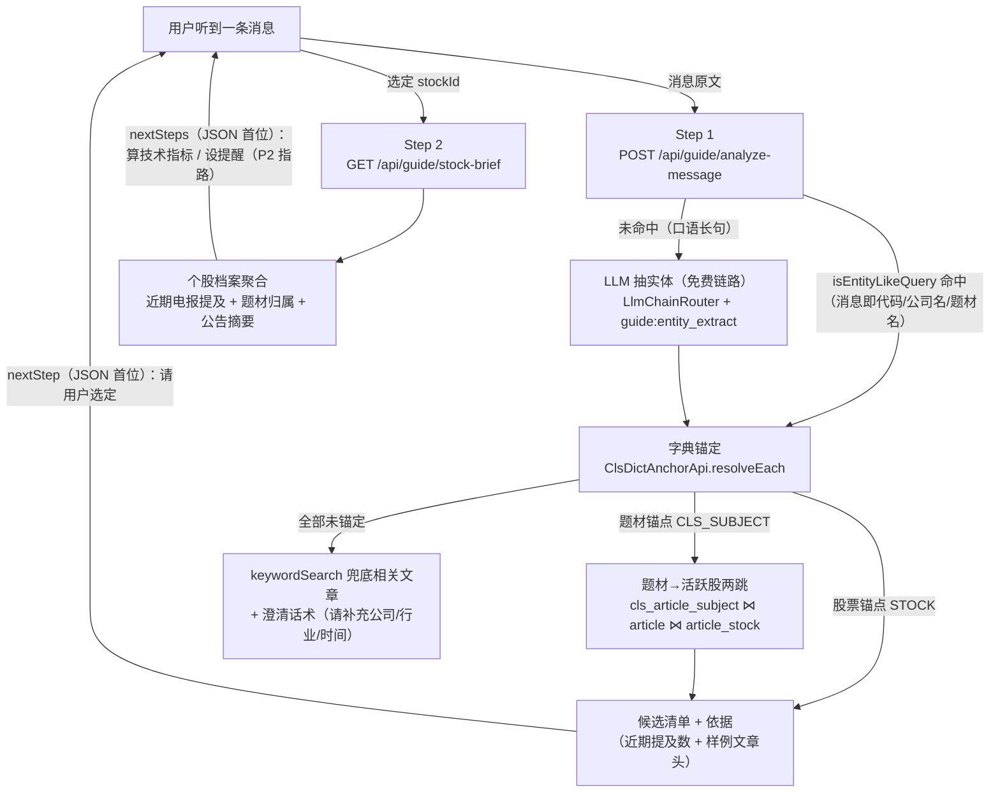
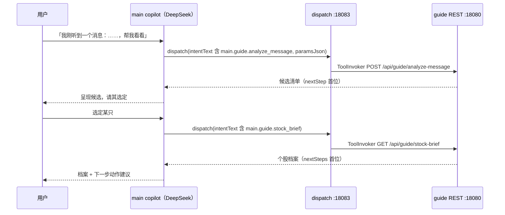

# 选股引导设计（guide 域）

> main 服务的选股引导业务：用户听到一条消息（新闻/传闻）后，从消息出发两步走到候选股票与个股档案。
> 跨域数据经各域基包门面组装，不建表无状态；copilot 聊天经 dispatch 网关自主调用，前端向导 UI 留 API 地基。
> **状态：设计已评审定案（2026-09-25），代码未落地——按本文档施工。**

## 一、背景与目标

现状痛点：没有引导流程，用户面对工具面（经纪人 MCP 工具 / 聊天 / 画布）不知道第一步操作什么。
高频真实场景是「刚听到一个消息，想看看有什么机会」——但「从一段口语转述的消息找到相关股票」
在现有工具面上没有端到端路径：消息解析、题材→股票、个股资讯聚合各自散落在不同域。

目标：一个**确定性的引导引擎**（REST 两步向导）+ 一个**聊天入口**（copilot 经 dispatch 自主调用），
从「用户听到一条消息」引导到「候选股票清单 → 个股档案 → 下一步动作建议」。

**已定案取向（2026-09-25 评审）**：

- 业务落 **main 服务**独立 guide 域（相关数据全在 main：电报文章/mentions、题材字典、股票字典、公告摘要）；
- 引擎 REST + 聊天引导**一次到位**；
- 流程终点 = **个股档案为止**（纯 main 数据；技术面快照/提醒联动为 P2 指路文案）。

## 二、范围与非目标

**范围内（v1）**：

- guide 新域（main 模块）：两步向导 REST 端点 + LLM 实体抽取 + 字典锚定 + 题材两跳；
- crawler 基包扩展：逐名锚点解析 + 3 个两跳查询（含 native SQL）；
- search 基包小门面：StockProfileApi（公告摘要）；
- orchestration ToolRegistry.REST_SEEDS 登记 2 个 guide 工具（聊天入口）；
- postgres/data.sql 播种 `guide:entity_extract` 抽取模板（热调）；
- 单测 + EXPLAIN 验证 + 冒烟。

**非目标（P2 展望，本期不做）**：

- 技术面快照：经 dispatch 调 :18081 指标/位带（需 broker 域基包新增门面，本期仅 nextSteps 文案指路）；
- 提醒登记联动（notify reminder，文案指路「帮我设个提醒」）；
- KG 时间线聚合（kg 域基包无查询门面，需先补）；
- `guide:stock_selection` copilot 系统提示词模板（注入路径待前端引导页 scopeId 或 taskType 路由，见 D7）；
- 前端向导 UI（本设计只交付 API 地基）；
- 全市场选股/回测（属 mcp 路线二独立 epic，与本引导无关）。

## 三、引导流程

### 3.1 引擎两步向导



**Step 1 消息→候选股**（`POST /api/guide/analyze-message`，body `{message, days?=7}`）：

1. **快路径**：`ClsArticleQueryApi.isEntityLikeQuery(message)` 命中（消息本身是代码/公司名/题材名短查询）
   → 直接 `ClsDictAnchorApi` 锚定，零 LLM 成本秒回。
2. **慢路径**：`LlmChainRouter.chat` 按抽取契约把口语消息转成候选实体名（`{entities:[...], keywords:[...]}`
   JSON 输出；虚拟线程 + 超时 + `isDegradedResponse` 守卫，照 CompositeSearchService 范式），
   逐名经锚点 API 锚定——**未锚定的丢弃不编造**（D4），未锚定名回显为 keywords 供澄清。
3. 股票锚点 → 直接入候选；题材锚点 → 题材→近 N 天活跃股票两跳（新基包方法，按提及文章数降序）。
4. 每个候选带依据：`{stockId, stockName, hitType(STOCK|SUBJECT), hitName, recentMentionCount, sampleArticles[≤2]}`。
5. 候选为空：澄清话术 + `keywordSearch`（LLM keywords / 消息清洗词）兜底相关文章。

**Step 2 个股档案**（`GET /api/guide/stock-brief?stockId=&days=7`）：聚合近期电报提及
（`countByStockCodeSince` + 近几条文章头）、近期题材归属标签（反向两跳）、公告摘要（search 域
StockProfileService），附 `nextSteps` 动作建议。

### 3.2 聊天入口（copilot 路径）



可发现性成立依据：copilot 只挂 dispatch 一个工具；意图零命中时 dispatch 回**全量能力菜单**
（注册表动态生成，2026-09-25 自纠闭环），LLM 同轮带工具名 + paramsJson 重发即精准命中。
guide 两工具登记进 `ToolRegistry.REST_SEEDS`（kind=rest，risk=read → plannable）后自动进菜单，
路由按工具名唯一前缀 `main.guide.*` 确定性命中（DispatchRouter：工具名 100 分 / 域名 10 分，并列即澄清）。

## 四、API 契约

### 4.1 端点

| 端点 | 入参 | 返回（字段序即序列化序） | 背后 |
|---|---|---|---|
| `POST /api/guide/analyze-message` | `{message 必填, days?=7（1-30 钳制）}` | nextStep → candidates → entities → keywords → llmDegraded | 锚定 + LLM 抽取 + 题材两跳 |
| `GET /api/guide/stock-brief` | query `stockId 必填, days?=7` | nextSteps → stockId/stockName → clsMention → subjects → announcements | 提及 + 反向题材 + 公告档案 |

- 统一 ApiResponse 信封，异常交 GlobalExceptionHandler；`/api/guide/**` **不挂** AuthInterceptor——
  本端点族同时是 orchestration 工具面，ToolInvoker 无用户会话，对齐 `main.announcement.summaries`
  先例（只读聚合 + 本地自用裸跑；设计早期「挂拦截」表述已废弃，见 D10）。

### 4.2 响应骨架（字段顺序为红线②约束）

```json
{
  "nextStep": "向用户呈现候选清单并请其选定关注对象；选定后调用 main.guide.stock_brief 取个股档案",
  "candidates": [
    {"stockId": "300750", "stockName": "宁德时代", "hitType": "STOCK", "hitName": "宁德时代",
     "recentMentionCount": 12,
     "sampleArticles": [{"articleId": 12345, "title": "……", "ctime": 1758750000}]}
  ],
  "entities": [{"name": "宁德时代", "anchorType": "STOCK", "anchorId": "300750"}],
  "keywords": ["储能"],
  "llmDegraded": false
}
```

```json
{
  "nextSteps": ["让 AI 算技术指标核实形态（画布或聊天里说「算下形态」）",
                 "说「帮我设个提醒」跟踪后续（P2 前为人工动作指引）"],
  "stockId": "300750", "stockName": "宁德时代",
  "clsMention": {"count": 12, "articles": [{"articleId": 12345, "title": "……", "ctime": 1758750000}]},
  "subjects": [{"subjectId": 88, "subjectName": "固态电池", "articleCount": 5}],
  "announcements": [{"annDate": "2026-09-20", "title": "……", "summary": "……"}]
}
```

### 4.3 orchestration 工具登记（REST_SEEDS）

| tool_name | endpoint | 形态原因 |
|---|---|---|
| `main.guide.analyze_message` | `POST /api/guide/analyze-message`，params `{message, days}` | ToolInvoker POST 分支 body(arguments) 已支持 JSON 体 |
| `main.guide.stock_brief` | `GET /api/guide/stock-brief`，params `{stockId, days}` | **GET query 形态而非 path variable**：ToolInvoker GET 分支把 arguments 平铺为 query 键值，不支持路径模板；与先例 `main.announcement.summaries` 口径一致 |

公共：domain=guide、risk=read（→ plannable）、execution_mode=sync（网关直接代调）、output_policy=keep_head。

## 五、改动清单（待实施）

| # | 落点 | 内容 |
|---|---|---|
| 1 | crawler 基包 | `ClsDictAnchorApi.resolveEach(Collection<String>)` → `List<NamedAnchor(name, anchorType, anchorId)>`（现 `resolveByName` 为首个命中即返回的单锚点语义） |
| 2 | crawler 基包 | `ClsArticleQueryApi` + 3 方法：`recentArticlesByStock(stockId, sinceCtime, limit)`（近期提及文章头，复用 `ArticleHead` record）、`subjectsByStockSince`（反向题材归属，新 record）、`activeStocksBySubject`（题材→活跃股两跳聚合，新 record） |
| 3 | crawler repository | native 查询（关联表无 JPA 关联，照 `countDistinctArticleIdByStockIdSince` 的 native join 范式）：`ClsArticleStockRepository.articleIdsByStockIdSince` / `subjectsByStockIdSince`；`ClsArticleSubjectRepository.activeStocksBySubjectSince` |
| 4 | search 基包 | `StockProfileApi` 门面（基包接口 + Impl 委托 `StockProfileService.profile`，返回基包 record，避免 guide 引 search.dto 子包） |
| 5 | guide 新域 | `controller/GuideController` + `service/GuideAnalyzeService` + `service/GuideStockBriefService` + `dto/GuideDtos`（单文件，照 SearchDtos 惯例）；`/api/guide/**` 不挂 AuthInterceptor（见 D10） |
| 6 | orchestration | `ToolRegistry.REST_SEEDS` +2（§4.3）；工具描述写清触发时机（「用户表达听到消息想选股时」） |
| 7 | postgres/data.sql | 播种 `guide:entity_extract` 模板（LLM 抽取契约，ON CONFLICT 幂等）；guide 代码常量兜底 + `CopilotPromptResolver.resolveTaskTemplate("guide:entity_extract")` fail-open 覆盖（热调） |
| 8 | 测试与验证 | `GuideAnalyzeServiceTest` / `GuideStockBriefServiceTest`（Mockito，mock 基包 API/LlmChainRouter/StockProfileApi，照 broker/service/*Test 风格）；`./mvnw test -pl stock-calculator-main -am`；三条 native 查询 EXPLAIN；curl 冒烟两端点 + `caller=service` 经 dispatch 冒烟 |

跨域引用纪律：guide 仅引用对方**基包**公开类型——crawler（ClsDictAnchorApi / ClsArticleQueryApi）、
copilot（CopilotPromptResolver）、llm（LlmChainRouter）、search（新 StockProfileApi）、common（ApiResponse）；
`ModulithVerifyTest` 守护。

## 六、实施红线（评审定案，两条必守）

1. **两跳 native SQL 性能**：已核验 `postgres/schema.sql`——驱动侧索引已在
   （`idx_cas_stock_id` / `idx_csub_subject_id`），join 走 `cls_article` 主键，ctime 过滤发生在主表行上
   （关联表本身无 ctime 列，无需 `(stock_id,ctime)` 复合索引，与既有 `countDistinctArticleIdByStockIdSince`
   同款索引形态）。三条新查询落地后各跑一次 `EXPLAIN`，若出现顺序扫描再补索引，**不凭猜预先加**。
2. **keep_head 截断安全**：`nextStep` / `nextSteps` 置于响应 JSON **顶层首位**（DTO 字段声明序即序列化序）；
   候选默认 top 8、`sampleArticles ≤2` 且仅 title+ctime（`ArticleHead` 本就无正文）；保证 2KB 截断只丢
   尾部候选、不丢流程指令。

## 七、关键决策记录

| # | 决策 | 理由 |
|---|---|---|
| D1 | 落 main 服务独立 guide 域（用户定案） | 数据全在 main（电报/mentions/题材/字典/公告）；mcp :18081 与 main「零直接依赖」边界不动，消息类工具不进经纪人 |
| D2 | 无状态无表 v1 | 两步向导上下文由调用方持有（copilot LLM 会话 / 前端 state）；引导语义靠响应自描述（nextStep），不建引导会话表 |
| D3 | 快慢双路径 | `isEntityLikeQuery` 命中（短查询精确认领）零 LLM 成本秒回；长句口语才走 LLM 抽取，省钱且快路径确定性 100% |
| D4 | 未锚定丢弃不编造 | LLM 抽出的名字必须过字典锚定才算数；未命中丢弃并回显 keywords——宁可澄清不可给错股票 |
| D5 | nextStep/nextSteps 置 JSON 顶层首位 | keep_head(2KB) 截断安全位 + LLM 第一眼看到指令；响应自描述驱动多轮，任何调用方（LLM/前端）都天然知道下一步 |
| D6 | stock_brief 用 GET query 而非 path variable | ToolInvoker GET 分支平铺 query，不支持路径模板；对齐 main.announcement.summaries 先例 |
| D7 | v1 不动 copilot 系统提示词 | 聊天引导已由 dispatch 能力菜单自纠（2026-09-25）+ 工具描述 + 响应 nextStep 兜住；系统提示词模板的注入路径（前端引导页 scopeId / taskType 路由）未定，不预留死代码 |
| D8 | LLM 免费链路 fail-open | LlmChainRouter（gemini→groq）失败/降级不阻塞主流程，回落词典路径并在响应标 `llmDegraded`，调用方可据此提示用户 |
| D9 | 域名 guide、前缀 /api/guide | main 全仓无 guide 包零撞名；/api/broker 已被画布域占用 |
| D10 | `/api/guide/**` 不挂 AuthInterceptor | 端点族同时是 dispatch 工具面，ToolInvoker 无用户会话，挂拦截会 401 掐断聊天路径；对齐 main.announcement.summaries 先例（实施期修正，2026-09-25 冒烟实证） |

## 八、风险与对策

| 风险 | 对策 |
|---|---|
| LLM 抽取质量（口语转述、别称漏抽） | 快路径优先 + 锚定校验丢弃 + 空结果澄清话术；抽取模板走 copilot_prompt_template 可热调不重发 |
| 题材两跳噪声（活跃 ≠ 相关） | 时间窗默认 7 天（可调 1-30）+ 按提及文章数降序 + 候选必附样例文章依据，判断权留给用户 |
| keep_head 截断丢指令 | 红线②字段序约束 + 样例只带 title+ctime |
| 两跳查询大表性能 | 红线①索引已核验 + EXPLAIN 实证 |
| dispatch 路由误判 | `main.guide.*` 全局唯一前缀必中；描述写清触发时机；误判样本回流 DispatchRouter 规则（既有机制） |
| Modulith 边界破坏 | guide 只碰基包类型，ModulithVerifyTest 守护 |

## 九、里程碑

| # | 内容 | 状态 |
|---|---|---|
| M0 | 设计评审定案（本文档） | done 2026-09-25 |
| M1 | crawler 基包扩展（resolveEach + 3 两跳方法 + native SQL + EXPLAIN） | done 2026-09-25（EXPLAIN 三查询全走索引，零顺序扫描） |
| M2 | search 基包 StockProfileApi 门面 | done 2026-09-25 |
| M3 | guide 域骨架（controller/service/dto）+ 归属表 find 展开补全 | done 2026-09-25（D10：不挂拦截） |
| M4 | orchestration REST_SEEDS +2 与 data.sql 播种 | done 2026-09-25（tool_registry 自动登记实证） |
| M5 | 单测 + `./mvnw test`（470 用例全绿） | done 2026-09-25 |
| M6 | 冒烟（curl 两端点 + tool_registry 登记 + 题材两跳产出） | done 2026-09-25（LLM 免费链路 504 → fail-open 降级实证；dispatch 全链 MCP 握手因手搓 curl 与 SDK 序列化差异未走通，生产客户端不受影响，留给聊天窗实测） |
| M7 | api.md 前端对接切片（按 docs skill §二 联动触发）与 implementation 实施记录 | 待实施（前端向导 UI 开工时） |

## 十、关联文档

- [agent-orchestration](../architecture/agent-orchestration.md) · dispatch 网关 / REST_SEEDS / 零命中自纠菜单
- [agent-orchestration-implementation](../architecture/agent-orchestration-implementation.md) · 编排代码落点口径
- [cls-news-kg](../ai-pipeline/cls-news-kg.md) · ClsDictAnchorApi 锚点 API 来源（§9 基包门面）
- [news-search](../news-search/) · 同源检索能力口径（isEntityLikeQuery / 双路径）
- [copilot](../copilot/) · 提示词模板播种与 resolveTaskTemplate 机制
- [mcp/design](../mcp/design.md) · P2 技术面快照的工具面（:18081 经纪人）
- [notify/design](../notify/design.md) · P2 提醒联动的触达面（:18082 通知者）
