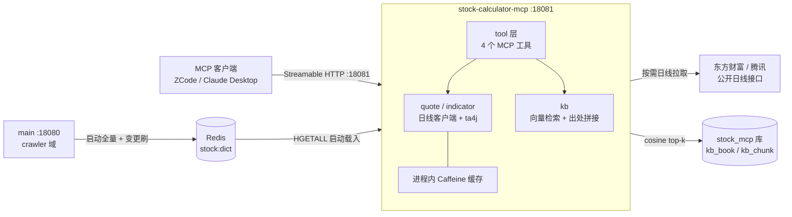

# MCP 服务设计（stock-calculator-mcp）

> 本地自用的 Model Context Protocol 服务：向 ZCode / Claude Desktop 等 MCP 客户端暴露两类能力——
> **股票技术指标计算**（按需现算）与**经典书籍知识检索**（整书 RAG）。独立 Maven 模块，JVM 模式运行 :18081。

## 一、背景与目标

stock-calculator 主体系（main/data/contract）沉淀了资讯、公告、KG 等 AI 管道，但两大日常刚需不在其内：

1. **指标计算**：查单只股票的 MA/MACD/RSI/BOLL/KDJ 等——主体系无行情数据，且逐项问 LLM 上下文成本高。
2. **书籍知识**：《聪明的投资者》《日本蜡烛图技术》等经典的核心概念与方法论——书籍级内容量装不进提示词，需要检索。

MCP 是两者的自然载体：一次实现，多客户端复用（IDE Agent / 桌面助手），工具以结构化 JSON 返回，
LLM 客户端可在对话中自主组合「计算 + 知识印证」（如算出 KDJ 金叉后翻书查其含义）。

## 二、范围与非目标

**范围内（一期）**：

- 4 个 MCP 工具：stock_analysis / stock_daily / kb_search / kb_book_list
- 书籍离线灌书管线（mcp 模块内参数门控入口）
- main 侧股票字典 Redis 镜像（唯一 main 改动点）
- 独立库 stock_mcp 与 kb 两表

**非目标（明确不做）**：

- 全市场选股 / 回测（需全市场日线落库，独立 epic，见 §七 路线二）
- 分钟级 / 实时盘口数据（免费源不稳定，经典指标均基于日线）
- 对外多租户、鉴权、限流（本地自用，端点裸跑）
- native-image 构建（JVM 模式即可，彻底绕开 AOT 成本）
- 术语卡独立建模（kb_search 先兜住，量起来再建）

## 三、总体架构



要点：mcp 与 main **零直接依赖**——唯一接触面是 Redis 的 stock:dict 镜像；PG 实例共用但库隔离；
行情数据不落库，按需拉取即算即走。

## 四、模块结构与依赖

```
stock-calculator-mcp/            新 Maven 模块（父 POM 挂载，packaging jar）
└─ com.zzh.stock_calculator.mcp  包名跟随 data 惯例
   ├─ tool/       MCP 工具层（@Tool bean，4 个）
   ├─ kb/         entity · repository · service · ingest（离线灌书入口）
   ├─ quote/      东财/腾讯日线 RestClient 客户端 + 缓存
   └─ indicator/  ta4j 封装（MA/MACD/RSI/BOLL/KDJ）
```

| 依赖 | 用途 |
|---|---|
| spring-ai-starter-mcp-server-webmvc | MCP 服务端（Streamable HTTP，端口 18081） |
| spring-ai-starter-model-openai + pgvector | 查询侧 embedding（bge-m3）与向量检索 |
| spring-boot-starter-data-jpa + postgresql | kb 两表读写 |
| spring-boot-starter-data-redis | 字典镜像读取 |
| ta4j | 技术指标计算（纯 Java，约 130+ 指标） |
| caffeine | 行情日线进程内缓存 |

**明确不引入**：amqp / stock-calculator-contract / spring-security / native 构建脚本。

## 五、存储设计

### 5.1 独立库 stock_mcp

- 与主库同 PG 实例（compose 常驻 pgvector/pg16），单独建库：边界由 DB 引擎物理强制，mcp 无法触碰 main 业务表。
- 一次性初始化（容器数据卷已初始化过，entrypoint 脚本不会重跑，手动 psql 一次）：
  建库后 **per-database** 执行 CREATE EXTENSION vector（pgvector 扩展按库生效）。
- 跨库不能 SQL join——当前无此需求；字典走 Redis 镜像正是为规避跨库读。将来若需「知识 × 个股文章」关联，应用层两次查询拼接。
- 备份独立：pg_dump stock_mcp 与主库互不影响，灌书实验可整库推倒重来。

### 5.2 kb 两表（mcp 模块自有 init DDL）

| 表 | 关键列 | 说明 |
|---|---|---|
| kb_book | id, title, author, category, difficulty, reading_order, embedding_model | 书目元数据，检索出处的拼接源 |
| kb_chunk | id, book_id, chapter_path, chunk_index, content, embedding vector(1024), content_hash, model | HNSW cosine 索引；model 列留档支撑换模型全量重嵌（R9 惯例） |

建表范式沿用 cls_article_embedding：vector(1024) + HNSW cosine、content_hash 幂等、model 留档。

### 5.3 Redis：stock:dict 镜像

- 结构：HASH `stock:dict`，field = stock_id，value = JSON（name / oldName / isStib）。
- main 为唯一写入方；mcp 只读：启动时 HGETALL 一次性载入内存 Map（约 5000 条 ≈ 1MB），
  代码 ↔ 名称 ↔ 曾用名双向解析全在内存做，不逐请求查 Redis。

### 5.4 行情缓存：进程内

- Caffeine + TTL，key = stockId+天数；TTL 内重复请求不外呼。
- 刻意不落 PG：日线按需拉取即可满足指标计算，落库是路线二（选股/回测）的事。

## 六、股票字典镜像（main 侧唯一改动点）

main 现状：stock 表仅 crawler 域使用，Redis 中无字典镜像（Redis 仅承载会话/限流/prompt 镜像）。

- **照抄 CopilotPromptSync 范式**（copilot 域已有「DB 全量镜像 → Redis，运行时只读」完整实现）：
  crawler 域新增字典镜像组件——main 启动时全量写 + 字典变更时增量刷（股票字典更新点在爬虫任务内）。
- mcp 侧启动加载 + 内存解析 + 手动刷新端点兜底（字典更新低频，重启/手动刷足够）。
- 模糊匹配（「茅台」→ 600519）用内存 contains 即可，个人使用规模无需分词。

## 七、指标计算（calc）

**路线一（一期，按需现算）**：工具入参股票代码 → 校验字典 → 东财/腾讯公开日线接口拉近 250-500 根 →
ta4j 内存计算 → 返回指标值。零管道零行情表，个人频率下公开接口绰绰有余。

**路线二（后置，独立 epic）**：全市场日线经 data 模块拉取循环落 stock_daily 表 → 支撑全市场选股与回测。
一期不做；若未来做，mcp 的 calc 工具改为读库，工具契约不变。

- 只做**日线**：分钟线/实时盘口免费源不稳定，经典书籍方法论亦基于日线。
- ta4j 选型理由：Java 生态标准库，130+ 指标免手搓（KDJ/SAR 手算易错），纯 Java 对 JVM 零负担。
- 粗粒度返回原则：stock_analysis 一次返回全家桶**最新值 + 近期趋势摘要**，严禁吐完整序列——
  数万数字灌进 LLM 上下文是灾难；需要原始序列的客户端显式调 stock_daily。

## 八、书籍知识检索（kb）

### 8.1 向量化：复用 bge-m3

- 模型：Cloudflare Workers AI `@cf/baai/bge-m3`（1024 维），main/data 已有成熟客户端
  （EmbeddingConfig + CfUsageFixingClient），mcp 抄精简版，CLOUDFLARE_API_TOKEN 走自己的 yml。
- 额度测算：免费 10000 Neurons/日（UTC 零点刷新），实测 1075 Neurons/M tokens；
  10 本书 × 约 40 万 token ≈ 4300 Neurons——**整个书库一天免费额度内灌完**，查询侧开销忽略不计。

### 8.2 灌书管线（离线，一次性动作）

抽文本（EPUB/PDF → 纯文本）→ 按章节边界切块（500-800 字/块，50-100 字重叠）→
批量 embedding（批次大小照抄 EmbeddingComputeWorker 现值）→ 写 kb_chunk。
幂等策略：同一本书重灌即 truncate 重载（切块参数一变 hash 全变，按 hash 跳过无意义）；
失败重跑脚本即可，**不建** PENDING/DONE/FAILED 状态机（那是常驻管道的设施）。

### 8.3 查询链路

1. 启动时校验 embedding 模型与维度（查询向量与库存向量模型不一致会静默劣化）。
2. 术语精确/ILIKE 匹配（「安全边际」等精确术语名向量召回易飘）与向量 cosine top-k **两路合并去重**。
3. 结果 join kb_book 拼出处（书名 + 章节），LLM 客户端可直接引用「出自《xxx》第x章」。
4. 原生查询写法参考 ArticleEmbeddingSearchService 现成实现（含可空参数 CAST 定型纪律，见 lessons）。

### 8.4 版权口径

本地自用不分发，整书文本入库无实际风险；**红线**：服务与库数据不得开源或提供他人接入。

## 九、MCP 工具契约（4 个起步）

| 工具 | 入参 | 返回 | 背后 |
|---|---|---|---|
| stock_analysis | stockId（或名称，内存解析） | MA5/10/20/60、MACD、RSI、BOLL、KDJ 最新值 + 趋势摘要 | quote + indicator |
| stock_daily | stockId, days | 原始日线序列（紧凑 JSON） | quote |
| kb_search | query, topK(默认5) | chunk 正文 + 书名/章节出处，两路合并 | kb |
| kb_book_list | — | 书目清单（含 chunk 数/分类/阅读顺序） | kb |

工具描述（description）写给 LLM 看：说明何时该用、入参口径（支持名称模糊解析）、返回结构——
描述质量直接决定客户端调用命中率。

## 十、关键决策记录

| # | 决策 | 理由 |
|---|---|---|
| D1 | 独立 Maven 模块，不进 main | main 的 native AOT 一行不动；依赖隔离；独立生命周期 |
| D2 | 独立库 stock_mcp | 边界 DB 引擎强制；灌书试错爆炸半径干净；备份独立 |
| D3 | 字典走 Redis 镜像 | 抄 CopilotPromptSync 现成范式；mcp 零 main 表依赖 |
| D4 | 向量自建 kb_chunk 表 | 不共用 vector_store：防与电报/公告检索互相污染 |
| D5 | calc 按需现算，不落库 | 单股指标无需数据仓库；路线二独立 epic |
| D6 | JVM 模式，无 native | 个人自用无需启动内存优化，绕开全部 AOT 成本 |
| D7 | 无 MQ / 无鉴权 | 灌书离线一次性；端点本地裸跑 |
| D8 | config 复制不抽公共 | 三模块变四模块，保持 contract 只管 MQ 的现状 |

## 十一、风险与对策

| 风险 | 对策 |
|---|---|
| Cloudflare embedding 不可用 | 灌书离线可重跑；查询侧报错由 LLM 客户端稍后重试 |
| 行情接口波动/限频 | Caffeine TTL 缓存 + 重试；接口切换预留（东财/腾讯双实现位） |
| bge-m3 术语召回飘（译名不统一） | ILIKE 精确匹配兜底两路合并 |
| 向量模型不一致静默劣化 | 启动时校验模型与维度（kb_book.embedding_model 留档） |
| 书籍翻译质量差导致切块破碎 | 首批只灌 2-3 本最常翻的书，调顺管线再批量 |

## 十二、关联文档

- 实现/里程碑：docs/mcp/implementation.md
- 镜像范式：docs/copilot/（CopilotPromptSync，「DB 镜像 → Redis，运行时只读」）
- 向量化基座：docs/ai-pipeline/cls-article-vector.md（bge-m3 客户端、额度、建表范式）
- 模块拆分背景：docs/architecture/data-service-split.md
