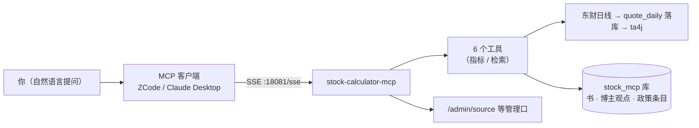

# MCP 服务使用手册（stock-calculator-mcp）

> 本地自用 MCP 服务（:18081）的操作手册：启动停止、接入 ZCode / Claude Desktop 等客户端、
> 六个工具的用法、知识库订阅源管理、离线加书与行情管理口、常见问题。
> 设计与实现细节见 [design](mcp/design.md) / [implementation](mcp/implementation.md)。

## 一、这是什么

把两类日常刚需做成 LLM 客户端可调用的工具：

1. **股票技术指标**：报股票名/代码 → MA/MACD/RSI/BOLL/KDJ、支撑压力位带（东财日线按需落库 + ta4j 现算）；
2. **本地知识库**：经典投资书籍原文 + 博主观点（微博备份）+ 政策条目（RSS）的语义检索，全部带出处。



一次实现、多客户端复用：算完 KDJ 金叉可以让它翻书查含义，也可以问「某博主怎么看黄金」。

## 二、启动与停止

前置：中间件容器常驻（postgres / redis，compose 起停见 `docker-compose.middleware.yml` 头注释）；
`.env` 提供 `POSTGRES_PASS`、`CLOUDFLARE_ACCOUNT_ID`、`CLOUDFLARE_API_TOKEN`（embedding 用）。

```sh
# 启动（后台）
set -a && . ./.env && set +a
./mvnw -q -pl stock-calculator-mcp spring-boot:run > /tmp/scs-mcp.log 2>&1 &

# 健康检查（返回 JSON 清单即在线）
curl -s http://localhost:18081/admin/source

# 停止：先查占用 18081 的进程，再 kill
ss -tlnp | grep 18081
kill <pid>
```

注意：**旧实例会占住 18081**——重启换新构建前先杀旧 java 进程，否则新实例起不来（报 Port already in use）。

## 三、接入 MCP 客户端

- 端点：`http://localhost:18081/sse`（SSE 传输）。
- ZCode / Claude Desktop 的 MCP 配置里新增一个 server，URL 填上面端点即可，工具列表自动发现。
- 手工 curl 探活必须走协议序：`initialize` → `notifications/initialized` → 之后再发 `tools/list` /
  `tools/call`——把 tools/list 当首条消息会得到「静默无响应」（协议硬性时序，不是服务挂了）。

## 四、六个工具速查

| 工具 | 入参 | 返回 | 背后 |
|---|---|---|---|
| stock_analysis | stockId（或名称） | MA5/10/20/60、MACD、RSI、BOLL、KDJ 最新值 + 趋势摘要 | 增量同步 + ta4j |
| stock_daily | stockId（或名称）, days | 原始日线序列（东财 11 字段） | quote_daily 读库 |
| stock_levels | stockId（或名称） | 支撑/压力位带各 ≤5 档（带触及次数等依据） | 枢轴+摆动聚类+量密集三法 |
| kb_search | query, topK(默认5) | 相关段落 + 出处（书名/章节、博主/微博时间、政策标题+链接） | 向量+关键词双路 |
| kb_book_list | — | 书目清单（含订阅源伪书与块数） | kb_book |
| ping | — | 探活 | — |

用法要点（写给 LLM 客户端的描述同样适用）：

- 股票**名称/曾用名/代码都能直接说**（「茅台」「600519」均可，内存字典解析；多命中不会瞎猜，会返回候选）；
- stock_analysis 是粗粒度摘要（不吐全序列），要原始 K 线显式调 stock_daily；
- kb_search 覆盖「书 + 博主观点 + 政策条目」三层知识：查概念方法论会命中原著，问行情观点会命中博主，问政策会命中条目标题+链接。

典型问法示例：`茅台最近怎么样？` / `贵州茅台的支撑位在哪` / `安全边际是什么意思，原文怎么讲` /
`麻辣新鲜怎么看黄金` / `最近有什么新政策跟消费相关`。

## 五、知识库订阅源管理（博主观点 / 政策 feed）

管理口 `/admin/source`（本地裸跑，无鉴权）——增删源是人干的事，不进 MCP 工具层：

```sh
# 注册 text 源（微博备份导出文件，或普通 txt）——注册即灌入
curl -s -X POST -G http://localhost:18081/admin/source \
  --data-urlencode 'name=麻辣新鲜' \
  --data-urlencode 'type=text' \
  --data-urlencode 'location=/home/zzh/Documents/blog/2188093987.txt'

# 注册 rss 源（全文/摘要/标题型 feed 都支持；标题型以「标题+链接」当条目雷达用）
curl -s -X POST -G http://localhost:18081/admin/source \
  --data-urlencode 'name=政策法规' \
  --data-urlencode 'type=rss' \
  --data-urlencode 'location=https://politepaul.com/fd/2iu4B1VcerML.xml'

# 清单（含块数与最后灌入时间）
curl -s http://localhost:18081/admin/source

# 手动刷新（不等 6h 轮询）：rss=拉增量，text=整源重灌
curl -s -X POST 'http://localhost:18081/admin/source/政策法规/refresh'

# 移除订阅（停更保数据：轮询跳过 + 检索过滤，已入库内容保留；重新注册即恢复）
curl -s -X DELETE 'http://localhost:18081/admin/source/政策法规'
```

语义备忘：

- **text 源**：微博备份导出格式（「日期 | 原创/转发」+ 正文 + 长横线分隔）一条微博 = 一个观点单元，
  纯图片/纯转发空文本条目自动剔除；其他 txt 按 600/80 字切块。重灌幂等（同名整源重载）。
- **rss 源**：注册即首拉全量，之后默认 6h 轮询增量（启动 1 分钟后也会拉一轮）；按条目内容 hash 去重，
  只补新条目。轮询参数 `kb.rss.*`（application.yml）。视频/播客型 feed 不支持（需 ASR，暂未做）。
- **移除 ≠ 删数据**：移除只停更新并让检索忽略该源；数据保留，重新注册同名源即恢复（并重灌 text / 增量补 rss）。

## 六、离线加书（经典书籍）

一次性动作，参数门控（不占运行态）：

```sh
KB_INGEST_ENABLED=true KB_INGEST_PATH=/path/to/book.epub \
KB_INGEST_TITLE=聪明的投资者 KB_INGEST_AUTHOR=格雷厄姆 \
./mvnw -q -pl stock-calculator-mcp spring-boot:run
```

支持 .epub（按 spine 顺序抽取）与 .txt；600/80 字切块 + bge-m3 向量化；同名书重灌即覆盖。
灌完关闭开关正常启动即可。

## 七、行情与字典管理口

| 端点 | 用途 |
|---|---|
| POST /admin/quote/resync?stockId=&days= | 除权导致远端前复权漂移后全量重灌修复 |
| GET /admin/quote/bars?stockId=&from=&to= | 任意区间日线读取 |
| GET /admin/quote/status?stockId= | 某股落库条数与最新日期 |
| POST /admin/dict/refresh | 内存股票字典手动重建（正常随 main 镜像自动维护） |
| GET /admin/dict/resolve?q=关键词 | 字典解析验证（代码/名称/曾用名） |

注意：股票字典镜像由 main 服务写入 Redis，**main 需常驻**字典才鲜活；mcp 启动时载入内存，重启即刷新。

## 八、常见问题

| 现象 | 原因与处理 |
|---|---|
| 启动报 Port 18081 already in use | 旧实例还活着：`ss -tlnp | grep 18081` 查 pid 杀掉再启 |
| 首次问某只股票明显变慢 | 首调全量拉 ~65 根日线落库并 embedding 检索无此开销，属正常；后续增量只有近 10 天 |
| curl 探活 tools/list 零响应 | MCP 协议序问题：必须先 initialize → initialized，见 §三 |
| kb_search 报「检索失败」且带 CF/网络字样 | Cloudflare embedding 不可用：查 `.env` 的 CLOUDFLARE_* 与额度 |
| 检索结果里没有某博主/某源 | 该源已被移除（停更保数据语义，见 §五）或源未注册；GET /admin/source 核对 |
| 政策条目只有标题没有正文 | 标题型 feed 本身无正文，块=标题+链接；需要全文再评估正文抓取 |
| 指标值与行情软件略有出入 | 口径为东财日线（前复权 qfq）+ ta4j 标准算法；除权后远端漂移用 resync 修复 |

## 九、关联文档

- [design](mcp/design.md) · 架构与决策（D1-D10、存储设计、工具契约）
- [implementation](mcp/implementation.md) · 里程碑实现记录（M1-M7）
