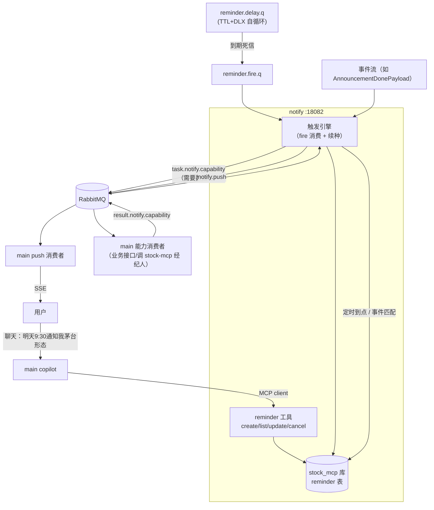
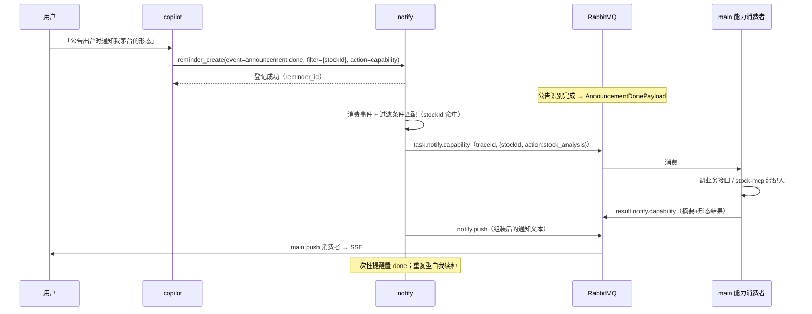

# 个人定制提醒服务设计（stock-calculator-mcp-notify）

> 用户在聊天窗口说「明天 9:30 通知我茅台的形态」，一句话完成登记；到点或事件出现时，
> 服务经 MQ 管道请求 main 能力、组装通知、由 main SSE 触达用户。
> 角色分工：**mcp=经纪人（指标/知识），notify=通知者（触发引擎+触达），main=能力供给**；
> 简单提醒与复杂链路同引擎覆盖（职责≠粒度，见 [agent-orchestration](../architecture/agent-orchestration.md) D12）。

## 一、定位与边界

| 服务 | 职责 | 在提醒链路中的角色 |
|---|---|---|
| stock-calculator-mcp :18081 | 经纪人：指标/知识检索 | 被按需调用，供给通知内容 |
| **notify（本服务）:18082** | **通知者：登记/触发/组装/投递** | 主动方 |
| main :18080 | 能力供给 + SSE 触达 | 消费能力请求、消费推送消息 |

明确不做（边界）：

- 不做复杂编排（多节点 DAG 归 orchestration 远期演进，本服务单动作直通）；
- 不做业务能力（查形态/查公告是 main 或 stock-mcp 的事，本服务只发起请求与等待结果）；
- 不持有任务语义状态（DAG 类状态仍属 task_instance，本服务只有 reminder 生命周期状态）。

## 二、核心决策

| # | 决策 | 理由 |
|---|---|---|
| N1 | 独立 Maven 模块 + 独立进程 :18082 | 必须引入 amqp + contract（消费事件、发推送），与 stock-mcp「明确不引入 amqp」（mcp design §四）是硬依赖边界冲突，不并入 |
| N2 | 触发引擎**零 @Scheduled**：复用 TTL+DLX 自循环机制 | 项目定时任务已全部自循环化（pull-loop-unification L1/L8），「钟」在 broker 不在进程；提醒=第二种任务形态，机制直接复用 |
| N3 | reminder 表放 **stock_mcp 库**（与 mcp 同库） | 用户指定；mcp 模块已有独立库与幂等 DDL 惯例（mcp-schema.sql），notify 复用同库分表，边界由库隔离惯例延续 |
| N4 | 登记/查询/**修改**/删除经 **MCP 工具面**（:18082/sse），运行态触达走 MQ | LLM 对话内操作=MCP 本职；服务间数据流=MQ 管道，两条通道各归其位 |
| N5 | 触达出口统一为 notify.push 队列 → main 消费 → SSE | 触达通道收敛一处（未来加邮件/webhook 只扩 main 的 push 消费者），notify 不直连用户 |
| N6 | **删除=删除重建**：不提供原地 update，修改经「cancel + 重建新 reminder」两步表达 | 提醒状态机简单化（active→done/cancelled 单向），避免半更新状态；LLM 编排两步调用同样自然 |
| N7 | **触发频率动态控制**：notify 对自己的触发行为有自治管理能力 | 防事件洪峰/误配置轰炸（如「每次公告都提醒」×批量公告）；机制见 §五之频率治理 |

## 三、总体架构

一次完整流程（事件型提醒）：

## 四、数据模型

### 4.1 reminder 表（stock_mcp 库，N3）

| 列 | 类型 | 说明 |
|---|---|---|
| id | bigserial PK | |
| user_id | | 归属用户 |
| trigger_type | text | `at_time` / `on_event` |
| trigger_spec | jsonb | at_time：`{next_fire_at, repeat}`（一次性/cron 语义）；on_event：`{event_type, filter}`（如 stockId、关键词） |
| action | jsonb | `{kind: text｜capability, payload}`：直达文本，或能力请求（调 main 的什么、参数） |
| status | text | `active` / `done` / `cancelled` |
| fired_at / fire_count | | 幂等与统计（fire 消费以 reminder_id+due 唯一键判重） |
| created_at / updated_at | | |

### 4.2 MQ 拓扑（contract 新增）

| 队列 | 类型 | 说明 |
|---|---|---|
| task.notify.capability.q | quorum + DLX→stockcalc.dlx | notify→main 能力请求 |
| result.notify.capability.q | quorum | main→notify 能力结果（含 traceId） |
| notify.push.q | quorum | notify→main 推送（main 消费转 SSE） |
| reminder.delay.q | classic、无消费者、**per-message TTL**、DLX→TASKS 交换机 | 定时提醒种子（自循环钟摆） |
| reminder.fire.q | quorum | TTL 到期死信落地，notify 消费触发 |

MessageType 新增：`task.notify.capability` / `result.notify.capability` / `notify.push`；消息体走 MessageEnvelope，traceId 进头（呼应 agent-orchestration D9）。

## 五、触发引擎（零 @Scheduled，N2）

**at_time（定时提醒）**——完全对齐 pull-loop 自循环形态：

1. **种子**：登记 at_time 提醒时投一颗种子到 reminder.delay.q，per-message expiration = 距 next_fire_at 的毫秒数；
2. **触发**：TTL 到期死信进 reminder.fire.q → notify 消费 → 读 reminder → 幂等判重（fired 唯一键）→ 执行动作；
3. **续种**：重复型提醒在触发后自我续种（下一周期 TTL 编进新种子）；一次性置 done 不续；
4. **深度守卫**：续种前 passive declare 探 messageCount，防重复种子堆积（同 pull-loop §4）；
5. **启动 bootstrap**：启动时扫 active 的 at_time 提醒，delay 队列深度不足则**全量重投影种子**（进程重启钟不丢）；
6. **看门狗兜底**：main 侧低频 watchdog（既有 MqHeartbeatWatchdog 同款独立线程池模式）校对 due 时间与队列深度，漏种补投；
7. **日历语义**：「每周一 08:00」类 cron 语义按 L8 先例衰变为动态 TTL 种子，不引入 Spring cron。

**on_event（事件提醒）**：notify 消费对应事件消息（如公告完成、KG 抽取完成）→ 按 trigger_spec.filter 匹配（stockId/关键词，JSONB 条件轻量判断，不做表达式引擎）→ 命中即走动作执行。无种子无钟，事件即钟。

**频率治理（N7：触发频率动态控制）**——notify 对自身触发行为自治：

1. **登记期约束**：reminder_create 校验 trigger_spec 合法性（重复周期下限、事件型必带非空 filter），把「每条公告都提醒」这类无界频率挡在入口；
2. **运行期限幅**：每 reminder 设最小触发间隔（min_interval，登记时按类型赋默认值、可在 spec 内显式放宽）——事件洪峰时同一提醒在窗口内只触发一次，其余命中记 suppressed（可查）；
3. **动态退避**：连续触发后自动拉长窗口（如 1h 内命中 >N 次 → 间隔翻倍），状态存 reminder 表（suppress_until），恢复冷静后自动回落；
4. **全局保险丝**：单用户/全局每分钟 push 上限，超限聚合为一条摘要通知（「过去 10 分钟命中 12 条，已合并」），熔断状态自恢复；
5. **观测**：fired/suppressed 计数落 reminder 表，reminder_list 可见——用户能发现「我的提醒被限流了」并自行调整。

**宕机恢复语义**：种子在 broker，重启不丢；崩溃在 fire 消费中 → quorum 队列 redeliver + fired 唯一键幂等；崩溃在能力请求后 → result 回流时 reminder 状态校验，done 则丢弃。

## 六、动作执行（能力请求直通）

- `action.kind=text`：trigger_spec 命中即组装通知直达 push——纯提醒零额外跳数；
- `action.kind=capability`：发 task.notify.capability（traceId + 能力名 + 参数）→ main 能力消费者执行（内部可调业务接口或 stock-mcp 经纪人工具）→ result.notify.capability 回流 → 组装通知 → push；
- 等待结果采用**临时关联表 + 超时兜底**：pending 请求记 capability_request（traceId、reminder_id、deadline）；deadline 到未回流 → 降级通知「数据暂不可用」（不做无限等待）；
- 结果组装：通知文本模板轻量拼接（「9:30 快报：茅台 MA5 上穿…」），不引入模板引擎。

## 七、MCP 工具面（:18082/sse）

| 工具 | 入参 | 行为 |
|---|---|---|
| reminder_create | trigger（at_time：时刻/重复规则；on_event：事件+过滤）、action（文本或能力名+参数） | 登记 + 频率合法性校验 + at_time 投种子 + 返回 reminder_id |
| reminder_list | （当前用户） | 活跃提醒清单（含下次触发时间、fired/suppressed 计数） |
| reminder_update | reminder_id + 新 trigger/action | **删除重建语义（N6）**：cancel 旧 reminder → 按新内容走 create 全流程（含频率校验与投种），返回新 reminder_id |
| reminder_cancel | reminder_id | 置 cancelled（delay 队列里的种子 fire 时判 status 跳过——种子不回收，幂等挡） |

用户身份：工具入参带 userId（copilot 持会话身份传入）；工具面本地裸跑无鉴权（与 stock-mcp 同口径，design §二非目标）。

copilot 侧挂载：main 引 MCP client 连 :18082，向 LLM 注册 reminder_* 四工具（与 :18081 经纪人工具同池）。

## 八、落地顺序（每步独立可验）

1. contract 新增队列常量与消息类型 + notify 模块骨架（:18082，MCP server + amqp 引入）；
2. reminder 表 DDL（stock_mcp 库，并入 mcp-schema.sql 惯例）+ reminder_create/list/update/cancel 四工具（update=删除重建）；
3. at_time 自循环触发链（种子→fire→幂等→续种→bootstrap→看门狗，对齐 pull-loop 验证清单：per-message TTL 已实证）；
4. text 直达动作 + notify.push → main SSE 全链路（先跑纯文本提醒端到端）；
5. capability 动作（main 能力消费者 + 结果回流 + 超时降级）——「9:30 通知茅台形态」端到端；
6. on_event 事件提醒（公告完成事件 + filter 匹配）。

## 九、风险与未决项

| 项 | 说明 |
|---|---|
| 种子丢失/重复 | 深度守卫 + fired 唯一键幂等 + bootstrap 重投影三重防线（机制同 pull-loop，已生产实证） |
| 事件洪峰 | 事件型提醒过滤在 notify 侧做；频率治理三层防线兜底（N7：入口校验/运行限幅/全局保险丝），suppressed 可查 |
| capability 等待泄漏 | deadline 兜底 + 降级通知，pending 表 TTL 清理 |
| 与 orchestration 的关系 | 本服务是「单动作直通」的现在时；DAG 编排是远期演进（agent-orchestration §三非目标外的独立立项），reminder 的 action 结构预留升级空间（capability 请求体可承载 DAG 引用） |

## 十、关联文档

- [agent-orchestration](../architecture/agent-orchestration.md) · 统一编排引擎与 D12（职责≠粒度）、D9（traceId）
- [pull-loop-unification](../architecture/pull-loop-unification.md) · TTL+DLX 自循环机制（N2 的机制来源，L1/L8 已实证）
- [data-service-split](../architecture/data-service-split.md) · MQ 通信与契约基础
- [mcp/design](../mcp/design.md) · 经纪人服务（N1 依赖边界冲突的出处）
