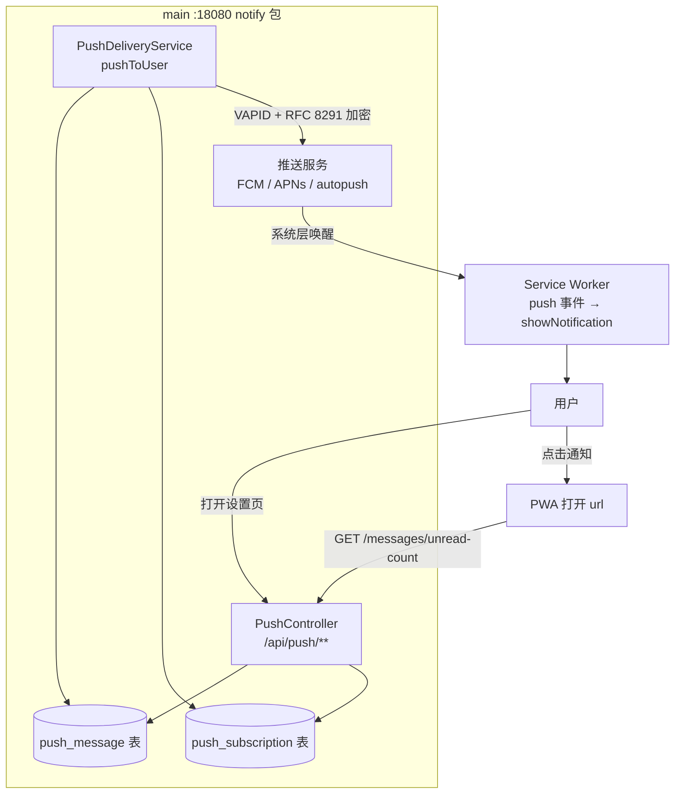
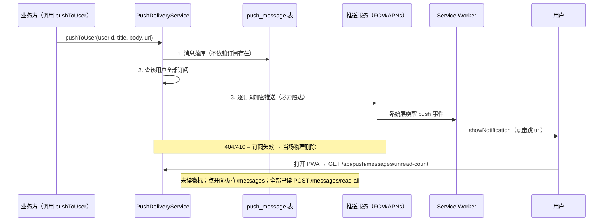

# Web Push 推送通知（双通道触达）

> PWA 推送能力：**推送通道**（Web Push 标准，iOS 16.4+ / Android Chrome / PC 桌面浏览器）
> + **拉取兜底通道**（消息落库，打开 PWA 拉未读）。两通道共用同一条消息，
> 推送漏达时打开页面必能补看。落点：main 模块 `notify` 包（:18080）。

## 一、定位与背景

- 前端是 PWA（vite-plugin-pwa，Workbox generateSW），需要服务端主动触达用户（提醒类消息）；
- Web Push 是 W3C 标准通道，无需自建 iOS/安卓原生推送，也不依赖绑定任何厂商 SDK；
- 推送有天然漏达场景（浏览器未开、无 GMS 国行机、订阅失效、iOS 未添加主屏幕），
  因此消息**先落库**，打开 PWA 时拉未读作为兜底——「推送管不在场触达，拉取管在场补漏」。

## 二、平台支持矩阵

| 平台 | 推送通道 | 触达条件 |
|---|---|---|
| PC Chrome / Edge / Firefox | FCM / Mozilla autopush | 浏览器进程存活（Windows 关窗后由后台进程接收） |
| macOS Safari 16.4+ | APNs | macOS 13 (Ventura)+ |
| Android Chrome / Chromium 系 | FCM（Google Play Services 常驻连接） | 有关 GMS；**浏览器完全关闭也能收** |
| Android Firefox | Mozilla autopush | 无需 GMS |
| iOS / iPadOS 16.4+ | APNs | **仅「添加到主屏幕」的 standalone PWA**（前端已隐藏不支持环境的开关） |

国内注意：纯国行无 GMS 机型上 Chrome 走不了 FCM，推送收不到——这正是拉取兜底通道存在的原因。

## 三、总体架构



一次投递的完整时序：



## 四、数据模型（postgres/schema.sql）

### 4.1 push_subscription

| 列 | 类型 | 说明 |
|---|---|---|
| id | bigserial PK | |
| user_id | varchar(64) | authUserId（UUID 文本） |
| endpoint | varchar(1024) UNIQUE | 推送服务订阅端点（upsert 唯一键） |
| p256dh | varchar(200) | 客户端 ECDH P-256 公钥（base64url） |
| auth | varchar(100) | 认证密钥（base64url） |
| user_agent | varchar(300) | 登记时 UA 摘要（运维排查） |
| created_at / updated_at | timestamptz | |

### 4.2 push_message

| 列 | 类型 | 说明 |
|---|---|---|
| id | bigserial PK | |
| user_id | varchar(64) | 归属用户 |
| title / body | varchar(200)/(1000) | 通知标题/正文 |
| url | varchar(500) | 点击跳转路径（可空） |
| read_at | timestamptz NULL | NULL = 未读；部分索引 `(user_id, created_at DESC) WHERE read_at IS NULL` |
| created_at | timestamptz | |

## 五、后端实现（stock-calculator-main，com.zzh.stock_calculator.notify）

| 类 | 职责 |
|---|---|
| entity/PushSubscription | 订阅三元组 JPA 实体 |
| entity/PushMessage | 消息实体（read_at 为 NULL 即未读） |
| repository/PushSubscriptionRepository | native upsert（endpoint 唯一冲突整行覆盖）/ 按 endpoint·userId 删除 |
| repository/PushMessageRepository | 最近 50 条列表 / 未读数 / 全部已读（幂等 UPDATE） |
| service/PushSubscriptionService | 订阅 CRUD 门面 |
| service/PushDeliveryService | 先落库再逐订阅推送；BouncyCastle 注册；404/410 即删订阅 |
| controller/PushController | REST 面（见 §六），@ConditionalOnProperty push.enabled |

依赖：`nl.martijndwars:web-push:5.1.2` + 显式补 `bcprov-jdk18on`、`httpclient`(4.x)、`jose4j`
（库 POM 未声明传递依赖，main 模块 pom.xml 有注释说明）。

库行为注意：web-push 5.1.x 要求 BouncyCastle 为最高优先级 Provider（JCE 默认不含
aes128gcm 所需 ECDH/HKDF 组合），`PushDeliveryService.init()` 已静态注册。

## 六、对外接口（/api/push/**，均挂 AuthInterceptor，登录可用）

| 端点 | 方法 | 说明 |
|---|---|---|
| /vapid-public-key | GET | VAPID 公钥（前端 subscribe 的 applicationServerKey） |
| /subscribe | POST | 登记订阅 `{endpoint, p256dh, auth}`，endpoint 幂等 upsert |
| /unsubscribe | POST | 注销单订阅 `{endpoint}`（幂等） |
| /subscriptions | DELETE | 注销该用户全部订阅 |
| /messages | GET | 消息列表（最近 50 条倒序） |
| /messages/unread-count | GET | 未读数（角标） |
| /messages/read-all | POST | 全部标记已读（幂等） |

统一 ApiResponse 信封；参数不完整抛 BusinessException（全局异常处理器转错误响应）。

## 七、前端实现（/home/zzh/Documents/zed/stock-calculator）

| 文件 | 职责 |
|---|---|
| src/services/pushService.ts | 兼容性探测（iOS 仅 standalone）→ 权限 → pushManager.subscribe → 上报；消息列表/未读数/全部已读 API |
| public/push-sw.js | push（showNotification）与 notificationclick（聚焦或开页）事件；经 vite.config.ts workbox `importScripts` 注入主 SW，零侵入 |
| src/components/settings/PushNoticeCard.tsx | 设置卡片：订阅开关 + 消息面板（未读徽标 99+ 截断、未读高亮、全部已读）；登录打开页面自动拉未读数 |

iOS 特性处理：`isPushSupported()` 对 iOS 额外要求 `display-mode: standalone`，
浏览器内打开（非主屏幕 PWA）时开关整体隐藏；消息面板不受此限（登录即显示，兜底可看）。

TS 注意：`applicationServerKey` 需 `Uint8Array<ArrayBuffer>` 泛型（TS 5.7+ BufferSource
约束），`base64UrlToUint8Array` 内已显式 `new ArrayBuffer` 处理。

## 八、部署配置

application.yml `push.*`（环境变量注入，默认 enabled=false 全链路不装配）：

| 变量 | 说明 |
|---|---|
| PUSH_ENABLED | true 开启（Controller/Service 均条件装配） |
| PUSH_SUBJECT | VAPID 主题，`mailto:xxx` 或站点 origin |
| PUSH_VAPID_PUBLIC_KEY | base64url 公钥（同时是前端 applicationServerKey） |
| PUSH_VAPID_PRIVATE_KEY | base64url 私钥（PKCS#8 内 32 字节） |

密钥生成（openssl，P-256 → base64url）：

```sh
openssl ecparam -name prime256v1 -genkey -noout -out vapid.pem
openssl ec -in vapid.pem -pubout -out vapid_pub.pem
openssl pkcs8 -topk8 -nocrypt -in vapid.pem -outform DER -out vapid.der
# 公钥 = SPKI DER 尾 65 字节（04 开头非压缩点）；私钥 = PKCS#8 DER 中 04 20 标记后的 32 字节
```

上线前务必重新生成生产密钥对（仓库开发用密钥不入库，走 .env）。

## 九、关联文档

- [notify 服务总体设计](design.md) · 提醒登记/触发引擎，push 是其触达出口之一
- [e2ee-auth](../e2ee-auth/) · AuthInterceptor 会话鉴权（/api/push/** 已挂）

## 十、评审结论与已落地修复（2026-09-21）

四项隐患评估（高并发膨胀 / 多端未读同步 / 僵尸订阅 / SW 版本残留）及处置结果：

| # | 隐患 | 处置 | 落点 |
|---|---|---|---|
| 1 | push_message 无限膨胀（「最近 50 条」只是查询上限，表无清理） | **已修复**：惰性清理，拉取列表 / 全部已读时顺带 `pruneKeepRecent100`（每用户仅保留最近 100 条，物理删除更早历史）；无独立定时任务，对齐 notify design N2「钟不在进程」 | PushMessageRepository / PushController messages、read-all |
| 2 | 多端未读状态不同步（A 端 read-all，B 端红点不消） | **已修复（轻量方案）**：不用 SSE 长连接（现有 SSE 均为请求级流，常驻全局管道复杂度远超收益）；前端 `focus` / `visibilitychange` 时重拉 unread-count，秒级对齐。未来真有「服务端主动驱动前端」需求再评估 SSE 通道 | PushNoticeCard useEffect |
| 3 | 僵尸订阅静默过期不清理（只靠投递报 404/410 触发），pushToUser 对无效 endpoint 反复加密+POST | **已修复**：push_subscription 加 `last_success_at` 列（投递成功即 touchSuccess 刷新；upsert 保留原值不抹掉）；pushToUser 每次投递前 `pruneStale` 删除 90 天无成功触达（COALESCE last_success_at/created_at）的订阅 | schema / PushSubscription(+lastSuccessAt) / Repository touchSuccess、pruneStale / PushDeliveryService |
| 4 | importScripts 固定 URL：改 push-sw.js 内容不改变 sw.js 字节，浏览器 SW 更新检测失灵，用户端残留旧推送逻辑 | **已修复**：importScripts 改为 `push-sw.js?v=1`，每次改 push-sw.js 需递增版本参数强制 sw.js 字节变化。skipWaiting 已由 registerType autoUpdate 注入（dist 验证过）；clients.claim 缺失属低风险（skipWaiting+页面刷新已覆盖主路径），后续构建产物再观察 | vite.config.ts workbox.importScripts |

后续可针对性改进的预留项：
- 若消息量显著增长（单用户常触 100 条上限），再考虑 pg_cron / 归档表方案替代惰性清理；
- SSE 全局 badge_update 通道仅在出现「不刷新页面也要实时红点」的硬需求时立项；
- 僵尸订阅窗口（90 天）可按实际触达数据调整（pruneStale 参数化已就绪）。
