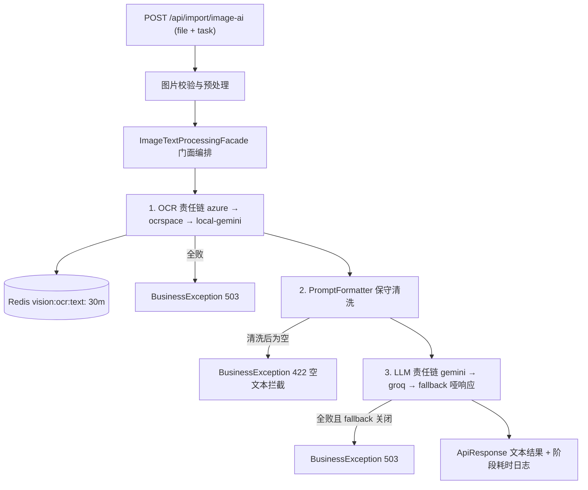

# 智能图片分析：多渠道 OCR + 免费 LLM 全链路管道

> 版本：v1.1（2026-09-01）
> 定位：`/api/import` 下「图片 → OCR 提取文本 → 清洗组装 → LLM 处理 → 业务结果」全链路的实现文档，覆盖 OCR 多渠道责任链、LLM 多渠道责任链与门面编排三层。
> 配套代码：`stock-calculator-main` 模块 `com.zzh.stock_calculator.llm` / `com.zzh.stock_calculator.vision`
> 状态：已实现并通过单测与本地桩测试（共 64 用例）；端点示例为契约示例，未含真实外部 API 冒烟记录。

---

## 0. 关键决策记录

| # | 决策点 | 结论 |
|---|--------|------|
| P1 | LLM 包归属 | LLM 是通用能力（非 vision 专属），独立顶级领域包 `llm`；OCR 留 `vision`。跨域只允许引用对方**基包**类型（`LlmChainRouter` 置于 `llm` 基包即模块 API），ModulithVerifyTest 守护 |
| P2 | LLM 协议 | 传输层用 Spring AI 2.x 标准 Builder：**模型为 LlmConfig 声明的全局 Bean，每渠道一个 `OpenAiChatModel` 实例**，连接参数（base-url/api-key/model/超时/maxRetries）全部落在 `OpenAiChatOptions` 上——不显式传 `openAiClient` 时 `build()` 会按 options 自动装配底层 OkHttp 客户端（源码实证），`maxRetries=0` 保住「429 不在 SDK 内静默重试」语义；渠道类只做消息编排/结果提取/错误分类（共用 `AbstractOpenAiCompatibleLlmService`）。Groq 双渠道由此恢复——「单实例只能绑定一套连接参数」的结论仍成立，解法是多实例而非运行时切换 |
| P3 | 重试策略 | LLM 默认单渠道**不重试**（`llm.max-attempts: 1`）：429 属 RPM/TPM 窗口限流，短退避重试大概率仍失败且占窗口，重试预算花在「渠道切换」上；OCR 保留 2 次（429 多为瞬时/请求过快） |
| P4 | 兜底定位 | `FallbackLlmService` 为诚实哑响应（`[降级响应]` 前缀固定模板，不调任何模型）；链尾放无模型规则引擎会编造结果，比诚实降级更危险。`llm.fallback.enabled=false` 时全链失败抛 503 |
| P5 | 工厂模式 | 砍掉 `OcrServiceFactory` / `LlmServiceFactory`：Spring 注入 `List<T>` + `@Order` 已覆盖全部场景，工厂唯一增量是「按枚举指定单渠道」，无第二使用场景不做双层间接 |
| P6 | 清洗原则 | `PromptFormatter` 保守清洗（零宽字符、行尾空白、压缩连续空行），**不做**正则智能断句/合并行——对表格类 OCR 文本有破坏性（数字与列错位） |
| P7 | 缓存 | OCR 层 MD5→文本 **Redis** 缓存（`vision:ocr:text:<MD5>`，命中省免费额度，重启不清零，决策 B12 前为 Caffeine）；LLM 层结果缓存暂不实现（P2 待定，同图同任务重复请求会重复耗额度） |
| P8 | 交易解析不迁移 | `/ocr-parse` 继续走 Gemini 多模态直读（表格结构识别远优于「OCR 扁平文本→LLM 重建」），与 `/image-ai` 并存、定位不同 |
| P9 | 结果缓存与强制刷新 | `/process-image` 新增「图片哈希→交易草稿」结果缓存（`vision.ai.*`，**Redis** key=`vision:ai:draft:<MD5>`，TTL 30m；决策 B12 前为 Caffeine 30m/128）；`useCache=false` 淘汰缓存并以审查模式 Prompt 重新处理。OCR 文本缓存刻意独立保留——同图重识别零增益只耗免费额度，重新处理的杠杆是提示词增强；降级模板输出不解析不缓存（`LlmChainRouter.isDegradedResponse` 识别） |
| P10 | Prompt 模板包归属 | vision System 侧模板入库热更后**不抽独立 `prompt` 包**：现仅 copilot / vision 两个消费方，跨域耦合面收敛为 copilot 基包 `CopilotPromptResolver.resolveByTag` 单类 API（P1 同款「基包类即模块 API」模式），ModulithVerifyTest 守护。抽包触发条件与迁移清单见 4.5「Prompt 热更」附注 |

---

## 1. 概述与能力边界

系统为「手机截图 → AI 文本处理」场景提供两层免费渠道池 + 自动降级：

- **OCR 层**（vision 域）：Azure AI Vision（月 5000 次免费）→ OCR.space（月 25000 次免费）→ 本地 Gemini 兜底，提取图片纯文本；
- **LLM 层**（llm 域）：Gemini → Groq（均为 OpenAI 兼容端点，各持一个 Spring AI `OpenAiChatModel`）→ 哑响应兑底，对文本完成业务任务；
- **门面层**（vision 域）：编排两层责任链 + 保守文本清洗 + 空文本拦截 + 阶段耗时统计。

| 能力 | 定位 | 渠道 |
|---|---|---|
| `/api/import/ocr-parse` | 交易流水结构化解析（**既有，未改动**，多模态直读） | Gemini 多模态 |
| `/api/import/ocr-text` | 通用 OCR 纯文本提取（单层：只走 OCR 链） | azure → ocrspace → local-gemini |
| `/api/import/image-ai` | 智能图片分析（全管道：OCR → 清洗 → LLM） | 两层责任链叠加 |
| `/api/import/process-image` | 交易流水图片→AI 草稿（全管道 + 结果缓存/强制刷新） | 两层责任链叠加 + 结果缓存 |

**边界内**：竖屏截图（复用交易截图校验：10KB~20MB、高宽比 0.45~5、高 ≤5200px）、免费层额度优先、单渠道故障透明降级。
**边界外**：多模态图片直传 LLM（本管道刻意拆成 OCR+LLM 两段，规避多模态超时与高额开销）、云端配额监控告警。

---

## 2. 总体架构



降级语义：任一渠道抛出渠道级异常（`OcrChannelException` / `LlmProviderException`）时，调度器记录 **Warning** 日志并**自动流转下一渠道**，对调用方完全透明；仅当全部渠道失败（且兜底关闭）才抛业务异常。

---

## 3. 包结构与组件职责

```
com.zzh.stock_calculator.llm                     # 顶级领域包（模块基包 = 对外 API 边界）
├── LlmChainRouter.java                          # 责任链调度器（基包，供跨域调用）
├── service/
│   ├── LlmService.java                          # 策略接口：chat(systemPrompt, userMessage)
│   ├── LlmProviderException.java                # 渠道级异常（retryable 标记）
│   └── impl/
│       ├── AbstractOpenAiCompatibleLlmService.java  # Gemini/Groq 共用基类：注入全局模型 Bean + 统一错误映射
│       ├── GeminiLlmService.java                # @Order(1) 首选（@Qualifier geminiChatModel）
│       ├── GroqLlamaService.java                # @Order(2) 备用（@Qualifier groqChatModel）
│       └── FallbackLlmService.java              # @Order(3) 兑底哑响应
└── config/
    ├── LlmProperties.java                       # llm.* 配置族
    └── LlmConfig.java                           # @EnableConfigurationProperties + 全局模型 Bean（geminiChatModel/groqChatModel）

com.zzh.stock_calculator.vision                  # 本轮新增文件
├── service/
│   ├── PromptFormatter.java                     # 保守清洗 + 通用/交易两族 Prompt 模板（System 侧 DB 可热更，内置常量兜底）
│   ├── TradeDraftParser.java                    # 模型输出 -> List<TradeDraftItem>（围栏清理 + 脏行隔离，两管道共用）
│   ├── ImageTextProcessingFacade.java           # 门面：编排 + 耗时打点 + 异常边界 + 交易草稿结果缓存
│   └── OcrChainManager.java                     # OCR 责任链调度器（前轮已建，MD5 缓存在此）
├── service/impl/                                # AzureOcrService / OcrSpaceService / LocalFallbackOcrService（前轮已建）
├── controller/ImportController.java             # /ocr-parse · /ocr-text · /image-ai · /process-image
└── config/
    ├── OcrProperties.java                       # vision.ocr.* 配置族（前轮已建）
    ├── VisionAiProperties.java                  # vision.ai.* 交易草稿结果缓存配置
    └── VisionOcrConfig.java
```

---

## 4. 核心机制

### 4.1 渠道契约与异常语义

两个策略接口刻意保持同构（`OcrService` / `LlmService`），每个渠道实现都必须回答三个问题：

| 接口方法 | 语义 |
|---|---|
| `channelName()` / `providerName()` | 渠道名，用于日志与全链失败原因汇总 |
| `isAvailable()` | 自我健康检查：enabled 关闭、缺少 Key/baseUrl 时返回 false，调度器**直接跳过**该节点 |
| 业务方法 | 成功返回结果（**绝不返回 null**）；失败抛渠道级异常 |

**严格区分两类失败**（异常处理严谨性的核心）：

| 结果类型 | 表现 | 调度器行为 |
|---|---|---|
| 业务空结果（图片无文字 / 模型输出为空） | 返回 `""` | 视为成功，立即结束链路（OCR 层并写缓存） |
| 网络/限流/服务端异常（429、5xx、超时、鉴权失败、响应畸形） | 抛 `OcrChannelException` / `LlmProviderException` | 记 Warning → （可重试则重试）→ 流转下一渠道 |

渠道级异常带 `retryable` 标记：`true`=瞬时故障（429/5xx/超时），可按配置重试；`false`=确定性失败（401/403），重试无意义直接换渠道。渠道异常不冒泡到 Controller——全链失败时由调度器统一抛 `BusinessException(503)` 并汇总各渠道原因。

**Azure 响应结构兼容**（2026-09-01 生产实测教训）：`AzureOcrService.extractContent` 依次尝试 ①`readResult.content`（imageanalysis 4.x）②`analyzeResult.readResult.content` ③`analyzeResult.readResults[*].content`（v3.2）④`readResult.blocks[*].lines[*].text` 逐行兜底——实测该资源响应的 `readResult` 只有 `blocks`（含 words/boundingPolygon）**没有 `content` 字段**，缺第④条时会把「有字图」静默解析成 `""`，被门面误判为空文本 422。全部路径未命中且响应含 `readResult`/`analyzeResult` 时打 WARN 暴露顶层结构（真·空图返回的是 `content=""` 字段存在，不会误触发告警）。

### 4.2 责任链调度与重试策略（OCR vs LLM 差异）

两个调度器（`OcrChainManager` / `LlmChainRouter`）逻辑同构：按 `@Order` 顺序遍历渠道 → 健康检查跳过不可用 → 成功即返 → 失败 warn+流转 → 全败抛 503。但**重试策略刻意不同**：

| 维度 | OcrChainManager | LlmChainRouter |
|---|---|---|
| 单渠道尝试次数 `max-attempts` | 2 | **1** |
| 依据 | OCR 429 多为瞬时/请求过快，短重试有效 | LLM 429 属 RPM/TPM **窗口限流**，短退避重试大概率仍失败且占窗口 |
| 结果缓存 | 有（Redis `vision:ocr:text:<MD5>`，TTL 30m） | 暂无（P2 预留） |
| 渠道异常 | `OcrChannelException` | `LlmProviderException` |
| 全败 | 503，message 汇总原因 | 503，message 汇总原因 |

渠道优先级由实现类 `@Order(n)` 声明，Spring 注入 `List<T>` 时自动排序；两个调度器启动时均打印装配日志（渠道顺序可观测）。两个路由器**保持独立实现**（Rule of Three）：差异点实质（缓存、重试、异常类型），待出现第三个路由器再抽象。

### 4.3 OCR 图片哈希缓存

- 实现：**Redis**（决策 B12，`VisionCacheStore` 接口 + `RedisVisionCacheStore`），key=`vision:ocr:text:<MD5>`，TTL `vision.ocr.cache-ttl`（默认 30m），应用重启不清零；
- 命中：跳过全部渠道调用，日志 `OCR 文本缓存命中，跳过渠道调用`；
- 降级：Redis 不可用时 get 视作未命中回源渠道链、put/evict 静默跳过（识别主链路不因缓存故障失败）；
- 隔离：本地 Gemini 兜底走 `OcrExecutor` 的 Redis 结果缓存（key=`vision:executor:<cacheKey>`，TTL 24h），缓存键加 `txt:` 前缀，与交易解析（键=裸 MD5）互不污染。

### 4.4 Spring AI 传输层与错误分类

Gemini / Groq 的模型为 `LlmConfig` 声明的**全局 Bean**（`geminiChatModel` / `groqChatModel`），连接参数（`llm.gemini.*` / `llm.groq.*`）全部通过 `OpenAiChatOptions` 提供；不显式传 `openAiClient` 时 `OpenAiChatModel.builder().build()` 会按 options 自动装配底层 OkHttp 客户端（Spring AI 2.0.1 源码实证）。渠道类经 `@Qualifier` + `ObjectProvider` 注入自己对应的模型实例，只负责消息编排、结果提取与错误分类。关键实现约束：

- **HTTP**：传输层完全交由 Spring AI（`OpenAiChatModel` → `OpenAiSetup` → OpenAI 官方 Java SDK + OkHttp）；options 的 `maxRetries(0)` 让 429/5xx 立即抛出、由责任链快速流转兑底；`timeout(20s)` 为单一超时（SDK 不区分 connect/read）；
- **多渠道 = 多实例 + 全局 Bean**：一个 `OpenAiChatModel` 只绑定一套连接参数（`call` 路径不读运行时 options 的 baseUrl/apiKey），因此每渠道一个 Bean；Bean 方法按 base-url 是否配置做 `@ConditionalOnProperty` 条件装配，未配置不建 Bean，渠道健康检查自动跳过；`geminiChatModel` 标 `@Primary`——vision 旧链路（/ocr-parse 的 `ChatClient.Builder`）按唯一 ChatModel 解析时复用同一实例，Gemini 连接参数因此全工程只有 `llm.gemini.*` 一处（`spring.ai.openai.*` 已删除）；
- **错误分类**：底层抛 OpenAI SDK 的 `com.openai.errors.*`，渠道内按异常类型映射为 `LlmProviderException`（分类逻辑属渠道业务语义）；
- **model 可配置**：`llm.*.model` 配置化 + 固定 `temperature(0.0)`，勿硬编码承诺。

错误分类表（统一收敛为 `LlmProviderException`）：

| 响应/错误 | retryable | 调度行为 |
|---|---|---|
| HTTP 429（SDK 异常） | true | 流转下一渠道 |
| HTTP 5xx（SDK 异常） | true | 流转下一渠道 |
| HTTP 401/403（Key 无效或过期） | false | 不重试，流转 |
| 非 JSON 响应（如 HTML 网关页） | true | 流转 |
| 缺少 choices/响应体解码失败 | true | 流转 |
| 连接/读取超时、其它网络 IO（SDK IO 异常） | true | 流转 |
| content 为空 | —（非异常） | 返回 `""`（业务空结果） |

### 4.5 PromptFormatter 保守清洗

清洗规则（刻意保守，防表格错位）：

| 规则 | 说明 |
|---|---|
| 不换行空格 `\u00A0` → 普通空格 | OCR 常见噪声 |
| 去零宽字符 `\u200B-\u200D` 与 BOM `\uFEFF` | 不可见污染 |
| 每行仅去行尾空白（`stripTrailing`） | 保留行首缩进，不改行内内容 |
| 连续空行压缩为单个空行 | 保留段落边界 |
| 整体 trim | 去首尾空白 |
| ~~智能断句/合并行~~ | **明确不做**：正则无法可靠处理表格文本 |

Prompt 组装：System 侧为通用约束（仅依据文本作答、严禁编造、容错 OCR 噪声、按指令格式输出）；User 侧为「任务指令 + 清洗后文本」模板（`【任务指令】/【待处理文本】` 两段式）。任务指令为空时门面使用默认指令「请整理并总结文本中的关键信息。」

Prompt 热更：System 侧三段模板（通用 `vision:generic:system`、交易提取 `vision:trade:system`、审查增强 `vision:trade:review`）存 `copilot_prompt_template` 表（data.sql 播种、`/api/copilot/prompt/templates` 在线增改删），经 copilot 基包的 `CopilotPromptResolver.resolveByTag` 直读 Redis，未命中/Redis 不可用回落代码内置常量（fail-open）；User 侧组装脚手架不入库。改库后即时生效（旧结果缓存 TTL 内仍生效，用 `useCache=false` 强刷验证）；`vision:trade:system` 的 JSON 二维数组输出契约是 `TradeDraftParser` 解析依赖，改写须保持该格式行。

**抽独立 prompt 包？暂不（2026-09，决策 P10）**——满足任一触发条件再抽：① 第三个域需读提示词（copilot 沦为依赖汇聚点）；② 写入路径需分化（如 JSON 契约校验进 admin 服务、vision 独立管理入口）；③ `/api/copilot/prompt` 管理 vision 模板的语义错位开始影响协作。届时迁移清单：

| 项 | 内容 |
|---|---|
| 类迁移 | `CopilotPromptTemplate`/`History` 实体与 repository、AdminService/AdminController、Sync 迁入 `prompt` 域；多级标签链解析留在 copilot 本域，新域只留通用 byTag 存储 |
| API 路径 | `/api/copilot/prompt/**` → `/api/prompt/**`，**AuthInterceptor 必须补挂新路径（安全项，不能漏）** |
| 前端 | prompt 管理页 service 层同步改路径 |
| 表改名 | `copilot_prompt_template` → `prompt_template`（schema.sql + data.sql + entity + 存量库迁移脚本） |
| 验证 | ModulithVerifyTest 重过 + 测试目录镜像迁移 |

### 4.6 门面编排与异常边界

`ImageTextProcessingFacade.processImageToAiResult(byte[] imageBytes, String taskInstruction)` 顺序编排三阶段并逐段打点，单条日志输出全链耗时：

```
图片→AI 全链路完成 (ocrCost=..ms, formatCost=..ms, llmCost=..ms, total=..ms, textLength=.., resultLength=..)
```

| 异常边界 | 触发条件 | 结果 |
|---|---|---|
| OCR 全链失败 | 所有启用渠道均失败 | `BusinessException(503, "所有 OCR 渠道均不可用：原因汇总")` |
| 空文本拦截 | OCR 成功但清洗后无有效内容 | `BusinessException(422, "图片中未识别到文字，已跳过 AI 处理")`——不消耗 LLM 额度 |
| LLM 全链失败 | fallback 关闭且其余渠道均失败 | `BusinessException(503, "所有 LLM 渠道均不可用：原因汇总")` |
| Prompt 为空 | systemPrompt/userMessage 空白 | `BusinessException(400)` |

### 4.7 交易草稿结果缓存与强制刷新（/process-image）

`ImageTextProcessingFacade.processImageToTradeDrafts(imageBytes, useCache)` 在通用管道之上增加**结果层缓存**：

| 缓存层 | Key -> Value | 归属 | 强制刷新时 |
|---|---|---|---|
| OCR 文本缓存 | `vision:ocr:text:<MD5>` -> 识别文本（Redis） | `OcrChainManager` 内置 | **保留命中**——同图重识别零增益只耗免费额度 |
| 交易草稿结果缓存 | `vision:ai:draft:<MD5>` -> List&lt;TradeDraftItem&gt;（JSON，Redis） | 门面内置（`vision.ai.*`） | 淘汰后重算 |

两层缓存均走 `VisionCacheStore`（Redis 实现，决策 B12）：应用重启不清零；Redis 不可用时自动降级（未命中回源、写入跳过），主链路不阻塞。

useCache 语义：

- `useCache=true`（默认）：命中结果缓存直接返回（零 OCR/LLM 消耗）；未命中走 OCR → 清洗 → LLM → 解析 → 写缓存；
- `useCache=false`：淘汰结果缓存重新处理，且 System Prompt 追加**审查模式增强段**（逐字校对代码/数字、0/6/8 与 1/7 混淆、价格×数量交叉核对、宁少不编造）——这是 temperature=0 下驱动模型产出不同结果的唯一杠杆；空文本 422 拦截语义不变。

缓存写入时机：仅「成功解析」的结果入缓存（业务空结果 `[]` 同样缓存，与 OCR 链缓存 `""` 语义一致）；**降级模板输出**（经 `LlmChainRouter.isDegradedResponse` 识别，模板文本可配置故不硬编码前缀）与**解析失败**不缓存，避免污染。解析由 `TradeDraftParser` 承担（Markdown 围栏清理 + 二维数组映射 + 单行脏数据隔离跳过），与既有 `/ocr-parse` 的行映射语义一致。

---

## 5. API 端点

通用约定：HTTP 状态恒 200，业务结果经 `ApiResponse` 信封承载（`{code, message, data}`），前端按 `code` 分支。

### 5.1 POST /api/import/image-ai（全管道）

```sh
curl -X POST http://localhost:18080/api/import/image-ai \
  -F "file=@screenshot.png" \
  -F "task=提取文本中的股票交易记录并整理为表格"
```

| 参数 | 必填 | 说明 |
|---|---|---|
| file | 是 | multipart 文件，10KB~20MB，竖屏截图（高宽比 0.45~5，高 ≤5200px） |
| task | 否 | 业务任务指令，缺省「请整理并总结文本中的关键信息。」 |

成功：

```json
{ "code": 200, "message": "success", "data": "AI 处理后的文本结果" }
```

失败（信封 code 区分）：422 空文本拦截；503 OCR/LLM 全链失败（message 含各渠道原因）；400 参数/文件问题。

### 5.2 POST /api/import/ocr-text（仅 OCR 层）

```sh
curl -X POST http://localhost:18080/api/import/ocr-text -F "file=@screenshot.png" -F "language=chs"
```

返回 `data` 为 OCR 原文（含哈希缓存命中）；language 缺省取 `vision.ocr.language`（chs）。

### 5.3 POST /api/import/ocr-parse（既有，未改动）

交易流水结构化解析：Gemini 多模态直读出 `TradeDraftItem` 数组，**不走本管道**（决策 P8）。

### 5.4 POST /api/import/process-image（全管道 + 结果缓存）

```sh
curl -X POST http://localhost:18080/api/import/process-image \
  -F "file=@screenshot.png" \
  -F "useCache=false"
```

| 参数 | 必填 | 说明 |
|---|---|---|
| file | 是 | multipart 文件，校验规则同 5.1 |
| useCache | 否 | 默认 true；false 时淘汰该图片的结果缓存并以审查模式 Prompt 重新处理 |

成功：`data` 为 `List<TradeDraftItem>`（stockCode / stockName / direction / price / volume / tradeTime / status）；无有效流水时为 `[]`（同样缓存）。
失败（信封 code 区分）：422 空文本；503 OCR/LLM 全链失败或降级模板输出；500 模型输出非 JSON。

---

## 6. 配置参考

```yaml
vision:
  ocr:
    language: chs
    cache-max-size: 256
    cache-ttl: 30m
    max-attempts: 2
    retry-backoff: 300ms
    azure:
      enabled: ${AZURE_OCR_ENABLED:false}
      endpoint: ${AZURE_OCR_ENDPOINT:}
      api-key: ${AZURE_OCR_API_KEY:}
      api-version: "2023-10-01"
      connect-timeout: 5s
      read-timeout: 30s
      poll-interval: 500ms
      poll-max-times: 20
    ocrspace:
      enabled: true
      api-key: ${OCRSPACE_API_KEY:K82621831488957}
      url: https://api.ocr.space/parse/image
      engine: "2"
      connect-timeout: 5s
      read-timeout: 30s
  ai:
    # 交易草稿结果缓存（门面层）
    result-cache-max-size: 128
    result-cache-ttl: 30m

llm:
  max-attempts: 1
  retry-backoff: 300ms
  gemini:
    # 首选渠道（Gemini OpenAI 兼容端点）；Key/baseUrl 未配置时健康检查自动跳过
    enabled: ${LLM_GEMINI_ENABLED:true}
    base-url: https://generativelanguage.googleapis.com/v1beta/openai
    api-key: ${GEMINI_API_KEY:}
    model: gemini-3.6-flash
    read-timeout: 20s
  groq:
    # 备用渠道（Groq OpenAI 兼容端点，Llama 开源模型极速推理）；Key 未配置时健康检查自动跳过
    enabled: ${LLM_GROQ_ENABLED:true}
    base-url: https://api.groq.com/openai/v1
    api-key: ${GROQ_API_KEY:}
    model: llama-3.3-70b-versatile
    read-timeout: 20s
  fallback:
    enabled: ${LLM_FALLBACK_ENABLED:true}
    response: "[降级响应] AI 渠道暂不可用，本次结果未经模型处理，请稍后重试。"
```

环境变量一览：

| 变量 | 作用 | 缺省行为 |
|---|---|---|
| `GEMINI_API_KEY` | llm.gemini（LLM 首选渠道唯一 Key 源；vision 旧链路经 @Primary geminiChatModel 复用同一配置） | 未设 → gemini 渠道被健康检查跳过 |
| `GROQ_API_KEY` | llm.groq（LLM 备用） | 未设 → 渠道被健康检查跳过 |
| `OCRSPACE_API_KEY` | vision.ocr.ocrspace | 未设 → 用 yml 内置免费 Key |
| `AZURE_OCR_ENABLED` / `_ENDPOINT` / `_API_KEY` | vision.ocr.azure | 默认关闭 |
| `LLM_GEMINI_ENABLED` / `LLM_GROQ_ENABLED` / `LLM_FALLBACK_ENABLED` | 渠道开关 | 均默认 true |

健康检查规则：`enabled=false` 或缺少 Key/baseUrl 的渠道启动后被调度器跳过（INFO 日志可见），不影响其余渠道。

---

## 7. 降级行为一览

| 场景 | 结果 |
|---|---|
| Azure 429 | warn 日志 → 流转 OCR.space（可重试，max-attempts=2） |
| OCR 全渠道失败 | 503「所有 OCR 渠道均不可用：azure(...)；ocrspace(...)」 |
| OCR 成功但图中无文字 | 422 空文本拦截（不进 LLM） |
| Gemini 429（RPM 窗口） | warn 日志 → 流转 Groq（默认不重试） |
| Gemini 失败（5xx/401/超时） | 流转 Groq |
| Groq 429/5xx/401/超时 | fallback 哑响应：`[降级响应]` 开头模板，调用方可识别 |
| fallback 关闭且全败 | 503「所有 LLM 渠道均不可用」 |
| Prompt 空白 | 400 |

---

## 8. 扩展新渠道指南

LLM 层扩展新渠道（照抄 Groq 模式，全程只用 Spring AI 公开 API）：

1. `LlmProperties` 新增 `Provider` 配置块 + `application.yml` 对应配置（Key 用环境变量占位符）；
2. `LlmConfig` 增加全局 `@Bean("xxxChatModel")`（复用 `buildChatModel(...)`）+ 新建 `llm/service/impl/XxxLlmService extends AbstractOpenAiCompatibleLlmService`，构造器 `super("xxx", properties.getXxx(), chatModel)` 并以 `@Qualifier("xxxChatModel")` 注入——错误分类全部复用基类；
3. 类上 `@Component` + `@Order(n)` 插入优先级；
4. 测试：按 `GroqLlamaServiceTest` 复制 HttpServer 桩用例（429/401/解析），`LlmChainRouterTest` 补充新渠道顺序用例。

OCR 层扩展新渠道不受上述限制：直接实现 `OcrService` 三方法，注册 `@Component` + `@Order(n)` 即可。

---

## 9. 测试与验证

| 测试类 | 用例 | 覆盖点 |
|---|---|---|
| `OcrChainManagerTest` | 9 | OCR 链：优先级/可重试流转/不可重试/健康跳过/空结果/缓存命中/全败 503 |
| `AzureOcrServiceExtractContentTest` | 9 | extractContent 纯解析：4.x/v3.2 各代 content 路径/blocks 逐行兑底/生产实测回归（无 content 字段）/真·空图不告警/结构未命中 WARN/error 体分类 |
| `LlmChainRouterTest` | 10 | LLM 链：优先级/429 快速流转/可配置重试/兑底/全败 503/空 Prompt/降级模板识别 |
| `LlmChannelWiringTest` | 2 | llm 渠道真实装配（ApplicationContextRunner 最小上下文）：嵌套配置类注入 / 全局模型 Bean 条件装配 / @Qualifier+ObjectProvider 注入 / 健康检查判定 |
| `GeminiLlmServiceTest` | 7 | JDK HttpServer 本地桩 + 渠道自建 OpenAiChatModel 真实 HTTP 往返：Bearer 鉴权/内容解析/429/5xx/401/非 JSON/缺 choices |
| `GroqLlamaServiceTest` | 3 | Groq 渠道同款桩：Bearer 鉴权/模型名传递/429/401（其余路径与 Gemini 共用基类已覆盖） |
| `PromptFormatterTest` | 13 | 清洗规则与模板（通用 + 交易提取/审查模式；DB 覆写优先/未命中回落） |
| `ImageTextProcessingFacadeTest` | 9 | 编排顺序/空文本拦截/异常透传/默认指令/结果缓存命中/强制刷新审查模式/降级不缓存/解析失败不缓存 |
| `TradeDraftParserTest` | 5 | 围栏清理/二维数组映射/脏行隔离/非 JSON 500/空结果语义 |
| `ModulithVerifyTest` | 2 | 模块边界（vision→llm 基包单向依赖） |

```sh
./mvnw compile -q
./mvnw test -q '-Dtest=AzureOcrServiceExtractContentTest,OcrChainManagerTest,LlmChainRouterTest,LlmChannelWiringTest,GeminiLlmServiceTest,GroqLlamaServiceTest,PromptFormatterTest,ImageTextProcessingFacadeTest,TradeDraftParserTest,ModulithVerifyTest' '-DfailIfNoTests=false'
```

以上 65 用例全部通过（2026-09-01 全局模型 Bean 轮验证）；`GeminiLlmServiceTest` / `GroqLlamaServiceTest` 为本地桩的真实 HTTP 测试，未打真实外部 API。

---

## 10. 日志观测

| 时机 | 日志样例 |
|---|---|
| 启动装配 | `OCR 责任链装配完成，渠道优先级：[azure, ocrspace, local-gemini]` / `LLM 责任链装配完成，渠道优先级：[gemini, groq, fallback]` |
| 渠道成功 | `OCR 识别成功 (channel=.., hash=.., cost=..ms, textLength=..)` / `LLM 调用成功 (provider=.., cost=..ms, ..)` |
| 渠道失败 | `OCR 渠道失败，流转下一渠道 (channel=.., attempt=1/2, retryable=.., reason=..)` |
| 缓存命中 | `OCR 文本缓存命中，跳过渠道调用 (hash=..)` |
| 全链完成 | `图片→AI 全链路完成 (ocrCost=.., formatCost=.., llmCost=.., total=..)` |
| 全链失败 | `全部 OCR/LLM 渠道均失败 (failures=[..])` → 503 |

---

## 11. 已知限制与注意事项

1. **双真实渠道**：LLM 层 Gemini + Groq 两个免费渠道，稳定性由 OCR 层多渠道 + LLM 兑底哑响应保障；Groq 免费层限流较紧，高峰期可能更快落到 fallback；
2. **双 Gemini 额度**：OCR 兑底与 LLM 首选同为 Gemini，极端场景（azure+ocrspace 双挂）同一图会调 Gemini 两次（提文本 + 处理文本）——发生率低，P2 可加门面级 OCR 兑底开关；
3. **降级可识别**：全链降级结果以 `[降级响应]` 前缀标识，前端可按前缀提示用户；
4. **明文 Key**：`OCRSPACE_API_KEY` 默认值仍内置 yml（开箱可用），仓库公开前建议改为空默认值 + 纯环境变量；
5. **LLM 无结果缓存**：同图同任务重复请求会重复消耗免费额度（P2 预留）；
6. **最坏耗时**：约等于 Σ(启用渠道数 × connect+read 超时 × max-attempts) + 退避 + Azure 轮询，个人场景低概率触顶；前端/网关超时建议 ≥90s，或按需调低各渠道 read-timeout；
7. **网络代理（生产实测）**：本机直连 `generativelanguage.googleapis.com` 不通（connect timeout），必须走代理——JVM 需真实系统属性 `-Dhttps.proxyHost=... -Dhttps.proxyPort=...`（IDEA 里放 **VM options**，放 Program arguments 无效，`HttpClient` 经 `ProxySelector.getDefault()` 读取）；代理故障时 Gemini 免费层偶发 503 high demand，重试可过；`api.groq.com` 与 global Azure 端点直连可达；
8. **验证口径**：2026-09-01 真实端到端冒烟（azure OCR blocks 兑底路径 656 字符 → gemini 16936ms → 9 笔交易草稿全部正确）发生在旧手写 HTTP 传输层上；其后传输层收敛为 Spring AI（OpenAI SDK + options 多实例），真实 API 冒烟待重做；`api.groq.com` 历史直连可达，Groq 渠道 2026-09-01 随 options 多实例方案恢复。
