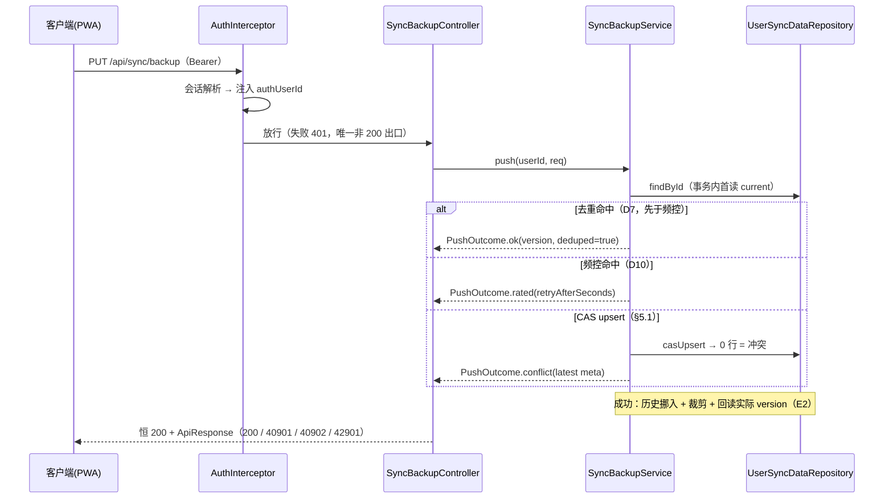

# 服务端密文同步（登录即备份）· 后端设计文档

> 版本：v1.0（2026-09-04）
> 范围：stock-calculator-service 侧的 sync 领域包设计——两表存储、3 端点 API、CAS 版本协议、频控与历史裁剪。承接前端仓库 `docs/server-sync-spec.md` 的决策 D1-D15 中与后端相关的部分（D2/D5/D7/D8/D10/D11 为主）。
> 关联：前端仓库 `docs/server-sync-spec.md` / `docs/server-sync-implementation.md`；本仓库 `docs/e2ee-auth-backend-design.md`（鉴权拦截）、`docs/copilot-design.md`（恒 200 信封与领域包先例）
> 状态：设计定稿，待开发（落点见 `docs/server-sync-backend-implementation.md`）

---

## 0. 对前端方案的评估结论与修正

### 0.1 总评

前端两份文档整体质量高，可以承接：

- D1-D15 决策记录完整、可追溯，边界场景（墓碑、回退检测、响应丢失重试、localStorage 丢失）考虑周到；
- CAS 单语句（spec §7.2）的并发分析正确：并发首传落入 ON CONFLICT 且 `version(1) != 0` → 0 行 → 40902，无竞态窗口；
- 判定顺序合理：去重（D7）先于频控（D10），保证丢失响应后的重试零成本；
- 后端实现要点与本项目编码模式（Lombok 三件套、`@RequiredArgsConstructor`、平铺外键、恒 200 信封）基本对齐。

主要问题集中在「后端事实核对不足」：用户 ID 类型、成功码、带 data 错误的承载通道、拦截器接线、部署体积限制五处与后端现状不符或缺失，另有 newVersion 计算一处协议正确性缺陷。全部修正如下表，本文档以下章节按修正后的口径编写。

### 0.2 修正表（E1-E10）

| # | 级别 | 前端文档原状 | 问题 | 本文档修正 |
|---|---|---|---|---|
| E1 | 高 | spec §5 `user_id BIGINT PRIMARY KEY`；implementation §3.1/3.4 `Long userId`、`Long currentUserId()` | 后端用户主键是 **UUID**（`UserEntity.id` 为 `UUID`，`auth_sessions.user_id` 为 uuid）；copilot 先例按 `varchar(64)` + Java `String` 存储。BIGINT 建表即错，`Long` 无值可填 | `user_id varchar(64)`，Java `String userId`，直接透传 `@RequestAttribute("authUserId")`（与 CopilotController 同法，零转换） |
| E2 | 高 | spec §7.2、implementation §3.3：`newVersion = baseVersion + 1` | INSERT 路径（云端为空）实际写入 `version=1`；云端空但 `base=5` 时响应 6 ≠ 库中 1 → 客户端 lastSeen 错乱 → 下次对账误报回退（D14 假告警）。且「读空 → CAS 前他人首传且其版本恰好等于 base」竞态下 INSERT 分支实际转 UPDATE，版本无法本地推算 | CAS 成功后用 native scalar 查询**回读实际 version**（同事务可见自身写入，绕开一级缓存旧实体），响应与客户端 lastSeen 一律以回读值为准 |
| E3 | 高 | spec §3.4「401 由既有拦截器统一处理」；implementation 文件清单未含 WebConfig | `WebConfig` 拦截路径白名单（`/api/auth/profile/**`、`/api/auth/logout`、`/api/auth/recovery/confirm`、`/api/copilot/**`）**不含 /api/sync/\*\***——不加则 sync 端点无鉴权裸奔（拦截器只挂已注册路径） | `WebConfig` 增挂 `/api/sync/**`（见 implementation §8）；native 变体（`app.auth.enabled` 不配置）下拦截器整体不装配，sync 与 copilot 同步不可用，属预期行为 |
| E4 | 中 | spec §6.3：40901/40902 data=最新 meta，42901 data={retryAfterSeconds} | `BusinessException` 无 data 字段、`ApiResponse.fail` 恒 data=null——三个带 data 的错误无承载通道（implementation 文档已自我标记，未给方案） | Service 以结果对象 `PushOutcome` 表达冲突/频控（不抛异常）；Controller 用 `ApiResponse.builder()` 组装带 data 响应；40001/40002/40003/40401（data=null）仍走 `BusinessException` → `GlobalExceptionHandler` |
| E5 | 中 | spec §6.1/6.2 成功示例 `"code": 0` | `ApiResponse.success` 恒 **code=200**，前端 apiClient 底座判定 `envelope.code === 200`——前端若按 0 判定会全部误判失败 | 成功码统一 200；前端 spec 示例与 pushBackup 映射需同步修订（见 implementation §12 修订反馈清单） |
| E6 | 中 | spec §10 部署前提仅「反代需暴露 /api/sync」 | Nginx 默认 `client_max_body_size 1m` < 2MB 信封硬限 → 大快照 413 假故障，表象是「network 失败」难排查 | 部署清单增加 location 级 `client_max_body_size 3m` |
| E7 | 低 | history 写入无重复防御 | 服务端整库从备份回滚（或部分恢复）后重推同版本，可能撞 `uq_user_sync_history` 唯一约束，主流程被防御性约束打断 | 历史写入用 native `ON CONFLICT DO NOTHING`，冲突即跳过，不影响主流程 |
| E8 | 低 | spec 未定义 payloadHash=null、baseVersion=null/负数的处理 | 校验缺口 | `payloadHash` 必填且须 64 位小写 hex（40003）；`baseVersion` 必填且 ≥ 0（40001） |
| E9 | 低 | 频控与 409 合并重推的交互未说明 | 冲突 → 拉取合并 → 重推可能落在 5s 频控窗口内 | 属预期：42901 附 retryAfterSeconds，前端已按建议延迟重试一次；两文档明确此交互即可，不改协议 |
| E10 | 中 | spec §7.2 / implementation §3.3 历史裁剪：`DELETE version <= newVersion - 5` | off-by-one：`<=` 连 newVersion-5 一并删除，只能保留 4 份历史，与 D8「保留最近 5 份」矛盾 | 裁剪改为 `DELETE version < newVersion - 5`（`deleteByUserIdAndVersionLessThan`），保留 {N-5..N-1} 恰 5 份（见 implementation §12 #9） |

---

## 1. 职责边界与非目标

### 1.1 后端职责（零知识哑存储，D2）

后端只做四件事，按 push 请求的处理顺序：

1. **结构校验**：信封 JSON 结构 / 大小 / hash 格式 / bytes 一致性；永不解析、不解密、不检索业务内容
2. **版本 CAS**：服务端单调自增版本号（D5），单语句乐观 upsert 保证多设备并发不交错丢写
3. **频控**：单用户 PUT 间隔 ≥ 5s（D10），状态在 DB 行上
4. **历史保留**：被替换版本挪入历史表，保留最近 5 份（D8）

硬性红线：`userId` 只取认证上下文注入的 `authUserId`，绝不从请求体读取；日志禁止输出信封内容。

### 1.2 非目标（对齐 spec §1.2）

- 实时推送（WebSocket / SSE / 长轮询）——meta 轻量轮询由前端承担（D13）
- 增量同步 / 分片上传
- 历史版本读取 API（表结构本期就位，API 二期）
- 未登录用户的云端同步（D15：native 变体无 auth 即无 sync，行为一致）
- 任何业务检索能力（设计上不可能：后端无明文）

## 2. 总体设计

### 2.1 请求处理链路（PUT）



### 2.2 层次职责

| 层 | 职责 | 明确不做 |
|---|---|---|
| Controller | 端点声明、`PushOutcome` → 带信封响应的组装（E4） | 业务判定 |
| Service | 校验 / 去重 / 频控 / CAS 编排 / 历史裁剪 / 版本回读 | HTTP 细节 |
| Repository | `casUpsert`、`selectVersion` 回读、历史 insert-ignore 与裁剪 SQL | 业务判断 |
| DTO | 请求/响应/内部判别结果的数据载体 | 逻辑 |

## 3. 数据库设计（PostgreSQL，两表）

### 3.1 DDL（追加到仓库根 postgres/schema.sql，风格对齐既有条目）

```sql
CREATE TABLE IF NOT EXISTS public.user_sync_data (
	user_id           varchar(64) NOT NULL,
	encrypted_payload text NOT NULL,
	version           int8 NOT NULL,
	payload_hash      varchar(64) NULL,
	payload_bytes     int4 NOT NULL,
	created_at        timestamptz DEFAULT CURRENT_TIMESTAMP NOT NULL,
	updated_at        timestamptz DEFAULT CURRENT_TIMESTAMP NOT NULL,
	CONSTRAINT user_sync_data_pkey PRIMARY KEY (user_id)
);

CREATE TABLE IF NOT EXISTS public.user_sync_history (
	id                bigserial NOT NULL,
	user_id           varchar(64) NOT NULL,
	version           int8 NOT NULL,
	encrypted_payload text NOT NULL,
	payload_bytes     int4 NOT NULL,
	created_at        timestamptz DEFAULT CURRENT_TIMESTAMP NOT NULL,
	CONSTRAINT user_sync_history_pkey PRIMARY KEY (id),
	CONSTRAINT uq_user_sync_history UNIQUE (user_id, version)
);

-- 回滚：DROP TABLE IF EXISTS public.user_sync_history; DROP TABLE IF EXISTS public.user_sync_data;
```

### 3.2 设计说明

| 点 | 理由 |
|---|---|
| `user_id varchar(64)`（E1） | 对齐 copilot 先例（`ai_chat_session.user_id varchar(64)` + Java String），`authUserId` 直接透传零转换；auth_sessions 用 uuid 是另一先例，但 sync/copilot 同属「登录用户业务数据」，取 varchar 统一。前端 spec 的 BIGINT 作废 |
| 无物理外键 | 项目惯例平铺；同步表生命周期与用户表解耦，便于清理 |
| `version int8` 服务端自增（D5） | 多设备并发时客户端版本号必撞号；服务端单点自增保证全序。首传 =1，覆盖原子 +1 |
| `payload_hash varchar(64)` 可空列 | DB 层可空，API 层必填（E8，40003）；只做去重行内比对，不建索引（非检索键） |
| `updated_at` 频控时钟（D10） | 写入路径全部由服务端产生（INSERT 默认值 / `@UpdateTimestamp` / CAS SQL 的 `NOW()`），客户端不可指定；状态在行上，多实例部署仍成立 |
| 历史 `UNIQUE (user_id, version)` | 兼作裁剪依据（按 version 删除），无需额外索引；整库回滚场景的重复插入由 `ON CONFLICT DO NOTHING` 吸收（E7） |
| 单行主表 + 小历史表 | meta/pull 恒为单行主键读；历史仅作坏写入保险（D8），保留 5 份由 service 裁剪 |

## 4. API 契约

### 4.1 通用约定

| 项 | 约定 |
|---|---|
| 路径前缀 | `/api/sync/backup`（meta: `GET /meta`；pull: `GET`；push: `PUT`） |
| 认证 | Bearer 必需；`WebConfig` 增挂 `/api/sync/**`（E3）；401 由拦截器直写信封体，是唯一 HTTP 非 200 响应 |
| 成功码 | **code=200**（E5 修正：对齐 `ApiResponse.success` 与前端 apiClient 底座 `envelope.code === 200`；前端 spec 示例的 code:0 作废） |
| 响应 | 恒 HTTP 200 + `ApiResponse{code,message,data}`；业务错误看 code |
| Content-Type | application/json；body UTF-8 |
| userId | 一律取 `@RequestAttribute("authUserId")`（String，UUID 文本），与 CopilotController 同法；请求体任何 userId 字段均忽略 |

### 4.2 端点

#### GET /api/sync/backup/meta

轻量对账：只回元信息，不回密文（D13 轮询的基础）。

```jsonc
// 云端为空
{ "code": 200, "message": "success", "data": { "hasData": false, "version": 0 } }
// 云端有数据
{ "code": 200, "message": "success", "data": {
    "hasData": true, "version": 7,
    "updatedAt": "2026-09-04T03:10:37Z",
    "payloadHash": "a1b2…", "payloadBytes": 287431 } }
```

#### GET /api/sync/backup

```jsonc
// 云端为空 → 业务错误（GlobalExceptionHandler 统一转信封）
{ "code": 40401, "message": "云端暂无备份", "data": null }
// 成功（密文原样透传，不解密）
{ "code": 200, "message": "success", "data": {
    "version": 7, "updatedAt": "…", "payloadHash": "…",
    "envelope": "{\"v\":1,\"alg\":\"A256GCM\",…}" } }
```

#### PUT /api/sync/backup

```jsonc
// 请求体
{ "baseVersion": 6,                  // 0=云端应为空（首传）；n=期望云端当前版本（E8：必填 ≥0）
  "envelope": "{\"v\":1,…}",          // 信封 JSON 字符串
  "payloadHash": "a1b2…",            // 64 位小写 hex，必填（E8）
  "payloadBytes": 287431 }            // 信封 UTF-8 字节数，服务端比对
// 成功（含 dedup：deduped=true 表示未写库）
{ "code": 200, "message": "success", "data": { "version": 7, "deduped": false } }
// 冲突（E4：data 携带最新 meta，version 保证新鲜——唯一参与客户端判定的字段）
{ "code": 40901, "message": "版本冲突", "data": { "hasData": true, "version": 8, … } }
// 频控（E4：data 携带建议等待秒数）
{ "code": 42901, "message": "上传过于频繁", "data": { "retryAfterSeconds": 4 } }
```

### 4.3 业务错误码总表

| code | 含义 | data | 承载路径 |
|---|---|---|---|
| 40001 | 信封结构非法 / payloadBytes 与实际不符 / baseVersion 缺失或负数（E8） | null | `BusinessException` → `GlobalExceptionHandler` |
| 40002 | 信封超限（> 2MB，D11） | null | 同上 |
| 40003 | payloadHash 缺失或非 64 位小写 hex（E8） | null | 同上 |
| 40401 | 云端无备份（pull） | null | 同上 |
| 40901 | 版本冲突（云端 version != baseVersion） | 最新 meta | `PushOutcome` → Controller 组装（E4） |
| 40902 | 首传冲突（baseVersion=0 但云端已有数据） | 最新 meta | 同上 |
| 42901 | 频控（D10） | {retryAfterSeconds} | 同上 |

### 4.4 PUT 判定顺序（design 定案）

```
认证（拦截器，401）
→ baseVersion 非空且 ≥ 0（40001，E8）
→ payloadHash 非空且匹配 64 位小写 hex（40003，E8）
→ envelope UTF-8 字节数 ≤ 上限（40002，D11；先比字节数再进 JSON 解析）
→ envelope JSON 结构：v==1、alg=="A256GCM"、iv/ct 非空字符串（40001，D2）
→ payloadBytes 声明值与 envelope 实际字节数一致（40001）
→ 去重（D7 两分支，先于频控，保证丢失响应后的重试零成本）
→ 频控（D10：updated_at 距今 < 5s → 42901）
→ CAS upsert（§5.1；0 行 = 冲突 → 按 baseVersion 与云端有无区分 40901/40902）
→ 成功：历史挪入 + 裁剪（D8/E7）→ 回读实际 version（E2）→ 200
```

## 5. 关键机制设计

### 5.1 CAS 单语句与 newVersion 回读（E2，协议正确性关键）

```sql
INSERT INTO user_sync_data (user_id, encrypted_payload, version, payload_hash, payload_bytes)
VALUES (:userId, :payload, 1, :hash, :bytes)
ON CONFLICT (user_id) DO UPDATE SET
    encrypted_payload = EXCLUDED.encrypted_payload,
    version           = user_sync_data.version + 1,
    payload_hash      = EXCLUDED.payload_hash,
    payload_bytes     = EXCLUDED.payload_bytes,
    updated_at        = NOW()
WHERE user_sync_data.version = :baseVersion
```

返回受影响行数：`1` = 赢得写入；`0` = 冲突。前端 spec §7.2 的并发分析正确，本设计沿用；**修正点**：成功后的新版本一律用 native scalar 查询回读，不做本地推算：

```sql
SELECT version FROM user_sync_data WHERE user_id = :userId
```

- 为什么必须回读：INSERT 路径（云端为空）写入的 version=1，`baseVersion + 1` 在「云端空但 base=5」时会错报 6（E2）；且「事务内首读为空 → CAS 前他人首传且其版本恰好等于 base」时 INSERT 分支实际转 UPDATE，新版本无法推算。
- 为什么用 native 而非 findById：事务内首读的 `current` 已在持久化上下文（一级缓存），findById 返回 CAS 前旧实体；native scalar 查询直达数据库。
- 正确性：同一事务 READ COMMITTED 可见自身未提交写入，回读值即本次写入值。

全场景表：

| 场景 | 事务内首读 current | CAS 结果 | 库中实际新版本 | 响应 |
|---|---|---|---|---|
| 首传（云端空，base=0） | 无行 | INSERT，1 行 | 1 | 200 version=1 |
| 并发首传（同 base=0 两请求） | 无行 | 一胜一 0 行 | 1 | 胜者 200；败者 40902 |
| 正常覆盖（base=6，云端 6） | version=6 | UPDATE，1 行 | 7 | 200 version=7 |
| 云端空但 base=5（E2 修正点） | 无行 | INSERT，1 行 | **1**（≠ base+1=6） | 200 version=1；客户端静默置 lastSeen=1，不触发回退告警（spec §7.2 语义） |
| 读空 → CAS 前他人首传且其版本==base | 无行 | ON CONFLICT 转 UPDATE 命中 | base+1 | 200 version=回读值（推算不可靠的竞态实证） |
| base 落后 / 超前 / 他人已推进 | version=6 | 0 行 | 不变 | 40901 |
| base=0 但云端已有 | 有行 | 0 行（1 ≠ 0） | 不变 | 40902 |

### 5.2 幂等去重（D7）

去重基于事务内首读 `current` 与请求 `payloadHash` 比对，先于频控：

| 分支 | 条件 | 语义 |
|---|---|---|
| (a) | `current.version == baseVersion` 且 hash 同 | 重复推送同一内容，未写库，返回 deduped |
| (b) | `current.version == baseVersion + 1` 且 hash 同 | 推送成功但响应丢失后的重试，零成本返回 deduped |

- 前提：`payloadHash` 必填（E8），否则走 40003，不存在「无 hash 的去重」
- 分支 (b) 的语义边界：若他设备推过完全相同的信封（同 hash 即同 iv/ct 同密文同内容），本设备也得到 deduped——结果一致，无害
- 去重命中直接返回，不执行 CAS，无双重写入风险
- 去重旧值竞态：并发推进后本事务仍判 deduped → 返回略旧 version → 客户端 lastSeen 落后 → 下次对账发现 v > lastSeen → 静默拉取合并（安全侧，最坏多合并一次），不产生错误写入

### 5.3 频控（D10）

- 判定：`current.updated_at` 距今 < 5s → 42901，`retryAfterSeconds = ceil(剩余毫秒 / 1000)` 且至少 1
- 首传（无行）不限频；去重先于频控，重试不受罚
- 与前端 10s 冷却对齐；409 → 合并 → 重推可能落在频控窗口内（E9），属预期：前端按 retryAfterSeconds 静默重试一次
- 时钟基准：`updated_at` 由服务端写入（INSERT 默认值 / `@UpdateTimestamp` / CAS 的 `NOW()`）；单实例 JVM 与 DB 时钟偏差远小于 5s 窗口，可忽略
- 参数化：窗口经 `@Value`（`sync.push.rate-limit-millis:5000`）注入（D11 风格，defaultValue 写死代码、不进 yml），生产默认 5s 不变；测试以属性覆盖窗口验证连续推送与 CAS/回读路径（implementation §9.1/§9.2）

### 5.4 历史保留与裁剪（D8 + E7）

- 仅当 CAS 成功且 `current` 存在（覆盖语义）才落历史：记录被替换行的 `version / encrypted_payload / payload_bytes`
- 历史写入用 native `INSERT … ON CONFLICT DO NOTHING`（E7）：服务端整库从备份回滚后重推同版本时唯一约束冲突被静默吸收，主流程不受影响
- 裁剪（E10，修正前端 spec 的 off-by-one）：成功写入 newVersion 后 `DELETE … WHERE user_id=? AND version < newVersion - 5`，历史保留 {N-5..N-1} 恰 5 份（`<=` 写法只能留 4 份）
- 与 CAS 同一事务：CAS 失败整体回滚，无孤儿历史行；历史行数恒 ≤ 5

### 5.5 信封结构校验（D2 / D11）

- 只验结构，不解码 iv/ct、不碰业务内容（D2）；JSON 解析用 Boot 4 自动装配的 Jackson 3（tools.jackson）`ObjectMapper` Bean（AuthInterceptor 同法，不用 `new ObjectMapper()`）
- 校验项与顺序见 §4.4；结构判定：对象 + `v` 为数值且 ==1 + `alg` 为 "A256GCM" + `iv`/`ct` 为非空字符串
- 大小检查先于 JSON 解析（先比 envelope 字段字节数再 parse，超大 body 不进解析器）；注意信封字段级校验是内存级防线，传输级防线靠反代 body 上限（E6）

### 5.6 并发正确性分析

| 竞态 | 分析 | 结论 |
|---|---|---|
| 两 PUT 同 baseVersion | PG 行锁下 `ON CONFLICT … WHERE version=base` 的比较与写入原子，一胜一败 | CAS 无竞态窗口（spec §7.2 结论成立） |
| 两 PUT 同过频控（同读旧 updated_at） | CAS 仍一胜一败，实际至多一次写入 | 频控只影响体验，不影响正确性 |
| 去重读到旧值后他人推进 | §5.2 末条：返回略旧 version，客户端对账收敛 | 安全侧 |
| 历史/主表跨行一致性 | 同一事务，CAS 失败即整体回滚 | 无孤儿历史、无半程写入 |

## 6. 安全设计

| 项 | 设计 |
|---|---|
| 端点鉴权（E3） | `/api/sync/**` 全部过 AuthInterceptor；401 是唯一 HTTP 非 200 出口 |
| userId 来源 | 只取 `authUserId` request attribute（String，UUID 文本）；请求体任何 userId 字段忽略 |
| recovery 受限会话 | 拦截器 scope 检查仅放行 recovery/confirm 与 logout，`/api/sync` 天然被拒，无需新增逻辑 |
| 日志 | 只允许 `payloadHash` 前 8 位 + `payloadBytes`；禁止输出信封内容与请求体 |
| 滥用防护 | 信封 2MB 硬限（D11）+ 单用户 5s 频控（D10）；两者均在认证之后生效 |
| 零知识 | 服务端无 MEK、校验不碰内容；数据库整库泄露仅有密文（继承 spec §3.3 威胁边界） |
| native 变体 | `app.auth.enabled` 不配置 → WebConfig/AuthInterceptor 不装配 → sync 端点缺 `authUserId` 必然失败，与 copilot 行为一致；sync 依赖登录态，无 auth 即无 sync，属预期而非缺陷 |

## 7. Modulith 与 native 约束

- 新领域包 `com.zzh.stock_calculator.sync`：controller / dto / entity / repository / service 子包
- 依赖边界：只依赖 `common` 基包（ApiResponse / BusinessException）；`userId` 经 `@RequestAttribute` 字符串契约注入，**不 import auth 任何类型**（比前端文档设想的「auth 基包取法」更干净，零类型耦合）；不引用其他域 → `ModulithVerifyTest` 自动守护
- 参数（D11）：`sync.push.max-envelope-bytes:2000000`、`sync.push.rate-limit-millis:5000` 两个 `@Value` defaultValue 写死在代码，不进 yml、不新增配置键 → native 重建无配置漂移；注意实现时该文件含 `${…}` 字符串，必须用 write_file 写入（终端命令禁 `${…}`，见 workflow skill）
- 无 JSONB、无数据库生成列、无 `@ManyToOne`/`@OneToMany`（项目惯例：平铺字段、无关联）

## 8. 测试设计

| 层 | 方式 | 说明 |
|---|---|---|
| Service 单测 | Mockito（`@ExtendWith(MockitoExtension.class)`，同 SessionServiceTest 模式） | 仓库全部 mock；覆盖校验全分支 / 去重两分支 / 频控 / 冲突映射 / 历史落库与裁剪 / 版本回读（用例表见 implementation §9.1） |
| Repository CAS | 真库验证（本地 PG） | psql 冒烟脚本（implementation §9.2）；勿用 @DataJpaTest（无 H2 依赖，且 `ON CONFLICT … WHERE` 兼容性存疑）；@SpringBootTest 可选，需本地库环境变量 |
| Modulith | ModulithVerifyTest | 自动覆盖新 sync 包，无额外工作 |
| 全量验证 | `./mvnw test '-Dtest=!TaskServiceTest' '-DfailIfNoTests=false'` | TaskServiceTest 打真实 API 必挂，永远排除 |

## 9. 部署与回滚

| 步骤 | 内容 | 注意 |
|---|---|---|
| 1 | postgres/schema.sql 增量执行（两表） | 先于后端发布；IF NOT EXISTS 幂等 |
| 2 | 后端部署（native 全量重建） | 零 yml 改动；新包进 native 需全量构建 |
| 3 | 反代暴露 `/api/sync` → :18080 | **location 级 `client_max_body_size 3m`**（E6：Nginx 默认 1m，2MB 信封会被 413，表象是前端 network 失败难排查） |
| 4 | 前端发布（前端仓库 M2-M5） | SW 缓存提示强刷或等 autoUpdate |

回滚：后端可独立回滚（旧版本无 sync 包 → 端点消失 → 前端走 network 退避，不报错打扰）；两表保留不删（数据无损）；前端关 `server_sync_meta_v1.enabled` 即可先行止血。

## 10. 二期展望（对齐 spec §11）

1. 历史读取 API：`GET /api/sync/backup/versions`、`/versions/{v}`（表已就位，本期无 API）
2. `DELETE /api/sync/backup`：物理删除云端含历史；需与前端墓碑语义（D9）对齐设计
3. 压缩信封：明文 gzip 后再加密，信封升级 v2——后端结构校验按 v 白名单扩展（本期 `v==1` 硬编码），属于后端唯一需要跟随信封格式演进的点
4. 增量同步 / 分片：独立立项
